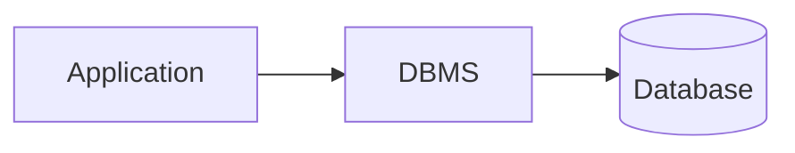
```mermaid
flowchart LR
    App[Application] --> Manager[DBMS]
    Manager --> Data[(Database)]
```

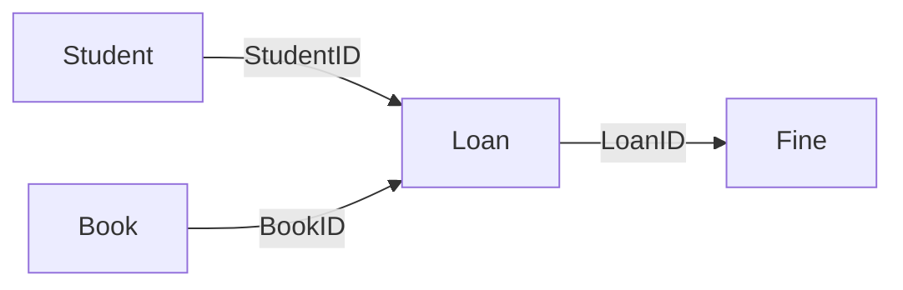
```mermaid
flowchart LR
    Student[Student] -->|StudentID| Loan[Loan]
    Book[Book] -->|BookID| Loan
    Loan -->|LoanID| Fine[Fine]
```

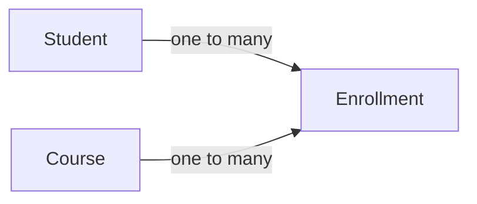
```mermaid
flowchart LR
    Student[Student] -->|one to many| Enrollment[Enrollment]
    Course[Course] -->|one to many| Enrollment
```

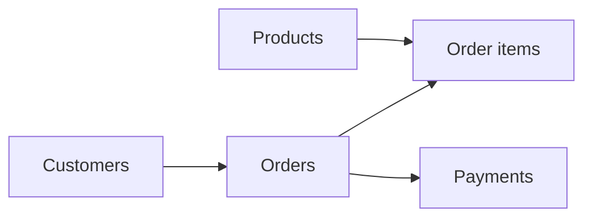
```mermaid
flowchart LR
    Customers[Customers] --> Orders[Orders]
    Products[Products] --> Items[Order items]
    Orders --> Items
    Orders --> Payments[Payments]
```

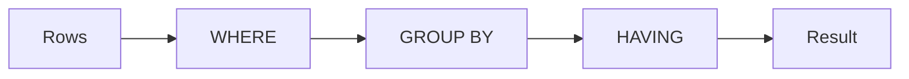
```mermaid
flowchart LR
    Rows[Rows] --> Filter[WHERE]
    Filter --> Groups[GROUP BY]
    Groups --> Keep[HAVING]
    Keep --> Result[Result]
```

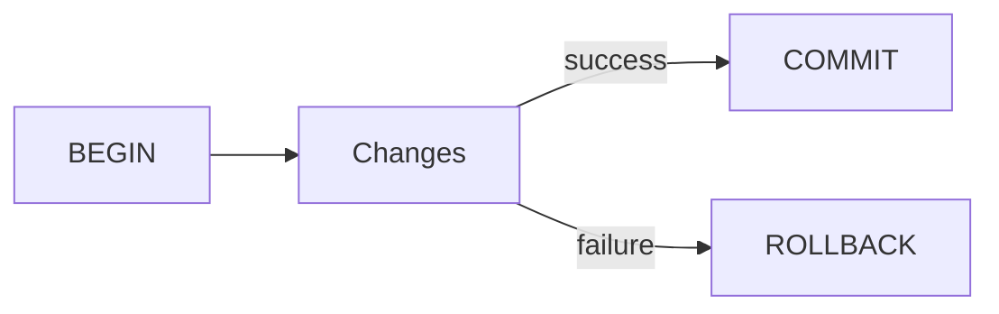
```mermaid
flowchart LR
    Start[BEGIN] --> Work[Changes]
    Work -->|success| Commit[COMMIT]
    Work -->|failure| Undo[ROLLBACK]
```

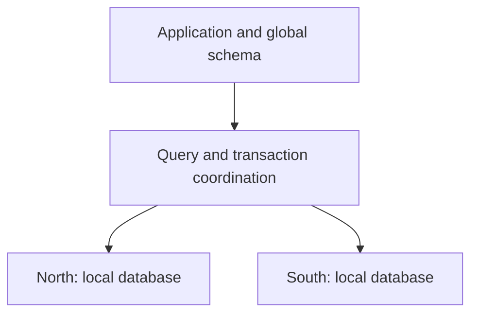
```mermaid
flowchart TB
    App[Application and global schema] --> Plan[Query and transaction coordination]
    Plan --> North[North: local database]
    Plan --> South[South: local database]
```

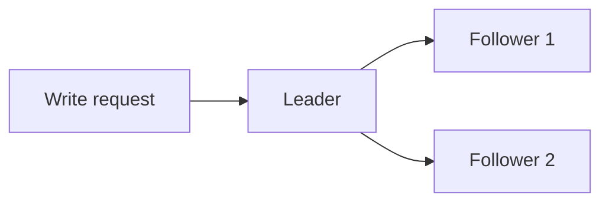
```mermaid
flowchart LR
    Write[Write request] --> Leader[Leader]
    Leader --> First[Follower 1]
    Leader --> Second[Follower 2]
```

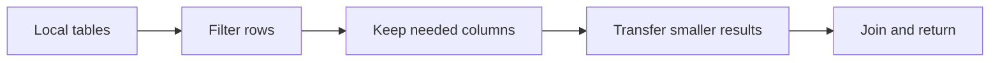
```mermaid
flowchart LR
    Local[Local tables] --> Filter[Filter rows]
    Filter --> Columns[Keep needed columns]
    Columns --> Move[Transfer smaller results]
    Move --> Join[Join and return]
```

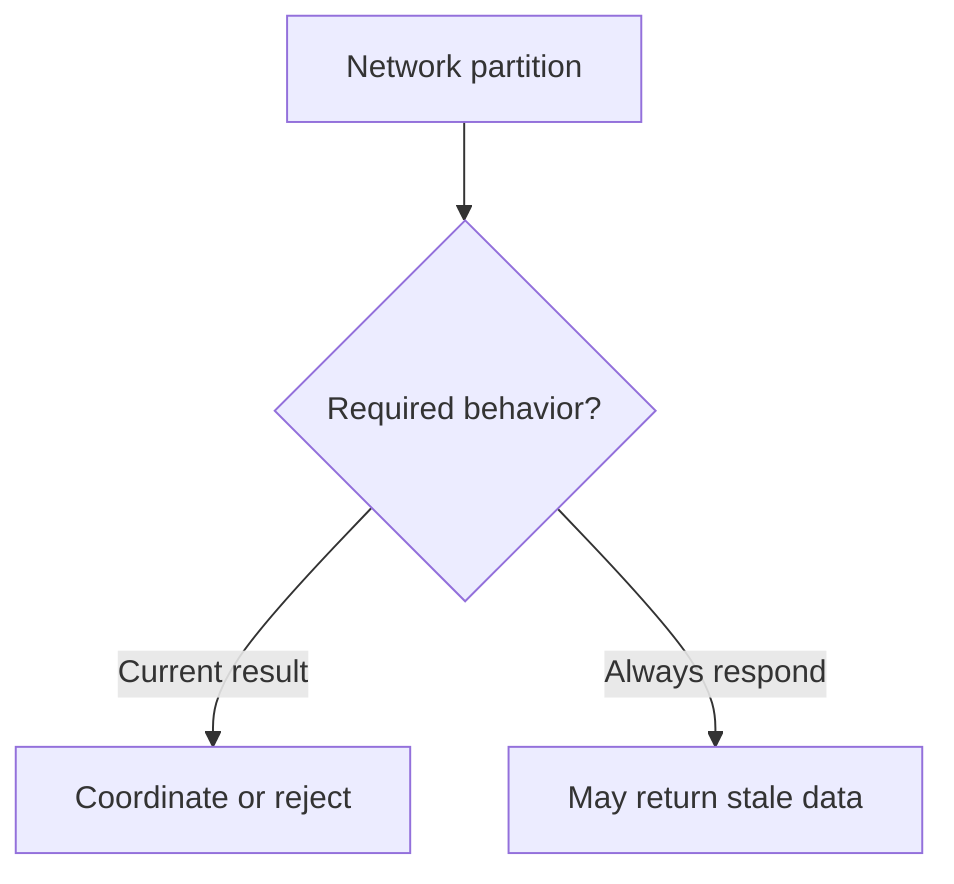
```mermaid
flowchart TB
    Partition[Network partition] --> Need{Required behavior?}
    Need -->|Current result| Consistent[Coordinate or reject]
    Need -->|Always respond| Available[May return stale data]
```

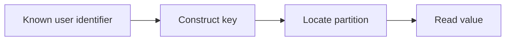
```mermaid
flowchart LR
    Known[Known user identifier] --> Key[Construct key]
    Key --> Partition[Locate partition]
    Partition --> Value[Read value]
```

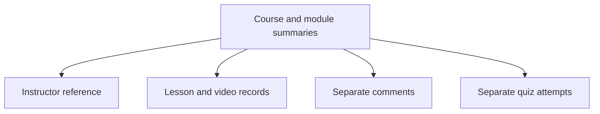
```mermaid
flowchart TB
    Course[Course and module summaries] --> Instructor[Instructor reference]
    Course --> Lessons[Lesson and video records]
    Course --> Comments[Separate comments]
    Course --> Attempts[Separate quiz attempts]
```

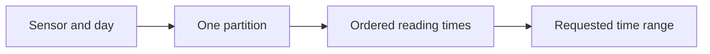
```mermaid
flowchart LR
    Query[Sensor and day] --> Partition[One partition]
    Partition --> Time[Ordered reading times]
    Time --> Slice[Requested time range]
```

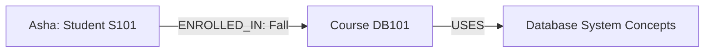
```mermaid
flowchart LR
    Student[Asha: Student S101] -->|ENROLLED_IN: Fall| Course[Course DB101]
    Course -->|USES| Book[Database System Concepts]
```

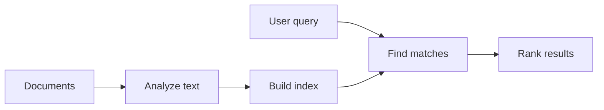
```mermaid
flowchart LR
    Documents[Documents] --> Analyze[Analyze text]
    Analyze --> Index[Build index]
    Query[User query] --> Match[Find matches]
    Index --> Match
    Match --> Rank[Rank results]
```

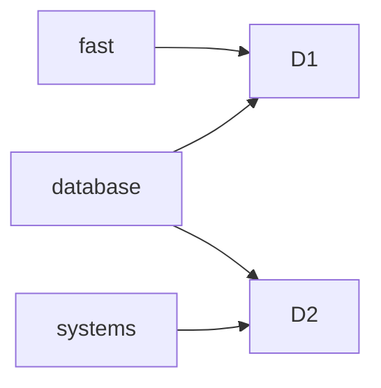
```mermaid
flowchart LR
    Fast[fast] --> First[D1]
    Database[database] --> First
    Database --> Second[D2]
    Systems[systems] --> Second
```

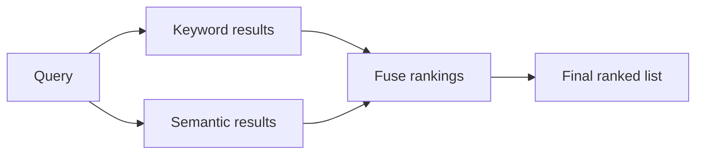
```mermaid
flowchart LR
    Query[Query] --> Keyword[Keyword results]
    Query --> Meaning[Semantic results]
    Keyword --> Combine[Fuse rankings]
    Meaning --> Combine
    Combine --> Final[Final ranked list]
```