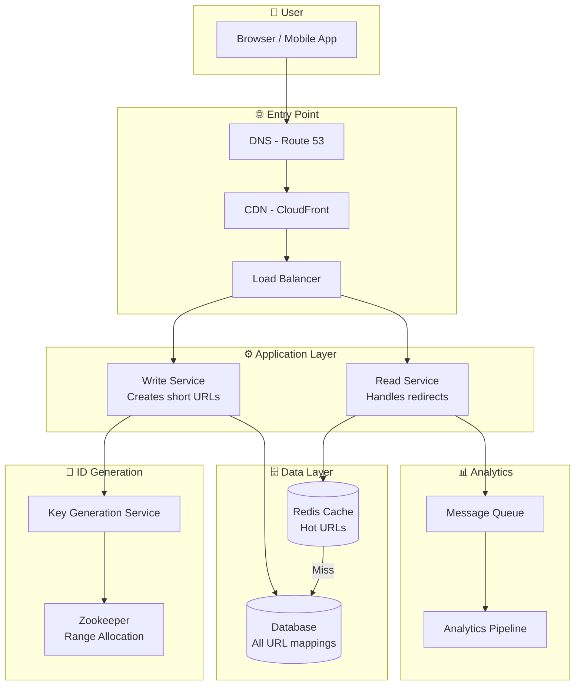
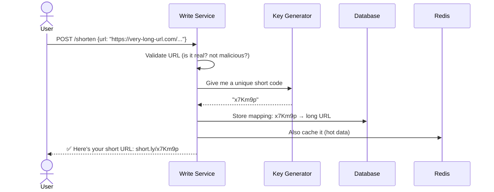
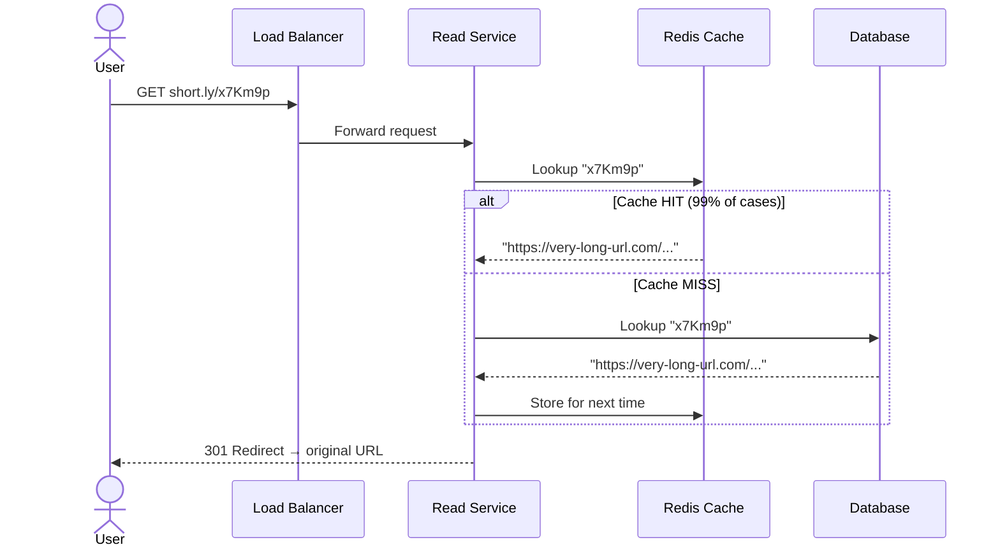
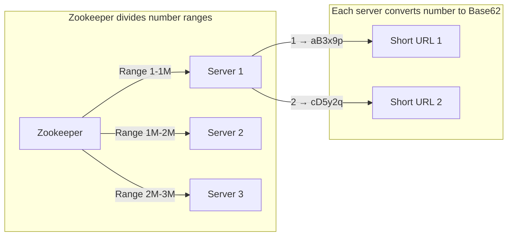
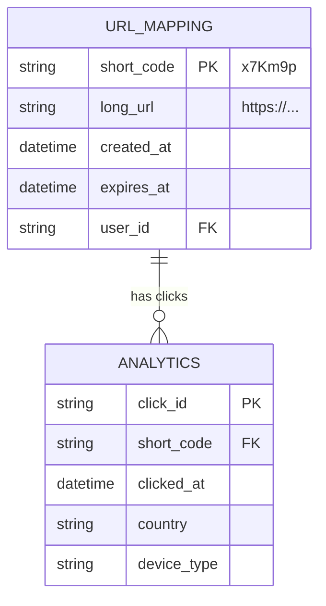
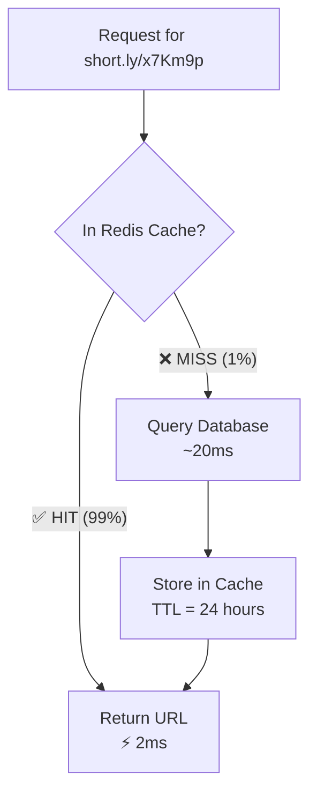
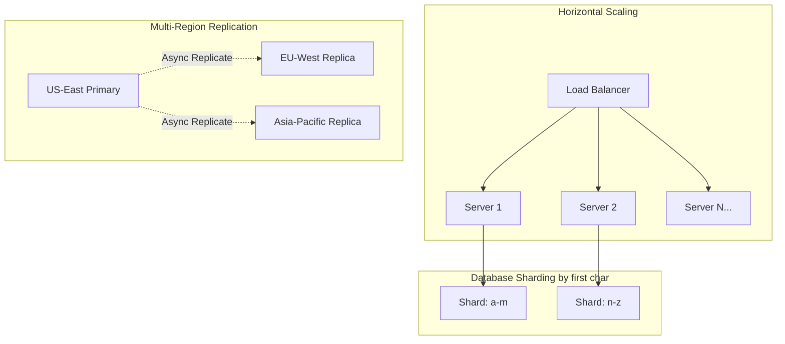

# HLD 01: Design a URL Shortener (like TinyURL / Bit.ly)

## 💡 Quick Summary

> **What**: A service that converts long URLs into short ones (e.g., `bit.ly/abc123`) and redirects users back.  
> **Key Insight**: The core challenge is generating unique short codes at scale without collisions, while handling 100:1 read-to-write ratio.

---

## 🎯 The Problem in Simple Terms

Imagine you have a really long URL like:
```
https://www.amazon.com/dp/B09V3KXJPB?ref=myi_title_dp&th=1&psc=1
```

You want to share it on Twitter (character limit!) or verbally tell someone. A URL shortener gives you:
```
https://short.ly/x7Km9p
```

When anyone clicks this short URL → they get redirected to the original long URL.

---

## 📋 Requirements

### What It Must Do (Functional)
| Feature | Detail |
|---------|--------|
| Shorten URL | User gives long URL → gets short URL back |
| Redirect | Anyone clicks short URL → goes to original |
| Custom aliases | User can pick their own short code (optional) |
| Expiration | URLs can expire after X days |
| Analytics | Track clicks, location, device |

### How Well It Must Do It (Non-Functional)
| Quality | Target | Why |
|---------|--------|-----|
| Availability | 99.99% | Broken redirects = broken internet |
| Latency | < 50ms redirect | Users won't wait |
| Scale | 100M daily users | Think billions of URLs |

### 📊 Back-of-Napkin Math

```
Writes: 1M new URLs/day = ~12/second
Reads:  100M redirects/day = ~1,200/second (peak: ~6,000/sec)
Storage: 1M × 500 bytes × 365 days × 5 years ≈ 900 GB
Short code: 7 chars of Base62 = 62⁷ = 3.5 TRILLION combos ✓
```

---

## 🏗️ Architecture Overview



---

## 🔍 How It Works — Step by Step

### Creating a Short URL



### Redirecting (The Hot Path — must be FAST)



---

## 🔑 The Hardest Part: Generating Unique Short Codes

### Option 1: Counter-Based (Our Choice ✅)



**Why this works**: Each server gets its own number range → no collisions, no coordination needed per request.

### Option 2: Hashing (Simpler but problematic)
- `MD5(long_url)` → take first 7 chars → check DB for collision
- **Problem**: Collisions require extra DB lookups

### Option 3: Random Generation
- Generate random 7-char string → check if exists → retry if taken
- **Problem**: As DB fills up, more collisions and retries

---

## 🗄️ Database Design



**Why DynamoDB/Cassandra?** Simple key→value lookups, massive horizontal scaling, no complex joins needed.

---

## ⚡ Caching Strategy



**Key insight**: Top 20% of URLs get 80% of traffic (Pareto principle). We only need to cache the popular ones.

---

## 📊 Key Trade-offs

| Decision | We Chose | Alternative | Why |
|----------|----------|-------------|-----|
| ID generation | Counter + Base62 | Random/Hash | Zero collisions, predictable |
| Database | NoSQL (DynamoDB) | SQL (PostgreSQL) | Simple key-value, massive scale |
| Redirect code | 301 (permanent) | 302 (temporary) | Better for SEO, less analytics visibility |
| Consistency | Eventual | Strong | OK: new URL works within ~1 second |

---

## 🚀 Scaling Strategy



**How we handle 100M+ daily users:**
1. **CDN caches** 301 redirects at edge (most traffic never hits our servers)
2. **Redis cluster** serves 99% of remaining requests from memory
3. **Database shards** by short code prefix for write distribution
4. **Read replicas** per region for global low latency
