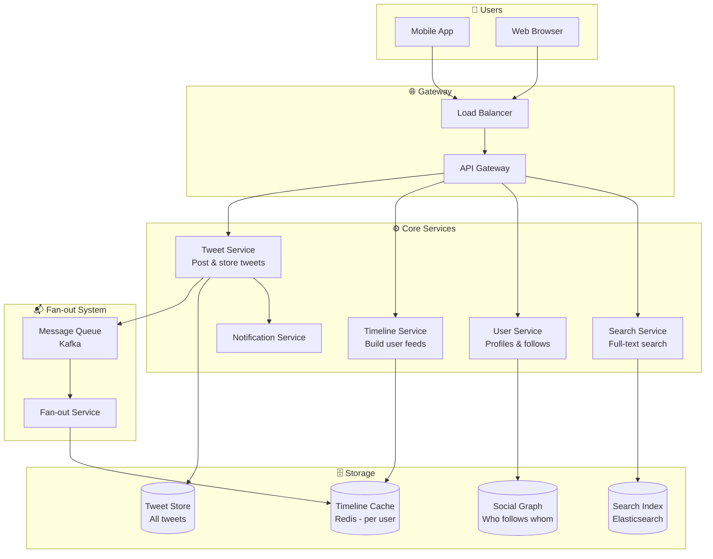
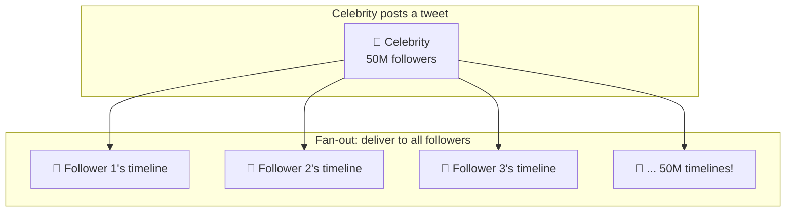
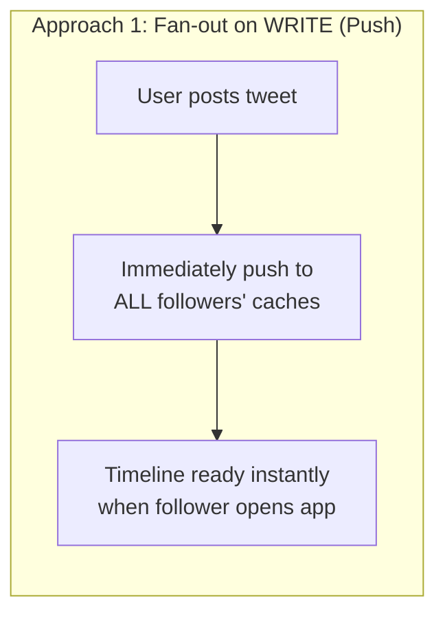
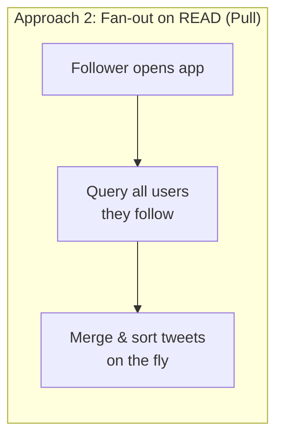
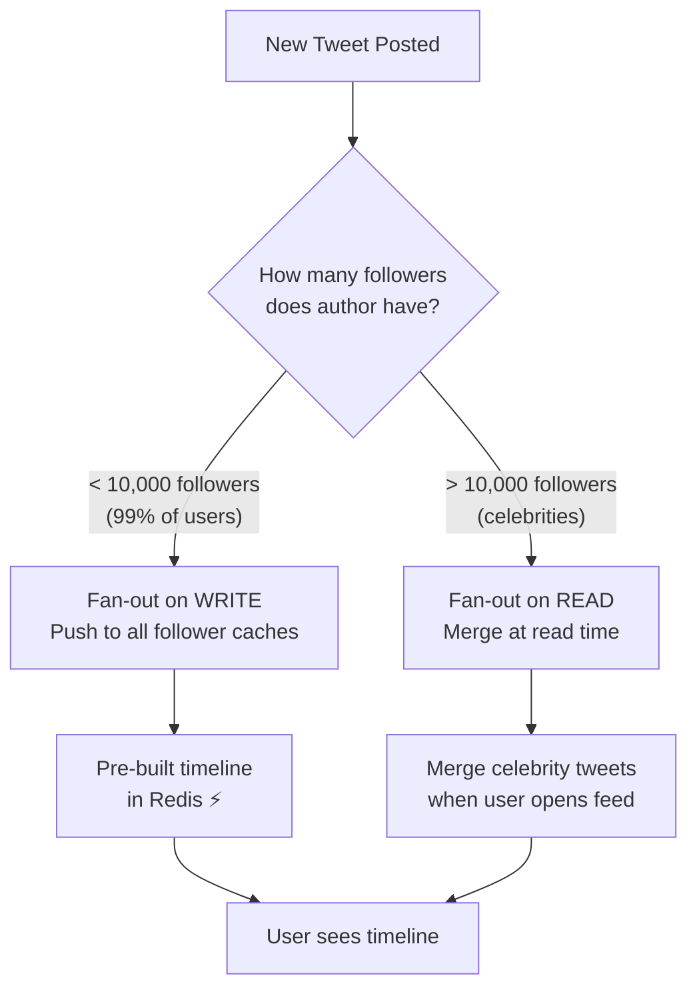
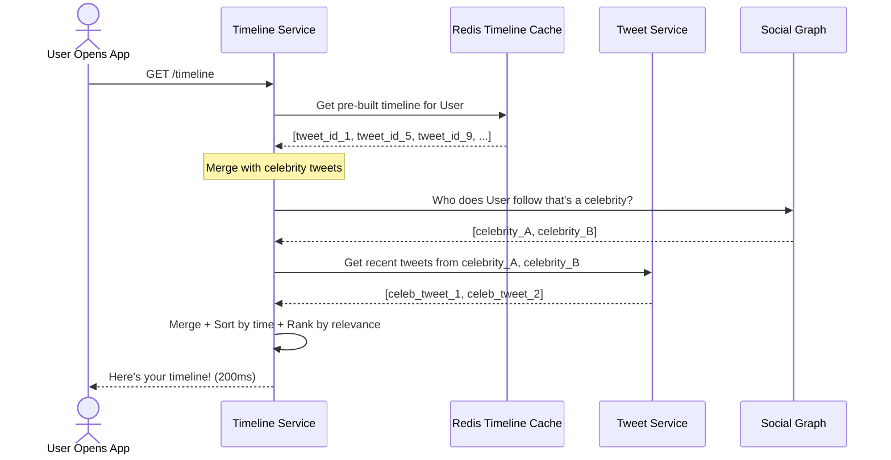
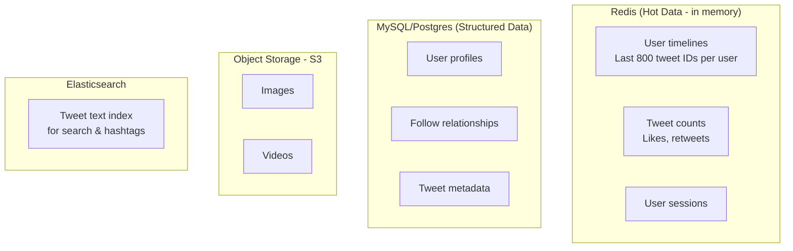
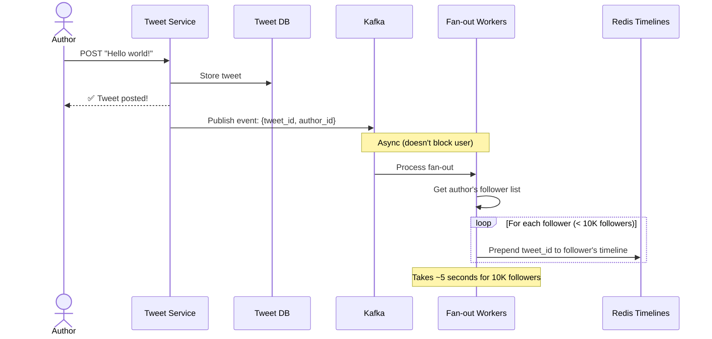

# HLD 02: Design Twitter / X (Social Feed)

## 💡 Quick Summary

> **What**: A social platform where users post short messages (tweets), follow others, and see a personalized timeline.  
> **Key Insight**: The main challenge is the "fan-out" problem — when a celebrity with 50M followers tweets, how do you deliver it to all of them in real-time?

---

## 🎯 The Problem in Simple Terms

When you open Twitter, you see a feed of tweets from people you follow. Sounds simple, but:
- 500M tweets/day are posted
- Some users have 50M+ followers
- Your timeline must load in < 200ms
- Tweets appear in near real-time

The question: Do you **pull** tweets when a user opens their feed, or **push** tweets to all followers when someone posts?

---

## 📋 Requirements

### What It Must Do
| Feature | Detail |
|---------|--------|
| Post tweet | Text (280 chars), images, videos |
| Timeline | See tweets from people you follow |
| Follow/Unfollow | Subscribe to other users |
| Like & Retweet | Engage with tweets |
| Search | Find tweets by keyword/hashtag |
| Notifications | Alerts for mentions, likes, follows |

### Scale Numbers
```
DAU: 300M users
Tweets/day: 500M (avg user reads 100+ tweets/session)
Reads:Writes = 1000:1 (read VERY heavy)
Celebrity: 1 user can have 50M followers
Timeline load: < 200ms
```

---

## 🏗️ Architecture Overview



---

## 🔍 The Fan-Out Problem (The Heart of Twitter)

### What is Fan-Out?

When User A posts a tweet, it must appear in the timeline of ALL their followers. This is "fan-out."



### Two Approaches:





### Our Solution: Hybrid Approach ✅



**Why hybrid?**
- Normal users (99%): Push is fine — 500 followers × 1 write = fast
- Celebrities: Push would mean 50M writes per tweet = too slow! Pull on demand instead.

---

## 🔍 How Timeline Generation Works



---

## 🗄️ Data Storage

### What Goes Where?



### Tweet Table (Sharded by user_id)
```
tweet_id | user_id | content | media_urls | created_at | like_count | retweet_count
```

### Social Graph (Who follows whom)
```
follower_id | followee_id | created_at
```
Indexed BOTH ways: "who do I follow?" and "who follows me?"

---

## ⚡ How a Tweet Gets Published



---

## 📊 Key Trade-offs

| Decision | We Chose | Why |
|----------|----------|-----|
| Fan-out strategy | Hybrid (push + pull) | Push can't handle celebrities; pull is too slow for everyone |
| Timeline storage | Redis (in-memory) | Must load in < 200ms; RAM is fast |
| Tweet storage | Sharded SQL | Need indexes, counters, structured queries |
| Ordering | Time-based + ranking | Pure chronological is too noisy; add relevance |
| Consistency | Eventual | OK if tweet appears 2-5s late in feeds |

---

## 🚀 Scaling Bottlenecks & Solutions

| Bottleneck | Solution |
|------------|----------|
| Celebrity tweet fan-out | Pull-based for accounts > 10K followers |
| Timeline cache size | Only keep last 800 tweets per user; paginate |
| Hot tweets (viral) | Separate cache for trending tweets |
| Search at scale | Elasticsearch cluster with sharding by time |
| Media storage | S3 + CDN for images/videos |
| Thundering herd (events) | Rate limit fan-out workers; queue buffering |
