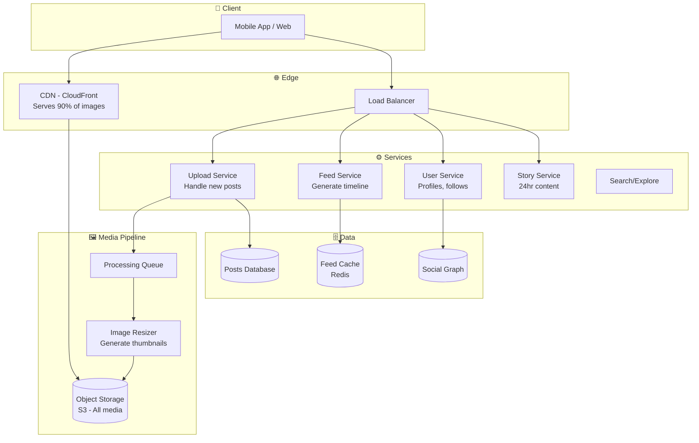
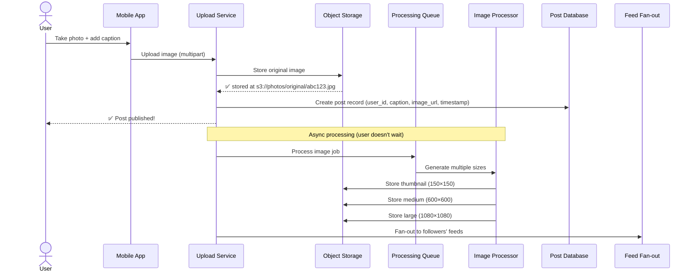
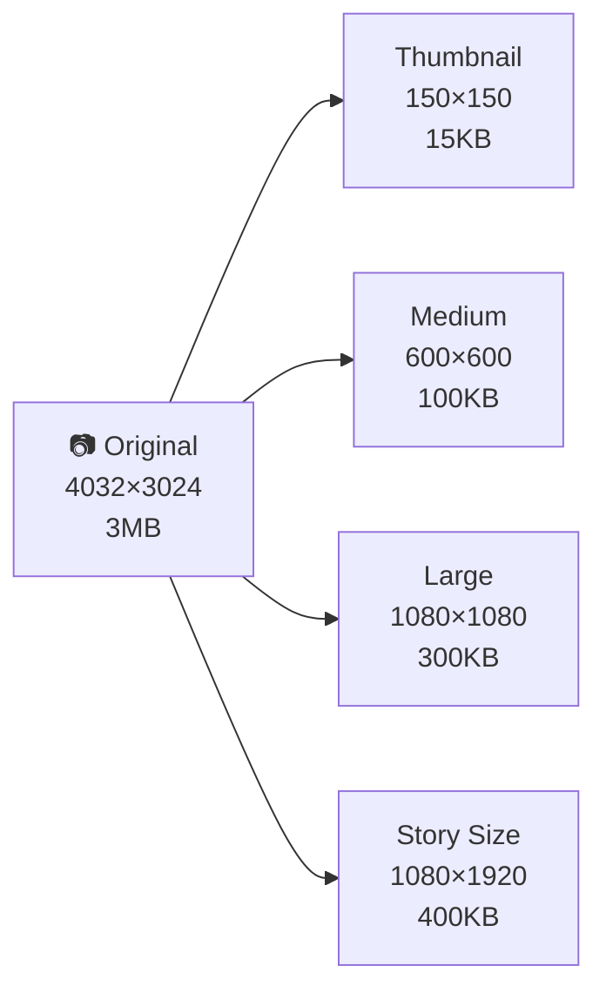
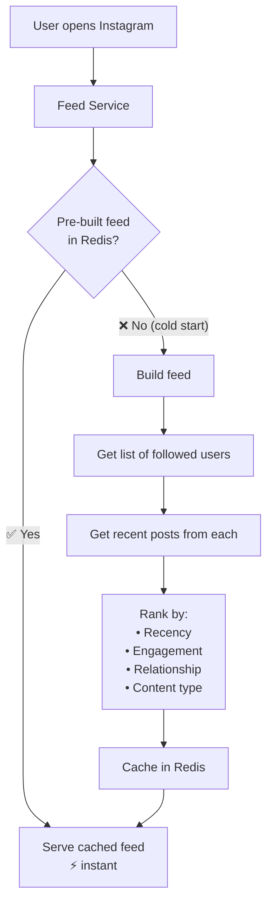
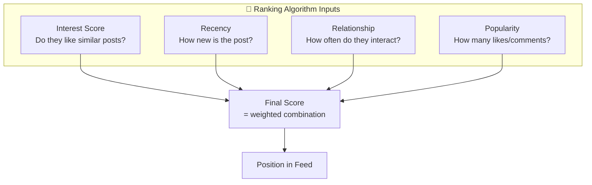
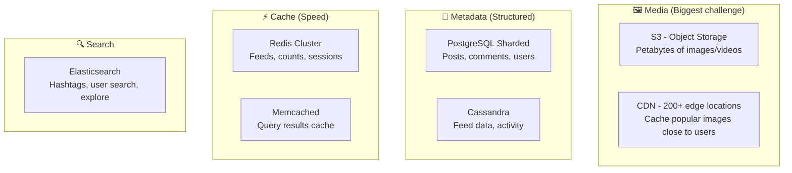
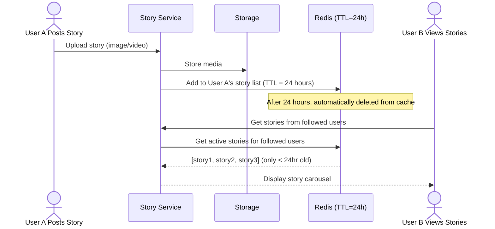

# HLD 03: Design Instagram (Photo Sharing)

## 💡 Quick Summary

> **What**: A photo/video sharing platform where users post content, follow others, and browse a personalized feed.  
> **Key Insight**: This is a read-heavy, media-heavy system. The challenge is serving billions of images fast (CDN + storage) and generating personalized feeds at scale.

---

## 🎯 The Problem in Simple Terms

Instagram handles:
- 100M+ photos uploaded daily
- 2B+ monthly active users browsing feeds
- Each photo needs multiple sizes (thumbnail, medium, full)
- Feed must be personalized and fast (< 300ms)

Think of it as: Twitter's feed problem + massive media storage + image processing pipeline.

---

## 📋 Requirements

### What It Must Do
| Feature | Detail |
|---------|--------|
| Upload photo/video | With captions, tags, location |
| News Feed | Personalized feed from followed users |
| Stories | 24-hour disappearing content |
| Like & Comment | Engage with posts |
| Explore | Discover new content (recommendation) |
| Direct Messages | Private messaging |

### Scale Numbers
```
Users: 2B monthly, 500M daily active
Uploads: 100M photos/day, 20M videos/day
Storage per photo: 5 sizes × 500KB avg = 2.5MB per upload
Daily new storage: 100M × 2.5MB = 250 TB/day!
Read:Write = 100:1
Feed latency: < 300ms
```

---

## 🏗️ Architecture Overview



---

## 🔍 How Photo Upload Works



### Image Sizes Generated



---

## 📰 How the Feed Works

### Feed Generation (Same hybrid approach as Twitter)



### Feed Ranking Signals



---

## 🗄️ Storage Architecture



### How much storage?
```
100M photos/day × 2.5MB × 365 days = ~91 PB/year
With replication (3x) = ~273 PB/year
Cost at $0.023/GB/month = ~$75M/year just for storage!
```

---

## 📱 Stories (Disappearing Content)



**Key insight**: Stories use TTL (time-to-live) in Redis. After 24 hours, they just disappear from cache automatically. The media stays in S3 for a bit longer (backup) then gets garbage-collected.

---

## 📊 Key Trade-offs

| Decision | We Chose | Why |
|----------|----------|-----|
| Image serving | CDN + S3 | CDN caches at edge; 90% of requests never hit origin |
| Feed strategy | Pre-computed + ranking | Can't compute at read time for 500M users |
| Multiple image sizes | Generate on upload | Costs storage but saves CPU on every view |
| Story storage | Redis with TTL | Auto-expiry, no cleanup jobs needed |
| Database | Sharded PostgreSQL | Instagram actually uses Postgres at massive scale |
| Consistency | Eventual for feed | OK if post appears 1-2s later in followers' feeds |

---

## 🚀 How It Scales

| Challenge | Solution |
|-----------|----------|
| 250 TB new images/day | S3 infinite storage + lifecycle policies |
| Serving images globally | 200+ CDN edge locations cache popular content |
| Feed for 500M daily users | Pre-computed feeds in Redis; hybrid fan-out |
| Hot posts (viral) | Separate trending cache; rate limit fan-out |
| Search & Explore | Elasticsearch + ML recommendation models |
| Database at scale | Shard by user_id; read replicas per region |
