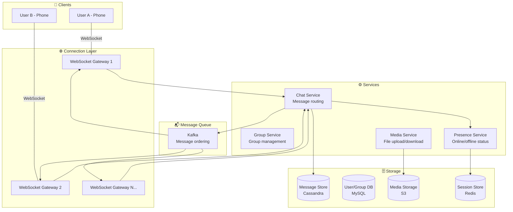
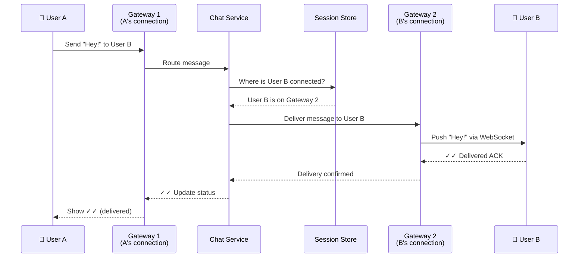
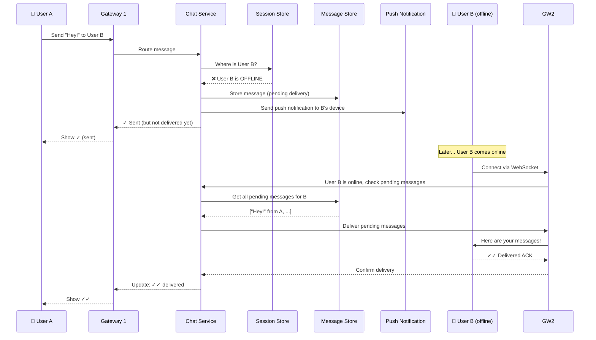
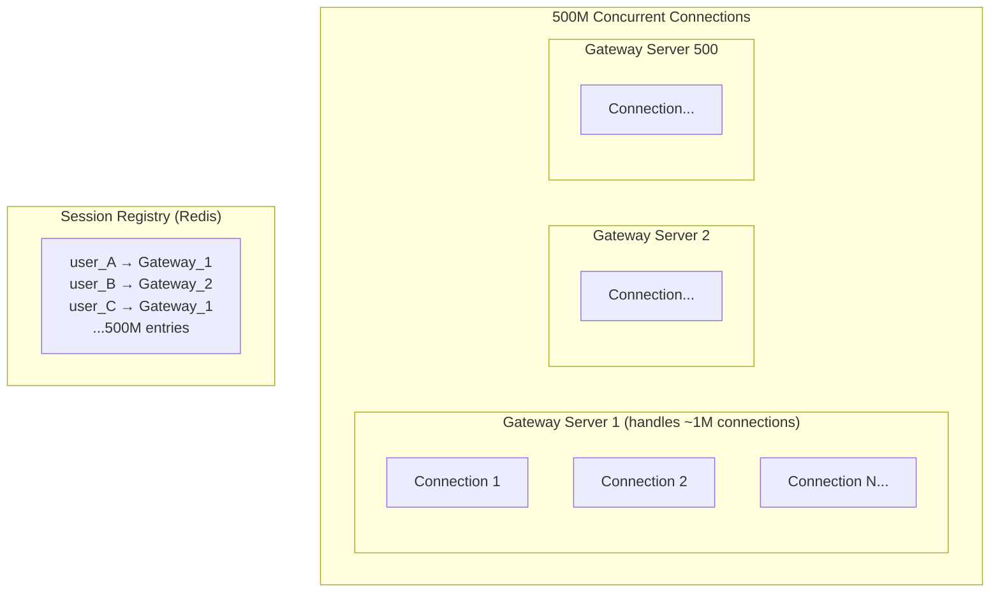
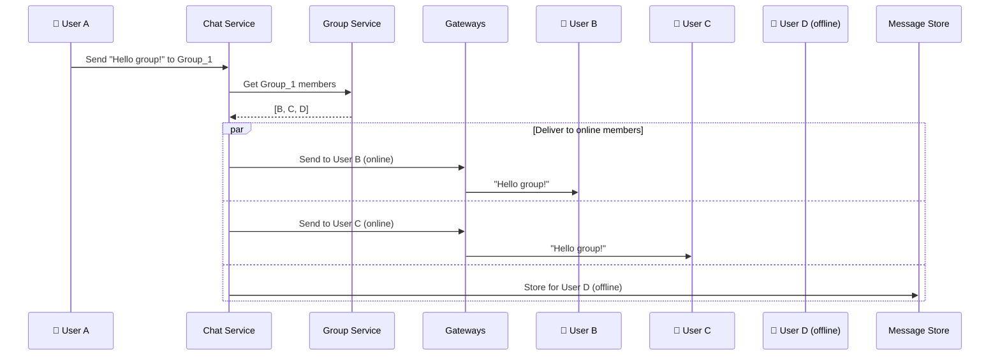
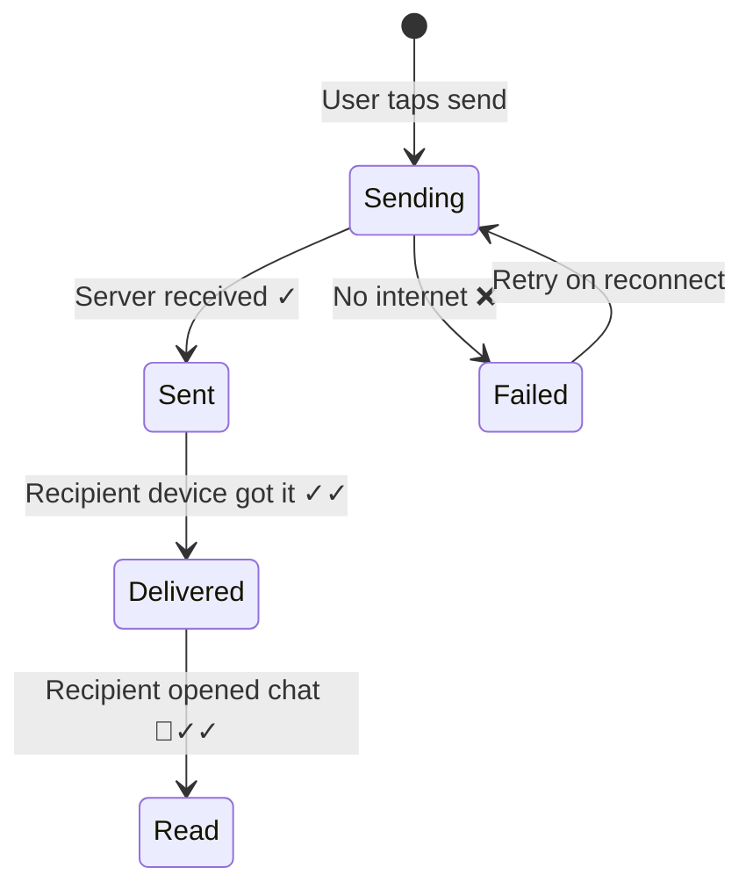
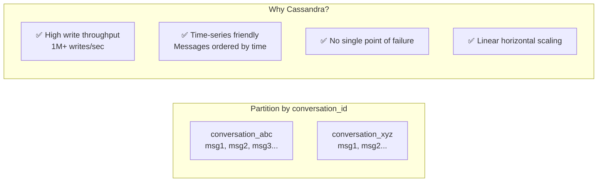
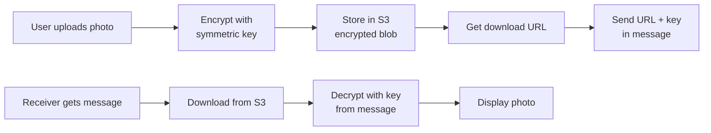
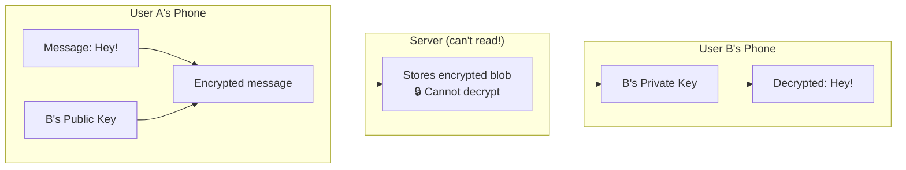

# HLD 04: Design WhatsApp (Real-Time Messaging)

## 💡 Quick Summary

> **What**: A real-time messaging system supporting 1:1 chats, group chats, media sharing, and online status.  
> **Key Insight**: The core challenge is maintaining persistent connections (WebSockets) to billions of devices and reliably delivering messages even when users are offline.

---

## 🎯 The Problem in Simple Terms

WhatsApp delivers 100B+ messages daily. When you send "Hey!" to a friend:
- If they're **online** → deliver instantly via WebSocket
- If they're **offline** → store it and deliver when they reconnect
- Show ✓ (sent) ✓✓ (delivered) and blue ✓✓ (read)
- All of this in under 100ms for online users

---

## 📋 Requirements

### What It Must Do
| Feature | Detail |
|---------|--------|
| 1:1 messaging | Text, images, videos, voice notes |
| Group chat | Up to 1024 members |
| Delivery receipts | Sent ✓, Delivered ✓✓, Read (blue) ✓✓ |
| Online/Last seen | Show when user was last active |
| Media sharing | Photos, videos, documents |
| End-to-end encryption | Server can't read messages |

### Scale Numbers
```
Users: 2B registered, 500M daily active
Messages: 100B/day = ~1.15M messages/second
Connections: 500M concurrent WebSocket connections
Group size: Up to 1024 members
Message size: Text ~100 bytes, Media ~1-10MB
Latency: < 100ms for online users
```

---

## 🏗️ Architecture Overview



---

## 🔍 How a Message Gets Delivered

### Case 1: Both Users Online (Real-Time Path)



### Case 2: Receiver is Offline



---

## 🔌 WebSocket Connection Management



**How it works:**
1. When User A connects → their phone opens a WebSocket to the nearest gateway
2. The gateway registers: "User A is connected to me" in Redis
3. When a message arrives for User A → look up Redis → route to correct gateway
4. If gateway crashes → client auto-reconnects to another one

---

## 👥 Group Messaging



**Optimization for large groups (1000 members):**
- Don't fan-out individually — use Kafka topic per group
- Members subscribe to group topic
- Only fan-out to online members; offline get on reconnect

---

## ✓ Message Delivery Receipts



---

## 🗄️ Storage Design

### Message Store (Cassandra — optimized for writes)



### Media Storage Flow


---

## 🔒 End-to-End Encryption (Simplified)



The server is just a relay — it stores and forwards encrypted blobs. Only the recipient's device can decrypt.

---

## 📊 Key Trade-offs

| Decision | We Chose | Why |
|----------|----------|-----|
| Protocol | WebSocket | Persistent bidirectional; low overhead vs HTTP polling |
| Message store | Cassandra | Write-heavy (100B msgs/day); append-only; time-ordered |
| Session store | Redis | Fast lookup for "which gateway is user on?" |
| Delivery | At-least-once | Better duplicate than lost message; client deduplicates |
| Group strategy | Kafka topics | Efficient fan-out; members subscribe to group topic |
| Encryption | E2E (Signal Protocol) | Privacy; server never sees plaintext |

---

## 🚀 Scaling Strategy

| Challenge | Solution |
|-----------|----------|
| 500M concurrent connections | 500+ WebSocket gateway servers (1M connections each) |
| 1M messages/second | Kafka partitions; horizontal write scaling |
| Message ordering | Partition Kafka by conversation_id → ordering per chat |
| Gateway failure | Client auto-reconnects; session registry updates |
| Media delivery | S3 + CDN for large files; only URL in message |
| Global reach | Multi-region deployment with geo-routing |
