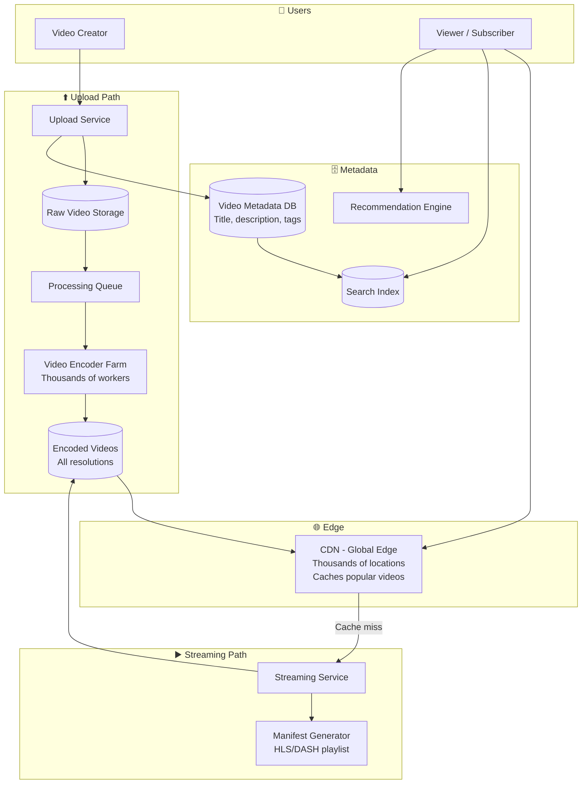
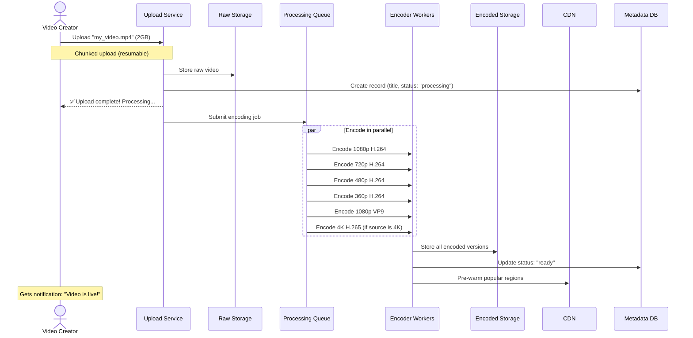
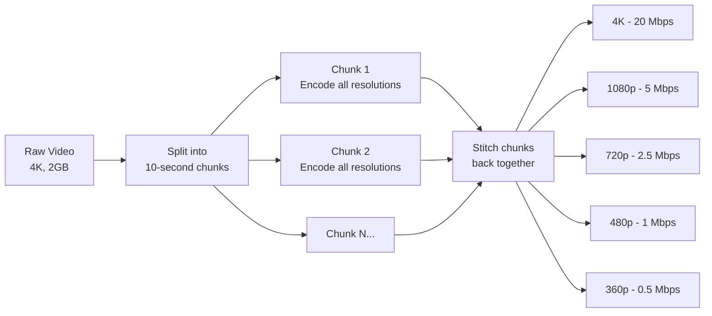
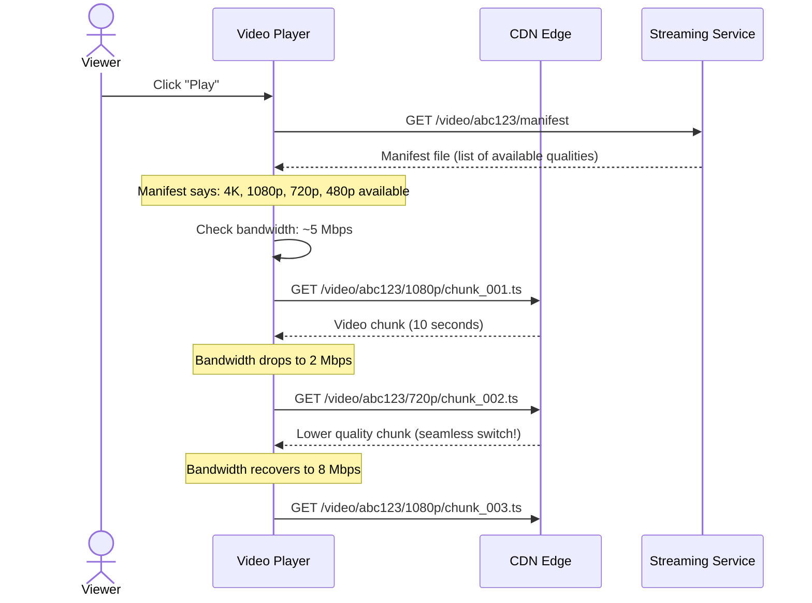
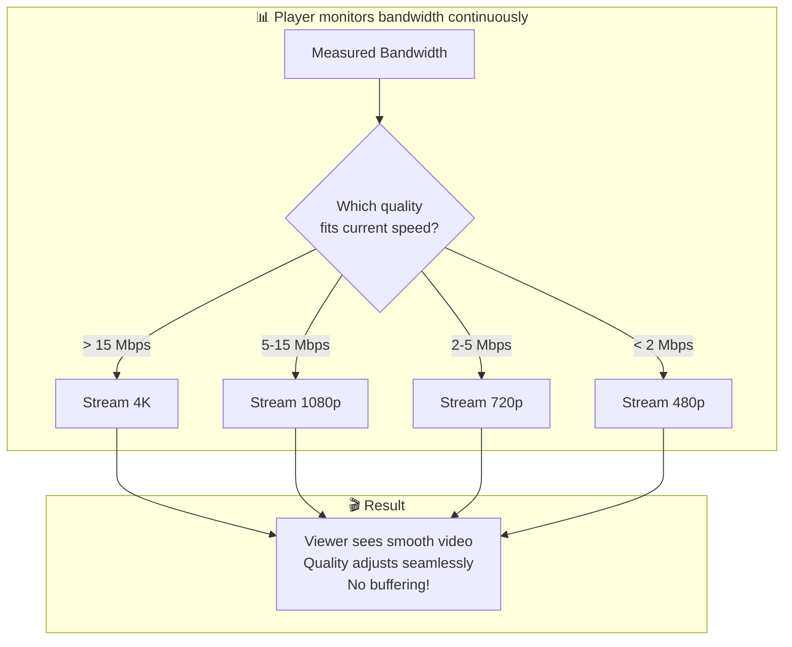
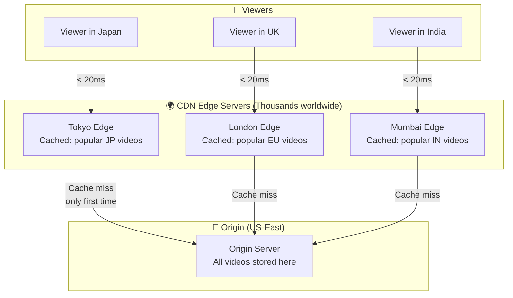
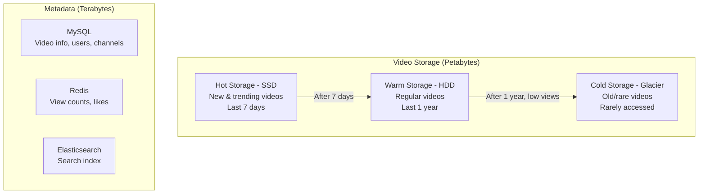

# HLD 05: Design YouTube / Netflix (Video Streaming)

## 💡 Quick Summary

> **What**: A video streaming platform where users upload, process, and stream videos at scale.  
> **Key Insight**: The hardest part is the video processing pipeline (encoding into multiple resolutions/formats) and serving massive video files globally with adaptive bitrate streaming.

---

## 🎯 The Problem in Simple Terms

When you upload a 10-minute 4K video to YouTube:
- It must be converted into 6+ resolutions (144p to 4K)
- Each resolution in multiple formats (H.264, VP9, AV1)
- That's 20+ versions of one video!
- Then serve it to viewers worldwide with zero buffering

YouTube serves 1B+ hours of video DAILY. Netflix streams to 230M subscribers simultaneously.

---

## 📋 Requirements

### What It Must Do
| Feature | Detail |
|---------|--------|
| Upload video | Any format, up to hours long |
| Process/Encode | Convert to multiple resolutions & codecs |
| Stream | Adaptive bitrate based on user's bandwidth |
| Search | Find videos by title, description, tags |
| Recommendations | Suggest videos based on watch history |
| Comments & Likes | Social engagement |

### Scale Numbers
```
YouTube scale:
- 500 hours of video uploaded every MINUTE
- 1B hours watched/day
- 2B monthly users
- Average video: 10 min = 150MB (720p)
- Storage: 500 hrs/min × 60 × 24 × 150MB × 6 resolutions = ~3.9 PB/day NEW storage!
- Peak concurrent viewers: 100M+
```

---

## 🏗️ Architecture Overview



---

## 🔍 How Video Upload & Processing Works



### Video Processing Pipeline (Detail)



**Why split into chunks?** Parallel processing! A 1-hour video split into 360 chunks (10s each) can be encoded by 360 workers simultaneously. Total time: minutes instead of hours.

---

## ▶️ How Video Streaming Works (Adaptive Bitrate)



### How Adaptive Bitrate Works (Visual)



---

## 🌍 CDN Strategy (Why Videos Don't Buffer)



**Key insight**: Popular videos (top 20%) serve 80% of traffic. These stay cached at edge. Less popular = fetched from origin on demand.

---

## 🗄️ Storage Architecture



---

## 📊 Key Trade-offs

| Decision | We Chose | Why |
|----------|----------|-----|
| Encoding strategy | Pre-encode all resolutions | CPU cost upfront vs. smooth playback for billions of views |
| Streaming protocol | HLS/DASH (chunked) | Adaptive bitrate; works over HTTP; CDN-friendly |
| Storage tiering | Hot/Warm/Cold | 90% of views are recent/popular content; save $$$ |
| Upload | Chunked + resumable | Large files (GB+); don't restart on network failure |
| Processing | Split video into segments | Parallel encoding = minutes instead of hours |
| CDN | Multi-CDN strategy | No single CDN covers everywhere; use multiple |

---

## 🚀 Scaling Challenges & Solutions

| Challenge | Solution |
|-----------|----------|
| 500 hrs uploaded/minute | Massive encoder fleet (1000s of GPU workers) |
| 1B hours watched/day | CDN serves 95% of traffic; viewers rarely hit origin |
| Storage growing 4PB/day | Tiered storage (hot→warm→cold); compression improvements |
| Buffering during peak | Multiple CDN providers; overflow routing |
| Video processing time | Split into chunks → parallel encode → faster completion |
| Search 800M videos | Elasticsearch cluster; metadata + captions indexed |
