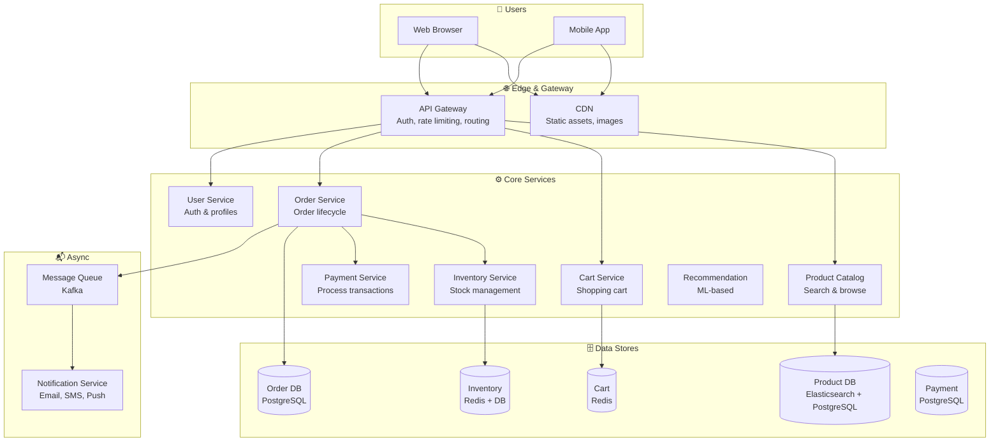
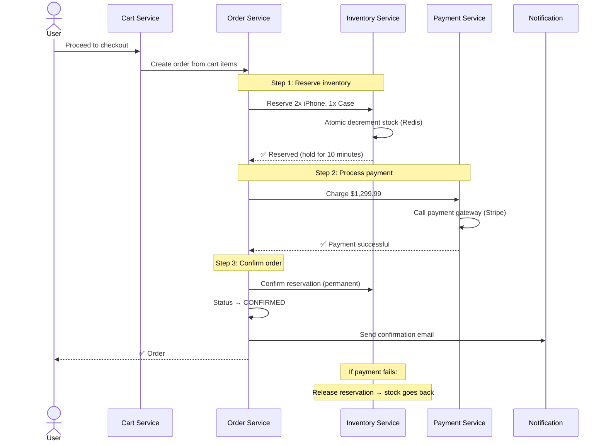
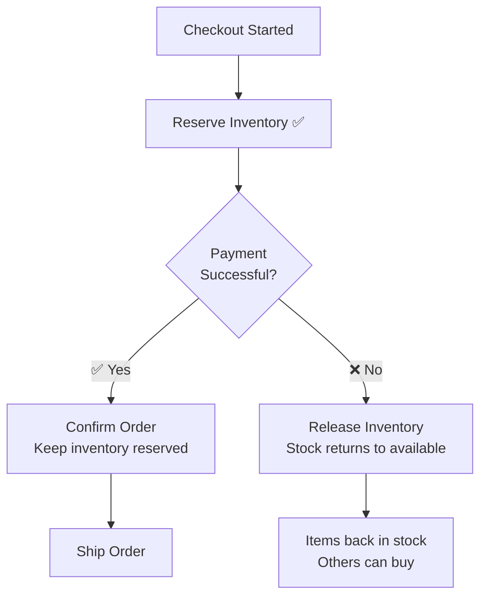
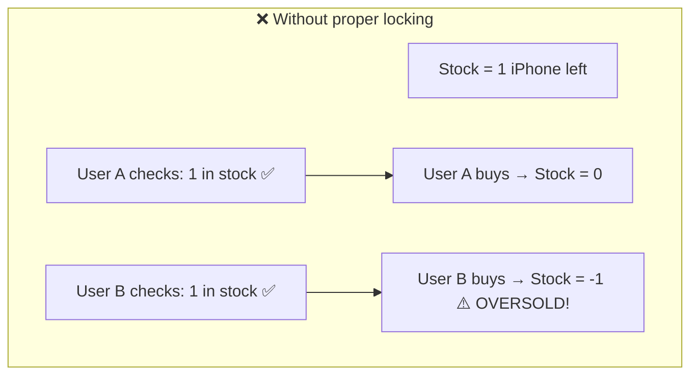
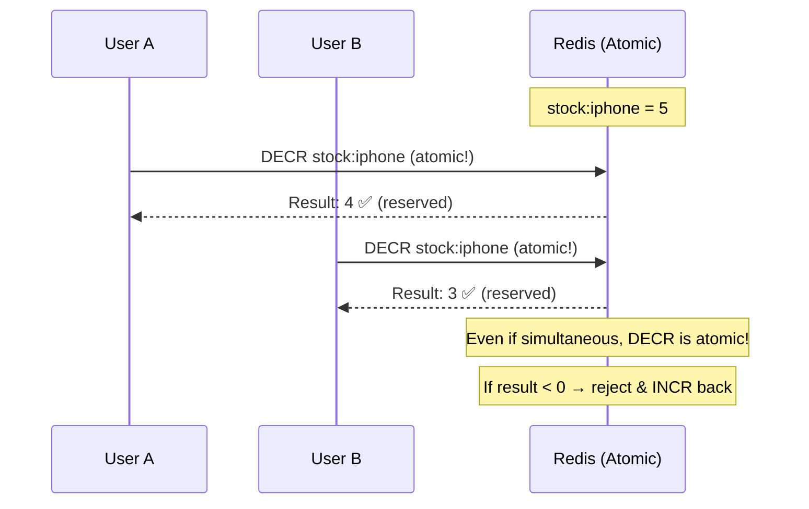
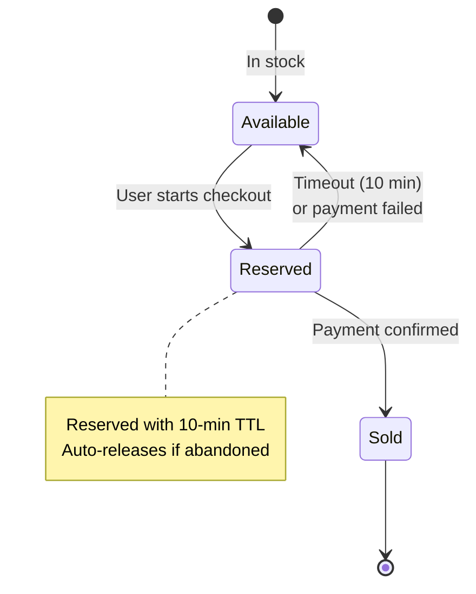
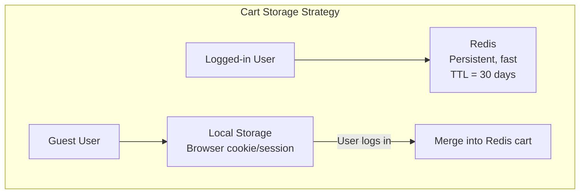
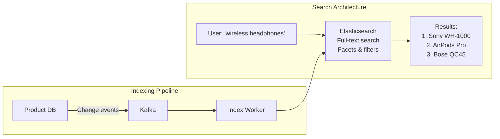
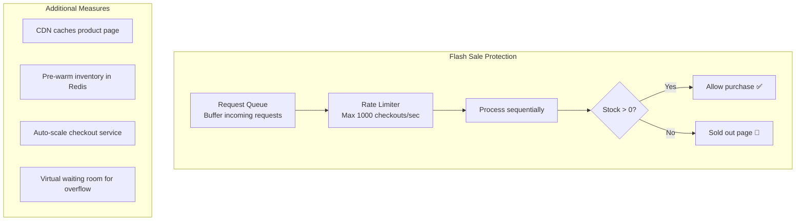

# HLD 06: Design E-Commerce Platform (Amazon)

## 💡 Quick Summary

> **What**: An online marketplace where users browse products, add to cart, and complete purchases with payment.  
> **Key Insight**: The hardest parts are inventory management (preventing overselling), handling flash sales (sudden traffic spikes), and maintaining consistency across distributed services during checkout.

---

## 🎯 The Problem in Simple Terms

When 10,000 people try to buy the last iPhone during a flash sale:
- Only 100 are in stock
- You CANNOT sell 101 (overselling = real money loss)
- Checkout must complete in < 3 seconds
- If someone abandons cart, items must be released back

This requires careful orchestration of inventory, payments, and order management.

---

## 📋 Requirements

### What It Must Do
| Feature | Detail |
|---------|--------|
| Product catalog | Browse millions of products with search & filters |
| Shopping cart | Add/remove items, persist across sessions |
| Checkout | Address → payment → order confirmation |
| Inventory | Real-time stock tracking, no overselling |
| Orders | Track order status, history |
| Payments | Multiple methods, refunds |
| Recommendations | "Customers also bought..." |

### Scale Numbers
```
Products: 350M+ (Amazon scale)
Daily orders: 50M+
Peak: 50x during flash sales (Black Friday)
Cart sessions: 200M concurrent
Latency: Product page < 200ms, Checkout < 3 sec
Availability: 99.99% (every minute of downtime = $millions lost)
```

---

## 🏗️ Architecture Overview



---

## 🔍 How Checkout Works (The Critical Path)



### What Happens When Payment Fails?



---

## 🏪 Inventory Management (Preventing Overselling)

### The Problem with Flash Sales



### Our Solution: Atomic Reserve with Redis



### Reservation with TTL (Timeout)



---

## 🛒 Shopping Cart Design



**Why Redis for cart?**
- Fast reads/writes (< 1ms)
- TTL = auto-cleanup of abandoned carts
- Persists across devices (logged-in users)
- Handles 200M concurrent cart sessions

---

## 🔎 Product Search & Catalog



**Search features:**
- Full-text search with typo tolerance
- Filters: price range, brand, rating, Prime eligible
- Sort: relevance, price, rating, newest
- Autocomplete suggestions

---

## 📊 Key Trade-offs

| Decision | We Chose | Why |
|----------|----------|-----|
| Inventory locking | Atomic Redis DECR | Fast, prevents overselling, no DB locks |
| Cart storage | Redis with TTL | Sub-ms reads, auto-cleanup, scales horizontally |
| Checkout flow | Saga pattern (compensating actions) | No distributed transactions needed; eventual consistency |
| Product search | Elasticsearch | Full-text, facets, fast; denormalized for read speed |
| Pricing | Eventual consistency | Price can change between cart add and checkout (show warning) |
| Database | Service-per-DB (microservices) | Independent scaling; fault isolation |

---

## 🚀 Handling Flash Sales (10,000x Normal Traffic)



**Strategy:**
1. **Pre-warm**: Load inventory into Redis before sale starts
2. **Virtual queue**: Overflow users see "You're #5,432 in line"
3. **Rate limit**: Process checkouts in controlled batches
4. **CDN**: Product page served from edge (static)
