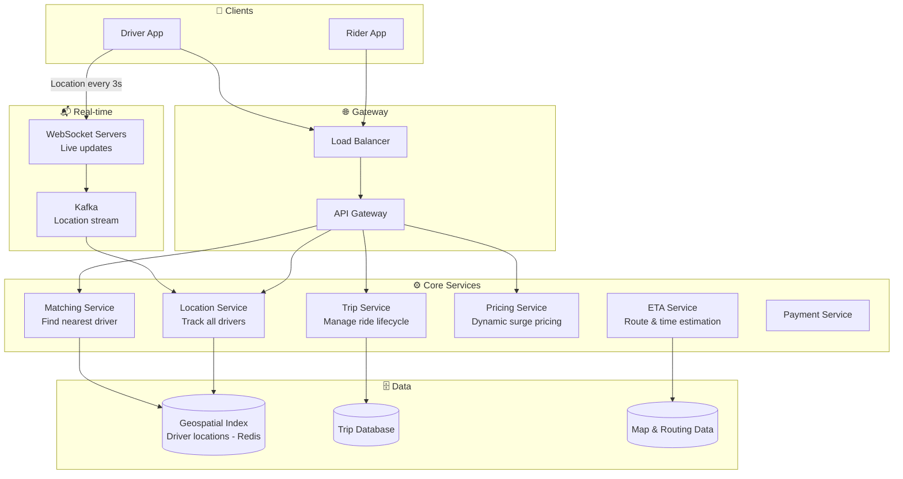
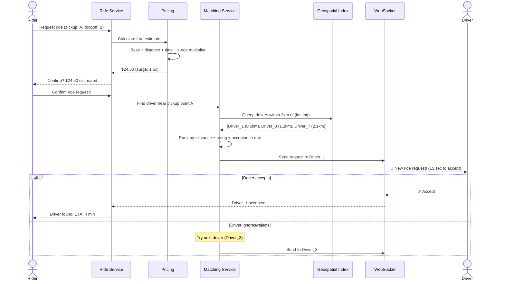
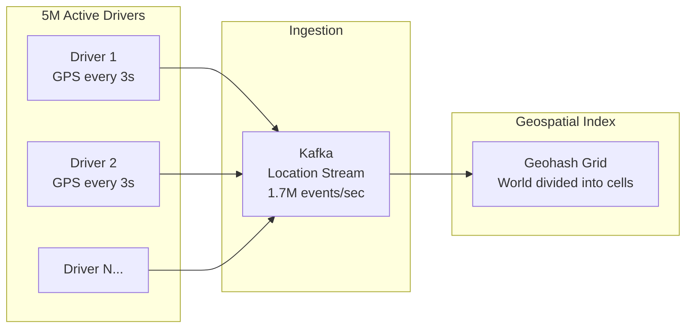
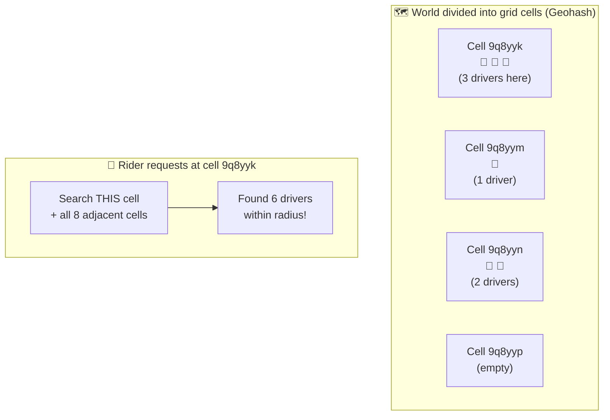
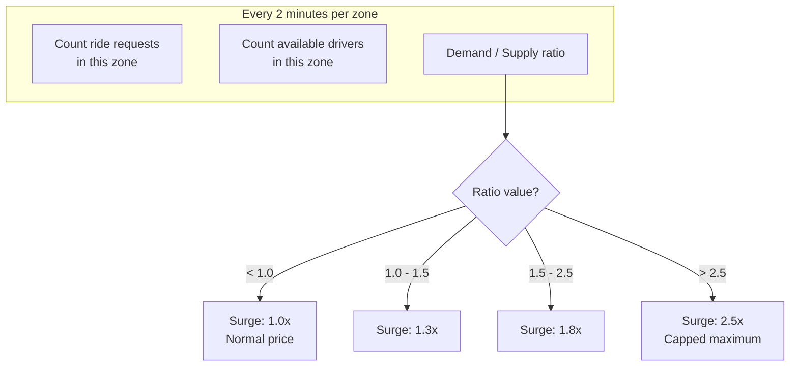
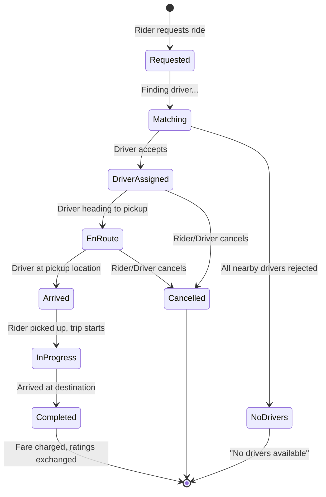
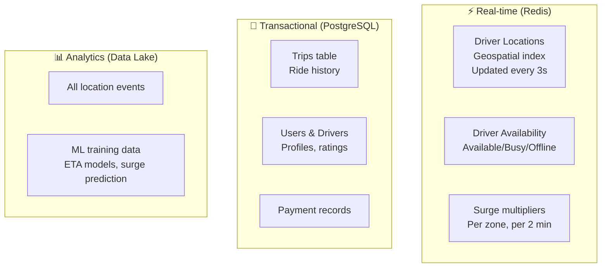

# HLD 07: Design Uber (Ride-Hailing Platform)

## 💡 Quick Summary

> **What**: A platform that matches riders with nearby drivers in real-time, tracks locations, calculates fares, and handles payments.  
> **Key Insight**: The core challenge is real-time geospatial matching — finding the nearest available driver among millions of moving vehicles, all updating their location every 3 seconds.

---

## 🎯 The Problem in Simple Terms

When you request an Uber ride:
- The system must find the 5 nearest available drivers (within seconds)
- Drivers are constantly moving (location updates every 3-4 seconds)
- 20M+ rides happen daily across 10,000+ cities
- ETA must be accurate (routing + traffic)
- Pricing changes dynamically based on demand (surge pricing)

---

## 📋 Requirements

### What It Must Do
| Feature | Detail |
|---------|--------|
| Request ride | Rider enters pickup & destination |
| Match driver | Find nearest available driver |
| Real-time tracking | See driver moving on map |
| ETA | Estimated arrival time |
| Pricing | Dynamic pricing with surge |
| Trip management | Start, track, end trip |
| Payments | Automatic fare calculation & charge |

### Scale Numbers
```
Active drivers: 5M+ worldwide
Rides/day: 20M+
Location updates: 5M drivers × 1 update/3 sec = 1.7M updates/second!
Matching latency: < 5 seconds
Cities: 10,000+
Peak: Friday night 10-50x normal in some areas
```

---

## 🏗️ Architecture Overview



---

## 🔍 How Ride Matching Works



---

## 📍 Location Tracking (1.7M Updates/Second!)

### How Driver Locations Are Tracked



### Geohash: How We Find Nearby Drivers



**How Geohash works:**
1. Divide the world into grid cells (like a chessboard)
2. Each cell has a string ID: "9q8yyk"
3. Store drivers in Redis: `geohash:9q8yyk → [driver_1, driver_3, driver_5]`
4. To find nearby: search the rider's cell + adjacent cells
5. Filter by actual distance (Haversine formula)

---

## 💰 Surge Pricing



**Example:** Friday night downtown
- 200 requests in zone, only 50 drivers available
- Ratio = 4.0 → Surge = 2.5x
- This incentivizes more drivers to come to that area

---

## 🚗 Trip Lifecycle



---

## 🗄️ Data Architecture



---

## 📊 Key Trade-offs

| Decision | We Chose | Why |
|----------|----------|-----|
| Location index | Redis Geospatial (GEOADD) | Sub-ms lookups, handles 1.7M writes/sec |
| Matching algorithm | Nearest + rank (rating, acceptance) | Pure nearest isn't best (driver might reject) |
| Location update freq | Every 3 seconds | Balance between accuracy and bandwidth |
| Surge calculation | Zone-based, every 2 min | Too frequent = unstable prices; too slow = inaccurate |
| Trip consistency | Strong (PostgreSQL) | Money involved — can't lose trip records |
| Communication | WebSocket | Real-time bidirectional for live tracking |

---

## 🚀 Scaling Challenges

| Challenge | Solution |
|-----------|----------|
| 1.7M location updates/sec | Kafka partitioned by city; Redis per region |
| Finding drivers fast | Geohash index; search cell + neighbors only |
| Peak demand (New Year's Eve) | Auto-scale matching service; pre-warm capacity |
| Global presence (10K cities) | Regional deployments; independent matching per city |
| ETA accuracy | ML model trained on historical trip data + live traffic |
| Driver-rider communication | WebSocket connections with auto-reconnect |
