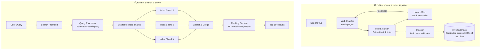
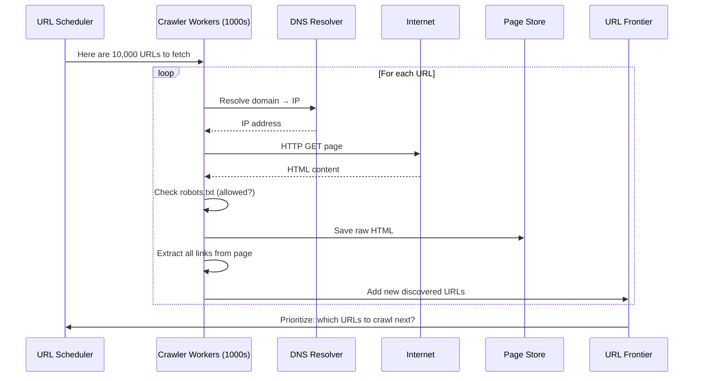
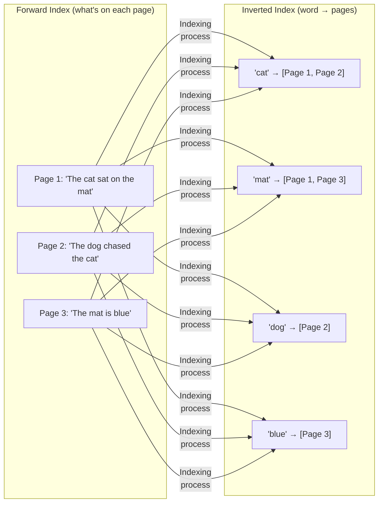
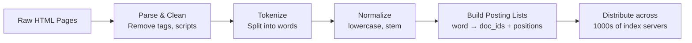
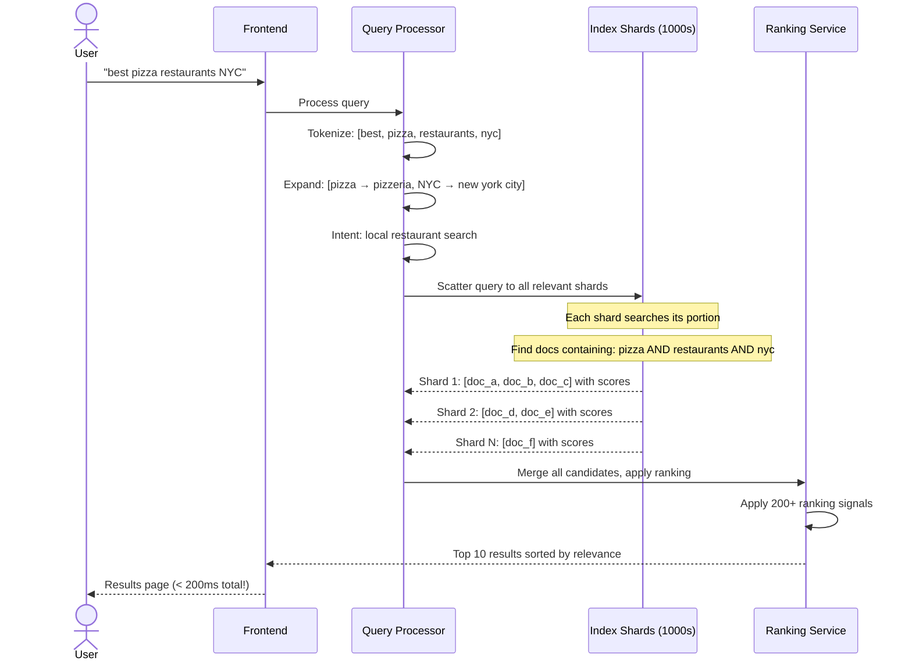
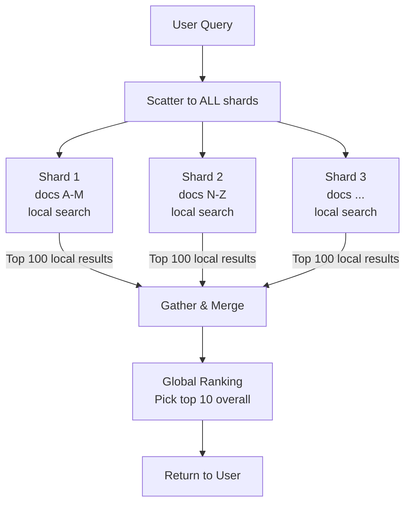
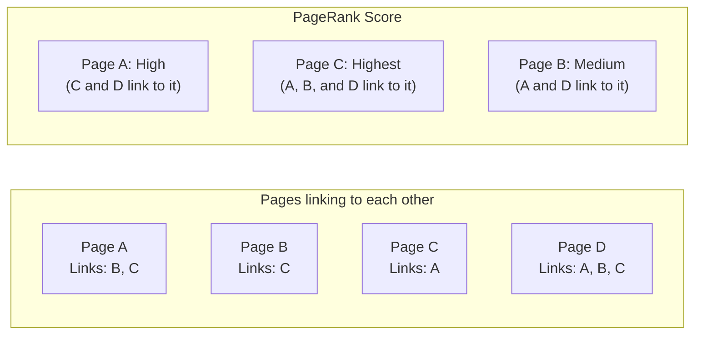
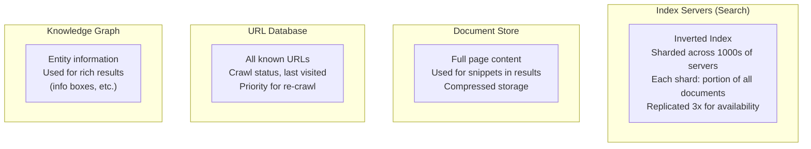

# HLD 08: Design Google Search

## 💡 Quick Summary

> **What**: A web search engine that crawls the internet, indexes billions of pages, and returns relevant results in milliseconds.  
> **Key Insight**: The system has two halves — an offline pipeline (crawl → index billions of pages) and an online serving system (search → rank → return results in < 200ms).

---

## 🎯 The Problem in Simple Terms

Google indexes 100+ BILLION web pages. When you type "best pizza near me":
- It searches through 100B+ documents
- Finds the most relevant ones
- Ranks them by 200+ signals
- Returns results in < 200ms

This requires two systems working together:
1. **Crawling & Indexing** (offline, runs continuously): "Read the entire internet"
2. **Search & Ranking** (online, real-time): "Find the needle in the haystack, instantly"

---

## 📋 Requirements

### What It Must Do
| Feature | Detail |
|---------|--------|
| Web crawling | Discover & download web pages continuously |
| Indexing | Process pages into searchable format |
| Search | Return relevant results for any query |
| Ranking | Order by relevance (PageRank + 200 signals) |
| Autocomplete | Suggest queries as user types |
| Freshness | New pages indexed within minutes-hours |

### Scale Numbers
```
Web pages indexed: 100B+
Searches/day: 8.5B (100,000/second)
New/updated pages/day: hundreds of millions
Index size: 100+ PB
Latency: < 200ms for results
Availability: 99.999%
```

---

## 🏗️ Architecture Overview



---

## 🕷️ How Web Crawling Works



### URL Prioritization

```mermaid
graph TD
    subgraph "URL Priority Queue"
        High[🔴 High Priority<br/>• News sites (fresh!)<br/>• High PageRank sites<br/>• Recently changed]
        Medium[🟡 Medium Priority<br/>• Regular popular sites<br/>• Updated weekly]
        Low[🟢 Low Priority<br/>• Rarely changing pages<br/>• Low PageRank]
    end
    
    High -->|"Crawl every hour"| Crawler
    Medium -->|"Crawl every few days"| Crawler
    Low -->|"Crawl every month"| Crawler
    
    Crawler[Crawler Workers]
```

---

## 📑 How Indexing Works (Inverted Index)

### What is an Inverted Index?

Think of it like a book index. Instead of "page → words on that page", it's "word → which pages contain that word."



### Building the Index



---

## 🔍 How a Search Query is Served



### Scatter-Gather Pattern (Visual)



---

## 📊 PageRank (Simplified)



**Key insight**: A page is important if other important pages link to it. It's like voting — a link from NYTimes counts more than a link from a random blog.

---

## 🗄️ Data Architecture



---

## 📊 Key Trade-offs

| Decision | We Chose | Why |
|----------|----------|-----|
| Index distribution | Sharded by document ID | Even distribution; parallel search |
| Freshness vs. cost | Tiered crawl frequency | Important pages hourly; others weekly/monthly |
| Ranking | ML model (200+ signals) | Pure PageRank not enough; need context, freshness, location |
| Index update | Batch + real-time | Batch for full re-index; real-time for breaking news |
| Result count | Estimate, don't count | "About 1.2B results" is estimate (faster than exact) |
| Serving | Replicate each shard 3x | Any replica can serve; handles node failures |

---

## 🚀 Scaling Challenges

| Challenge | Solution |
|-----------|----------|
| 100B+ pages to index | Distribute across 1000s of index servers |
| 100K queries/second | Each shard handles portion; replicas for throughput |
| Freshness (breaking news) | Separate "real-time index" merged with main index |
| Global latency | Data centers per continent; serve from nearest |
| Crawl politeness | Respect robots.txt; rate limit per domain |
| Malicious pages (SEO spam) | Spam detection in ranking pipeline |
