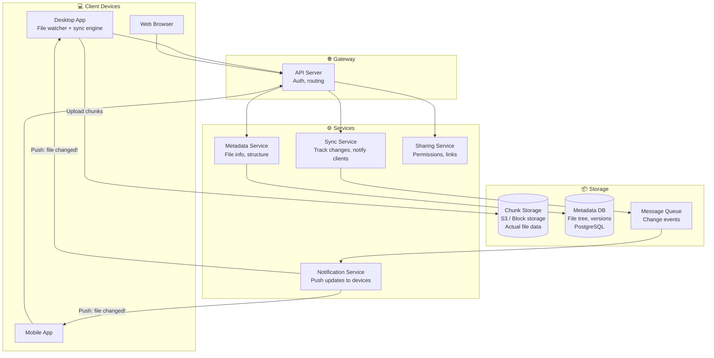
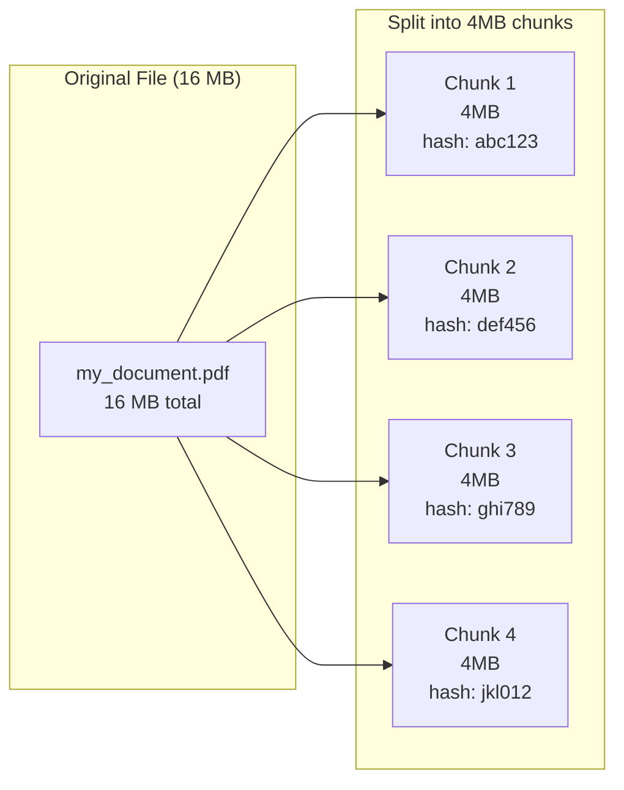
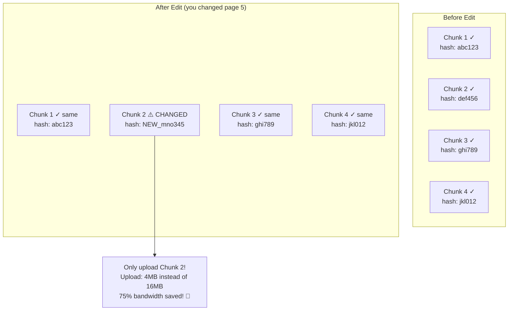
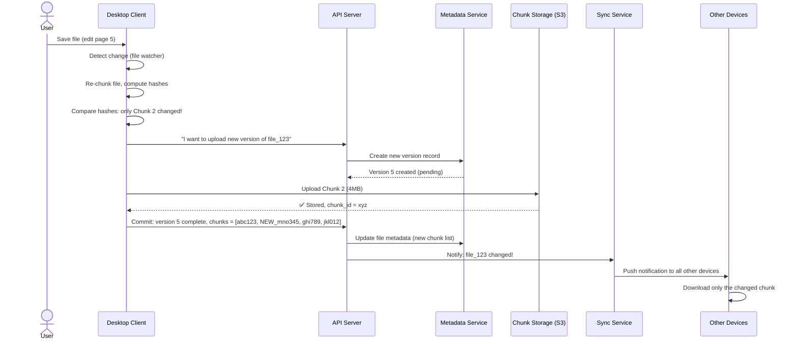
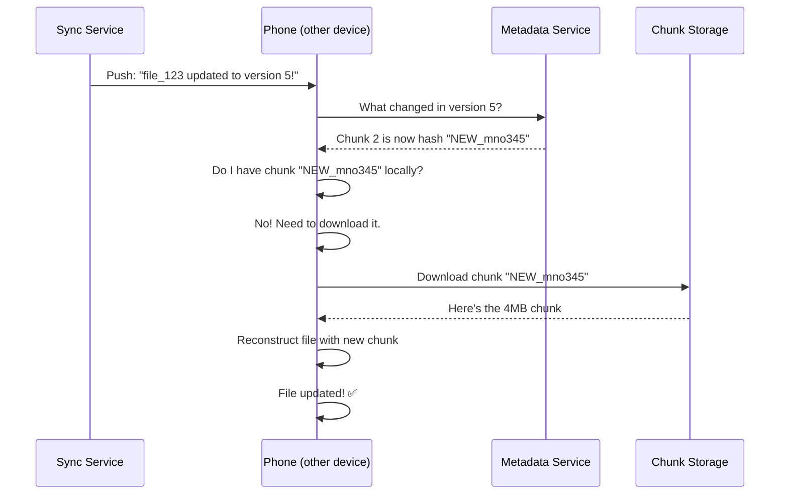
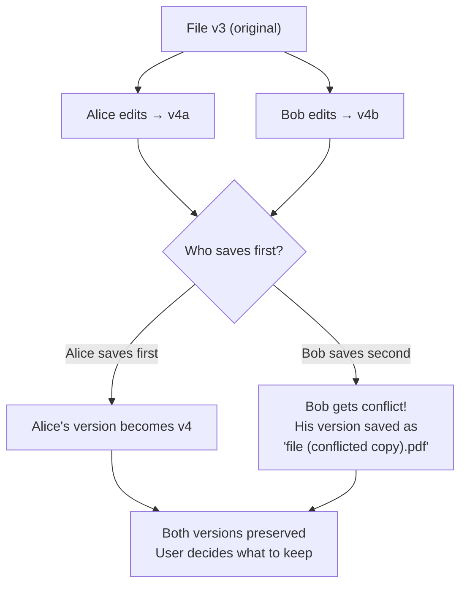
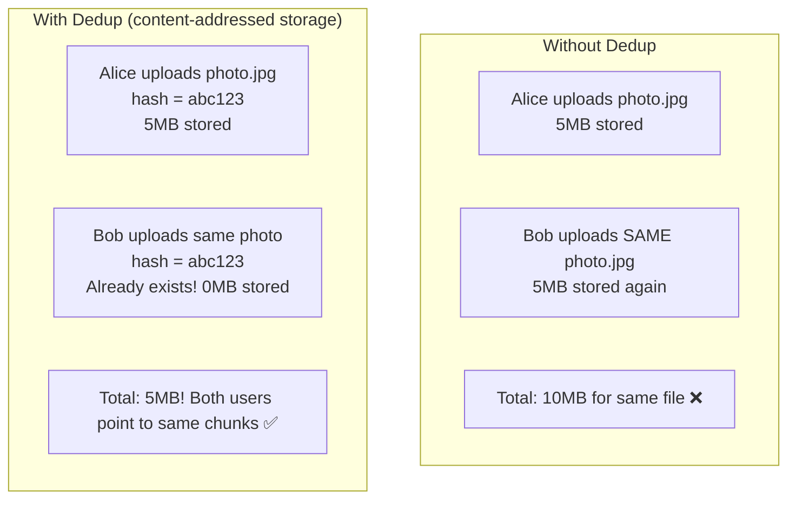
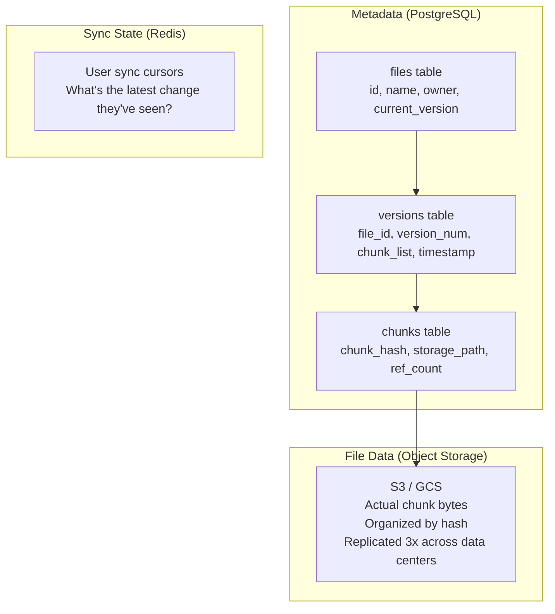

# HLD 09: Design Dropbox / Google Drive (File Storage & Sync)

## 💡 Quick Summary

> **What**: A cloud file storage service that syncs files across devices, handles versioning, and enables collaboration.  
> **Key Insight**: The core challenge is efficient sync — when you edit a 1GB file, don't re-upload the entire thing. Split files into chunks, detect which chunks changed, and only upload those.

---

## 🎯 The Problem in Simple Terms

When you save a file on your laptop, it should appear on your phone within seconds. But:
- Files can be huge (GB+)
- You might only change a few bytes
- Multiple people might edit simultaneously
- Network can be unreliable (resume interrupted uploads)
- Need version history (undo changes)

The trick: **chunking**. Split every file into 4MB blocks. Only sync the blocks that changed.

---

## 📋 Requirements

### What It Must Do
| Feature | Detail |
|---------|--------|
| Upload/Download | Store files in the cloud |
| Auto-sync | Changes sync across all devices |
| Versioning | Keep file history, rollback |
| Sharing | Share files/folders with others |
| Conflict resolution | Handle simultaneous edits |
| Offline support | Edit offline, sync when back |

### Scale Numbers
```
Users: 700M (Dropbox scale)
Files stored: 400B+
Storage: Exabytes total
File modifications/day: billions
Average file size: varies (docs ~100KB, photos ~5MB, videos ~1GB)
Sync latency: < 5 seconds for small files
Chunk size: 4MB
```

---

## 🏗️ Architecture Overview



---

## 🔍 How File Sync Works

### The Chunking Strategy



### When You Edit a File (Only Changed Chunks Upload)



---

## 🔍 Upload Flow (Step by Step)



---

## 🔄 How Other Devices Sync (Download)



---

## 🔀 Conflict Resolution

What happens when two people edit the same file at the same time?



**Strategy**: Last-writer-wins + conflicted copy. Never lose anyone's work.

---

## 📦 Deduplication (Save Storage!)



**How it works**: Chunks are stored by their hash (content-addressed). If two users upload the same content, it's stored only once. Both file metadata just points to the same chunk.

---

## 🗄️ Data Architecture



---

## 📊 Key Trade-offs

| Decision | We Chose | Why |
|----------|----------|-----|
| Chunk size | 4MB | Balance: too small = too many chunks overhead; too large = wasteful uploads |
| Sync trigger | Push notification (long poll) | Faster than polling; less battery drain |
| Conflict handling | Last-writer-wins + conflicted copy | Never lose data; let user resolve |
| Deduplication | Content-addressed (by chunk hash) | Massive storage savings (60%+ for similar files) |
| Storage | S3 (object storage) | Infinite scale, 11 nines durability, cheap |
| Compression | Compress chunks before upload | 30-50% bandwidth savings |

---

## 🚀 Scaling Challenges

| Challenge | Solution |
|-----------|----------|
| Exabytes of data | Object storage (S3) — essentially unlimited |
| Billions of file operations/day | Metadata sharded by user_id |
| Minimize upload bandwidth | Chunking + delta sync (only changed chunks) |
| Notifications to all devices | Long polling / WebSocket + message queue |
| File versioning at scale | Store only chunk diffs between versions (not full copies) |
| Offline support | Client queues changes; replays on reconnect |
