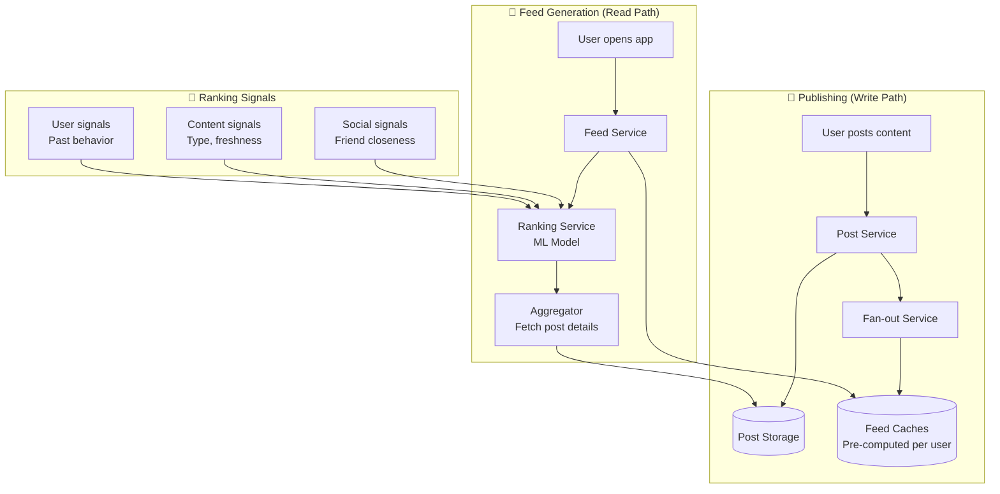
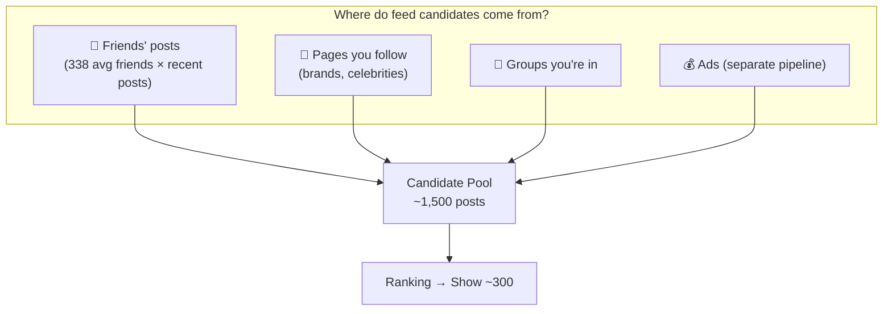
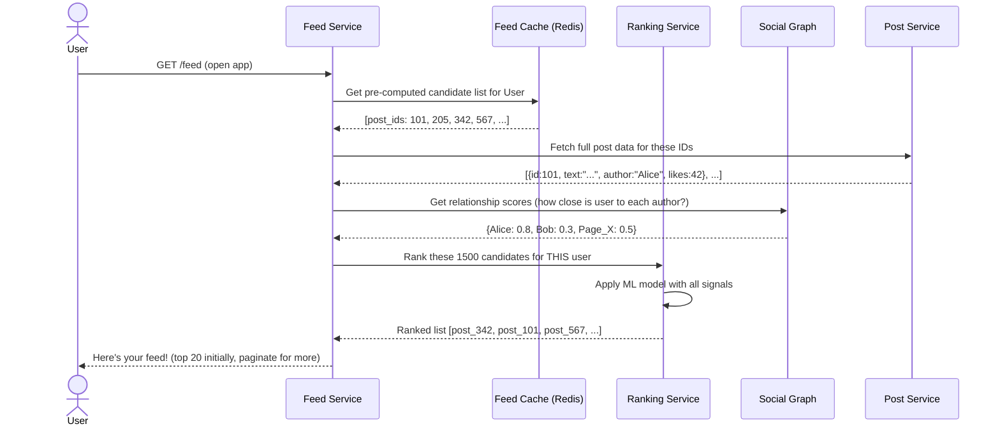
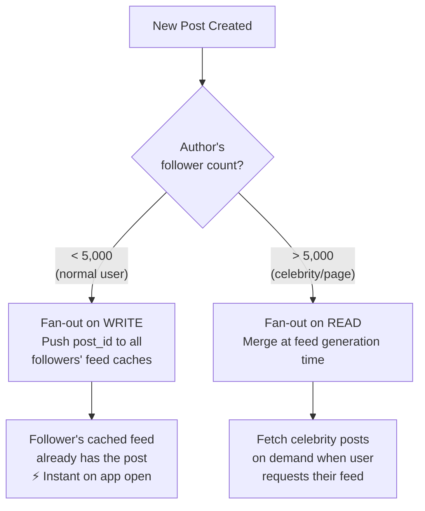
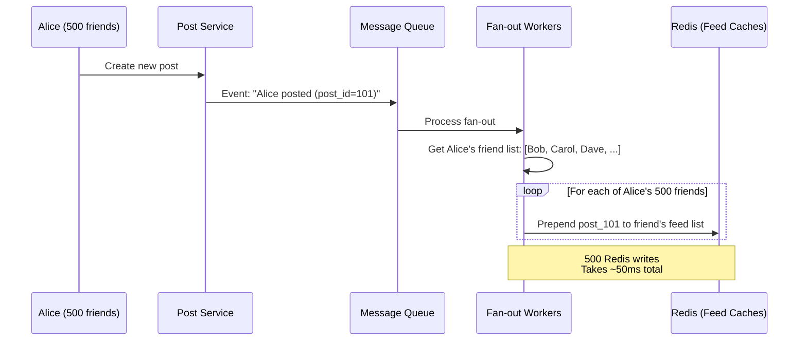
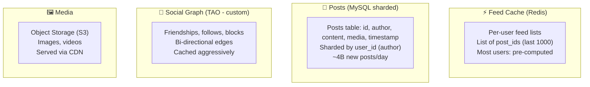

# HLD 10: Design a News Feed System (Facebook)

## 💡 Quick Summary

> **What**: A system that generates a personalized timeline showing posts from friends and pages you follow, ranked by relevance.  
> **Key Insight**: Same fan-out problem as Twitter, but with a heavier ranking component. Facebook uses a complex ML model to decide what you see (not just chronological).

---

## 🎯 The Problem in Simple Terms

When you open Facebook, your News Feed shows posts from friends, groups, and pages — but NOT everything. An average user has 1,500+ potential posts but only sees ~300. The system must:
1. **Collect** all candidate posts (from your connections)
2. **Rank** them by predicted engagement (what will YOU find interesting?)
3. **Serve** the top ones fast (< 500ms)

---

## 📋 Requirements

### What It Must Do
| Feature | Detail |
|---------|--------|
| Publish post | Text, images, videos, links |
| Generate feed | Personalized, ranked content |
| Real-time updates | New posts appear without refresh |
| Engagement | Like, comment, share |
| Diverse content | Mix of friends, pages, groups, ads |

### Scale Numbers
```
DAU: 2B+
Posts created/day: 4B+
Average friends per user: 338
Feed requests/second: 500,000+
Candidate posts per user: 1,500
Shown in feed: ~300 (ranked)
Feed load time: < 500ms
```

---

## 🏗️ Architecture Overview



---

## 🔍 How Feed Generation Works (Two Steps)

### Step 1: Candidate Collection



### Step 2: Ranking (The ML Magic)

```mermaid
graph LR
    subgraph "Input Signals"
        A[How close is this friend?<br/>Do you interact often?]
        B[Post type?<br/>Photo > text usually]
        C[How old is the post?<br/>Newer = higher]
        D[Engagement so far?<br/>Many likes = probably good]
        E[Your past behavior?<br/>Do you like similar posts?]
    end
    
    A & B & C & D & E --> ML[ML Ranking Model<br/>Predicts P(you'll engage)]
    ML --> Score["Score each candidate<br/>0.0 to 1.0"]
    Score --> Top["Show top 300<br/>in order of score"]
```

---

## 🔍 Complete Feed Request Flow



---

## 📬 Fan-Out Strategy (Hybrid, Same as Twitter)



### Fan-out on Write (The Push Path)



---

## 🧠 Ranking Signals Deep Dive

| Signal Category | Examples | Weight |
|----------------|----------|--------|
| **Relationship** | How often you message/tag this person | Very High |
| **Content Type** | Video > Photo > Link > Text (varies by user) | High |
| **Recency** | Newer posts score higher | High |
| **Engagement** | Posts with many likes/comments | Medium |
| **Creator Quality** | Does this page post spam? | Medium |
| **Diversity** | Don't show 5 posts from same person in a row | Medium |
| **Negative signals** | User hid similar posts before | High (negative) |

---

## 🗄️ Storage Architecture



---

## 📊 Key Trade-offs

| Decision | We Chose | Why |
|----------|----------|-----|
| Feed approach | Hybrid (push for normal, pull for celebrities) | Push alone can't handle celebrities; pull alone is too slow |
| Ranking | ML model (not chronological) | Better engagement; users see what matters to them |
| Cache strategy | Pre-compute feed candidates | Can't rank 1500 posts from scratch in real-time for every request |
| Freshness | Slight delay acceptable (5-30s) | Trade-off for better ranking quality |
| Feed length | ~1000 candidates cached per user | Balance memory (2B users × 1000 IDs × 8 bytes = ~16TB Redis) |
| Consistency | Eventual | Post shows up in friend's feed within seconds (not instant) |

---

## 🚀 Scaling Challenges

| Challenge | Solution |
|-----------|----------|
| 2B users × 1500 candidates each | Pre-compute; store only post_ids in Redis (small) |
| 500K feed requests/second | Redis cluster + multiple replicas |
| Ranking latency | Pre-filter to top ~500, then rank (not all 1500) |
| Celebrity fan-out | Pull-based; merge their posts at read time |
| Real-time updates | Long polling / SSE for new posts notification |
| ML model inference | Model servers with batch prediction; cache predictions |
