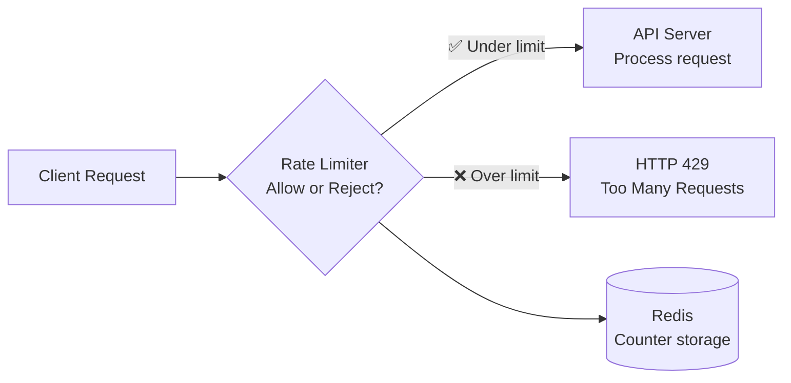
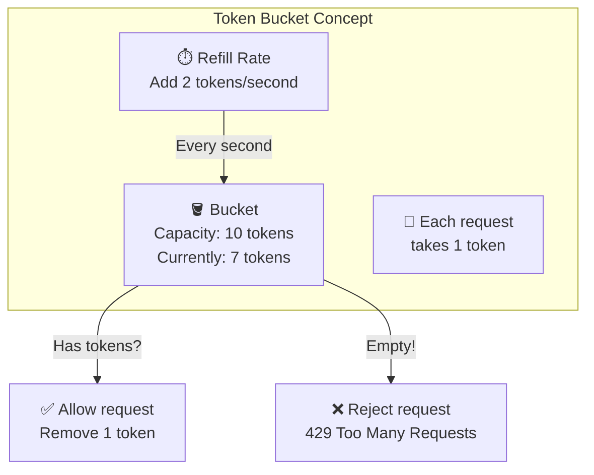
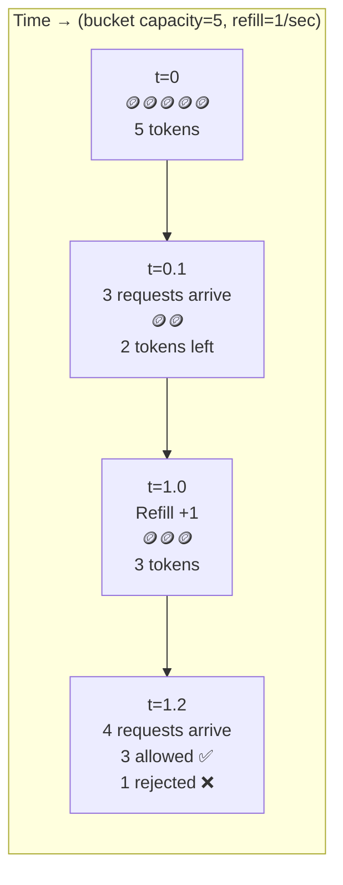
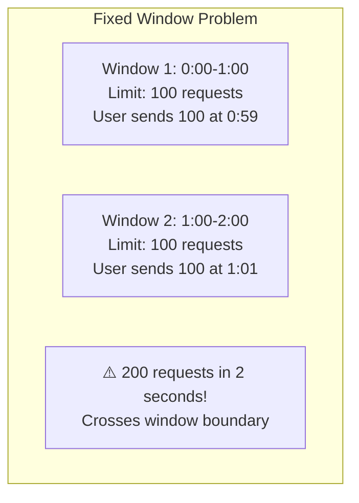
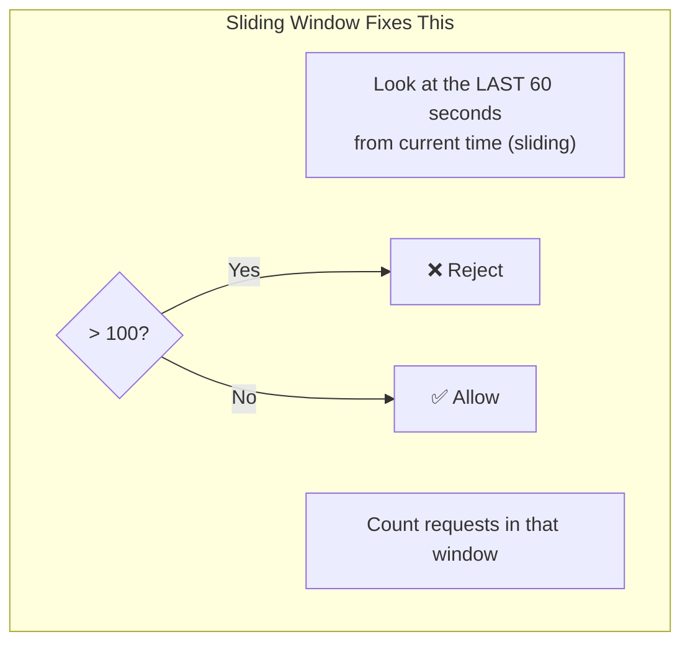
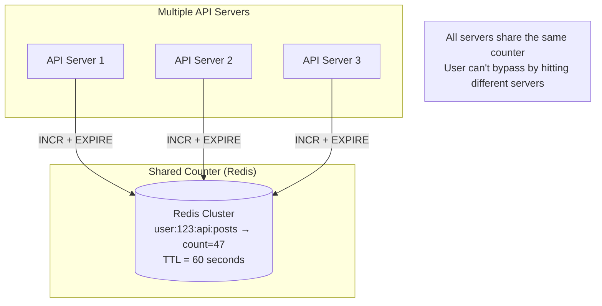
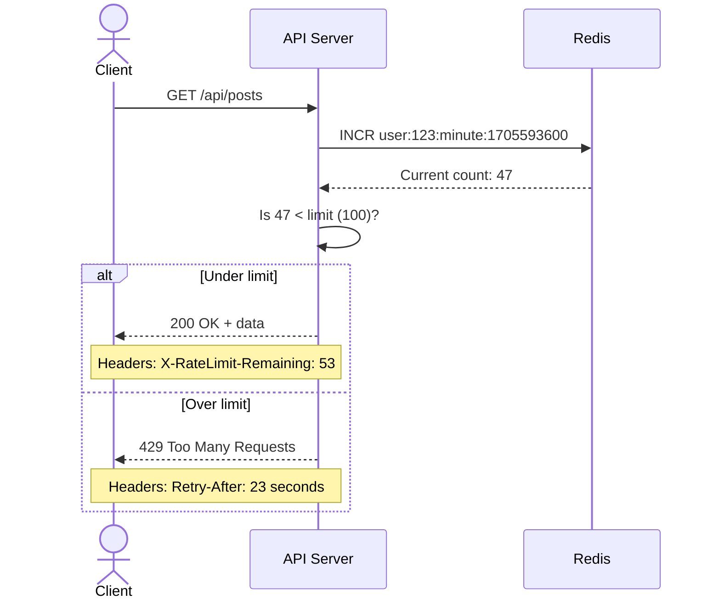
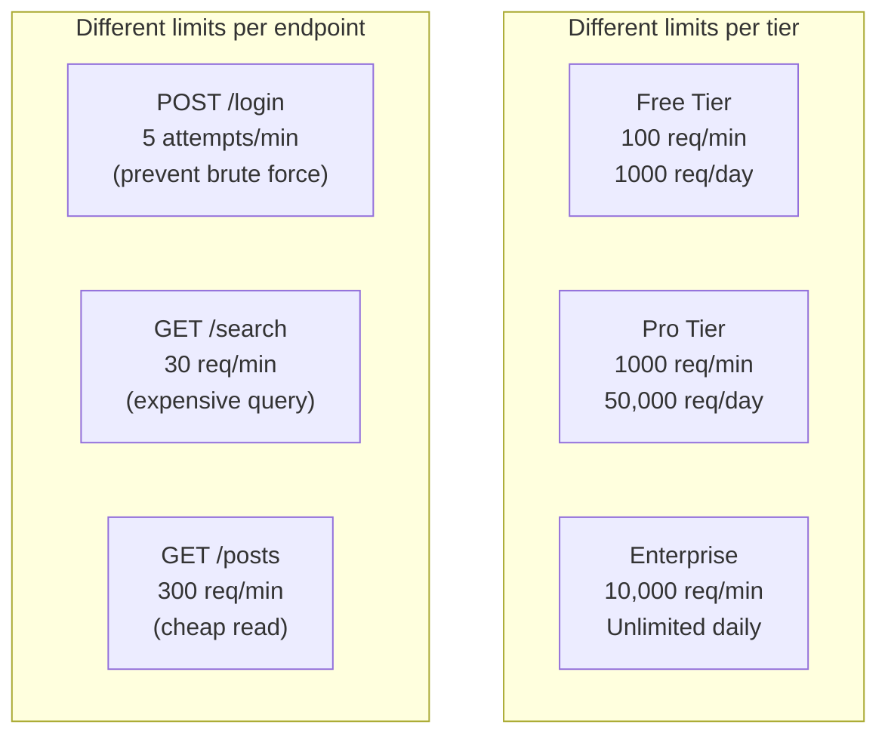

# HLD 11: Design a Rate Limiter

## 💡 Quick Summary

> **What**: A system that limits how many requests a user/IP can make in a given time window, protecting APIs from abuse and overload.  
> **Key Insight**: Multiple algorithms exist (Token Bucket, Sliding Window, Fixed Window). The choice depends on whether you need smooth rate limiting or simple counting.

---

## 🎯 The Problem in Simple Terms

Without rate limiting:
- A bot can hit your API 10,000 times/second → crashes your service
- One user can hog all resources → other users suffer
- DDoS attacks can overwhelm servers

With rate limiting:
- "You can make 100 requests/minute. After that, you get HTTP 429 (Too Many Requests)."

---

## 📋 Requirements

| Feature | Detail |
|---------|--------|
| Limit by user/IP | Track requests per client |
| Configurable rules | Different limits per endpoint, plan |
| Distributed | Works across multiple API servers |
| Low latency | < 1ms overhead per request |
| Accurate | No significant over-counting or under-counting |

### Scale
```
Requests: 10M/second across all APIs
Users: 100M+ 
Rules: Different limits per API endpoint & user tier
Latency added: < 1ms per check
```

---

## 🏗️ Where Does It Sit?



---

## 🔍 Algorithm 1: Token Bucket (Most Popular ✅)

### How It Works (Think of a Bucket of Tokens)



### Visual Example (Timeline)



**Why Token Bucket is great:**
- Allows short bursts (if bucket is full, you can use all tokens at once)
- Smooth long-term rate (refill rate = sustained throughput)
- Simple to implement

---

## 🔍 Algorithm 2: Sliding Window Counter





---

## 🏗️ Distributed Rate Limiter Architecture



### Request Flow



---

## 📏 Rate Limiting Rules (Examples)



---

## 📊 Algorithm Comparison

| Algorithm | Burst Handling | Memory | Accuracy | Best For |
|-----------|---------------|--------|----------|----------|
| **Token Bucket** ✅ | Allows bursts up to bucket size | Low (2 values per user) | Good | APIs with burst tolerance |
| Fixed Window | Edge-case: 2x burst at boundary | Low | Moderate | Simple use cases |
| Sliding Window Log | No bursts allowed | High (stores timestamps) | Perfect | Strict rate limiting |
| Sliding Window Counter | Smoothed | Low | Good | Balance of accuracy & memory |

---

## 📊 Key Trade-offs

| Decision | We Chose | Why |
|----------|----------|-----|
| Algorithm | Token Bucket | Allows bursts; simple; low memory |
| Storage | Redis (centralized) | Shared state across all API servers; fast |
| Granularity | Per-user + per-IP + per-endpoint | Defense in depth; different limits per dimension |
| Exceeded response | 429 + Retry-After header | Client knows when to retry |
| Race conditions | Redis Lua script (atomic) | INCR + check in one atomic operation |
| Failure mode | Fail open (allow) | Better to allow some excess than block legitimate traffic |

---

## 🚀 Scaling & Edge Cases

| Challenge | Solution |
|-----------|----------|
| Distributed counting (race condition) | Redis Lua script: atomic INCR + TTL |
| Redis failure | Fail open; local in-memory fallback |
| Multiple rate dimensions | Hierarchical: check IP → user → endpoint |
| Clock drift across servers | Use Redis server time (single source of truth) |
| Memory for millions of users | Redis expires keys automatically (TTL) |
