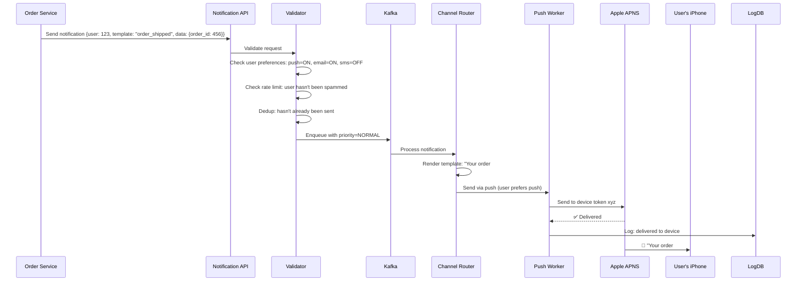
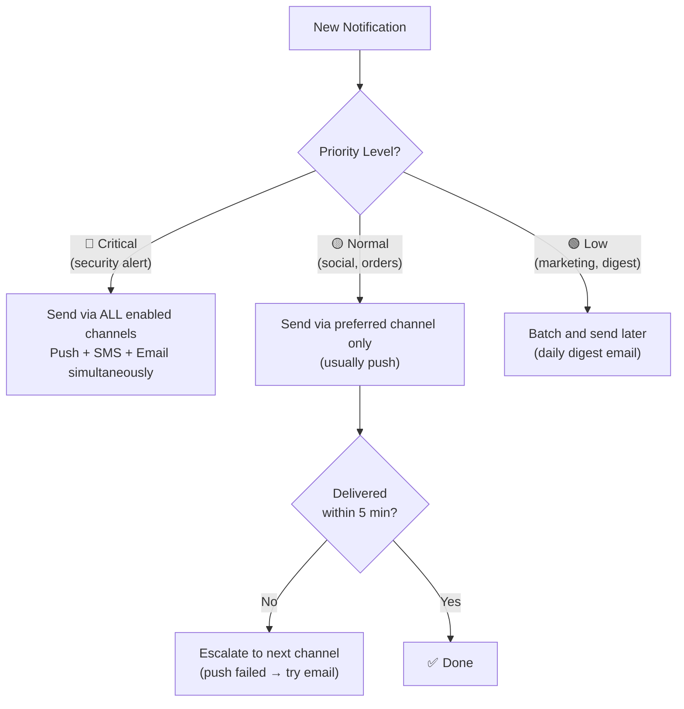
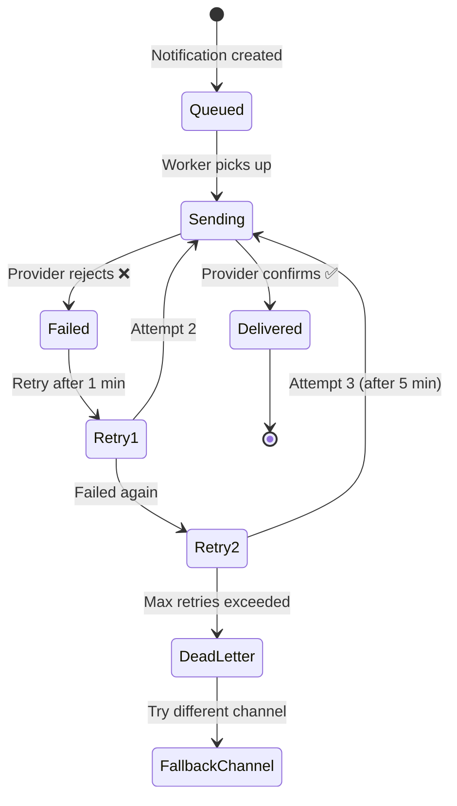
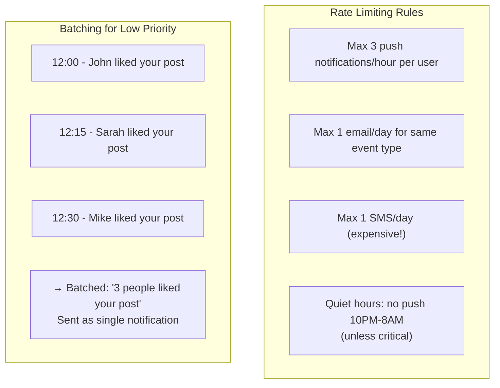
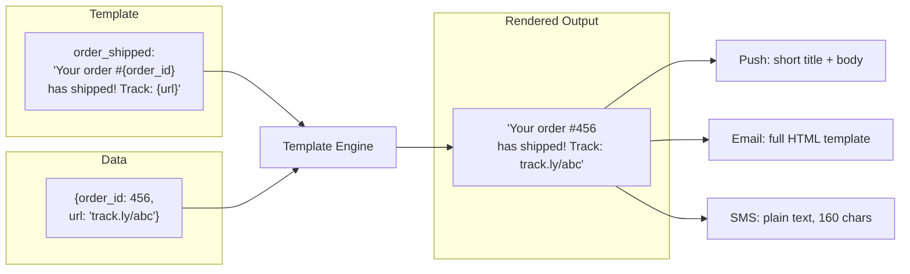

# HLD 12: Design a Notification Service

## 💡 Quick Summary

> **What**: A system that sends notifications to users across multiple channels (push, SMS, email) with templating, scheduling, and delivery guarantees.  
> **Key Insight**: The challenge is handling multiple delivery channels with different latencies, retry strategies, and rate limits while ensuring no duplicate notifications.

---

## 🎯 The Problem in Simple Terms

When someone likes your Instagram post, you get:
- A push notification on your phone (instant)
- Maybe an email (if you haven't seen it in 1 hour)
- Maybe an SMS (for critical alerts only)

The notification service must:
- Handle billions of notifications/day
- Route to the right channel based on user preferences
- Not spam users (batching, throttling)
- Retry failures (APNS/FCM can fail)
- Track delivery status

---

## 📋 Requirements

| Feature | Detail |
|---------|--------|
| Multi-channel | Push (iOS/Android), Email, SMS, In-app |
| Priority levels | Critical (instant), Normal, Low (batchable) |
| User preferences | Users choose what channels they want |
| Templates | Reusable notification templates |
| Scheduling | Send at specific time or after delay |
| Rate limiting | Don't spam users |
| Delivery tracking | Sent → Delivered → Opened |

### Scale
```
Notifications/day: 10B+ (Facebook scale)
Channels: Push (APNS/FCM), Email (SES), SMS (Twilio)
Delivery latency: < 1 second for critical
Users: 2B+
```

---

## 🏗️ Architecture Overview

```mermaid
graph TB
    subgraph "📨 Producers (many services)"
        OrderSvc[Order Service<br/>"Your order shipped!"]
        SocialSvc[Social Service<br/>"John liked your post"]
        AlertSvc[Alert Service<br/>"Login from new device"]
    end

    subgraph "⚙️ Notification Platform"
        API[Notification API<br/>Receives requests]
        Validator[Validator<br/>Check preferences, dedup]
        Prioritizer[Priority Queue<br/>Critical > Normal > Low]
        Template[Template Engine<br/>Render messages]
        Router[Channel Router<br/>Which channel to use?]
    end

    subgraph "📬 Channel Workers"
        Push[Push Worker<br/>APNS / FCM]
        Email[Email Worker<br/>SES / SendGrid]
        SMS[SMS Worker<br/>Twilio / SNS]
        InApp[In-App Worker<br/>WebSocket]
    end

    subgraph "🗄️ Storage"
        PrefsDB[(User Preferences)]
        TemplateDB[(Templates)]
        LogDB[(Delivery Logs)]
        Queue[(Message Queue<br/>Kafka)]
    end

    OrderSvc & SocialSvc & AlertSvc --> API
    API --> Validator --> Prioritizer --> Queue
    Queue --> Router
    Router --> Push & Email & SMS & InApp
    Template --> Router
    Push & Email & SMS --> LogDB
```

---

## 🔍 How a Notification Flows (End to End)



---

## 📬 Channel Selection Logic



---

## 🔄 Retry & Failure Handling



---

## 🚫 Anti-Spam & Rate Limiting



---

## 📝 Template System



---

## 📊 Key Trade-offs

| Decision | We Chose | Why |
|----------|----------|-----|
| Queue system | Kafka (priority topics) | Handle 10B/day; separate critical vs. normal |
| Deduplication | Idempotency key (event_type + user + entity) | Prevent duplicate notifications |
| Channel selection | User preferences + priority-based escalation | Respect user choices; ensure critical alerts get through |
| Failure handling | Exponential backoff + fallback channel | Don't give up; try alternative path |
| Batching | Group similar notifications (1-hour window) | "5 people liked your post" > 5 separate notifications |
| Template storage | Version-controlled templates in DB | A/B test different messages; rollback bad templates |

---

## 🚀 Scaling Challenges

| Challenge | Solution |
|-----------|----------|
| 10B notifications/day | Kafka partitioned by user_id; parallel workers |
| Push provider rate limits | Connection pooling to APNS/FCM; respect their limits |
| Email deliverability | Warm up IPs; manage sender reputation; SPF/DKIM |
| Global delivery | Regional notification services; local provider connections |
| User preference changes | Cache preferences in Redis; invalidate on change |
| Analytics (open rates) | Tracking pixels in email; push delivery receipts |
