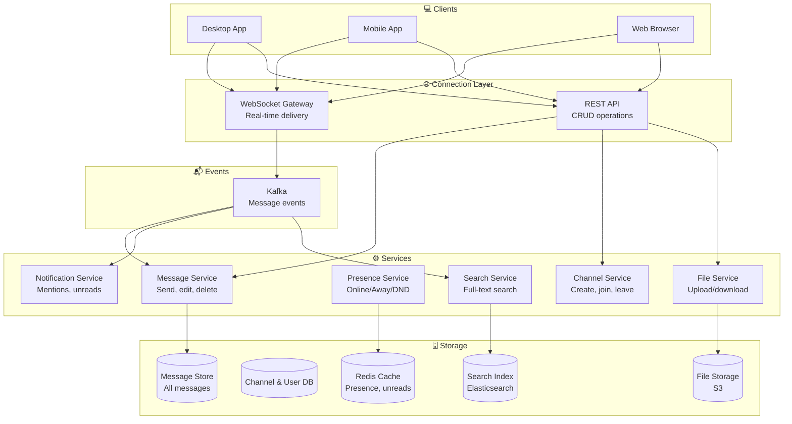
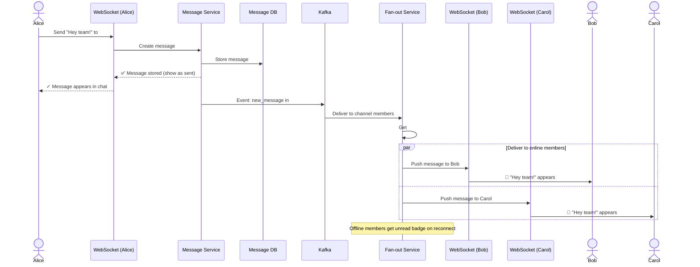
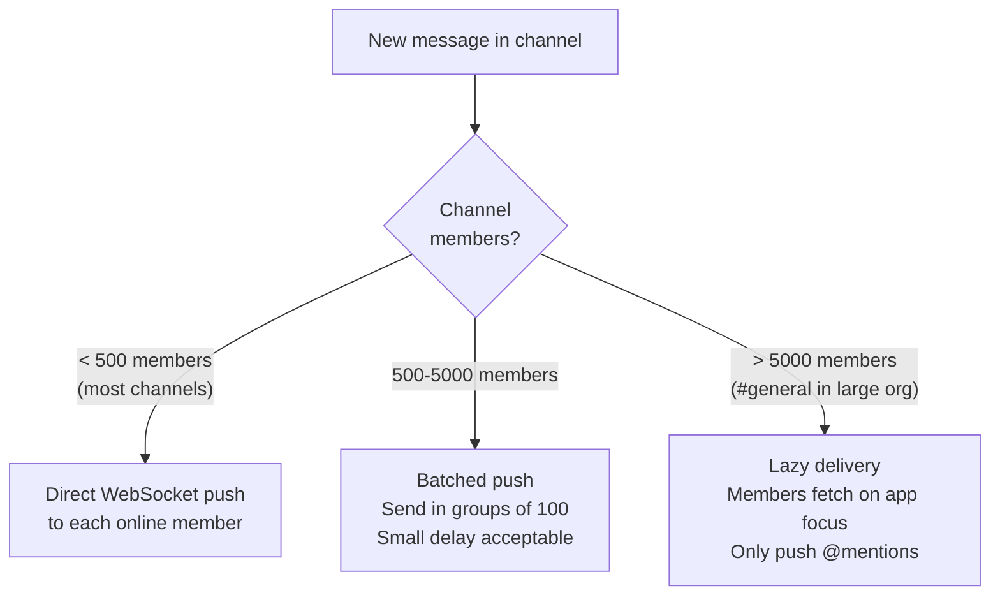
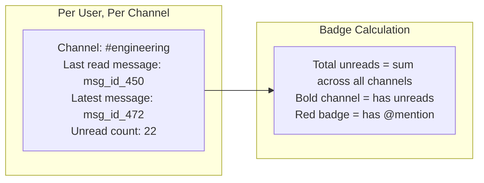
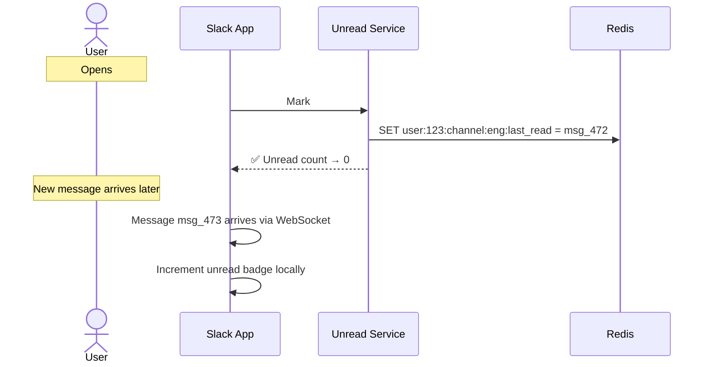
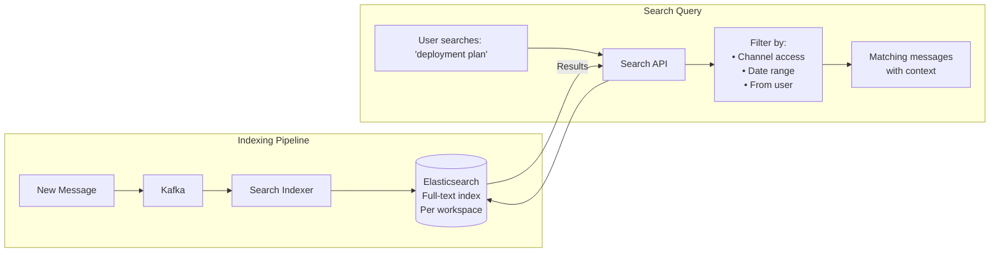
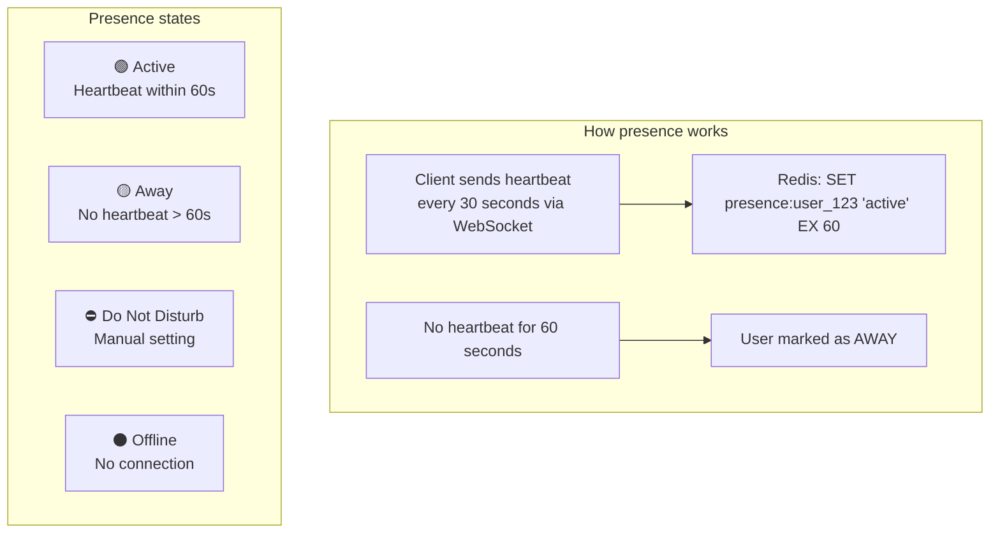
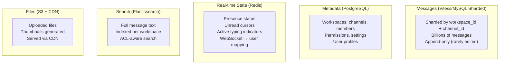

# HLD 13: Design Slack / Chat System

## 💡 Quick Summary

> **What**: A real-time team messaging platform with channels, direct messages, file sharing, threads, and search across message history.  
> **Key Insight**: Unlike WhatsApp (P2P focused), Slack is workspace-centric. The challenges are channel fan-out (channels with 10K+ members), message persistence, and real-time sync across devices.

---

## 🎯 The Problem in Simple Terms

Slack handles:
- Millions of workspaces, each with hundreds of channels
- Users in multiple channels simultaneously
- Messages must appear instantly for all channel members
- Full-text search across millions of messages
- File sharing, threads, reactions, mentions
- Users switch between desktop/mobile seamlessly

---

## 📋 Requirements

| Feature | Detail |
|---------|--------|
| Channels | Public/private channels within workspace |
| Direct messages | 1:1 and group DMs |
| Real-time messaging | Messages appear instantly |
| Threads | Reply to specific messages |
| File sharing | Upload and share files |
| Search | Full-text search across all messages |
| Notifications | @mentions, channel activity |
| Presence | Online/away/DND status |

### Scale
```
Workspaces: 750K+ paid
DAU: 30M+
Messages/day: 1.5B+
Concurrent WebSocket connections: 10M+
Channels per workspace: up to 50K
Members per channel: up to 10K+
Message search: full history (years of messages)
```

---

## 🏗️ Architecture Overview



---

## 🔍 How Sending a Message Works



---

## 📺 Channel Fan-out Strategy



---

## 🔴 Unread Tracking





---

## 🔍 Search Architecture



---

## 🟢 Presence System (Online/Away/DND)



---

## 🗄️ Data Architecture



---

## 📊 Key Trade-offs

| Decision | We Chose | Why |
|----------|----------|-----|
| Protocol | WebSocket (real-time) + REST (CRUD) | WebSocket for live messages; REST for everything else |
| Message ordering | Per-channel sequential IDs | Simple; no cross-channel ordering needed |
| Fan-out | Direct push for small channels; lazy for huge ones | Balance between instant delivery and server load |
| Search | Elasticsearch per workspace | Full-text search with access control |
| Unread tracking | Redis (user:channel cursor) | Fast reads; millions of updates/sec |
| Message storage | Sharded SQL (Vitess) | Need ordering, history, pagination |
| Typing indicators | Ephemeral (don't persist) | "Alice is typing..." is transient info |

---

## 🚀 Scaling Challenges

| Challenge | Solution |
|-----------|----------|
| 10M+ WebSocket connections | Gateway fleet; each handles ~100K connections |
| Large channel delivery (#general 10K+) | Lazy delivery; only push @mentions |
| Message search (years of history) | Elasticsearch sharded per workspace |
| File uploads in chat | S3 + async thumbnail generation |
| Cross-device sync | Unread cursors in Redis; sync on reconnect |
| Workspace isolation | Shard data by workspace; strict ACL |
