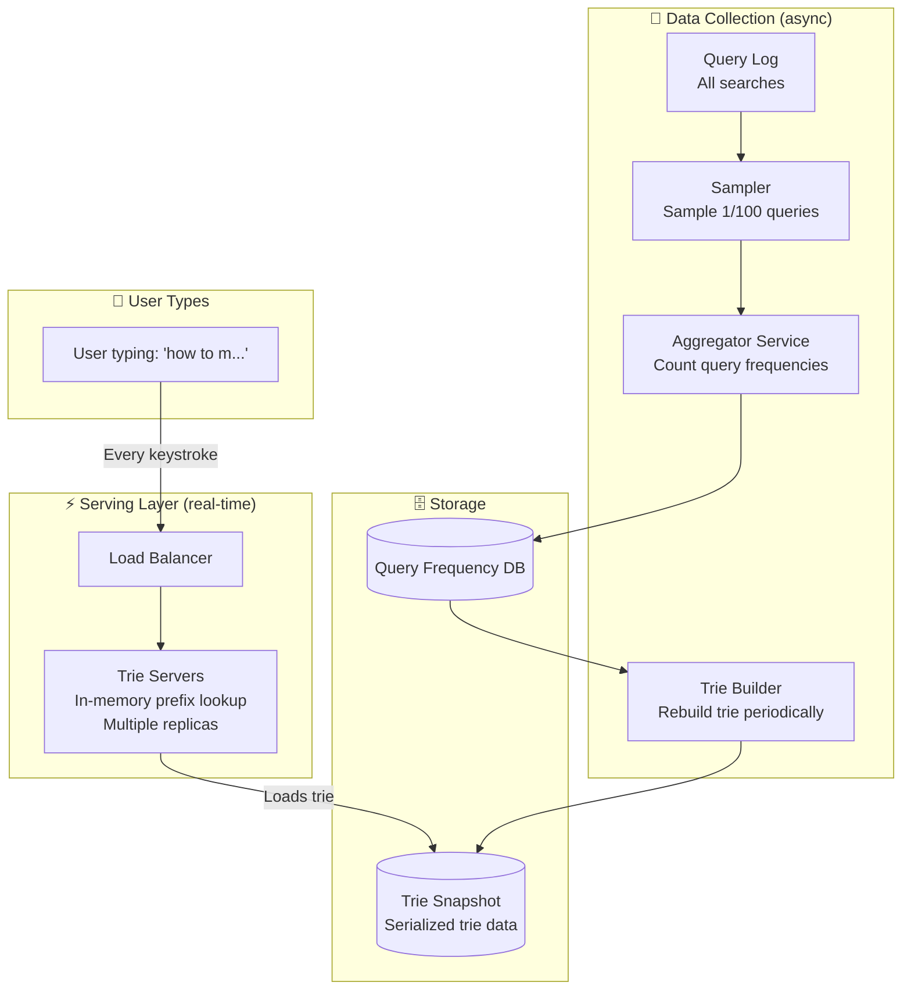
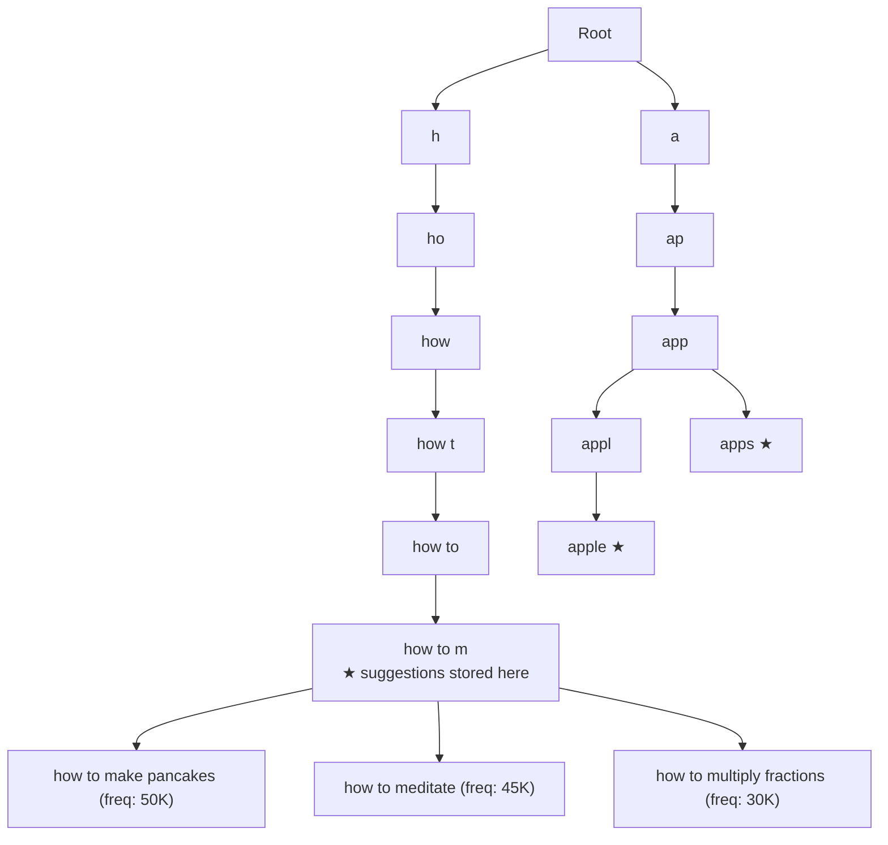
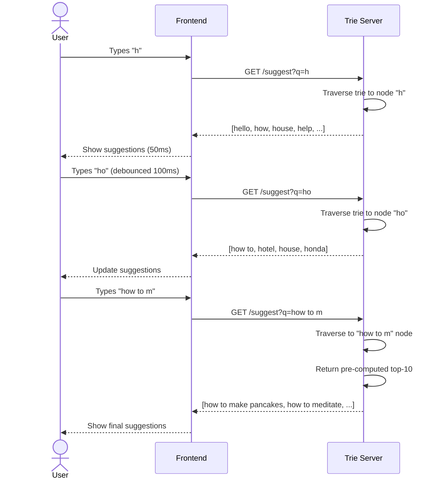
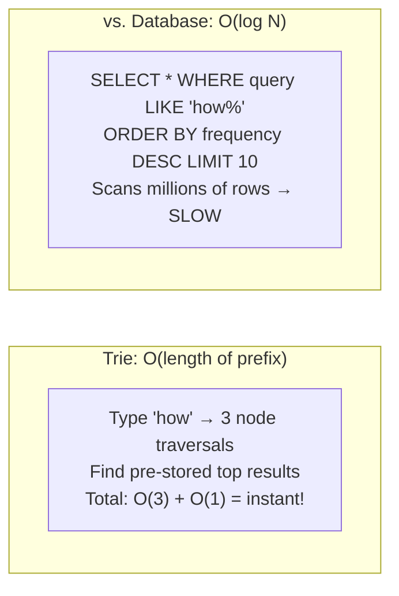
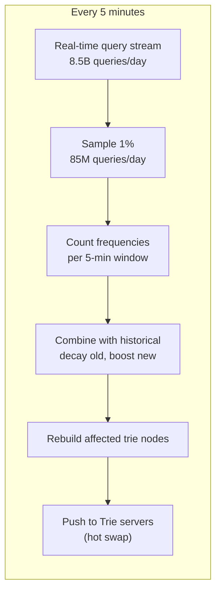
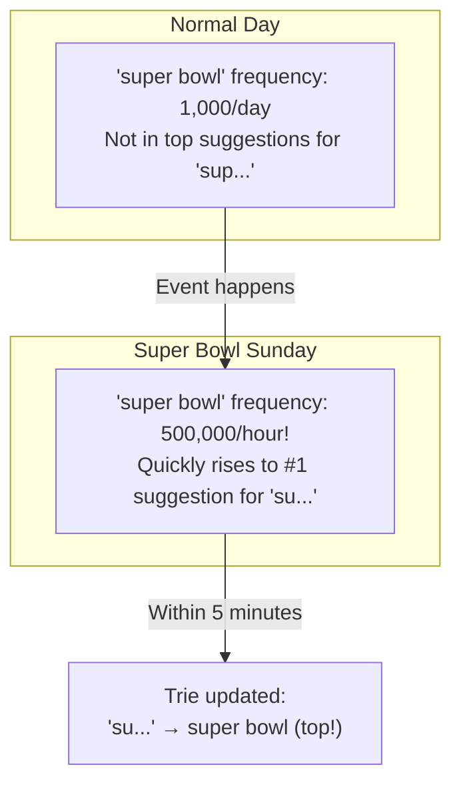
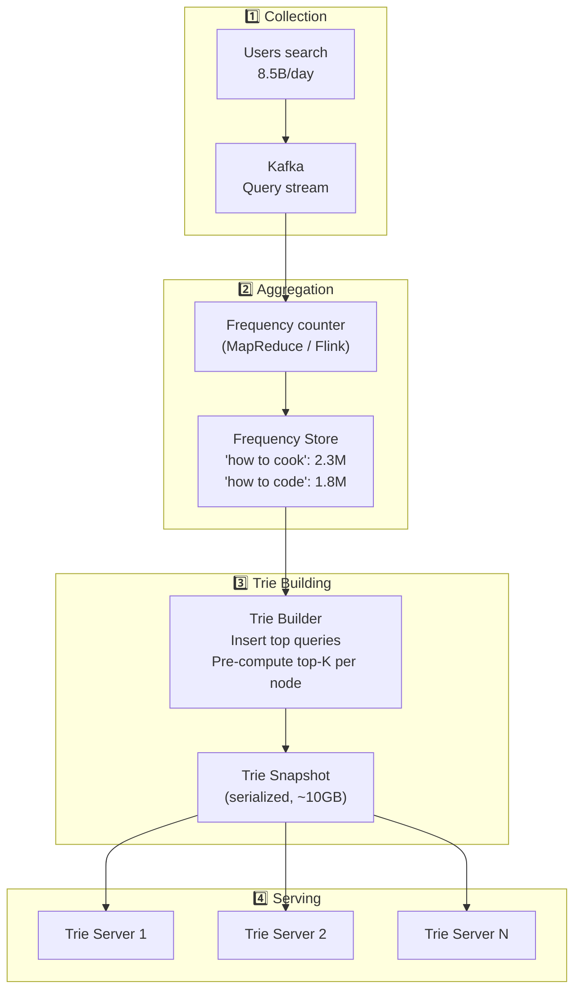
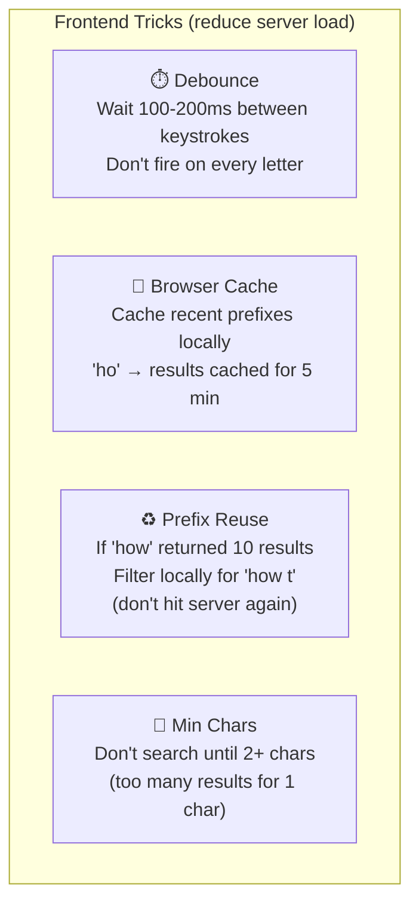

# HLD 14: Design Autocomplete / Typeahead

## 💡 Quick Summary

> **What**: A system that suggests search completions as the user types, showing the most relevant suggestions within 100ms of each keystroke.  
> **Key Insight**: Use a Trie (prefix tree) data structure for fast prefix lookups, combined with pre-computed popularity rankings. The challenge is updating suggestions based on trending queries.

---

## 🎯 The Problem in Simple Terms

When you type "how to m..." in Google:
- Within 100ms, you see: "how to make pancakes", "how to meditate", "how to multiply fractions"
- These suggestions change based on what's trending, your location, and your personal history
- Google handles 8.5B searches/day → each keystroke triggers a suggestion lookup

---

## 📋 Requirements

| Feature | Detail |
|---------|--------|
| Prefix matching | Type "app" → show "apple", "application", "app store" |
| Top-K results | Show top 5-10 most popular matches |
| Fast response | < 100ms per keystroke (ideally < 50ms) |
| Fresh data | Trending queries appear within minutes |
| Personalization | Boost based on user's history |
| Multi-language | Support different scripts/languages |

### Scale
```
Queries/day: 8.5B
Unique queries: 5B+ (long tail)
Suggestions per keystroke: top 10
Latency budget: < 100ms
Updates: Trending queries appear within 5 minutes
QPS for autocomplete: ~60,000 (each search = ~5 keystrokes)
```

---

## 🏗️ Architecture Overview



---

## 🌳 How the Trie Works

### What is a Trie? (Visual)



### Lookup Flow



---

## ⚡ Why Trie is Fast



**Key optimization**: Store the top-10 suggestions at EACH trie node (pre-computed). No need to traverse all children at query time.

---

## 🔄 How Suggestions Stay Fresh



### Freshness Example (Trending Query)



---

## 🗄️ Data Flow (Collection → Serving)



---

## 💡 Client-Side Optimizations



---

## 📊 Key Trade-offs

| Decision | We Chose | Why |
|----------|----------|-----|
| Data structure | Trie (in-memory) | O(prefix length) lookup; fast prefix matching |
| Storage | Pre-compute top-K per node | Avoid expensive tree traversal at query time |
| Freshness | Rebuild every 5 minutes | Balance between freshness and computation cost |
| Sharding | Shard by prefix range (a-m, n-z) | Even distribution of queries |
| Personalization | Boost user's history on top of global | Client sends user context; server re-ranks |
| Multi-language | Separate trie per language/region | Different trending topics per locale |

---

## 🚀 Scaling Strategy

| Challenge | Solution |
|-----------|----------|
| 60K QPS for suggestions | Multiple trie server replicas; in-memory = fast |
| 5B unique queries in trie | Only keep top 10M most popular (covers 99% of searches) |
| Trie size (~10-50GB) | Fits in memory per server; shard if needed |
| Fresh trending data | Stream processing (Kafka + Flink); 5-min rebuild cycles |
| Multi-region latency | Trie replicas in each region |
| Long-tail queries (rare) | Fall back to DB search for unpopular prefixes |
