# HLD 15: Design a Distributed Cache (like Redis/Memcached)

## 💡 Quick Summary

> **What**: A distributed in-memory key-value store that sits between your application and database, dramatically reducing latency and database load.  
> **Key Insight**: The main challenges are cache invalidation ("the hardest problem in CS"), consistent hashing for distribution, and handling cache failures without cascading to the DB.

---

## 🎯 The Problem in Simple Terms

Database reads take 5-50ms. Memory reads take 0.1ms. If you can serve 90% of reads from memory:
- Your app is 50-500x faster for those reads
- Your database handles 10x less load
- Users get sub-millisecond responses

But distributed caching introduces: stale data, cache stampedes, memory limits, and partition challenges.

---

## 📋 Requirements

| Feature | Detail |
|---------|--------|
| GET/SET/DELETE | Basic key-value operations |
| TTL (expiration) | Auto-expire keys after time |
| Distributed | Spread data across N nodes |
| High availability | Handle node failures gracefully |
| Eviction | Remove old data when memory full (LRU, LFU) |
| Atomic operations | INCR, compare-and-swap |

### Scale
```
Data size: 100TB+ across cluster
Operations: 10M+ requests/second
Latency: < 1ms for GET/SET
Nodes: 100+ servers
Availability: 99.99%
Hit rate target: > 95%
```

---

## 🏗️ Architecture Overview

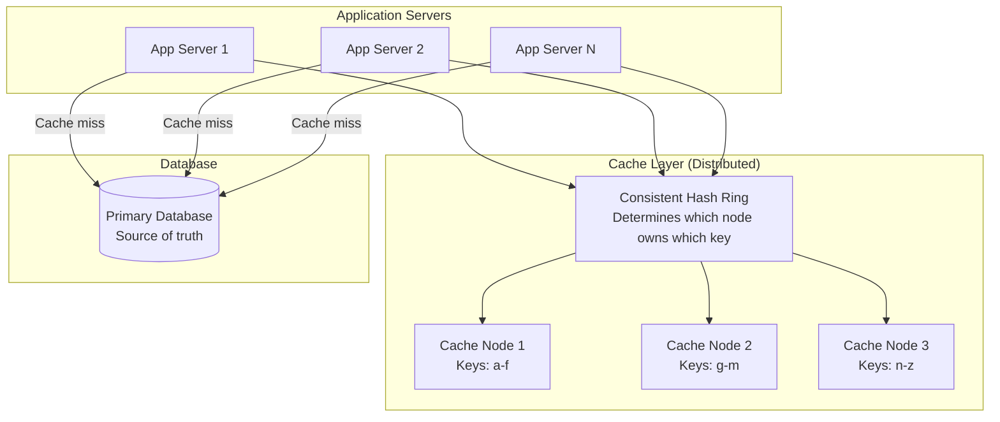

---

## 🔍 How Cache Read Works (Cache-Aside Pattern)

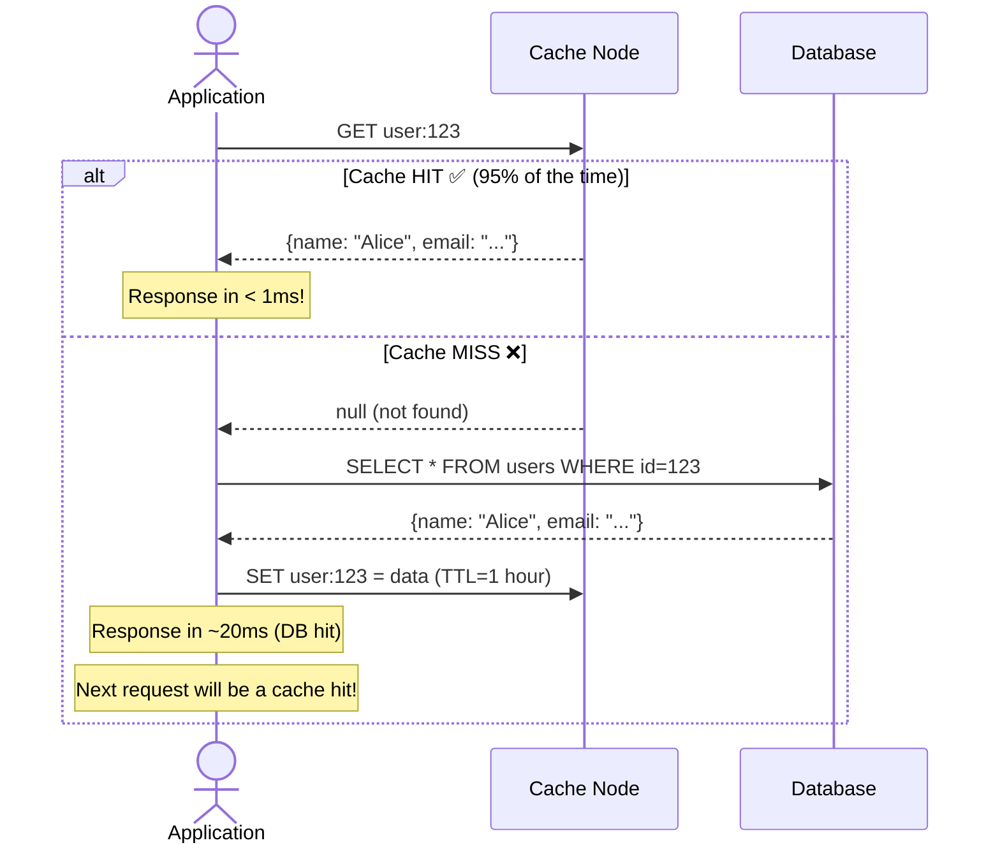

---

## ⭕ Consistent Hashing (How Keys Are Distributed)

### The Problem with Simple Hashing

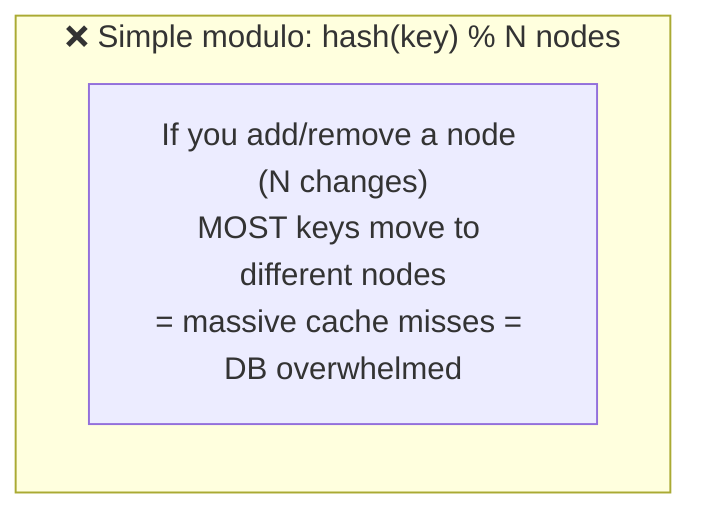

### Consistent Hashing Solution

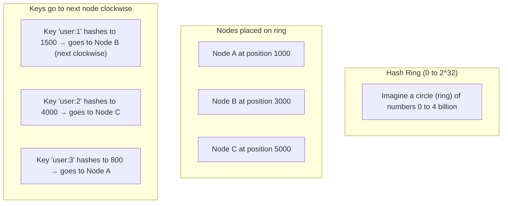

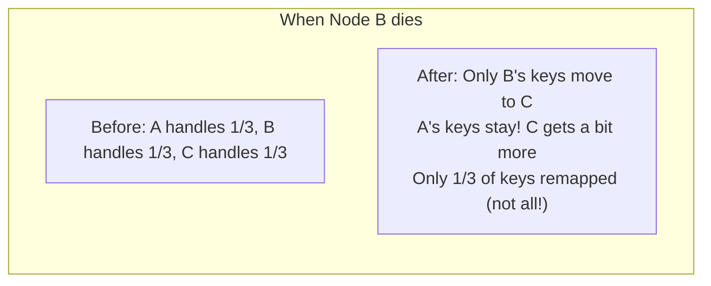

---

## 🔄 Cache Invalidation Strategies

### Strategy 1: TTL (Time-To-Live) — Simplest ✅

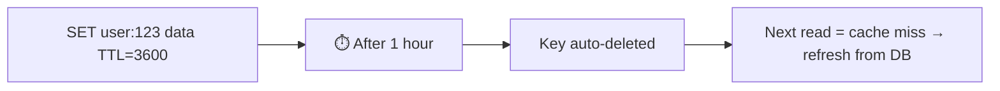

### Strategy 2: Write-Through (Strong Consistency)

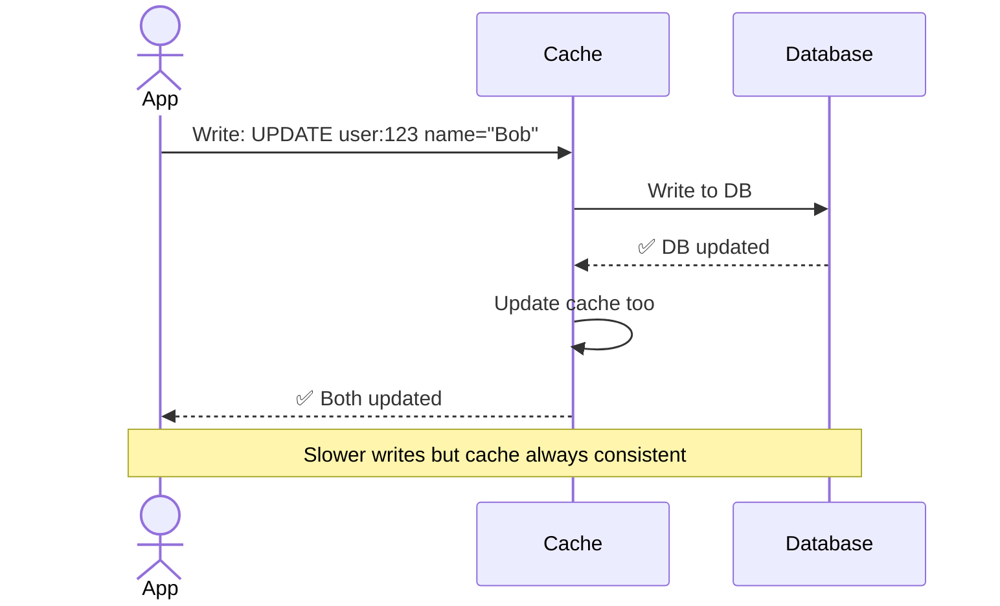

### Strategy 3: Write-Behind (Fast Writes, Eventual Consistency)

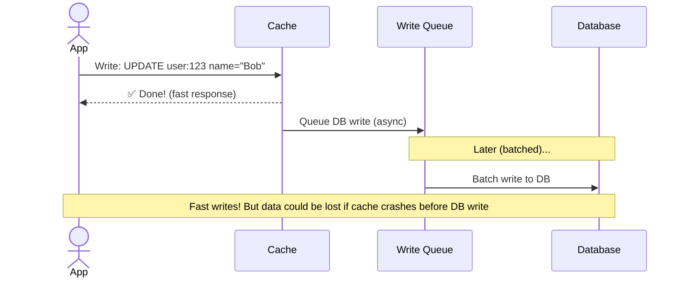

---

## ⚡ Cache Problems & Solutions

### Problem 1: Cache Stampede (Thundering Herd)

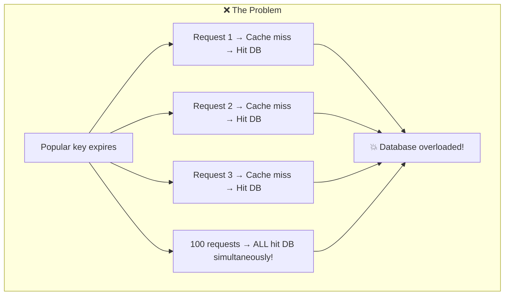

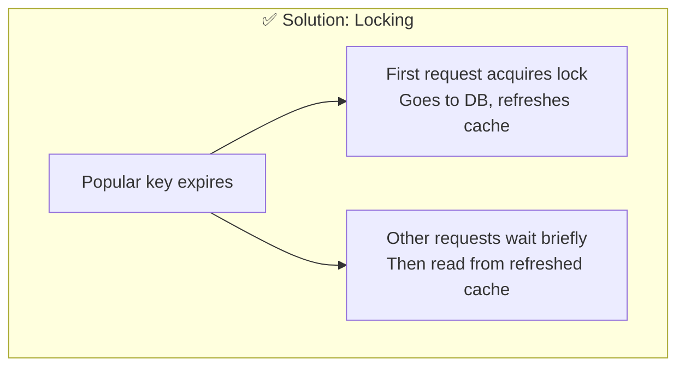

### Problem 2: Cache Penetration (Non-existent Keys)

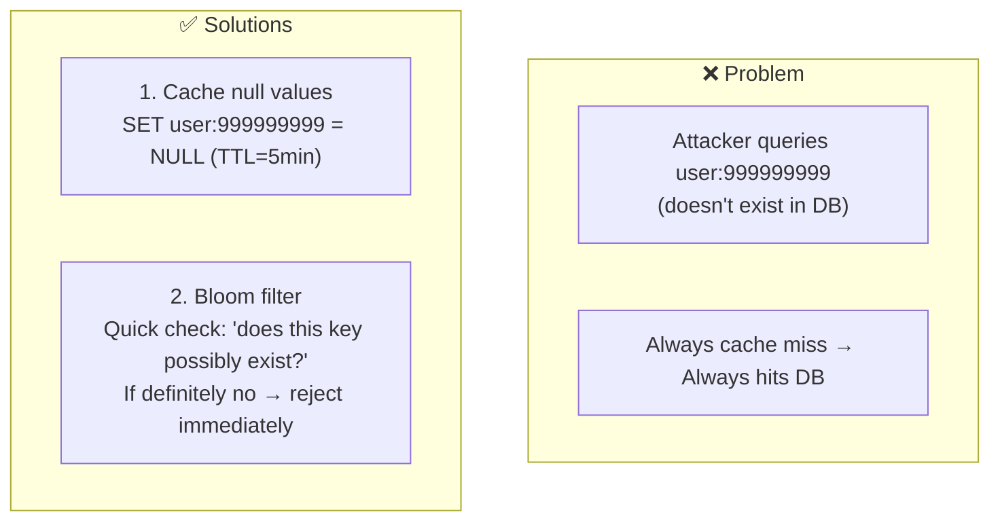

---

## 📏 Eviction Policies (When Memory is Full)

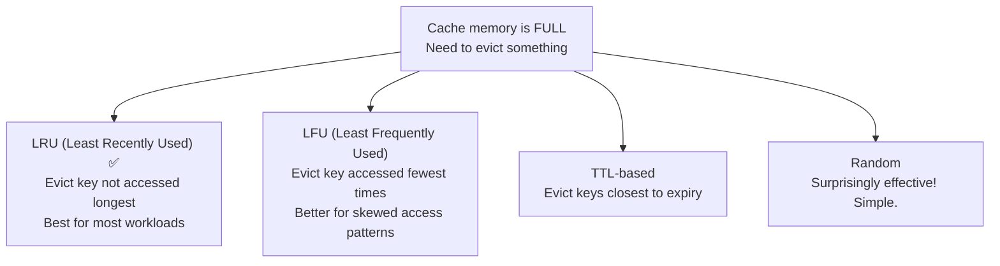

---

## 🏗️ High Availability

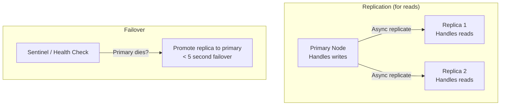

---

## 📊 Key Trade-offs

| Decision | We Chose | Why |
|----------|----------|-----|
| Distribution | Consistent hashing + virtual nodes | Minimal redistribution when adding/removing nodes |
| Invalidation | TTL + event-based invalidation | TTL for simplicity; events for critical data |
| Eviction | LRU | Best general-purpose; O(1) with hash map + linked list |
| Replication | Async (primary → replica) | Fast writes; slight staleness acceptable |
| Consistency | Eventual (not strong) | Cache is optimization, not source of truth |
| Serialization | Protocol buffers | Compact, fast, schema-aware |

---

## 🚀 Scaling Challenges

| Challenge | Solution |
|-----------|----------|
| Hot keys (celebrity profile) | Replicate hot keys to multiple nodes |
| Node failure | Replica takes over; consistent hash = minimal key movement |
| Memory limits | Eviction policies; tiered caching (L1 local + L2 distributed) |
| Cache stampede | Locking / singleflight pattern |
| Stale data | Event-driven invalidation for critical paths + TTL for others |
| Network partitions | Favor availability (serve stale) over consistency |
