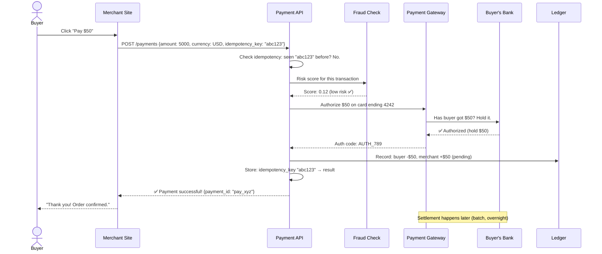
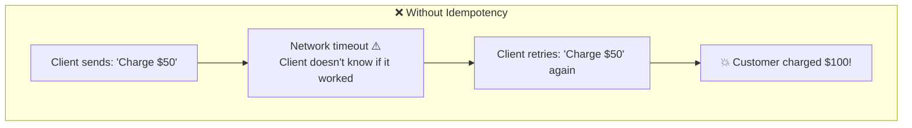
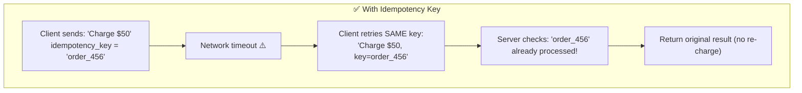
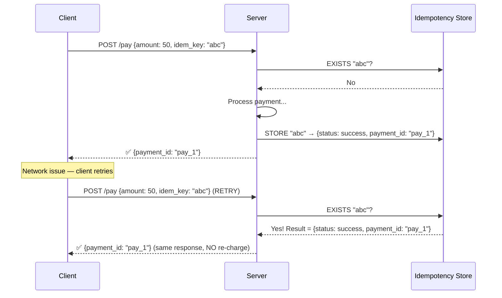
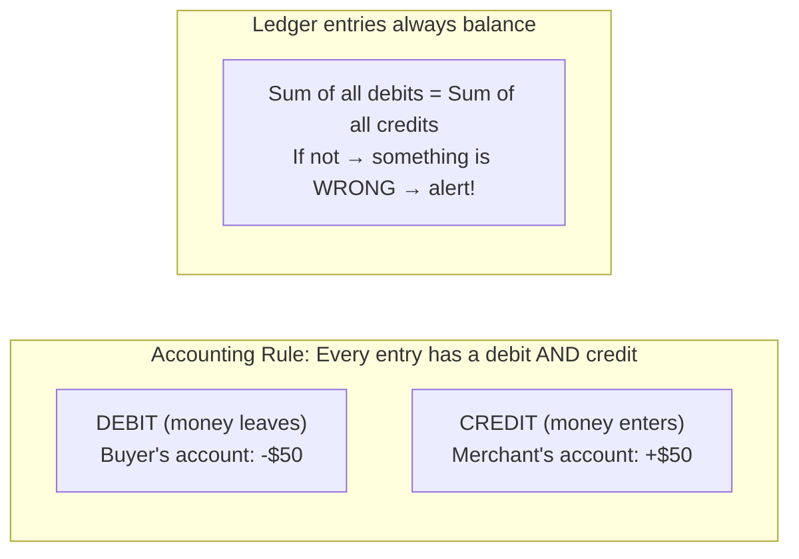
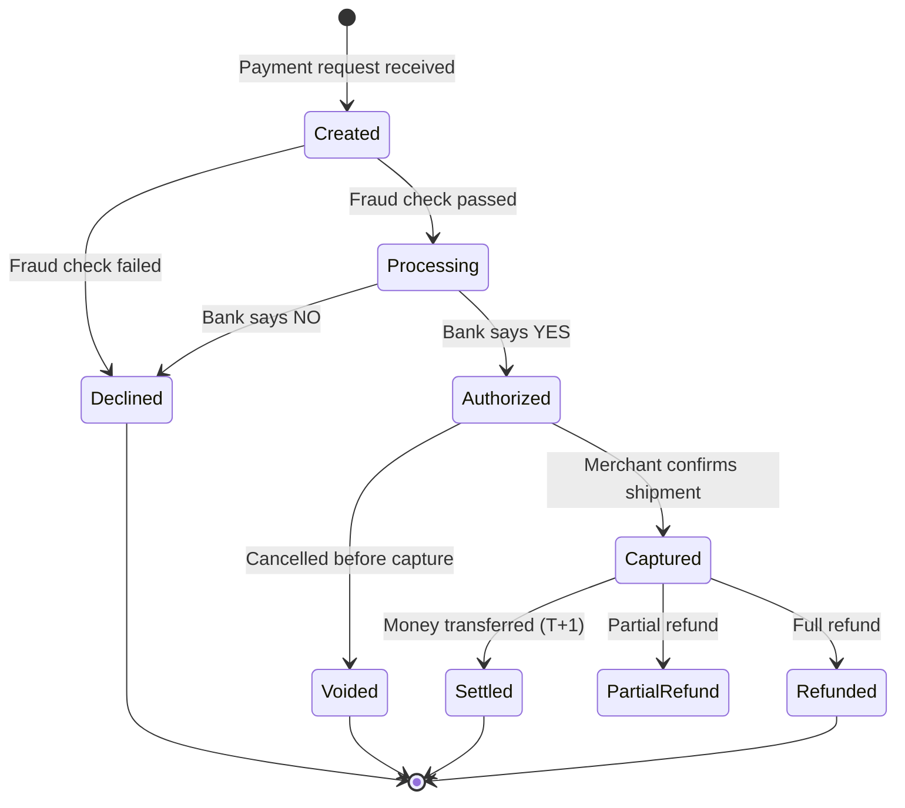
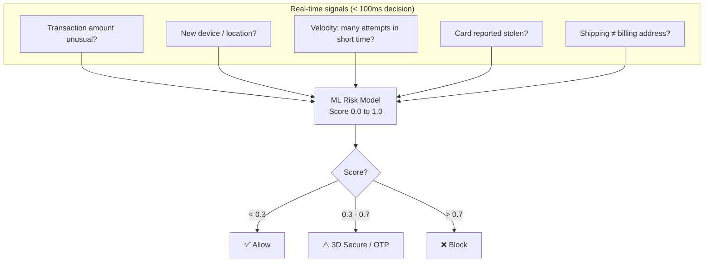

# HLD 16: Design a Payment System (Stripe / PayPal)

## 💡 Quick Summary

> **What**: A system that processes financial transactions between buyers, merchants, and banks — handling authorization, capture, refunds, and settlements.  
> **Key Insight**: The #1 priority is EXACTLY-ONCE processing. Charging someone twice or losing a payment is catastrophic. Idempotency keys and distributed transactions are essential.

---

## 🎯 The Problem in Simple Terms

When you buy something for $50 online:
1. Your card is **authorized** (bank confirms you have $50)
2. The amount is **captured** (money moves from your account)
3. The merchant gets paid in **settlement** (next business day)

If the network fails mid-transaction — did the charge go through? The system MUST handle this gracefully. No double charges. No lost money.

---

## 📋 Requirements

| Feature | Detail |
|---------|--------|
| Process payments | Credit card, debit, bank transfer |
| Idempotency | Same request never processed twice |
| Refunds | Full or partial refunds |
| Multi-currency | Handle USD, EUR, GBP, etc. |
| Reconciliation | Match our records with bank records daily |
| PCI Compliance | Never store raw card numbers |

### Scale
```
Transactions/day: 100M+ (Stripe scale)
Peak TPS: 50,000+
Latency: < 2 seconds per transaction
Availability: 99.999% (money can't sleep)
Accuracy: EXACTLY once (no double charges!)
Data retention: 7+ years (regulatory)
```

---

## 🏗️ Architecture Overview

```mermaid
graph TB
    subgraph "👤 Buyer Experience"
        Buyer[Buyer clicks 'Pay $50']
        Merchant[Merchant's Website]
    end

    subgraph "⚙️ Payment Platform"
        API[Payment API<br/>Idempotency check]
        Orchestrator[Payment Orchestrator<br/>Coordinates the flow]
        Tokenizer[Tokenization Service<br/>Card → token (PCI)]
        Fraud[Fraud Detection<br/>ML risk scoring]
        Ledger[Double-Entry Ledger<br/>All money movements]
    end

    subgraph "🏦 External"
        Gateway[Payment Gateway]
        Bank[Issuing Bank<br/>Buyer's bank]
        Acquirer[Acquiring Bank<br/>Merchant's bank]
    end

    subgraph "🗄️ Storage"
        TxnDB[(Transaction DB<br/>PostgreSQL)]
        EventLog[(Event Log<br/>Kafka)]
        WalletDB[(Wallet/Balance DB)]
    end

    Buyer --> Merchant --> API
    API --> Orchestrator
    Orchestrator --> Tokenizer & Fraud & Ledger
    Orchestrator --> Gateway --> Bank & Acquirer
    Orchestrator --> TxnDB
    Orchestrator --> EventLog
```

---

## 🔍 Payment Flow (Step by Step)



---

## 🔑 Idempotency (The Most Critical Feature)

### The Problem



### The Solution





---

## 📒 Double-Entry Ledger (Every Dollar is Tracked)



| Entry ID | Account | Type | Amount | Reference |
|----------|---------|------|--------|-----------|
| 1 | buyer_123 | DEBIT | $50.00 | pay_xyz |
| 2 | merchant_456 | CREDIT | $48.50 | pay_xyz |
| 3 | platform_fee | CREDIT | $1.50 | pay_xyz |

**Why double-entry?** If debits ≠ credits, you know immediately something went wrong. It's the foundation of all financial systems for 500+ years.

---

## 💳 Payment States



---

## 🛡️ Fraud Detection



---

## 📊 Key Trade-offs

| Decision | We Chose | Why |
|----------|----------|-----|
| Consistency | Strong (ACID transactions) | Money CANNOT be inconsistent |
| Idempotency | Server-side with client-provided key | Prevents double-charging even with retries |
| Ledger | Append-only double-entry | Auditable, never lose track of money |
| Card storage | Tokenization (never store raw PAN) | PCI-DSS compliance; reduce breach impact |
| Settlement | Batch (end of day) | Efficient; industry standard |
| Failure handling | Saga pattern with compensating actions | If step 3 fails, undo steps 1 and 2 |

---

## 🚀 Scaling & Reliability

| Challenge | Solution |
|-----------|----------|
| 50K TPS | Horizontal partitioning by merchant_id |
| Exactly-once processing | Idempotency keys + database constraints |
| Reconciliation | Daily batch job matches our records vs. bank records |
| Data retention (7 yrs) | Cold storage + archive; hot for recent 90 days |
| Multi-region | Active-passive per region; don't split transactions across regions |
| PCI compliance | Isolated card-handling service; encrypted at rest and in transit |
