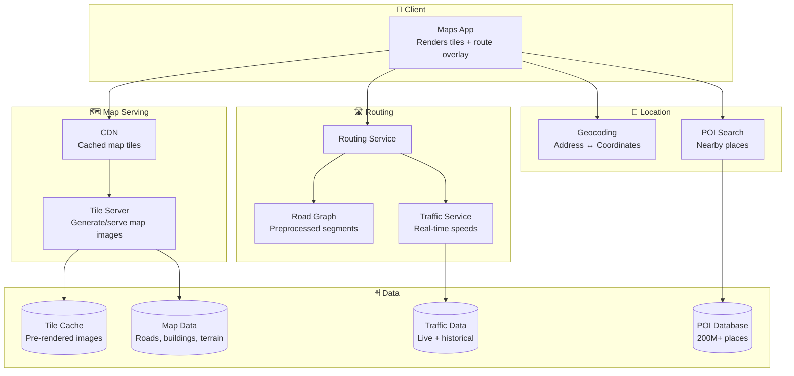
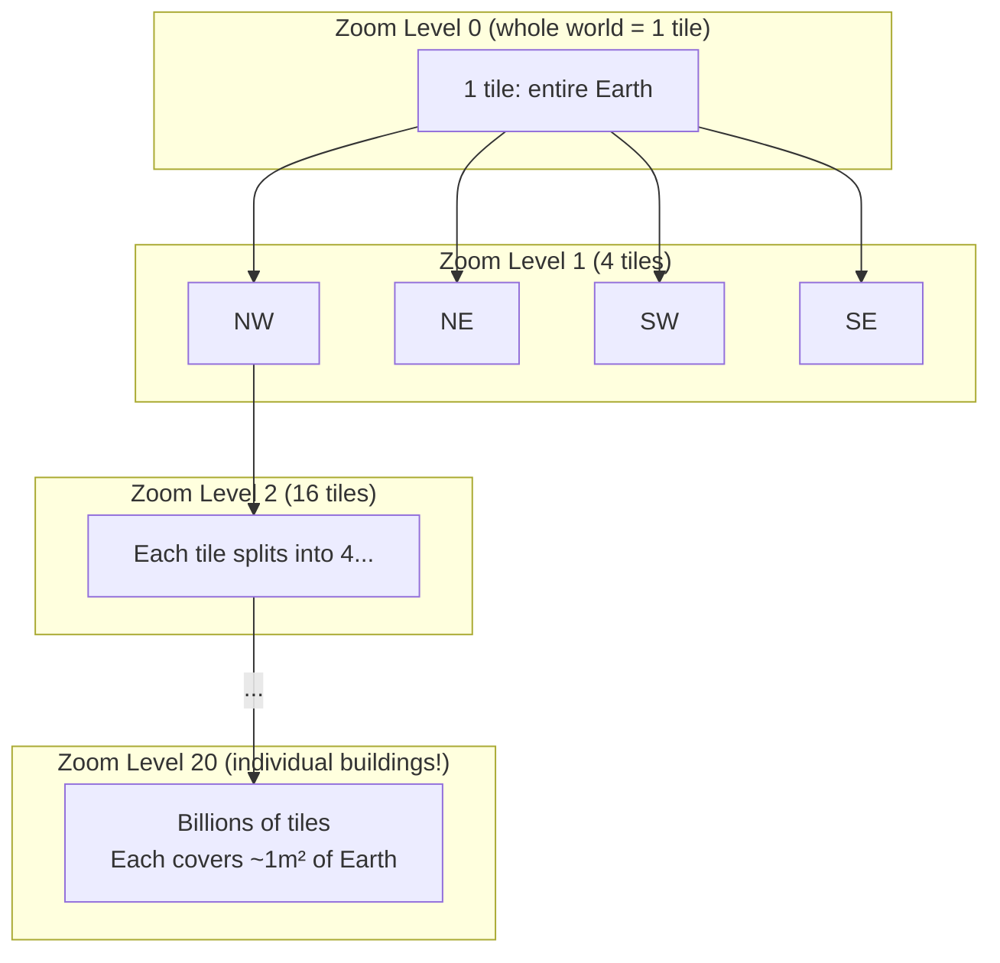
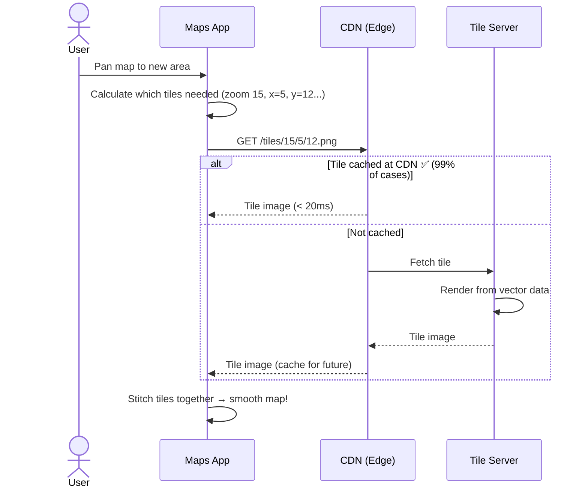
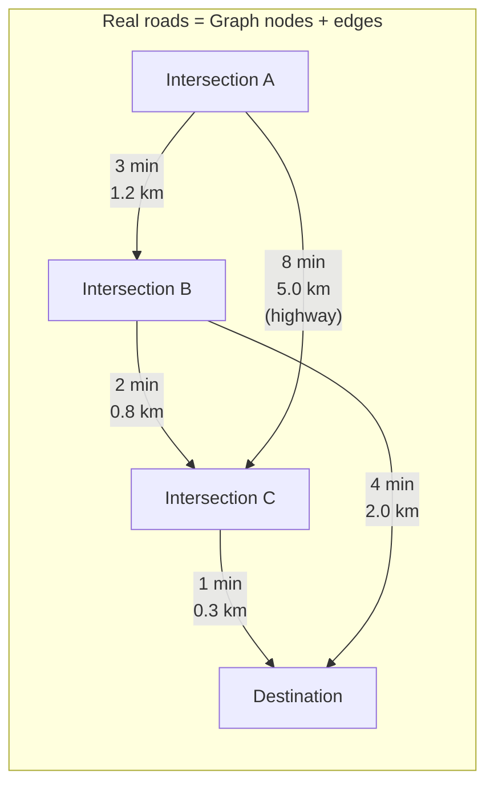
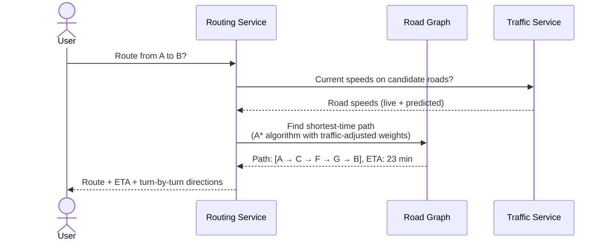
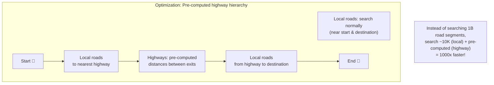
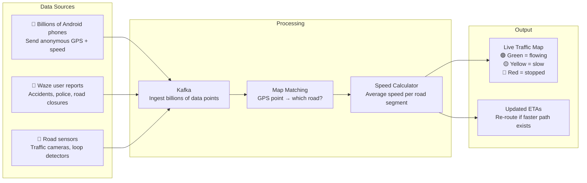
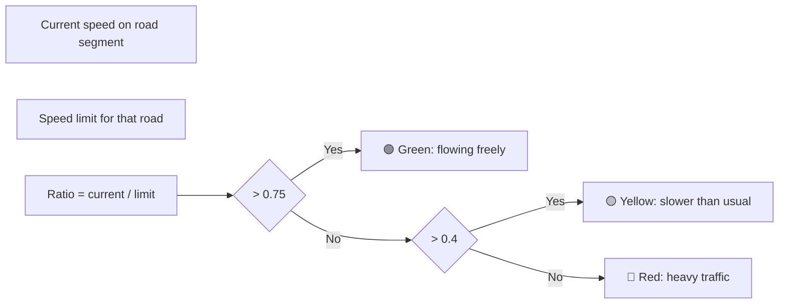
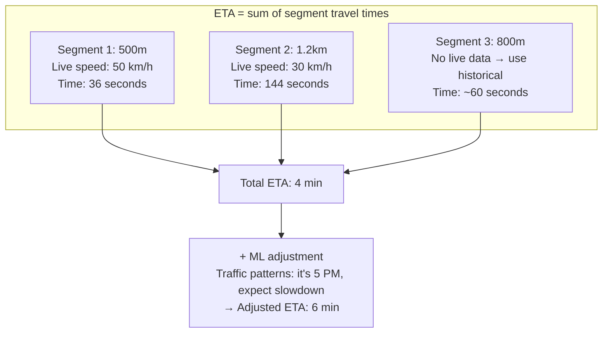

# HLD 17: Design Google Maps

## 💡 Quick Summary

> **What**: A navigation system that provides map rendering, real-time routing with traffic, ETA estimation, and point-of-interest search.  
> **Key Insight**: Maps are served as pre-rendered tiles at different zoom levels. Routing uses graph algorithms (Dijkstra/A*) on a road network graph, enhanced with real-time traffic data from millions of phones.

---

## 🎯 The Problem in Simple Terms

Google Maps handles:
- Rendering the entire world's map at 20+ zoom levels
- Computing driving routes across millions of road segments
- Real-time traffic from billions of GPS data points
- Point-of-interest search (restaurants, gas stations, etc.)
- Turn-by-turn navigation that adapts to live conditions

---

## 📋 Requirements

| Feature | Detail |
|---------|--------|
| Map rendering | Display map at any zoom level, smooth pan/zoom |
| Routing | Find optimal path (shortest time, not just distance) |
| Real-time traffic | Show current road conditions |
| ETA | Accurate arrival time (adapts to traffic) |
| POI Search | Find places ("pizza near me") |
| Navigation | Turn-by-turn directions with re-routing |

### Scale
```
Users: 1B+ monthly
Map tiles served: 200B+ tile requests/day
Routes calculated: 1B+/day
GPS data points ingested: Trillions/day (from all Android phones!)
Road segments worldwide: 1B+
POIs: 200M+ businesses
```

---

## 🏗️ Architecture Overview



---

## 🗺️ How Map Rendering Works (Tiles)

### The Tile Pyramid





---

## 🛣️ How Routing Works

### Road Network as a Graph



**Edge weights = travel time (not just distance!)** — incorporates speed limits, road type, and LIVE TRAFFIC.

### Route Calculation



### Why Not Just Dijkstra?



---

## 🚦 Real-Time Traffic



### How Traffic Colors Work



---

## 📍 ETA Prediction



---

## 📊 Key Trade-offs

| Decision | We Chose | Why |
|----------|----------|-----|
| Map rendering | Vector tiles (client renders) | Smaller downloads, client-side styling, smooth zoom |
| Routing algorithm | A* + contraction hierarchies | A* alone too slow for long routes; pre-computation helps |
| Traffic data | Crowd-sourced (Android phones) | Billions of data points for free; real-time |
| Tile serving | CDN + aggressive caching | Map tiles rarely change; serve from edge |
| ETA | ML model (not just distance/speed) | Historical patterns improve accuracy (traffic lights, school zones) |
| Road updates | Satellite + Street View + user reports | Multiple sources for freshness |

---

## 🚀 Scaling

| Challenge | Solution |
|-----------|----------|
| 200B tile requests/day | CDN caches most tiles; tiles are static (change rarely) |
| 1B route calculations/day | Pre-computed hierarchy reduces graph search 1000x |
| Global traffic (real-time) | Process regionally; road speeds are local |
| Map freshness | Continuous satellite + street view + user edits pipeline |
| Offline support | Client downloads tile region + road graph for offline nav |
