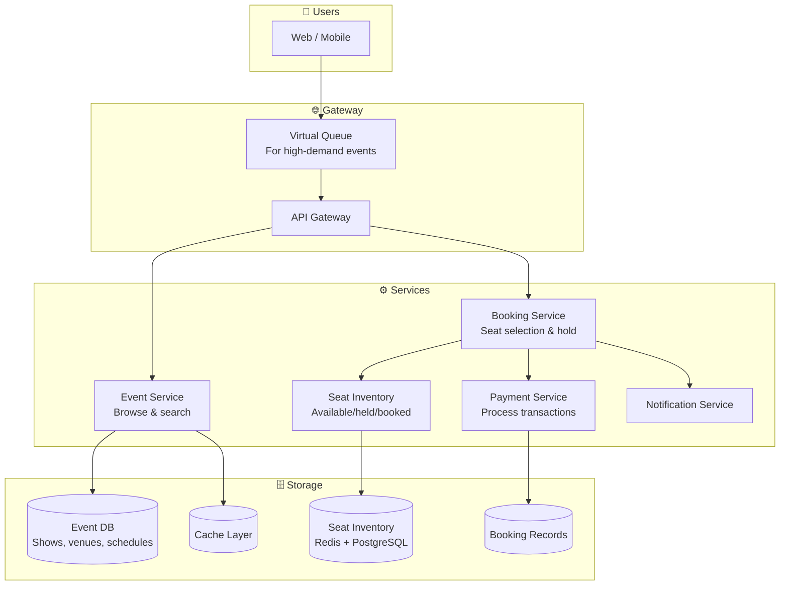
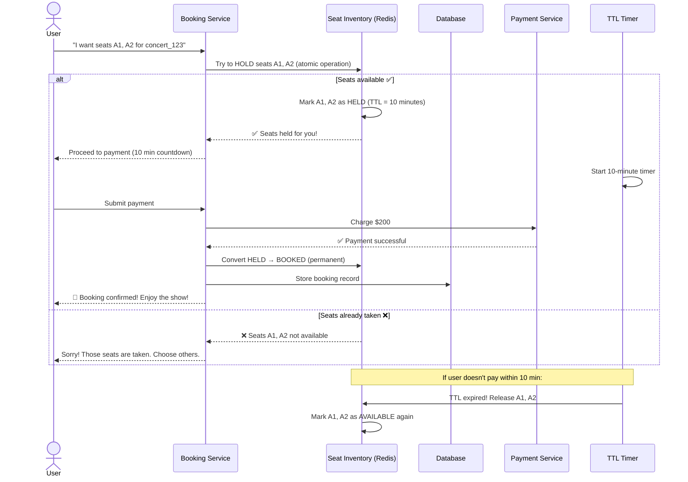
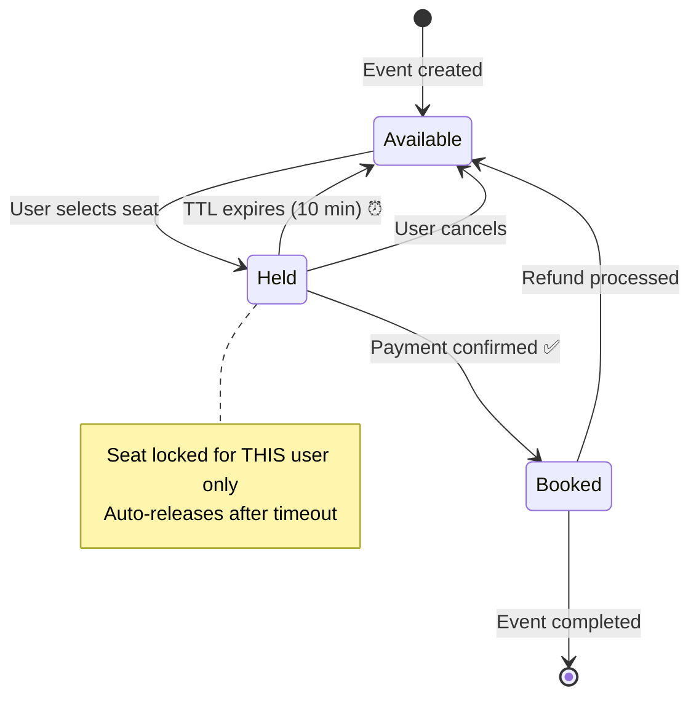
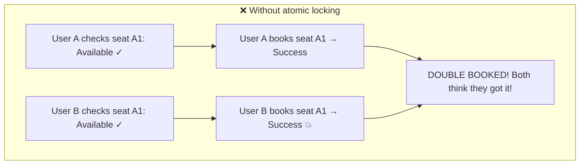
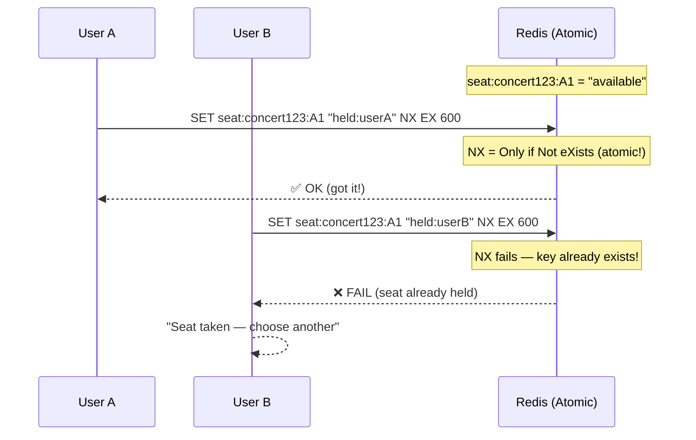
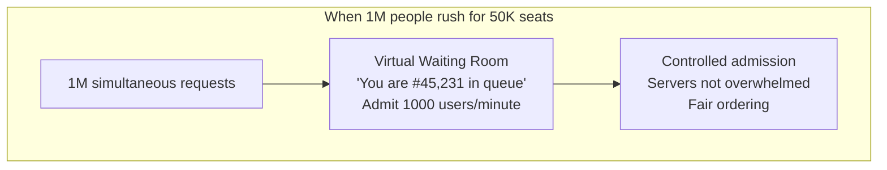
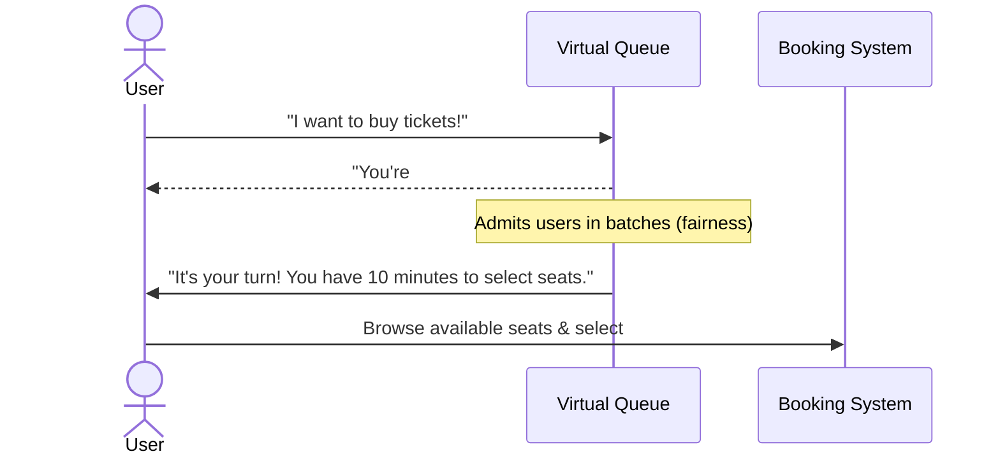
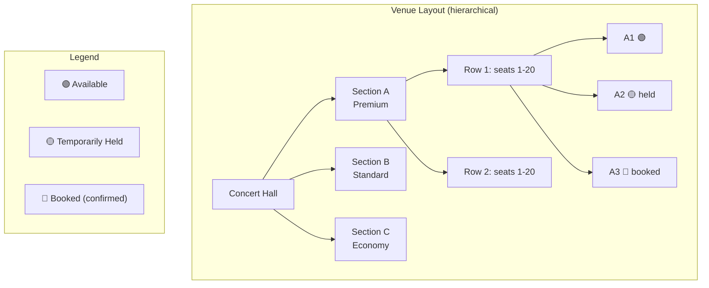

# HLD 18: Design a Ticket Booking System (BookMyShow / Ticketmaster)

## 💡 Quick Summary

> **What**: A system for booking seats at events (movies, concerts) that handles seat selection, temporary holds, payment, and prevents double-booking.  
> **Key Insight**: The main challenge is concurrency — when 10,000 people try to book the same 500 seats simultaneously. We need temporary seat locks with TTL to prevent both double-booking AND indefinite holds.

---

## 🎯 The Problem in Simple Terms

When Taylor Swift concert tickets go on sale:
- 1M people try to buy 50,000 seats in seconds
- Two people CANNOT book the same seat
- If someone starts checkout but doesn't pay → seat must be released
- The system must be fair (first-come-first-served)

---

## 📋 Requirements

| Feature | Detail |
|---------|--------|
| Browse events | Search by city, date, type |
| View seat map | See available/booked seats visually |
| Select & hold seats | Temporarily reserve while user pays |
| Payment | Complete booking within time limit |
| No double-booking | One seat = one confirmed booking only |
| Waitlist | Notify if cancelled seats become available |

### Scale
```
Events: 1M+ active at any time
Peak concurrent users: 10M (during popular on-sale)
Seat selections/second: 100K+
Payment window: 10 minutes (then seat released)
Booking confirmation: < 3 seconds
```

---

## 🏗️ Architecture Overview



---

## 🔍 Booking Flow (The Critical Path)



---

## 💺 Seat States



---

## ⚡ Preventing Double-Booking (The Key Challenge)

### Problem: Race Condition



### Solution: Atomic Compare-and-Swap in Redis



**Key**: Redis `SET key value NX EX 600` is atomic. Only ONE request can succeed. The loser immediately knows and can try another seat.

---

## 🚦 Virtual Queue (For High-Demand Events)





---

## 🏟️ Seat Map Data Structure



---

## 📊 Key Trade-offs

| Decision | We Chose | Why |
|----------|----------|-----|
| Seat locking | Redis with TTL (SET NX EX) | Atomic, auto-expires, fast |
| Hold duration | 10 minutes | Enough to complete payment; not too long to block others |
| High-demand protection | Virtual queue | Fair ordering; prevents server crash |
| Seat selection | Real-time seat map via WebSocket | Users see live availability |
| Payment failure | Auto-release held seats | Don't punish users for bank issues |
| Overbooking | Never (strict inventory) | Unlike airlines — a seat is a physical spot |

---

## 🚀 Scaling Challenges

| Challenge | Solution |
|-----------|----------|
| 1M simultaneous for one event | Virtual queue + admission control |
| Seat status real-time | Redis for state; WebSocket push updates to all viewers |
| Payment timeout handling | Redis TTL auto-releases; no cron job needed |
| Multiple events concurrently | Partition seat inventory by event_id |
| Scalper prevention | CAPTCHA + rate limiting + ID verification |
| Flash sale traffic (10,000x spike) | Auto-scale + CDN for static event pages |
