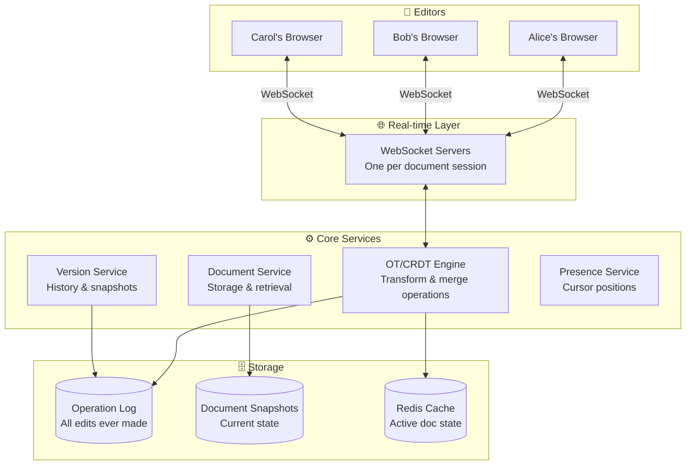
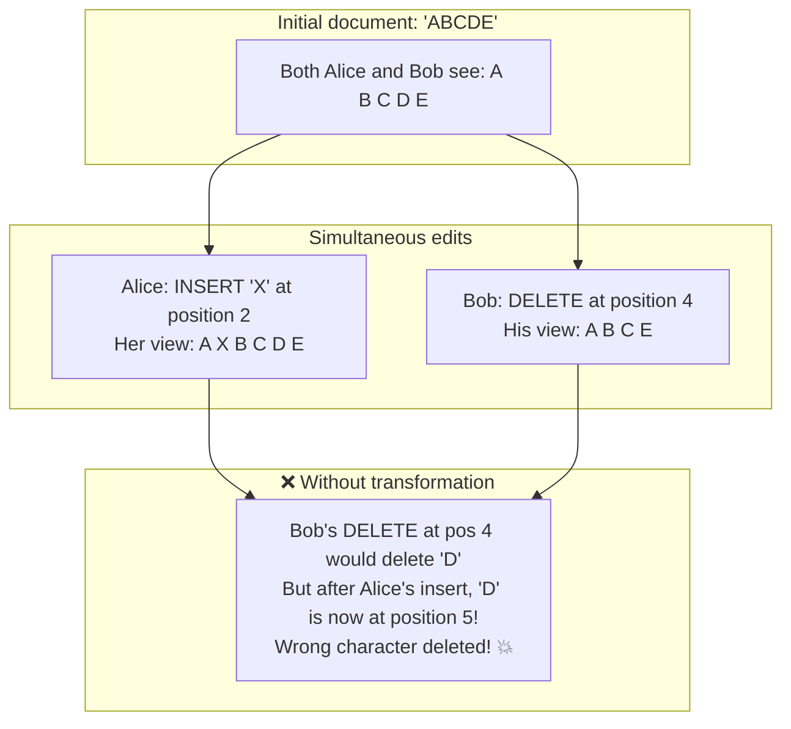
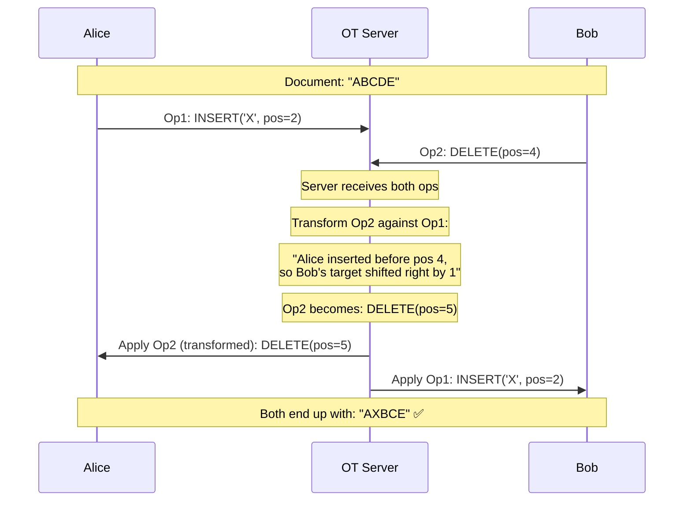
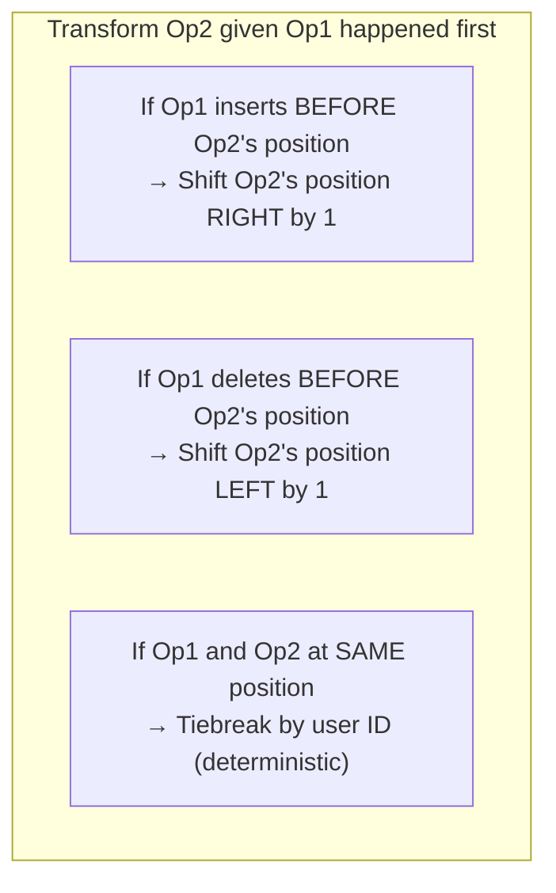
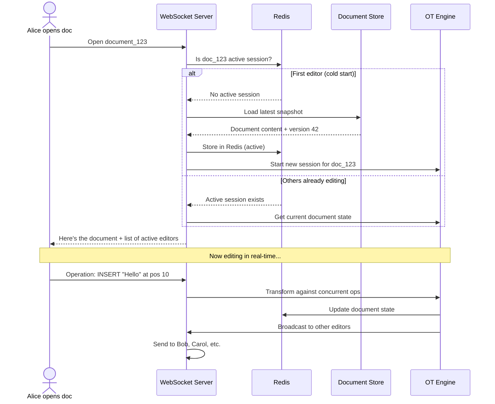
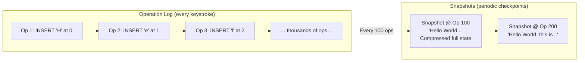
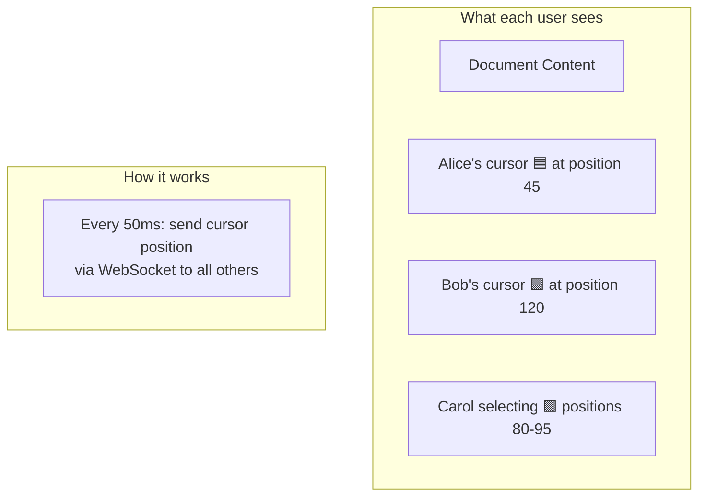
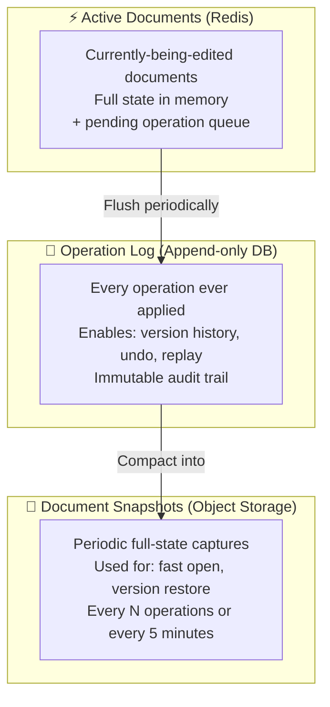

# HLD 19: Design Google Docs (Real-Time Collaborative Editing)

## 💡 Quick Summary

> **What**: A system where multiple users simultaneously edit the same document and see each other's changes in real-time.  
> **Key Insight**: The core challenge is conflict resolution — when two people type at the same position simultaneously. Solved using Operational Transformation (OT) or CRDTs to merge edits without conflicts.

---

## 🎯 The Problem in Simple Terms

When Alice and Bob both edit a document simultaneously:
- Alice types "Hello" at position 5
- Bob deletes characters at position 3

These operations happen at the "same time" on different computers. How do we ensure both end up with the same final document? This is the **conflict resolution** problem.

---

## 📋 Requirements

| Feature | Detail |
|---------|--------|
| Real-time co-editing | Multiple cursors, see changes live |
| Conflict resolution | Simultaneous edits don't corrupt document |
| Offline support | Edit offline, sync when back |
| Version history | See previous versions, restore |
| Cursor awareness | See where other users are typing |
| Comments & suggestions | Annotate document |

### Scale
```
Concurrent editors per doc: up to 100
Documents: billions
Active editing sessions: 10M+
Latency for updates: < 100ms between users
Operation throughput: millions of operations/second globally
```

---

## 🏗️ Architecture Overview



---

## 🔍 How Conflict Resolution Works (Operational Transformation)

### The Problem



### The OT Solution



### Transformation Rules (Simple)



---

## 🔄 Document Session Lifecycle



---

## 📋 Version History & Snapshots



**Why snapshots?** Without them, recovering a document would mean replaying ALL operations from the beginning (could be millions). Snapshots let you start from a recent checkpoint.

---

## 👥 Presence & Cursors



---

## 🗄️ Storage Architecture



---

## 📊 Key Trade-offs

| Decision | We Chose | Why |
|----------|----------|-----|
| Conflict resolution | OT (Operational Transformation) | Battle-tested (Google Docs uses it); works well with central server |
| Alternative | CRDTs (Conflict-free Replicated Data Types) | Better for P2P/offline but more complex for rich text |
| Transport | WebSocket | Bidirectional, low latency, persistent connection |
| Persistence | Op log + periodic snapshots | Full history (undo/audit) + fast recovery |
| Session management | One "authoritative" server per document | Simplifies OT (single point of ordering) |
| Offline edits | Queue ops locally, replay on reconnect | May cause large merge; acceptable for occasional offline |

---

## 🚀 Scaling Challenges

| Challenge | Solution |
|-----------|----------|
| 100 concurrent editors on one doc | Single server handles OT for one doc; stateful routing |
| Millions of active documents | Shard by document_id; route connections to correct server |
| Server failure mid-session | Op log allows replay from last snapshot; clients reconnect |
| Large documents (100+ pages) | Only send operations for visible portion; lazy load |
| Version history (millions of ops) | Compaction + snapshots; only store diff from last snapshot |
| Global latency | Regional WebSocket servers; central OT per document |
