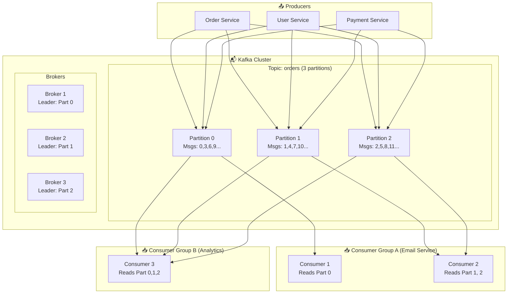
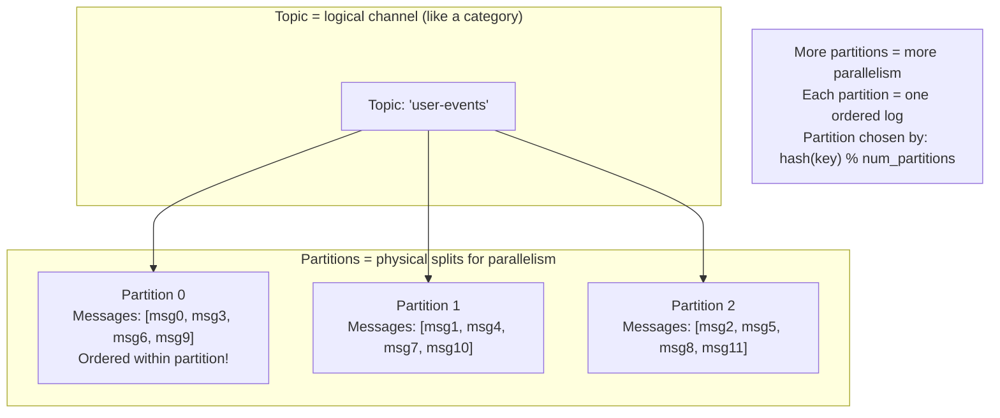
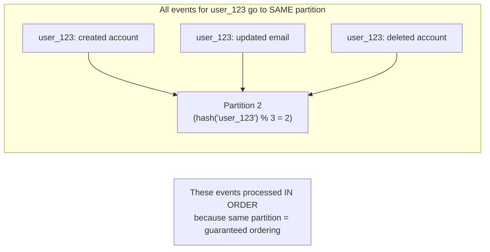
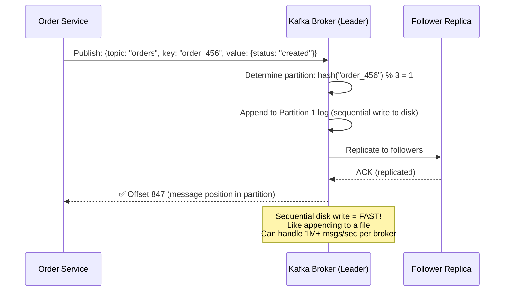
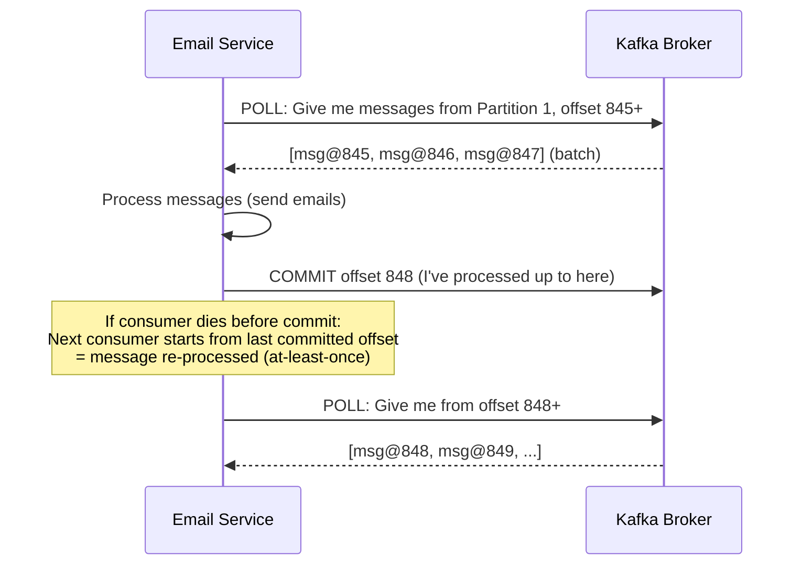
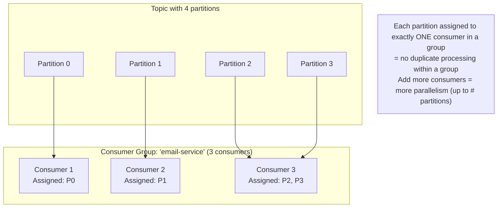
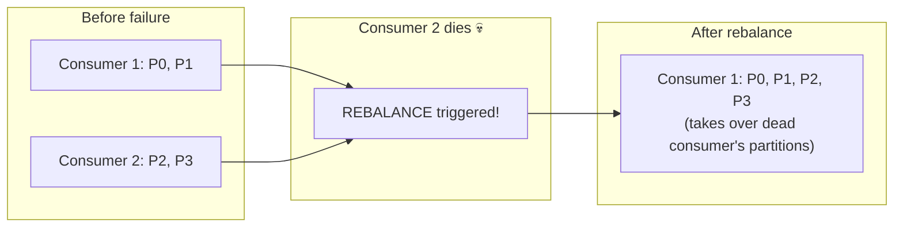
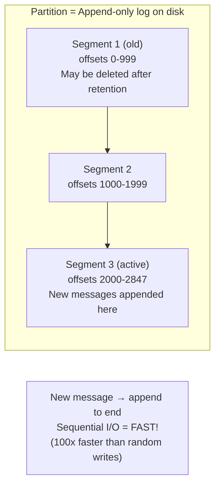
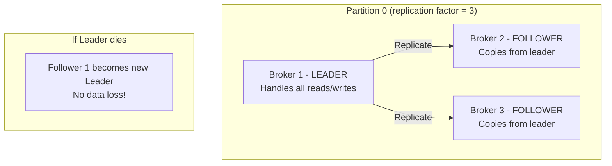

# HLD 20: Design a Message Queue (like Kafka)

## 💡 Quick Summary

> **What**: A distributed messaging system that decouples producers from consumers, enabling async communication, event streaming, and reliable delivery at massive scale.  
> **Key Insight**: Kafka's secret is treating messages as an append-only log (like a commit log). This enables high throughput (sequential writes), replay (re-read old messages), and consumer independence.

---

## 🎯 The Problem in Simple Terms

Without a message queue:
- Service A calls Service B directly → if B is down, A fails too
- If B is slow, A is slow (tight coupling)
- If 1M events happen at once, B gets overwhelmed

With a message queue:
- A publishes events to the queue → A is done (fast!)
- B reads from the queue at its own pace
- If B dies, messages wait safely until B recovers

---

## 📋 Requirements

| Feature | Detail |
|---------|--------|
| Publish messages | Producers write to topics |
| Subscribe & consume | Consumers read from topics |
| Ordering | Messages ordered within a partition |
| Durability | Messages persisted to disk (not lost) |
| Replay | Re-read old messages (reset offset) |
| Consumer groups | Multiple consumers share work |
| At-least-once delivery | Every message processed at least once |

### Scale (Kafka-level)
```
Throughput: 1M+ messages/second per broker
Messages/day: 1 trillion+ (LinkedIn scale)
Retention: 7 days default (configurable, some keep forever)
Latency: < 10ms end-to-end
Brokers: 1000+ in a cluster
Topics: 100,000+
```

---

## 🏗️ Architecture Overview



---

## 🔍 Core Concepts Explained

### Topics & Partitions



### How Partitioning Ensures Order



---

## 🔍 How Publishing Works



---

## 🔍 How Consuming Works



---

## 👥 Consumer Groups (Parallel Processing)



### What happens when a consumer dies?



---

## 💾 Storage: The Append-Only Log



**Why is Kafka so fast?**
- Sequential disk writes (append-only) are almost as fast as RAM
- Zero-copy: data goes disk → network without CPU copying
- Batching: sends groups of messages together
- No random seeks (unlike traditional databases)

---

## 🔄 Replication (Durability)



---

## 📊 Key Trade-offs

| Decision | We Chose | Why |
|----------|----------|-----|
| Storage | Append-only log (disk) | Fast sequential I/O; cheap; durable |
| Ordering | Per-partition (not global) | Global ordering = single partition = no parallelism |
| Delivery | At-least-once (default) | Can achieve exactly-once with idempotent producer |
| Retention | Time-based (7 days default) | Not infinite; configurable per topic |
| Pull vs Push | Consumer pulls | Consumer controls pace; handles slow consumers gracefully |
| Replication | Synchronous (ISR) | Leader waits for N replicas before ACK = durable |

---

## 🚀 Scaling

| Challenge | Solution |
|-----------|----------|
| Throughput | Add partitions → add consumers → linear scaling |
| Storage | Segments expire based on retention policy |
| Broker failure | Replication + automatic leader election |
| Consumer failure | Rebalance partitions to remaining consumers |
| Ordering requirements | Use same partition key for related events |
| Exactly-once | Idempotent producer + transactional consumer |
