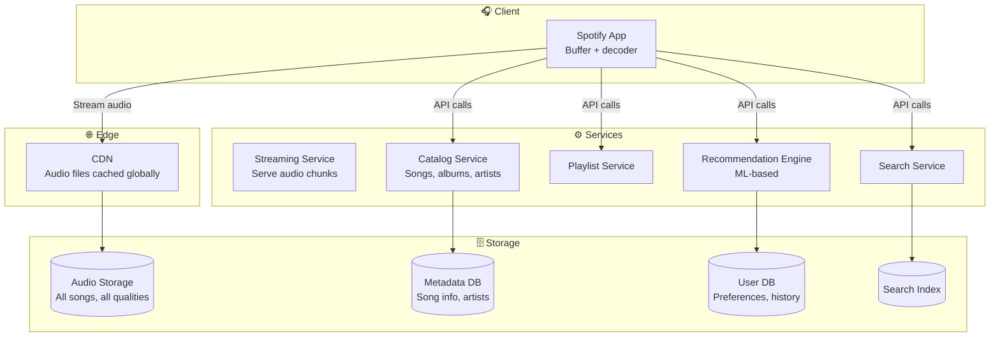
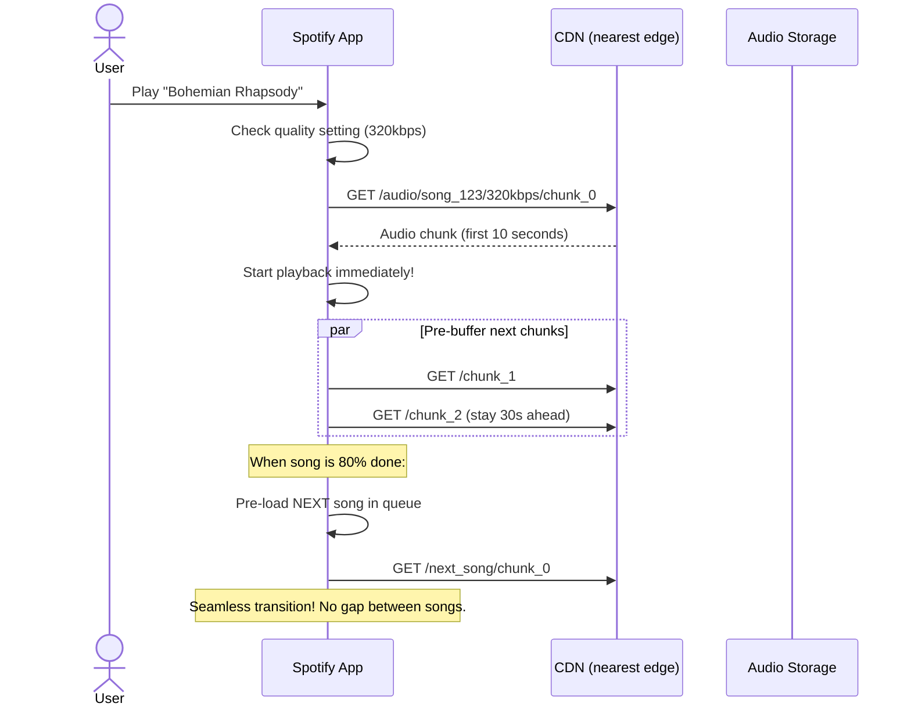
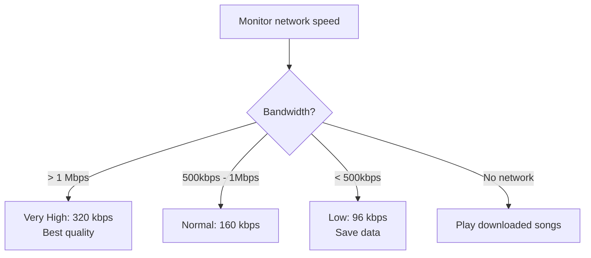
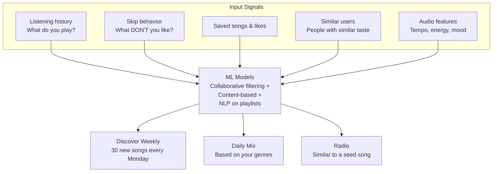

# HLD 21: Design Spotify (Music Streaming)

## 💡 Quick Summary

> **What**: A music streaming platform that serves audio content, manages playlists, and provides personalized recommendations.  
> **Key Insight**: Unlike video (YouTube), audio files are small (~3-10MB per song). The challenge is seamless playback (no buffering gaps between songs), offline downloads, and the recommendation engine that keeps users engaged.

---

## 🎯 The Problem in Simple Terms

When you hit play on Spotify:
- Audio starts within 200ms (pre-buffered)
- Songs transition seamlessly (next song pre-loaded)
- Quality adapts to your network (low/normal/high/very high)
- 100M+ songs available, personalized for each of 500M+ users

---

## 📋 Requirements

| Feature | Detail |
|---------|--------|
| Stream music | Play songs with adaptive quality |
| Search | Find songs, artists, albums, playlists |
| Playlists | Create, share, collaborative playlists |
| Recommendations | Discover Weekly, Daily Mix, Radio |
| Offline | Download for offline playback |
| Social | See what friends are playing |

### Scale
```
Songs: 100M+ tracks
Users: 500M+ (200M+ paid subscribers)
Concurrent streams: 50M+
Audio file sizes: 3MB (low) to 10MB (lossless)
Total storage: 100M × 10MB × multiple qualities = ~4 PB
Daily streams: 1B+
```

---

## 🏗️ Architecture



---

## 🔍 How Audio Streaming Works



### Adaptive Bitrate for Audio



---

## 🧠 Recommendation Engine



---

## 📊 Key Trade-offs

| Decision | We Chose | Why |
|----------|----------|-----|
| Audio delivery | CDN + chunked streaming | Low latency; CDN caches popular songs near users |
| Quality | Multiple encodings stored | Pre-encode at upload; save CPU at serving time |
| Buffer strategy | 30-second lookahead + next song preload | Seamless playback; handle brief network drops |
| Offline | Encrypted downloads + license check | DRM protection; works without internet |
| Recommendations | Hybrid ML (collaborative + content) | Cold start problem: new songs have no history → use audio features |
| Search | Elasticsearch with fuzzy matching | Handles typos; fast full-text across 100M songs |

---

## 🚀 Scaling

| Challenge | Solution |
|-----------|----------|
| 50M concurrent streams | CDN serves 95% of audio; only cache misses hit origin |
| 100M songs stored | Multiple quality levels × formats; tiered storage (hot/cold) |
| Personalization at scale | Pre-compute recommendations in batch (nightly); real-time adjustments |
| New song ingestion | Async pipeline: upload → transcode all qualities → distribute to CDN |
| Global low latency | CDN edge nodes in 100+ countries |
