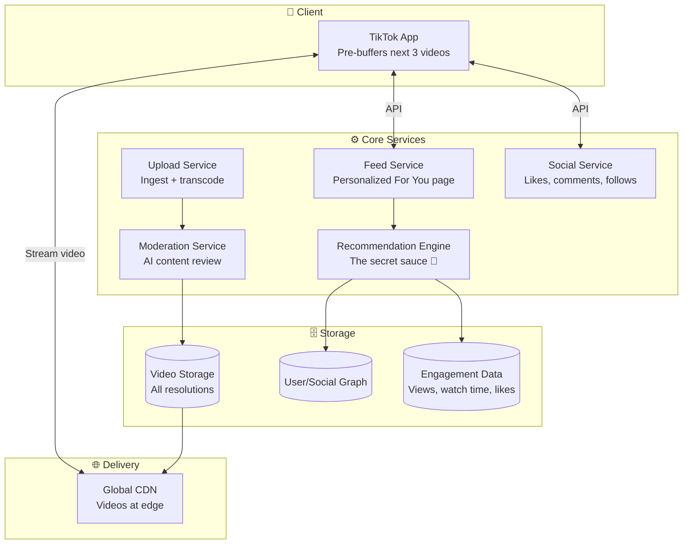
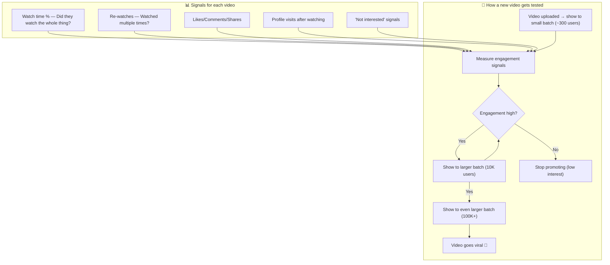
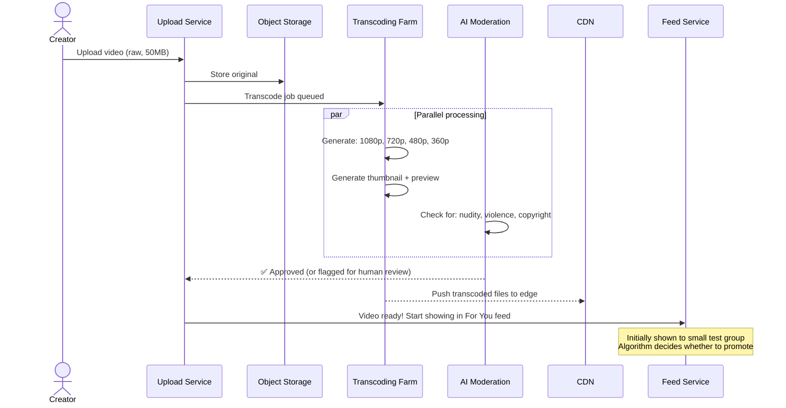
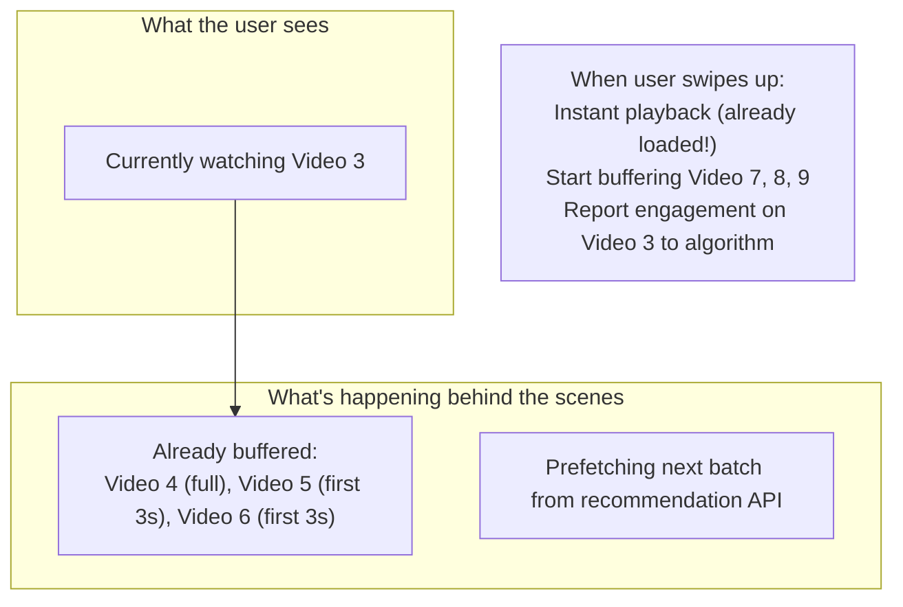

# HLD 22: Design TikTok (Short Video Feed)

## 💡 Quick Summary

> **What**: A short-form video platform with an algorithmically curated "For You" feed that keeps users scrolling endlessly.  
> **Key Insight**: Unlike Instagram (follow-based feed), TikTok's feed is entirely algorithm-driven. You don't need followers — any video can go viral if the algorithm detects engagement. The recommendation engine IS the product.

---

## 🎯 The Problem in Simple Terms

The "For You" page must:
- Show you videos you'll love (even from creators you don't follow)
- Decide within the first few views if a video is worth promoting
- Handle billions of video views per day with minimal buffering
- Process uploaded videos instantly (transcode, moderate, distribute)

---

## 📋 Requirements

| Feature | Detail |
|---------|--------|
| Upload short videos | 15s to 10 min, with effects |
| For You feed | Personalized, infinite scroll |
| Interactions | Like, comment, share, duet |
| Discovery | Hashtags, sounds, trending |
| Creator tools | Filters, music overlay, editing |
| Live streaming | Real-time broadcasts |

### Scale
```
DAU: 1B+
Video uploads/day: 10M+
Video views/day: 10B+
Avg video size: 5-50 MB (raw), 2-10 MB (compressed)
Feed refresh: real-time, personalized per user
Content moderation: AI + human review
```

---

## 🏗️ Architecture



---

## 🔍 The Recommendation Algorithm (Simplified)



---

## 📤 Video Upload Pipeline



---

## 📱 Feed Loading (Client Pre-buffer Strategy)



---

## 📊 Key Trade-offs

| Decision | We Chose | Why |
|----------|----------|-----|
| Feed algorithm | Pure algorithmic (not social graph) | Discovery > friends; virality potential |
| Video delivery | Aggressive pre-buffering (next 3 videos) | Instant swipe UX; uses more data but feels magical |
| Moderation | AI first, humans for edge cases | 10M uploads/day impossible to review manually |
| Upload processing | Async pipeline | Creator gets "processing" status; video live in ~minutes |
| Trending detection | Real-time engagement scoring | Fast trend cycles (hours, not days) |

---

## 🚀 Scaling

| Challenge | Solution |
|-----------|----------|
| 10B views/day | CDN caches popular videos; adaptive bitrate |
| Personalization for 1B users | Pre-compute candidate sets; real-time ranking at serve time |
| 10M uploads/day | Distributed transcoding farm (auto-scales) |
| Cold start (new users) | Start with popular/trending; learn preferences in ~30 swipes |
| Cold start (new videos) | Small batch testing system described above |
| Storage (petabytes) | Tiered: hot (CDN) → warm (SSD) → cold (HDD) based on view count |
