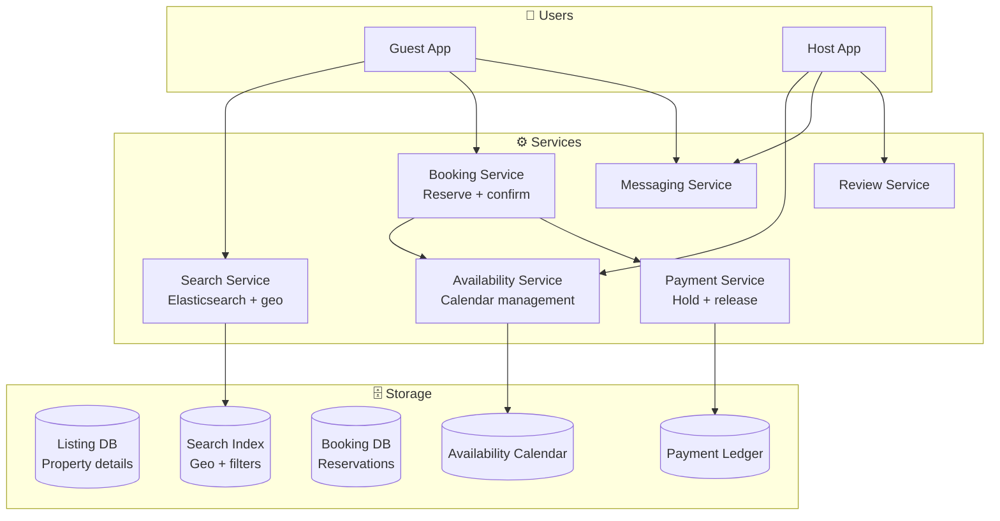
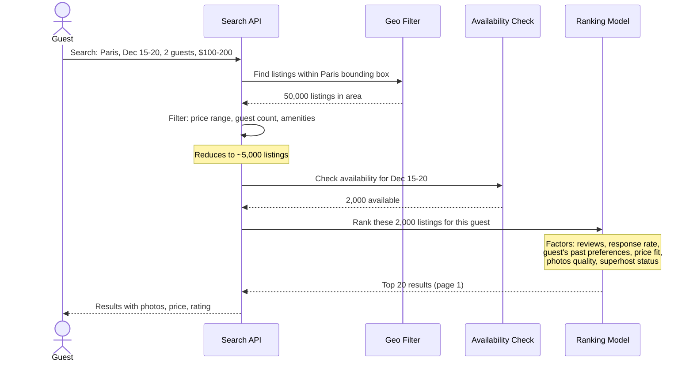
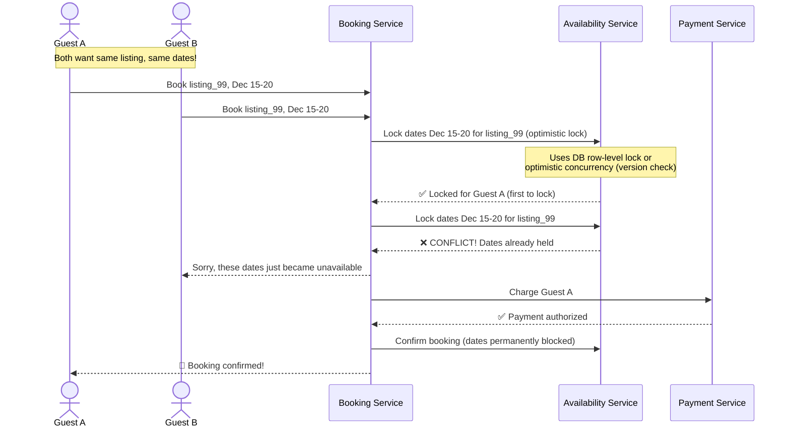
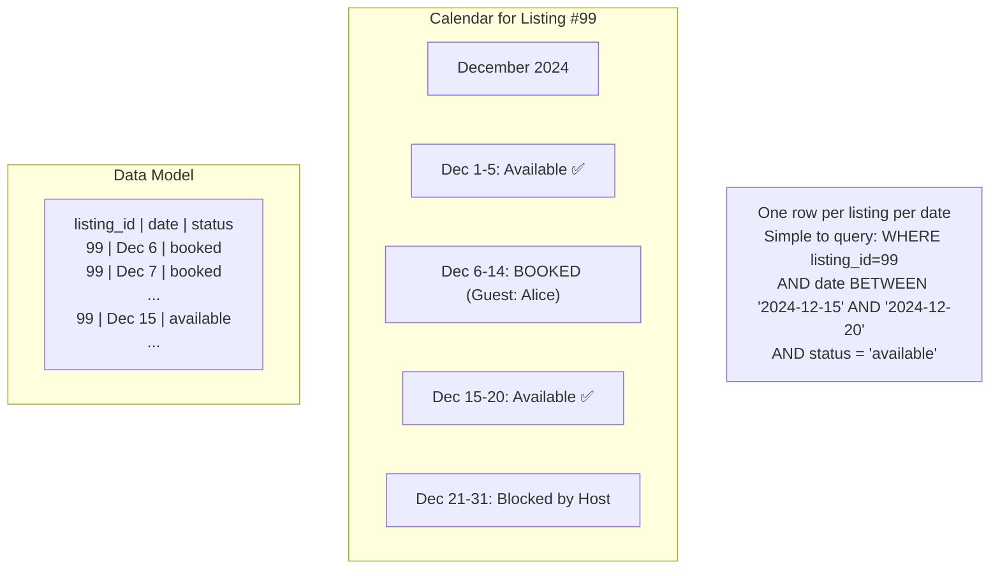
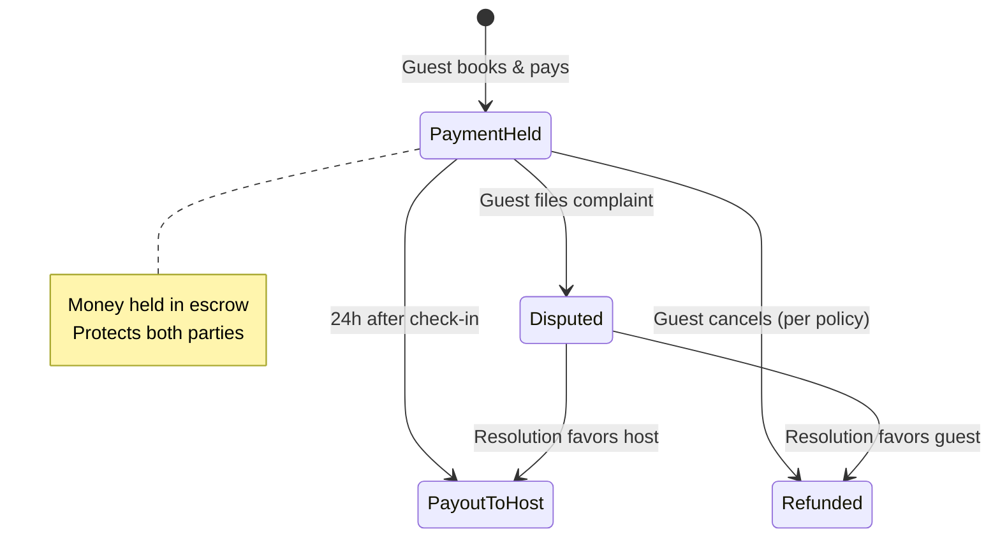

# HLD 23: Design Airbnb (Accommodation Marketplace)

## 💡 Quick Summary

> **What**: A two-sided marketplace connecting hosts (with properties) to guests (searching for stays), handling search, booking, payments, and reviews.  
> **Key Insight**: The hardest problem is **search ranking** (matching guests to the right listing from millions) and **availability management** (preventing double-bookings in a distributed system).

---

## 🎯 The Problem in Simple Terms

When a guest searches "Paris, 2 adults, Dec 15-20":
- Filter millions of listings by location, dates, guests, price, amenities
- Rank results by relevance (reviews, host quality, match to preference)
- Show real-time availability (no stale "available" that's actually booked)
- When guest books, lock those dates atomically (no double booking)

---

## 📋 Requirements

| Feature | Detail |
|---------|--------|
| Search listings | Location, dates, guests, filters |
| Booking | Reserve dates, pay, confirm |
| Availability calendar | Hosts manage open dates |
| Payments | Hold funds → release after check-in |
| Reviews | Two-way (guest ↔ host) |
| Messaging | Host-guest communication |

### Scale
```
Listings: 7M+ active
Bookings/day: 2M+
Search queries/day: 100M+
Users: 150M+
Countries: 220+
```

---

## 🏗️ Architecture



---

## 🔍 Search Flow



---

## 🔒 Booking & Double-Booking Prevention



---

## 📅 Availability Calendar Design



---

## 💰 Payment Flow



---

## 📊 Key Trade-offs

| Decision | We Chose | Why |
|----------|----------|-----|
| Search index | Elasticsearch with geo_point | Built-in geo queries + full-text + faceted filters |
| Availability check | Separate service with row-level locks | Prevent double-booking; clear ownership |
| Booking model | Request → Hold (5min) → Confirm | Give time for payment without losing listing |
| Pricing | Dynamic (hosts set base; system suggests) | Seasonal demand, events, competitor pricing |
| Reviews | Post-checkout only; both sides review | Prevents retaliation; honest feedback |

---

## 🚀 Scaling

| Challenge | Solution |
|-----------|----------|
| 100M searches/day | Elasticsearch cluster; cache popular searches |
| Geo queries at scale | Geohash-based sharding; regional indices |
| Double-booking prevention | Optimistic locking + short hold period (5 min) |
| Payment across 220 countries | Multiple payment processors; local currency support |
| Real-time availability | Event-driven updates; calendar service pushes changes to search index |
