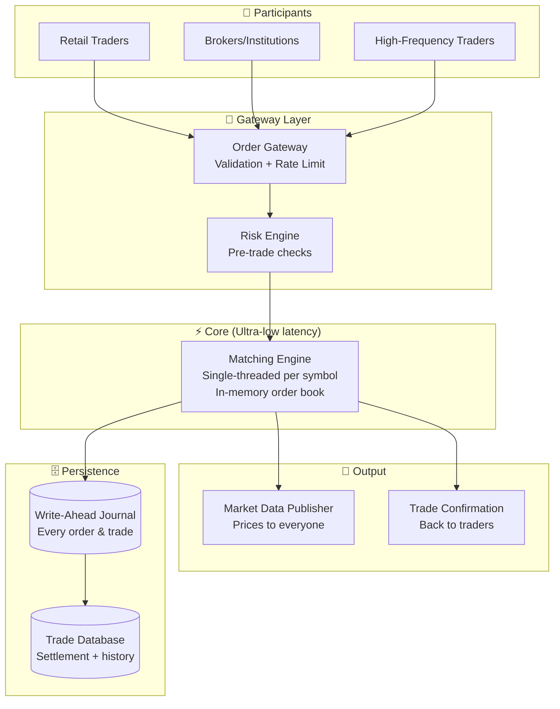
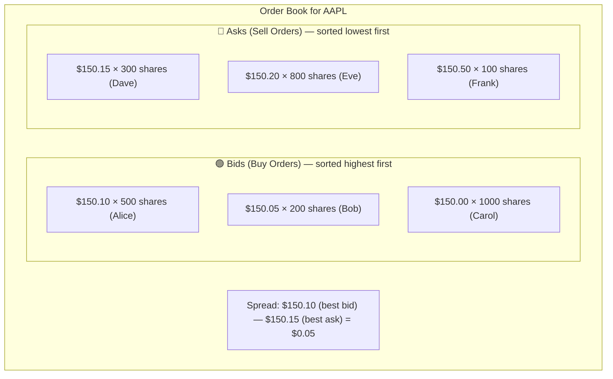
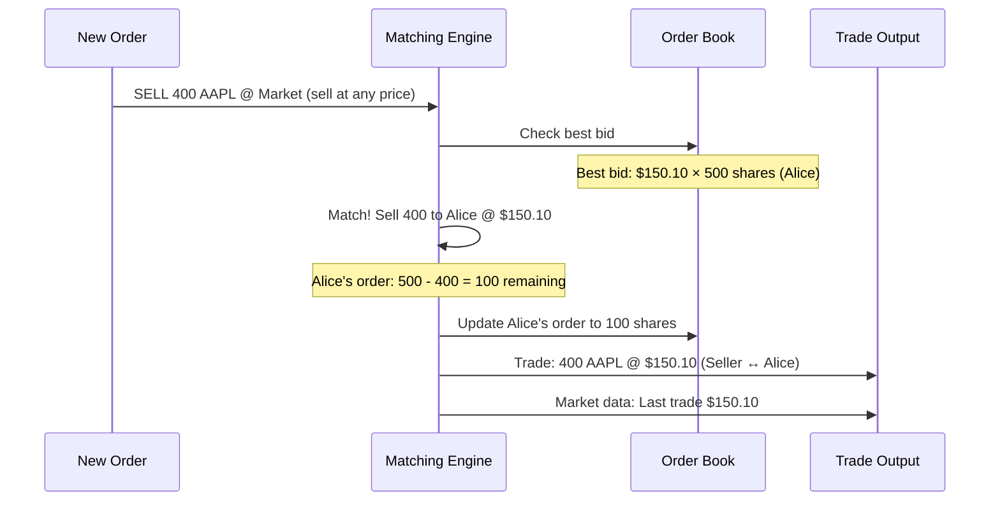
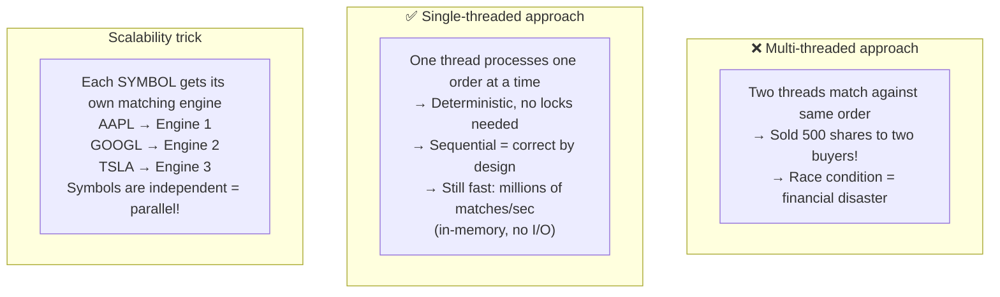
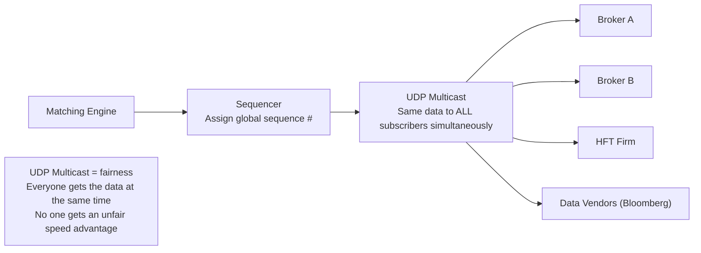

# HLD 24: Design a Stock Exchange

## 💡 Quick Summary

> **What**: A system that matches buy/sell orders for financial instruments in real-time with extreme low latency and strict ordering guarantees.  
> **Key Insight**: The matching engine is the heart — it MUST be single-threaded and deterministic. At stock exchanges, microsecond latency matters. This is one of the few systems where you optimize for latency over scalability.

---

## 🎯 The Problem in Simple Terms

When a trader submits "Buy 100 shares of AAPL at $150":
- The system must check if anyone is selling AAPL at ≤ $150
- If yes → match instantly (microseconds)
- If no → add to the order book, wait for a matching seller
- MUST be fair: first order in = first to be matched (FIFO)
- MUST be consistent: everyone sees the same order of trades

---

## 📋 Requirements

| Feature | Detail |
|---------|--------|
| Place orders | Market, limit, stop orders |
| Order matching | Price-time priority (FIFO) |
| Order book | Real-time bid/ask display |
| Trade execution | Instant notification on fill |
| Market data | Real-time prices to all subscribers |
| Risk checks | Pre-trade validation |

### Scale
```
Orders/second: 100K - 1M (peak)
Matching latency: < 10 microseconds
Instruments: 10,000+ (stocks, options, etc.)
Concurrent users: 1M+ (traders, brokers, bots)
Uptime requirement: 99.999% during market hours
Market data updates: millions/second to subscribers
```

---

## 🏗️ Architecture



---

## 🔍 The Order Book & Matching



### Matching Example



---

## ⚡ Why Single-Threaded Matching Engine?



---

## 🔄 Order Lifecycle

```mermaid
stateDiagram-v2
    [*] --> Received: Order submitted
    Received --> Validated: Pass risk checks
    Received --> Rejected: Fail checks (insufficient funds, etc.)
    Validated --> Queued: Added to matching queue
    Queued --> PartialFill: Partially matched
    Queued --> Filled: Fully matched
    Queued --> Open: No match yet (resting in book)
    PartialFill --> Filled: Remaining shares matched
    Open --> Filled: New counter-order arrives
    Open --> Cancelled: Trader cancels
    Filled --> [*]
    Cancelled --> [*]
    Rejected --> [*]
```



---

## 📡 Market Data Distribution



---

## 📊 Key Trade-offs

| Decision | We Chose | Why |
|----------|----------|-----|
| Matching engine | Single-threaded, in-memory | Correctness > throughput; no locks needed |
| Scaling | Shard by symbol (one engine per symbol) | Symbols are independent; horizontal scale |
| Persistence | Write-ahead journal (synchronous) | Can replay to recover state after crash |
| Market data | UDP multicast | Fair access; lowest latency to all subscribers |
| Language/runtime | C++ or Rust (no GC!) | Garbage collection pauses = unacceptable latency spikes |
| Network | Kernel bypass (DPDK), co-located servers | Every microsecond matters at this level |

---

## 🚀 Scaling

| Challenge | Solution |
|-----------|----------|
| 1M orders/second | Shard by symbol across matching engines |
| Microsecond latency | In-memory; kernel bypass networking; no GC languages |
| Fault tolerance | Write-ahead log + hot standby (replay journal) |
| Market data fanout | UDP multicast (one send → all receive) |
| Global access | Regional gateways → central matching (for consistency) |
| After-hours processing | Batch settlement, clearing, reconciliation |
