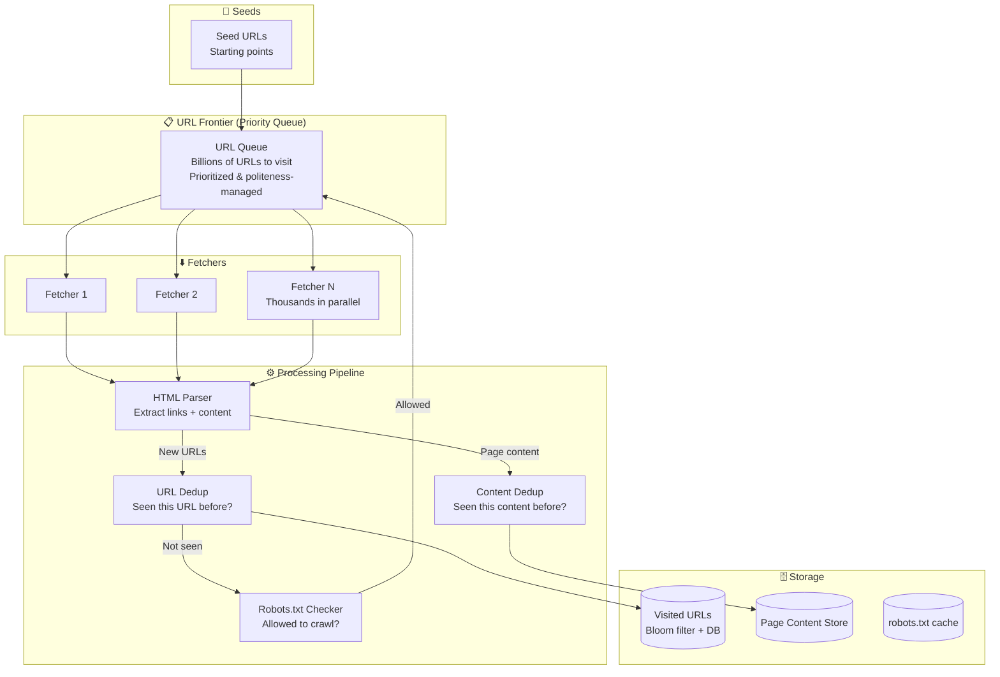
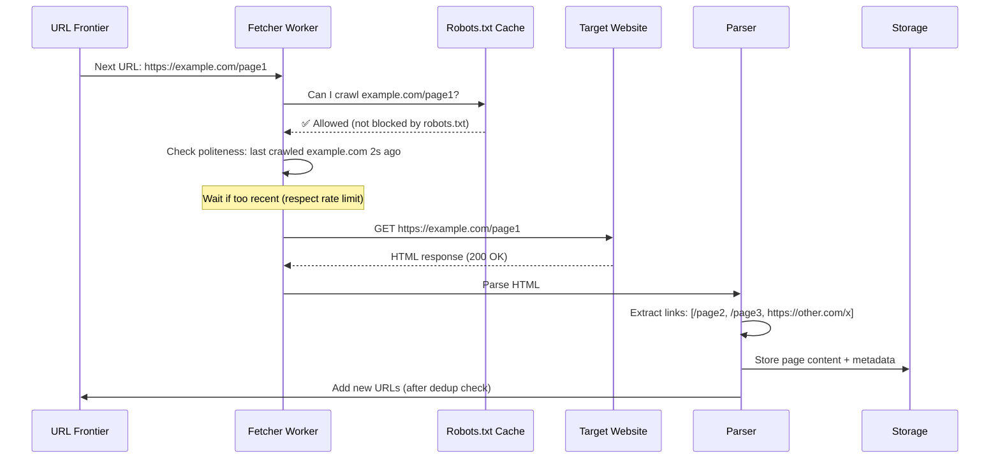
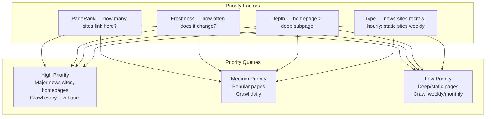
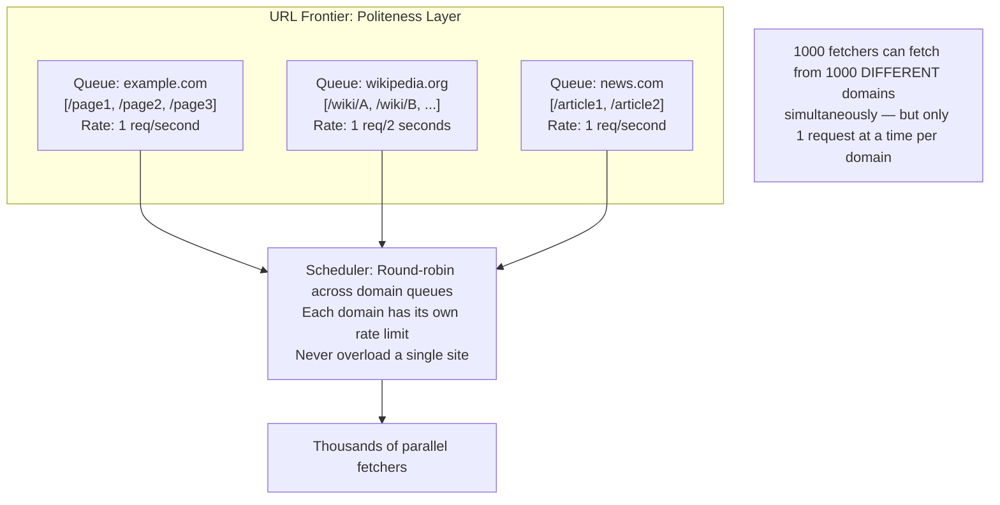
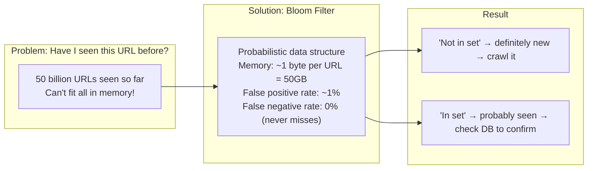

# HLD 25: Design a Web Crawler

## 💡 Quick Summary

> **What**: A system that systematically downloads web pages, extracts links, and follows them to discover and index the entire web.  
> **Key Insight**: The challenge isn't downloading one page — it's crawling billions of pages politely (respecting robots.txt, rate limits) while avoiding traps (infinite loops, duplicate content, spider traps) and keeping content fresh.

---

## 🎯 The Problem in Simple Terms

Google's crawler must:
- Start with some seed URLs
- Download page → extract all links → add to queue → repeat
- Don't visit the same page twice
- Don't hammer one website (be polite)
- Prioritize important/fresh pages
- Handle the entire web: 50B+ pages

---

## 📋 Requirements

| Feature | Detail |
|---------|--------|
| Crawl pages | Download HTML from URLs |
| Extract links | Find new URLs to crawl |
| Deduplication | Don't crawl same URL/content twice |
| Politeness | Respect robots.txt; rate limit per domain |
| Prioritization | Important pages first |
| Freshness | Re-crawl changed pages periodically |

### Scale
```
Pages to crawl: 50B+
Pages/day: 1B+ (combination of new + recrawl)
Unique domains: 200M+
Storage: petabytes of raw HTML
robots.txt cache: 200M entries
URL frontier size: billions of pending URLs
```

---

## 🏗️ Architecture



---

## 🔍 Crawl Flow



---

## 🎯 URL Prioritization



---

## 🚫 Politeness: Domain-Level Rate Limiting



---

## 🔄 Deduplication: Bloom Filter



---

## 📊 Key Trade-offs

| Decision | We Chose | Why |
|----------|----------|-----|
| URL dedup | Bloom filter + persistent DB | Memory-efficient; tiny false positive rate acceptable |
| Politeness | Per-domain queues with rate limits | Don't get blocked; be a good citizen |
| Content dedup | SimHash (fuzzy fingerprint) | Detect near-duplicate pages (slightly different URLs, same content) |
| Priority | PageRank + freshness score | Crawl important/changing pages more often |
| Storage format | WARC (Web ARChive) | Standard format; stores headers + body + metadata |
| DNS | Local DNS cache | DNS lookups are slow; cache heavily |

---

## 🚀 Scaling

| Challenge | Solution |
|-----------|----------|
| 1B pages/day | Thousands of parallel fetchers across distributed machines |
| URL frontier (billions) | Distributed queue (sharded by domain hash) |
| Dedup at scale | Bloom filter in memory + persistent store for verification |
| robots.txt for 200M domains | Cache with TTL; refresh periodically |
| Spider traps (infinite URLs) | Max depth limit; URL pattern detection; timeout per domain |
| Freshness | Track change frequency; re-crawl at predicted intervals |
