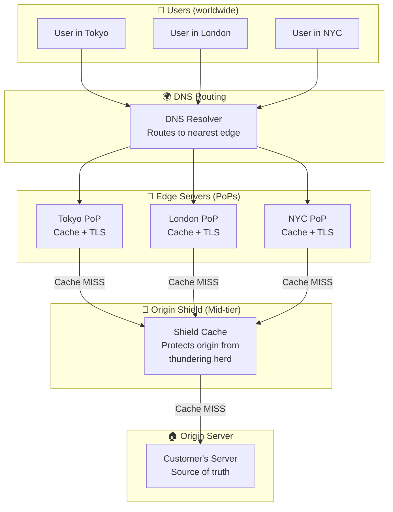
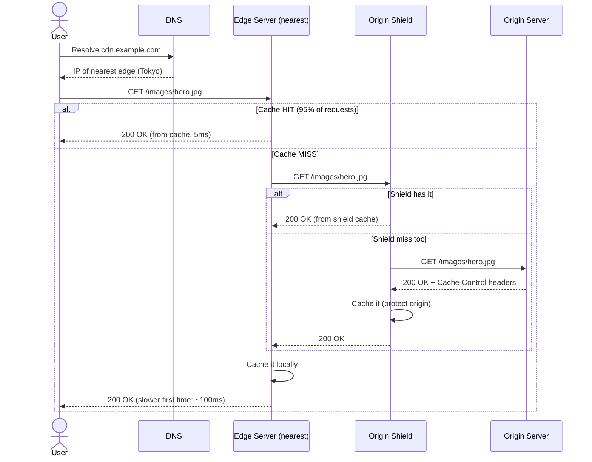
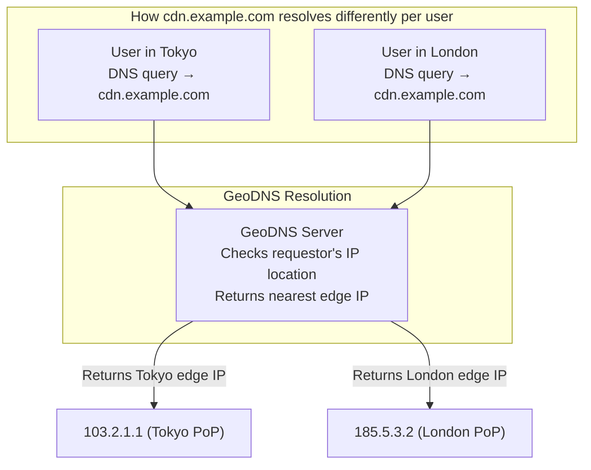
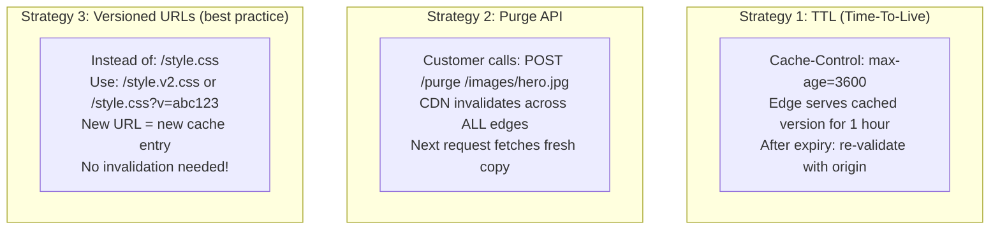
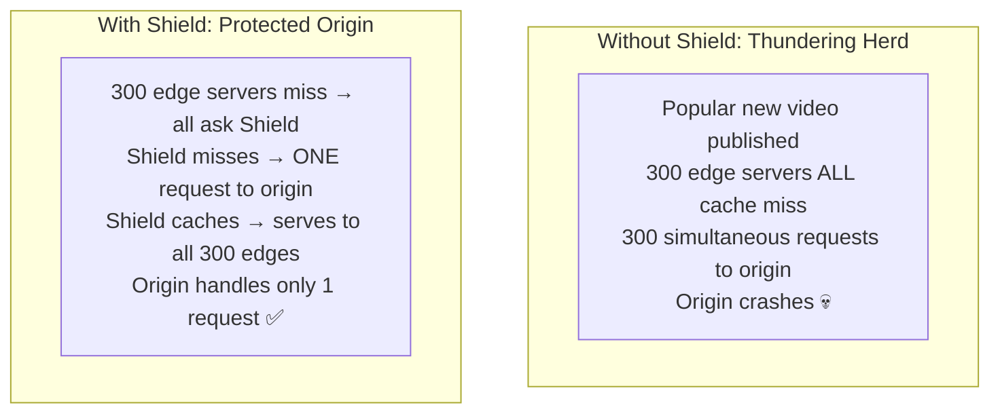

# HLD 26: Design a CDN (Content Delivery Network)

## 💡 Quick Summary

> **What**: A globally distributed network of servers that caches and serves content (images, videos, static files) from locations physically close to users.  
> **Key Insight**: Physics limits speed — light takes 130ms to cross the world. A CDN puts copies of content within 20ms of every user. The challenge is keeping cached content fresh while maximizing cache hit ratio.

---

## 🎯 The Problem in Simple Terms

Without CDN: User in Tokyo requests image from server in Virginia → 200ms round trip, server overloaded.

With CDN: Same image is cached at Tokyo edge server → 5ms response, origin server barely touched.

---

## 📋 Requirements

| Feature | Detail |
|---------|--------|
| Cache & serve static content | Images, CSS, JS, videos |
| Global distribution | Edge servers in 100+ cities |
| Cache invalidation | Update content when origin changes |
| SSL/TLS termination | HTTPS at the edge |
| DDoS protection | Absorb attacks at edge |
| Load balancing | Distribute traffic across edges |

### Scale
```
Edge locations: 300+ (globally)
Requests/second: 100M+
Bandwidth: 100+ Tbps
Cache hit ratio target: 95%+
Content size: petabytes cached globally
Latency target: < 50ms to any user worldwide
```

---

## 🏗️ Architecture



---

## 🔍 Request Flow: Cache Hit vs Miss



---

## 🌐 DNS-Based Routing (How Users Reach Nearest Edge)



---

## ♻️ Cache Invalidation Strategies



---

## 🛡️ Origin Shield (Why Two Layers of Cache)



---

## 📊 Key Trade-offs

| Decision | We Chose | Why |
|----------|----------|-----|
| Routing | GeoDNS (geographic) | Simple; gets users to nearby edge |
| Alternative routing | Anycast IP | Same IP announced from multiple locations; BGP routes to nearest |
| Invalidation | TTL + purge API + versioned URLs | Combination handles all use cases |
| Cache layers | Edge + Shield (2-tier) | Protect origin; improve hit ratio |
| Cache eviction | LRU (Least Recently Used) | Simple; works well for web content |
| HTTPS | Terminate TLS at edge | Reduces latency (TLS handshake happens locally) |

---

## 🚀 Scaling

| Challenge | Solution |
|-----------|----------|
| Global coverage | 300+ PoPs; add more in underserved regions |
| Cache hit ratio | Origin shield; long TTLs; pre-warming popular content |
| DDoS attacks | Absorb at edge (distributed); rate limiting |
| Content updates | Purge propagation in < 5 seconds globally |
| Video streaming | Chunked delivery; adaptive bitrate at edge |
| Cost | Tiered pricing; hot content on SSD, cold on HDD |
