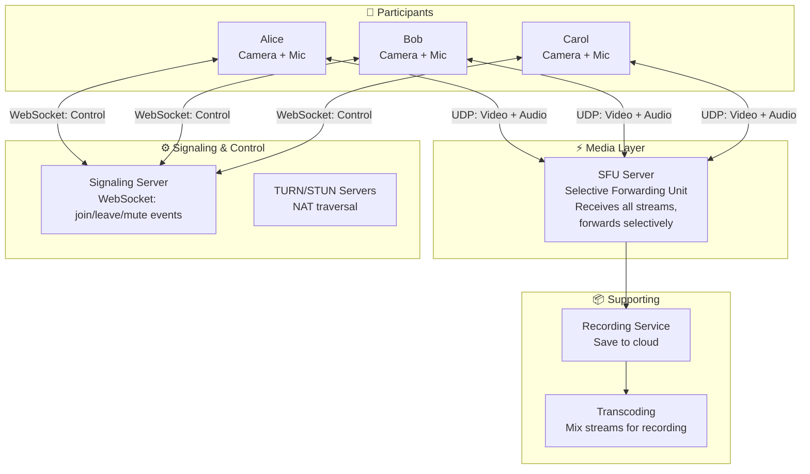
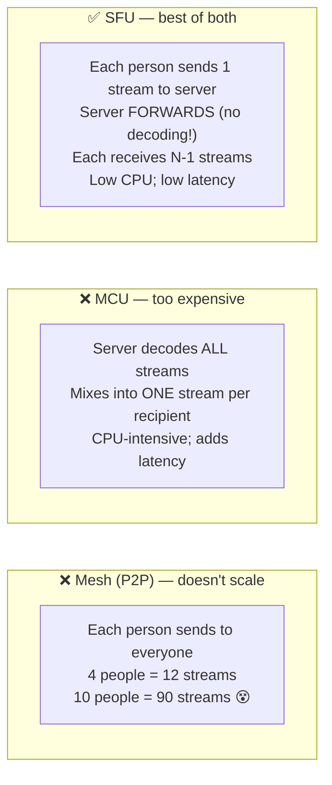
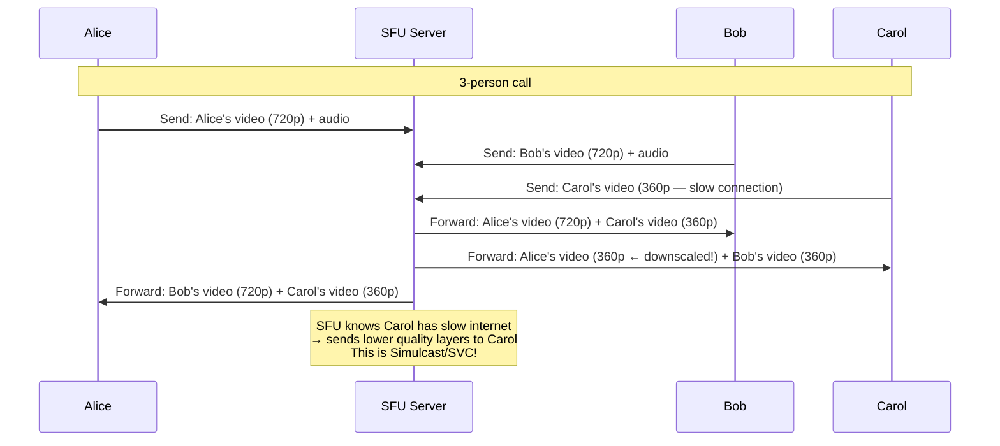
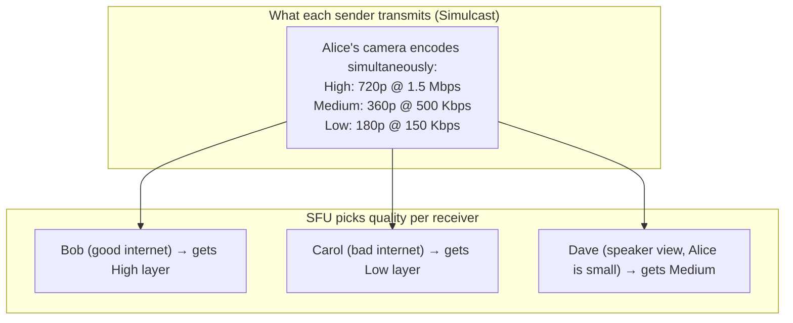
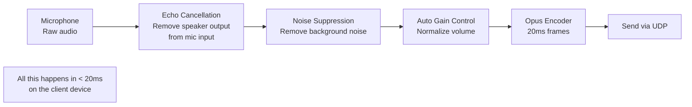

# HLD 27: Design Zoom (Video Conferencing)

## 💡 Quick Summary

> **What**: A real-time video/audio conferencing system supporting 1:1 calls, group meetings, screen sharing, and recordings.  
> **Key Insight**: Unlike streaming (one-way, tolerates buffering), video calls require **sub-200ms latency** (or conversation feels unnatural). Uses UDP (lossy but fast) over TCP (reliable but slow). Selective Forwarding Unit (SFU) architecture scales group calls.

---

## 🎯 The Problem in Simple Terms

In a 10-person video call:
- Each person sends 1 video stream + 1 audio stream
- Naive approach: each person sends to 9 others = 90 streams (N × (N-1)) — doesn't scale!
- Solution: everyone sends to a central server, server forwards selectively

---

## 📋 Requirements

| Feature | Detail |
|---------|--------|
| 1:1 video/audio | Peer-to-peer when possible |
| Group calls | Up to 1000 participants |
| Screen sharing | Low latency, high resolution |
| Recording | Cloud recording + transcription |
| Chat | In-meeting text chat |
| Adaptive quality | Adjust to network conditions |

### Scale
```
Concurrent meetings: 10M+
Participants in one meeting: up to 1000
Video quality: 720p/1080p (adaptive)
Latency target: < 150ms end-to-end
Bandwidth per participant: 1.5-4 Mbps (send + receive)
Audio codec: Opus (20ms frames)
Video codec: VP8/H.264/AV1
```

---

## 🏗️ Architecture



---

## 🔍 How SFU Works (vs. Alternatives)



### SFU Detail



---

## 📹 Simulcast (Adaptive Quality)



---

## 🌐 NAT Traversal (Connecting Through Firewalls)

```mermaid
sequenceDiagram
    participant A as Alice (behind NAT)
    participant STUN as STUN Server
    participant TURN2 as TURN Server
    participant SFU3 as SFU

    A->>STUN: What's my public IP?
    STUN-->>A: Your public IP:port is 203.0.113.5:4567
    
    A->>SFU3: Try direct connection to SFU
    
    alt Direct connection works (80% of cases)
        A<-->SFU3: UDP media flows directly
    else Blocked by strict NAT/firewall
        A->>TURN2: Relay my media through you
        TURN2<-->SFU3: TURN relays packets
        Note over TURN2: Adds ~20ms latency; uses more bandwidth<br/>But it ALWAYS works (fallback)
    end
```

---

## 🎙️ Audio Processing Pipeline



---

## 📊 Key Trade-offs

| Decision | We Chose | Why |
|----------|----------|-----|
| Transport | UDP (not TCP) | Dropped frame > delayed frame in real-time video |
| Architecture | SFU (not MCU, not Mesh) | Scales to large calls; low server CPU; low latency |
| Quality adaptation | Simulcast (3 layers per sender) | SFU picks best layer per receiver without transcoding |
| Fallback | TURN relay | Works through any firewall (unlike P2P) |
| Recording | Server-side (SFU records streams) | Doesn't burden participants; consistent quality |
| Audio codec | Opus | Adaptive bitrate; excellent quality at low bandwidth |

---

## 🚀 Scaling

| Challenge | Solution |
|-----------|----------|
| 1000-person meeting | SFU only forwards active speaker's video; others = audio only |
| Global latency | Regional SFU servers; route to nearest media server |
| SFU overload | Cascade SFUs (SFU-to-SFU forwarding for large meetings) |
| Network fluctuation | Simulcast + bandwidth estimation; drop quality gracefully |
| Recording large meetings | Dedicated recording nodes; async transcoding |
| TURN bandwidth cost | Minimize TURN usage; only for NAT-blocked users (~20%) |
