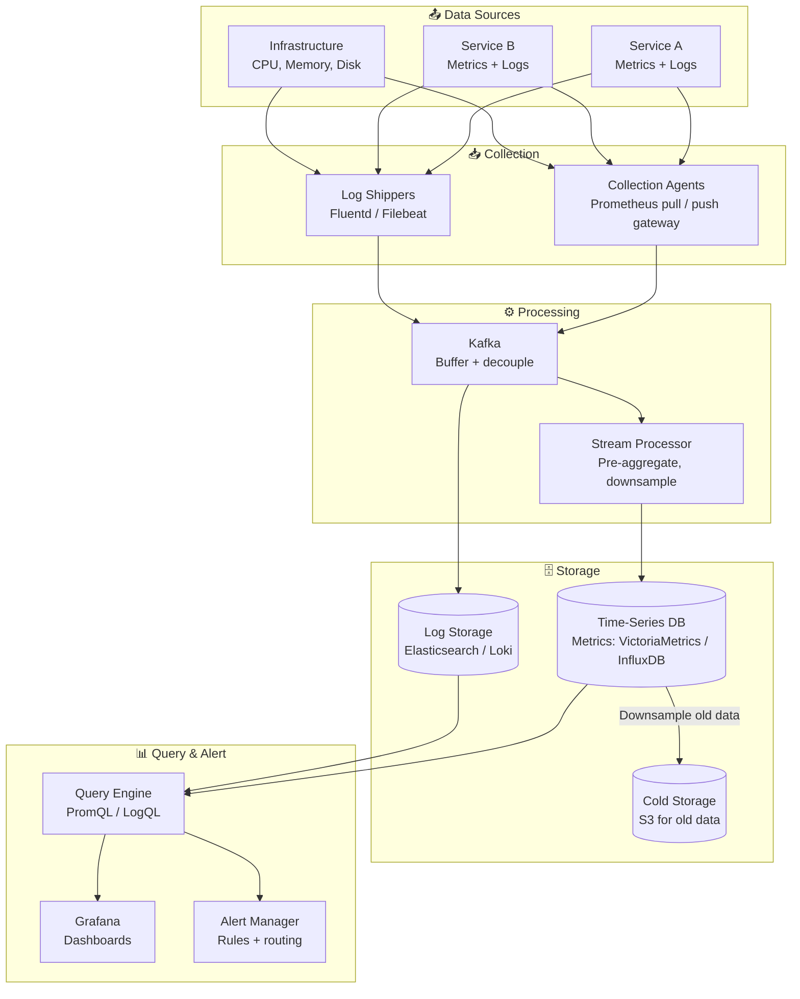
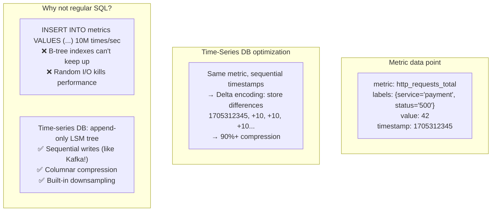
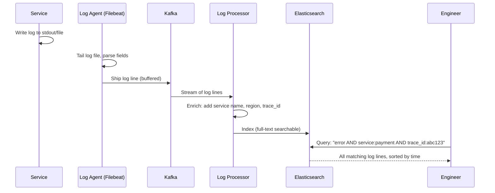
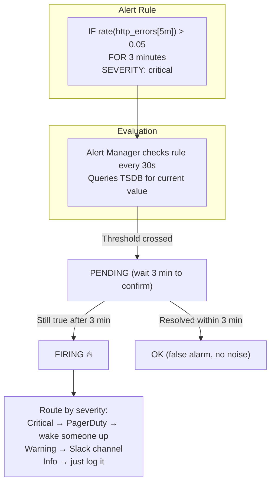
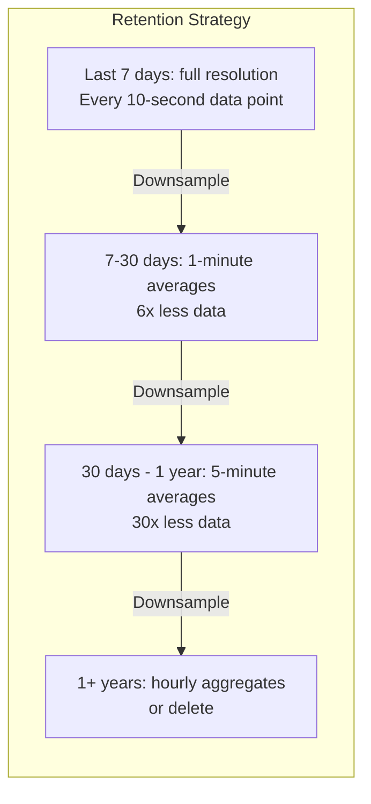

# HLD 28: Design a Metrics & Logging System

## 💡 Quick Summary

> **What**: A system that collects, stores, and queries time-series metrics (CPU, latency, error rates) and log data from thousands of services, enabling monitoring, alerting, and debugging.  
> **Key Insight**: Metrics are time-series data (value + timestamp). The write pattern is APPEND-ONLY and extremely high volume. Specialized time-series databases (not regular SQL) are needed. Logs are high-volume unstructured text requiring full-text search.

---

## 🎯 The Problem in Simple Terms

You have 1000 microservices, each emitting:
- Metrics: CPU=72%, memory=4.2GB, request_latency_p99=120ms (every 10 seconds)
- Logs: "2024-01-15 10:23:45 ERROR PaymentService: timeout connecting to Stripe"

You need to:
- Store all this (petabytes)
- Query: "show me p99 latency for PaymentService over the last 7 days"
- Alert: "if error rate > 5% for 3 minutes, page on-call engineer"
- Debug: "show all logs from request_id=abc123 across all services"

---

## 📋 Requirements

| Feature | Detail |
|---------|--------|
| Metrics collection | Pull or push from services |
| Metrics storage | High-volume time-series |
| Log aggregation | Centralized log storage + search |
| Dashboards | Visualize metrics over time |
| Alerting | Threshold + anomaly-based alerts |
| Distributed tracing | Follow request across services |

### Scale
```
Metrics data points ingested: 10M+ per second
Log lines/day: 100B+
Metric retention: 30 days full res, 1 year downsampled
Log retention: 14-30 days hot, 1 year cold
Query latency: < 1 second for dashboard charts
Services monitored: 10,000+
```

---

## 🏗️ Architecture



---

## 🔍 How Time-Series Storage Works



---

## 📝 Log Pipeline



---

## 🚨 Alerting Flow



---

## 📉 Downsampling (Keep Old Data Small)



---

## 📊 Key Trade-offs

| Decision | We Chose | Why |
|----------|----------|-----|
| Metrics collection | Pull (Prometheus-style) | Service health visible by pull success; simpler security |
| Log search | Elasticsearch / Loki | Full-text search; structured queries |
| Buffer | Kafka between collection and storage | Handle burst; decouple producers from consumers |
| Downsampling | Automatic time-based | Can't store raw data forever; dashboards don't need 10s resolution for last year |
| Alert evaluation | Central alert manager | Deduplicate alerts; group related; route correctly |
| Tracing | Distributed tracing (Jaeger/Zipkin) | Follow single request across services |

---

## 🚀 Scaling

| Challenge | Solution |
|-----------|----------|
| 10M metrics/second ingest | Kafka buffer → sharded TSDB (shard by metric name) |
| 100B logs/day | Tiered storage: hot (SSD, 7 days) → cold (S3, 1 year) |
| Query performance | Pre-compute common aggregations; recording rules |
| Alert noise | Grouping, deduplication, silence windows |
| Cross-service debugging | Distributed tracing with trace_id propagation |
| Cost | Aggressive downsampling; cold storage tier; drop debug logs early |
