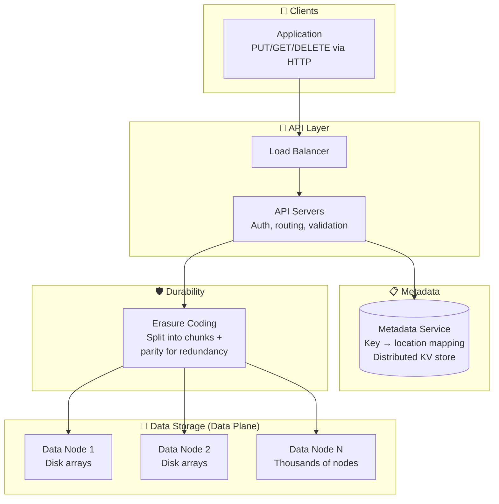
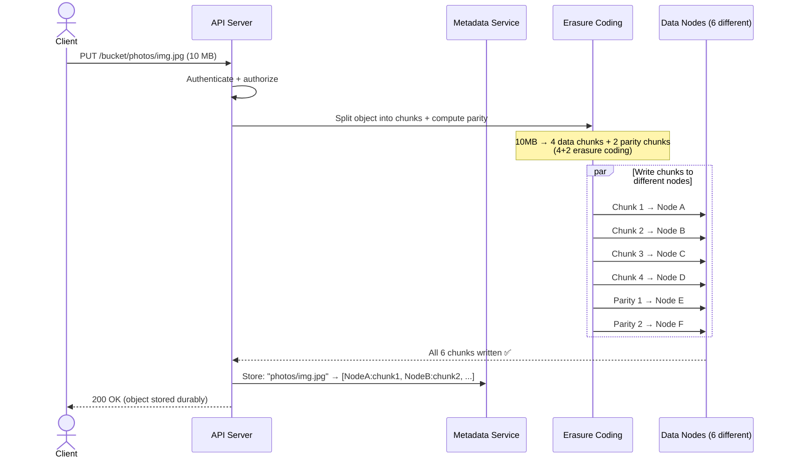
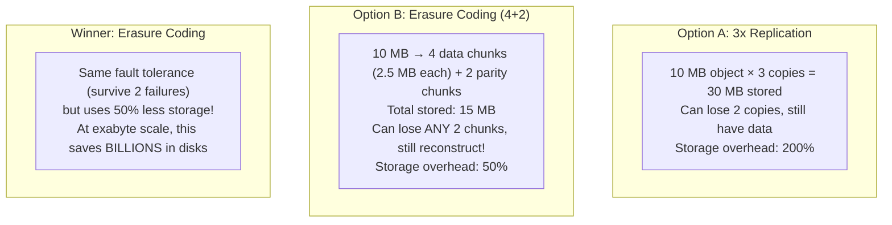
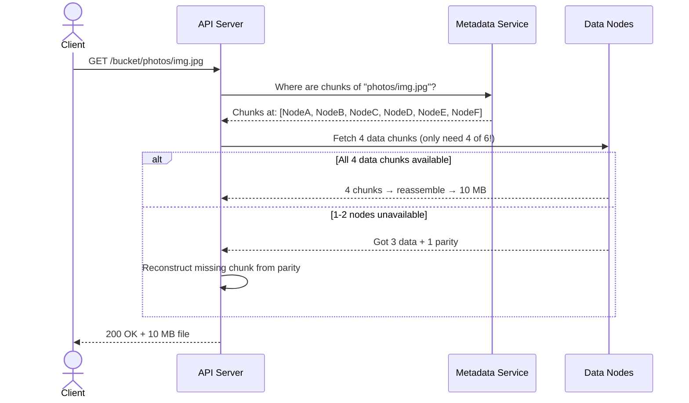
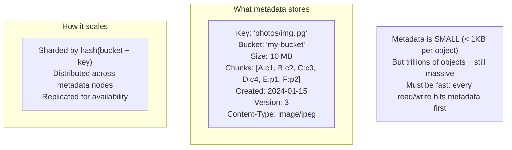

# HLD 29: Design Object Storage (like S3)

## 💡 Quick Summary

> **What**: A system that stores arbitrary files (blobs) at massive scale with high durability, accessed via simple HTTP APIs (PUT/GET).  
> **Key Insight**: Unlike file systems (hierarchy, directories), object storage is flat — each object has a unique key and is immutable. This simplicity enables extreme scale (exabytes). Durability is achieved through erasure coding (more efficient than replication).

---

## 🎯 The Problem in Simple Terms

Store any file (1KB to 5TB), retrieve it by key, never lose it. Period.
- PUT: Upload "photos/vacation/img001.jpg" → stored durably
- GET: Retrieve by key → returns exact bytes
- Guarantee: 99.999999999% durability (11 nines — lose 1 object per 10M years)

---

## 📋 Requirements

| Feature | Detail |
|---------|--------|
| Store objects | Any binary data, any size |
| Retrieve by key | O(1) lookup by bucket + key |
| Durability | 11 nines (never lose data) |
| Availability | 99.99% (always readable) |
| Versioning | Keep previous versions |
| Access control | Per-bucket and per-object policies |

### Scale
```
Objects stored: trillions
Total storage: exabytes
Object sizes: 1 byte to 5 TB
Requests/second: millions
Durability: 99.999999999%
Availability: 99.99%
```

---

## 🏗️ Architecture



---

## 🔍 Write Path (PUT Object)



---

## 🛡️ Erasure Coding (Why Not Just Replicate 3x?)



---

## 🔍 Read Path (GET Object)



---

## 📋 Metadata Service (The Brain)



---

## 📊 Key Trade-offs

| Decision | We Chose | Why |
|----------|----------|-----|
| Redundancy | Erasure coding (not replication) | 50% overhead vs 200%; same durability |
| Consistency | Strong consistency (read-after-write) | User expects to read what they just wrote |
| Object model | Immutable (overwrite = new version) | Simplifies caching, replication, concurrency |
| Metadata | Separate service (not co-located with data) | Different access patterns; metadata fits in memory |
| Large objects | Multipart upload (chunked) | 5TB upload would timeout; chunks can retry independently |
| Storage tiering | Hot (SSD) / Warm (HDD) / Cold (tape/archive) | Most objects rarely accessed after 30 days |

---

## 🚀 Scaling

| Challenge | Solution |
|-----------|----------|
| Exabytes of data | Add data nodes linearly; erasure coding across racks |
| Trillions of objects | Sharded metadata service; consistent hashing |
| Disk failures | Background repair: detect missing chunks, reconstruct from parity |
| Rack/AZ failures | Place chunks across different racks/zones |
| Hot objects | Cache layer in front; CDN for public objects |
| Multipart upload | Client uploads chunks in parallel; server assembles |
