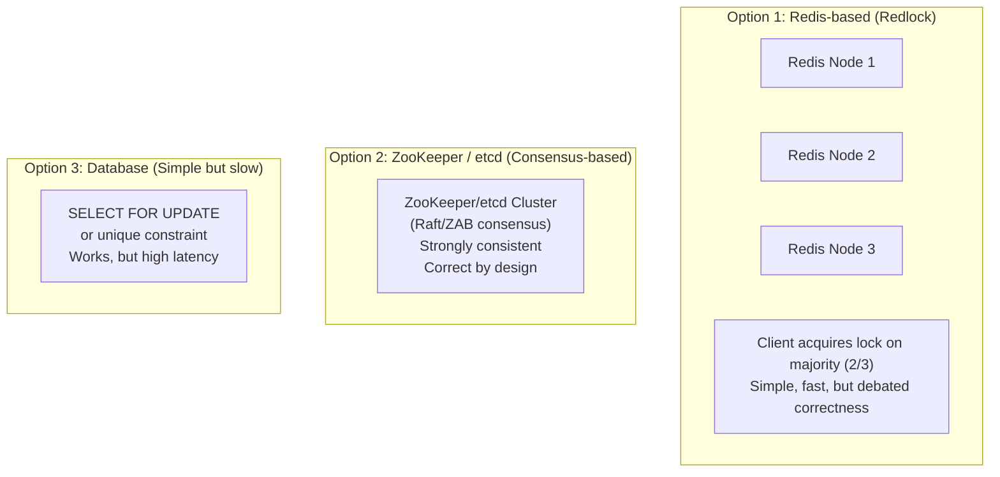
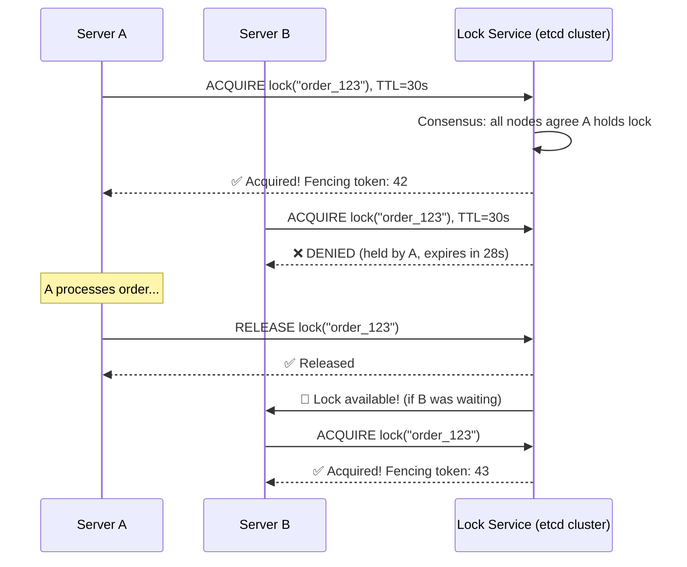
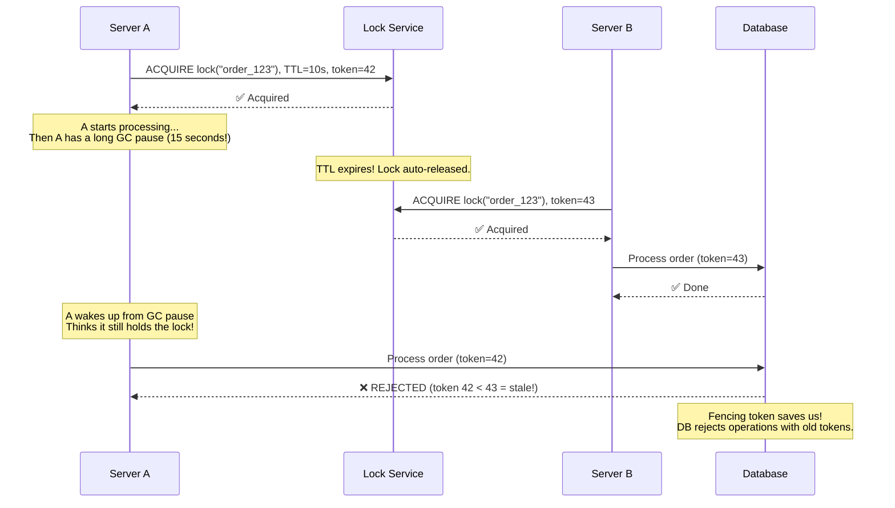
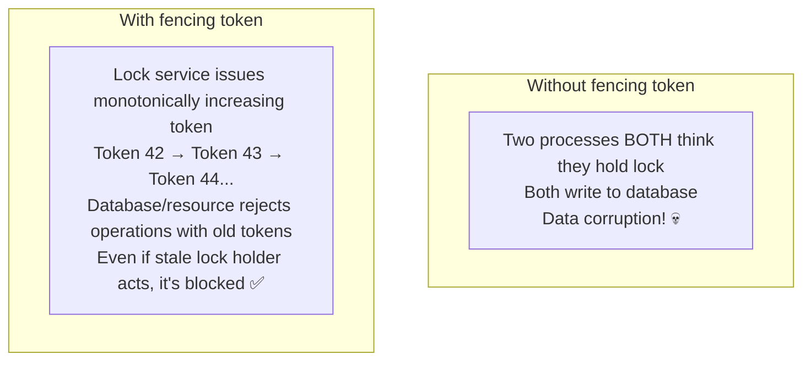
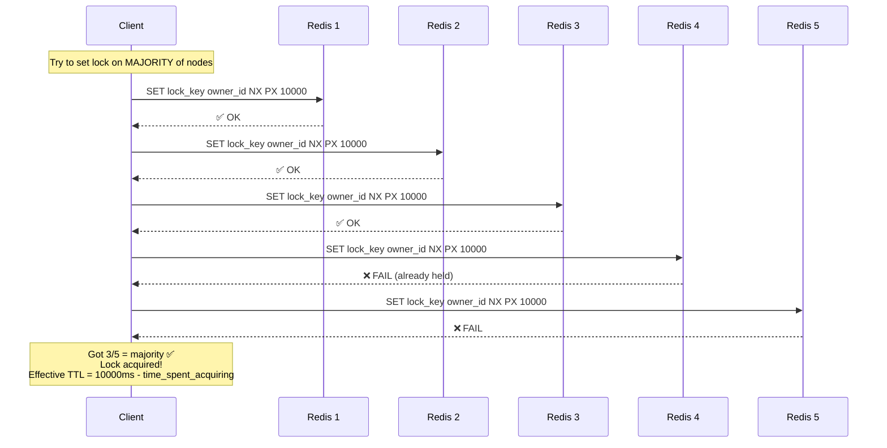

# HLD 30: Design a Distributed Lock Service

## 💡 Quick Summary

> **What**: A service that provides mutual exclusion across distributed systems — ensuring only one process/node can hold a "lock" at a time, preventing race conditions.  
> **Key Insight**: Distributed locks are HARD because of partial failures. A node might acquire a lock, then crash. Without a TTL (auto-expiry), the lock is held forever (deadlock). With TTL, you risk two holders if the first node is just slow (not dead). This is the fundamental tension.

---

## 🎯 The Problem in Simple Terms

Three payment servers all try to process the same order simultaneously:
- Without lock: all three charge the customer → triple charge! 💀
- With distributed lock: only one acquires lock("order_123"), processes it, releases lock

---

## 📋 Requirements

| Feature | Detail |
|---------|--------|
| Mutual exclusion | Only one holder at a time |
| Deadlock prevention | Auto-expire (TTL) if holder crashes |
| Fairness | Optional: queued waiters get lock in order |
| Reentrant | Optional: same owner can re-acquire |
| Fencing token | Monotonic token to detect stale locks |
| High availability | Lock service itself must not be SPOF |

### Scale
```
Lock acquisitions/second: 100K+
Active locks: millions
Lock hold time: milliseconds to minutes
Availability: 99.99%
Nodes in cluster: 3-5 (odd number for consensus)
```

---

## 🏗️ Architecture Options



---

## 🔍 How It Works (Consensus-based: etcd/ZooKeeper)



---

## ⚠️ The Dangerous Edge Case (Why TTL Isn't Enough)



---

## 🔑 Fencing Tokens (The Safety Net)



---

## 🔄 Redlock Algorithm (Redis-based)



---

## 📊 Key Trade-offs

| Decision | We Chose | Why |
|----------|----------|-----|
| Redlock vs Consensus | Consensus (etcd/ZooKeeper) for correctness-critical | Redlock has known theoretical issues (clock drift) |
| Redlock for | Performance-critical, approximate mutual exclusion | Faster; acceptable when duplicate work is tolerable |
| TTL | Always require TTL | Prevents permanent deadlock from crashed holders |
| Fencing tokens | Always use for critical resources | Safety net against stale lock holders |
| Availability vs Consistency | CP (Consistency + Partition tolerance) | A lock that lies is worse than a lock that's unavailable |
| Wait strategy | Exponential backoff + watch/subscribe | Don't spin-loop; react to release event |

---

## 🚀 Scaling

| Challenge | Solution |
|-----------|----------|
| High throughput | Shard locks by key hash across multiple lock groups |
| Lock contention | Keep critical sections short; use finer-grained locks |
| Node failure | Consensus (Raft/ZAB) handles leader election automatically |
| Network partition | CP system: minority partition cannot acquire new locks |
| Clock drift (Redlock) | Use logical clocks / fencing tokens instead of relying on wall clocks |
| Deadlock detection | TTL auto-expiry; monitor long-held locks |
