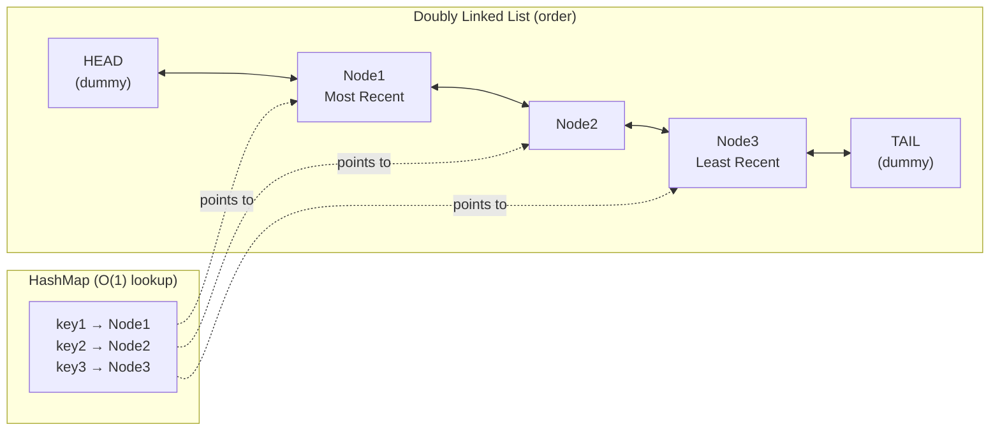
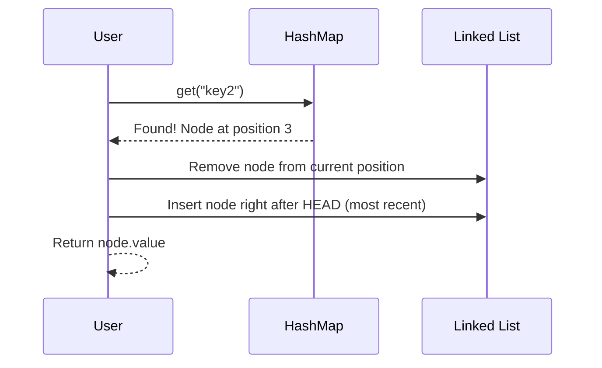
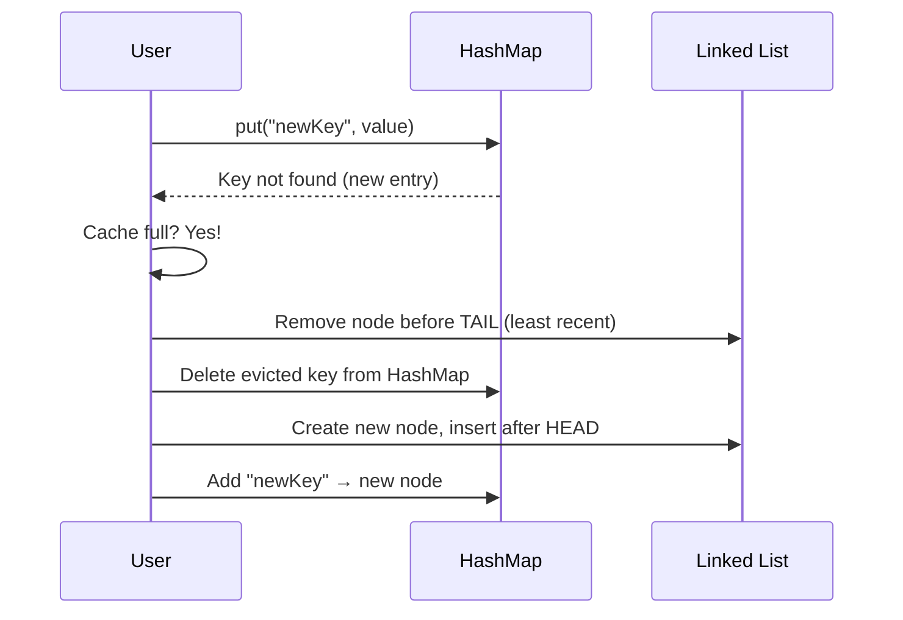
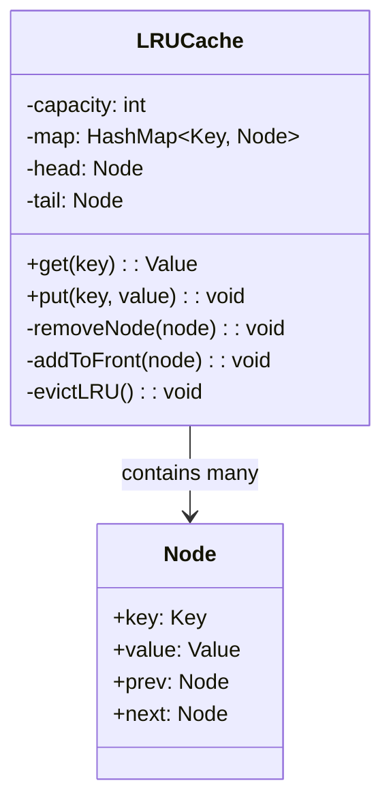

# LLD 01: Design an LRU Cache

## 💡 Quick Summary

> **What**: A fixed-size cache that evicts the Least Recently Used item when full.  
> **Key Insight**: Need O(1) for both `get` and `put`. Use a **HashMap + Doubly Linked List** combo. HashMap gives O(1) lookup; LinkedList gives O(1) removal/insertion for ordering.

---

## 🎯 The Problem in Simple Terms

You have space for only 3 items in cache:
1. Access A, B, C → Cache: [C, B, A] (most recent first)
2. Access B → Cache: [B, C, A] (B moved to front)
3. Access D (new!) → Cache full → evict A (least recent) → [D, B, C]

---

## 📋 Operations

| Operation | Time | Description |
|-----------|------|-------------|
| `get(key)` | O(1) | Return value, mark as recently used |
| `put(key, value)` | O(1) | Insert/update, evict LRU if full |

---

## 🏗️ Data Structure Design



---

## 🔍 How Operations Work

### GET (key exists)



### PUT (cache full, eviction needed)



---

## 🧩 Class Design



---

## 💻 Clean Implementation

```python
class Node:
    def __init__(self, key=0, value=0):
        self.key = key
        self.value = value
        self.prev = None
        self.next = None

class LRUCache:
    def __init__(self, capacity: int):
        self.capacity = capacity
        self.map = {}  # key → Node
        
        # Dummy head and tail (simplifies edge cases)
        self.head = Node()
        self.tail = Node()
        self.head.next = self.tail
        self.tail.prev = self.head
    
    def get(self, key: int) -> int:
        if key not in self.map:
            return -1
        node = self.map[key]
        self._move_to_front(node)
        return node.value
    
    def put(self, key: int, value: int) -> None:
        if key in self.map:
            node = self.map[key]
            node.value = value
            self._move_to_front(node)
        else:
            if len(self.map) >= self.capacity:
                self._evict()
            node = Node(key, value)
            self.map[key] = node
            self._add_to_front(node)
    
    def _add_to_front(self, node):
        node.prev = self.head
        node.next = self.head.next
        self.head.next.prev = node
        self.head.next = node
    
    def _remove(self, node):
        node.prev.next = node.next
        node.next.prev = node.prev
    
    def _move_to_front(self, node):
        self._remove(node)
        self._add_to_front(node)
    
    def _evict(self):
        lru = self.tail.prev  # Least recently used
        self._remove(lru)
        del self.map[lru.key]
```

---

## 🎯 Why This Design Works

| Requirement | How It's Met |
|-------------|--------------|
| O(1) get | HashMap direct lookup |
| O(1) put | HashMap insert + linked list insert at head |
| O(1) eviction | Tail.prev is always the LRU item |
| O(1) reorder | Doubly linked list: remove + add to front |
| Dummy head/tail | Eliminates null checks at boundaries |

---

## 🔄 Variations & Follow-ups

| Variation | Change |
|-----------|--------|
| LFU Cache (Least Frequently Used) | Track access count; evict lowest frequency |
| Thread-safe LRU | Add lock around operations (or use ConcurrentHashMap + lock striping) |
| TTL-based expiry | Add timestamp to node; lazy eviction on access |
| Distributed LRU | Shard by key hash across multiple LRU caches |
