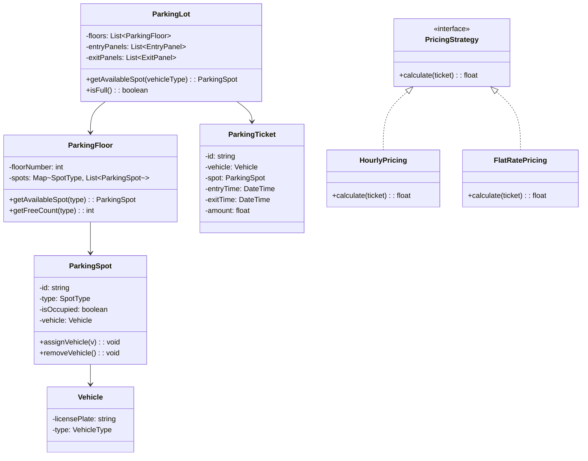
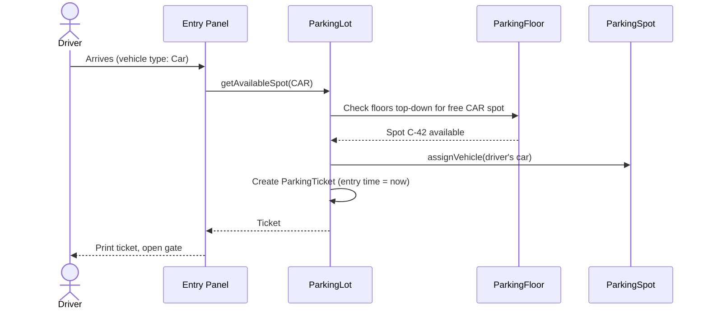
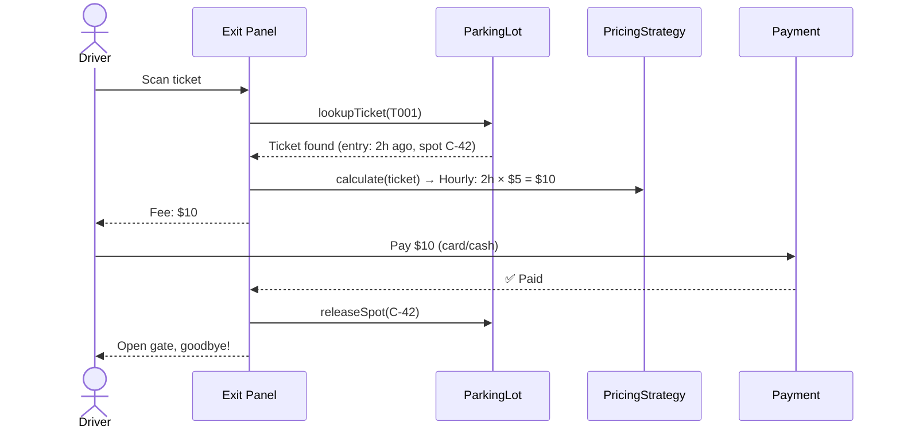
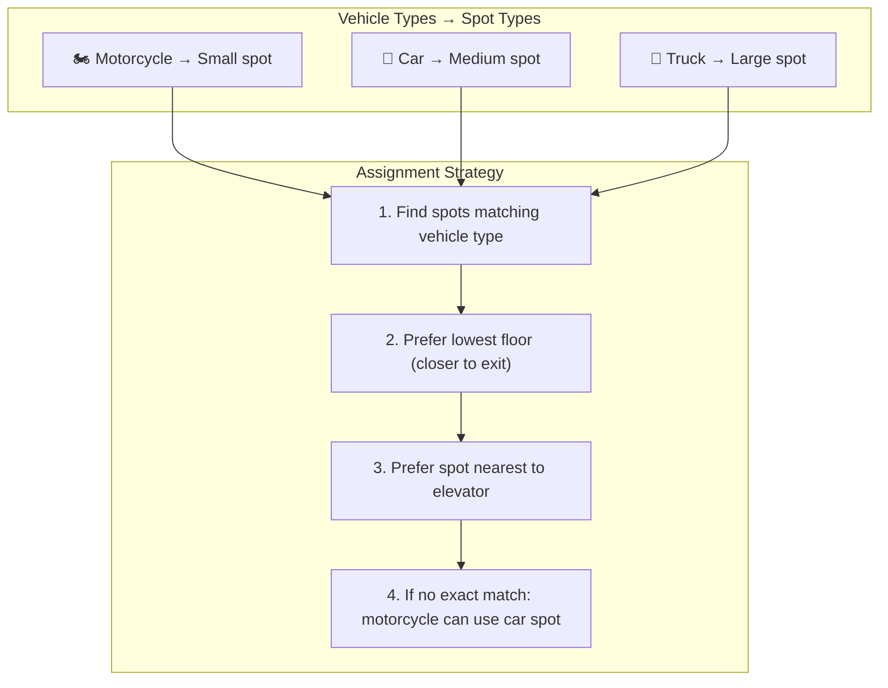

# LLD 02: Design a Parking Lot System

## 💡 Quick Summary

> **What**: An object-oriented system managing parking spots, vehicle entry/exit, and fee calculation.  
> **Key Insight**: Use **Strategy Pattern** for pricing, **Factory Pattern** for ticket creation, and proper class hierarchy for different vehicle/spot types.

---

## 🎯 The Problem in Simple Terms

A multi-floor parking lot needs to:
- Track which spots are available (by size: motorcycle, car, truck)
- Assign the nearest/best spot when a vehicle enters
- Calculate fees based on duration when vehicle exits
- Handle multiple entry/exit points concurrently

---

## 🏗️ Class Design



---

## 🔍 Entry & Exit Flow





---

## 🔄 Spot Assignment Strategy



---

## 🧩 Design Patterns Used

| Pattern | Where | Why |
|---------|-------|-----|
| **Strategy** | PricingStrategy | Swap pricing logic (hourly, flat, weekend) without changing core |
| **Singleton** | ParkingLot | Only one instance manages the lot |
| **Factory** | TicketFactory | Create tickets with auto-generated IDs |
| **Observer** | Display boards | Notify boards when spot count changes |

---

## 💻 Key Implementation

```python
from enum import Enum
from datetime import datetime

class VehicleType(Enum):
    MOTORCYCLE = 1
    CAR = 2
    TRUCK = 3

class SpotType(Enum):
    SMALL = 1
    MEDIUM = 2
    LARGE = 3

VEHICLE_TO_SPOT = {
    VehicleType.MOTORCYCLE: SpotType.SMALL,
    VehicleType.CAR: SpotType.MEDIUM,
    VehicleType.TRUCK: SpotType.LARGE,
}

class ParkingSpot:
    def __init__(self, spot_id, spot_type):
        self.id = spot_id
        self.type = spot_type
        self.vehicle = None
    
    @property
    def is_free(self):
        return self.vehicle is None
    
    def assign(self, vehicle):
        self.vehicle = vehicle
    
    def release(self):
        self.vehicle = None

class ParkingLot:
    def __init__(self, floors):
        self.floors = floors  # List[ParkingFloor]
        self.tickets = {}     # ticket_id → ParkingTicket
        self.pricing = HourlyPricing()
    
    def enter(self, vehicle):
        spot = self._find_spot(vehicle.type)
        if not spot:
            raise Exception("Lot is full for this vehicle type")
        spot.assign(vehicle)
        ticket = ParkingTicket(vehicle, spot)
        self.tickets[ticket.id] = ticket
        return ticket
    
    def exit(self, ticket_id):
        ticket = self.tickets[ticket_id]
        ticket.exit_time = datetime.now()
        fee = self.pricing.calculate(ticket)
        ticket.spot.release()
        del self.tickets[ticket_id]
        return fee
    
    def _find_spot(self, vehicle_type):
        needed = VEHICLE_TO_SPOT[vehicle_type]
        for floor in self.floors:
            spot = floor.get_free_spot(needed)
            if spot:
                return spot
        return None

class HourlyPricing:
    RATES = {SpotType.SMALL: 2, SpotType.MEDIUM: 5, SpotType.LARGE: 10}
    
    def calculate(self, ticket):
        hours = (ticket.exit_time - ticket.entry_time).total_seconds() / 3600
        hours = max(1, int(hours) + (1 if hours % 1 > 0 else 0))  # Round up
        return hours * self.RATES[ticket.spot.type]
```

---

## 📊 Concurrency Considerations

| Scenario | Solution |
|----------|----------|
| Two cars arrive simultaneously, one spot left | Lock on spot assignment (synchronized/mutex) |
| Display board shows stale count | Observer pattern: update on every assign/release |
| Multiple exit panels processing | Each ticket processed independently (no shared state) |
