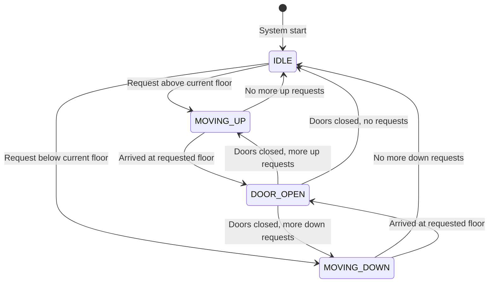
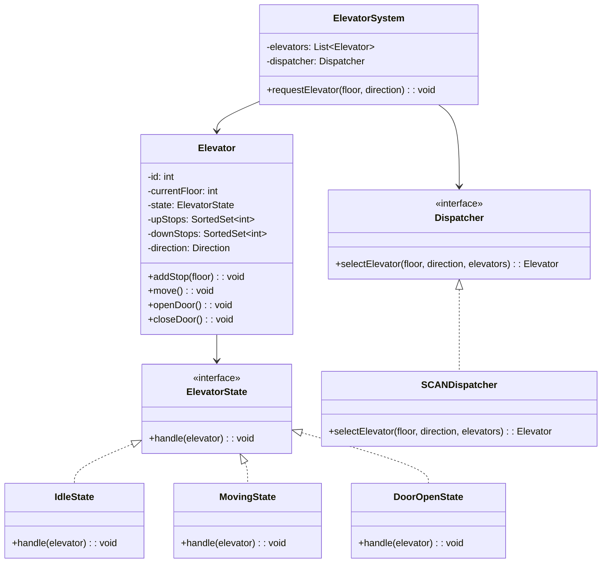
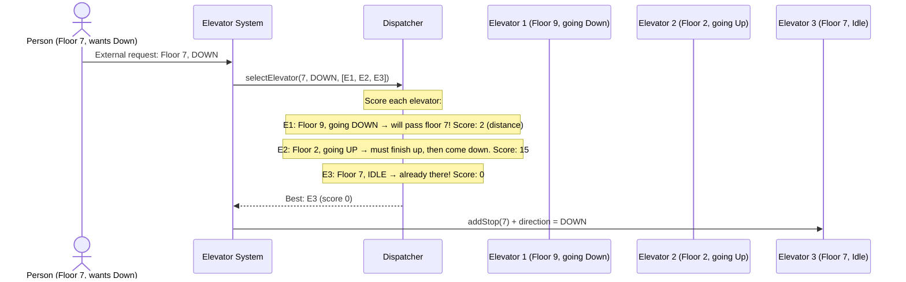
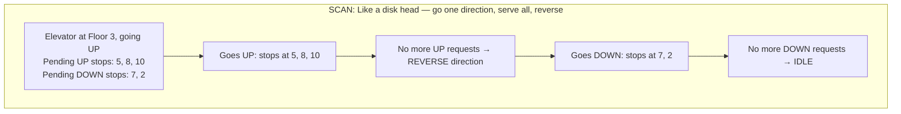

# LLD 03: Design an Elevator System

## 💡 Quick Summary

> **What**: A multi-elevator system that efficiently schedules and dispatches elevators to serve floor requests.  
> **Key Insight**: The scheduling algorithm is the core challenge. Use **State Pattern** for elevator states and **Strategy Pattern** for dispatching. SCAN (elevator) algorithm moves in one direction, serving all requests, then reverses.

---

## 🎯 The Problem in Simple Terms

Building with 10 floors, 3 elevators. Person on floor 7 presses "Down":
- Which elevator should respond? (the one closest moving in that direction)
- How to minimize wait time for all passengers?
- How to handle conflicting requests efficiently?

---

## 🔄 Elevator State Machine



---

## 🏗️ Class Design



---

## 🔍 Dispatching: How to Choose Which Elevator



---

## 📋 SCAN Algorithm (Elevator Algorithm)



---

## 💻 Core Implementation

```python
from enum import Enum
from sortedcontainers import SortedList

class Direction(Enum):
    UP = 1
    DOWN = -1
    IDLE = 0

class Elevator:
    def __init__(self, elevator_id, total_floors):
        self.id = elevator_id
        self.current_floor = 1
        self.direction = Direction.IDLE
        self.up_stops = SortedList()    # Floors to visit going up
        self.down_stops = SortedList()  # Floors to visit going down
    
    def add_stop(self, floor):
        if floor > self.current_floor:
            self.up_stops.add(floor)
        elif floor < self.current_floor:
            self.down_stops.add(floor)
        # If already at floor, open doors
    
    def move(self):
        """Called each time step — moves one floor."""
        if self.direction == Direction.UP:
            if self.up_stops:
                self.current_floor += 1
                if self.current_floor in self.up_stops:
                    self.up_stops.remove(self.current_floor)
                    self.open_doors()
                if not self.up_stops:
                    self.direction = Direction.DOWN if self.down_stops else Direction.IDLE
            
        elif self.direction == Direction.DOWN:
            if self.down_stops:
                self.current_floor -= 1
                if self.current_floor in self.down_stops:
                    self.down_stops.remove(self.current_floor)
                    self.open_doors()
                if not self.down_stops:
                    self.direction = Direction.UP if self.up_stops else Direction.IDLE

class SCANDispatcher:
    def select(self, floor, direction, elevators):
        best = None
        best_score = float('inf')
        for elevator in elevators:
            score = self._score(elevator, floor, direction)
            if score < best_score:
                best_score = score
                best = elevator
        return best
    
    def _score(self, elevator, floor, direction):
        # Already at floor and idle
        if elevator.current_floor == floor and elevator.direction == Direction.IDLE:
            return 0
        # Moving toward the floor in same direction
        if elevator.direction == direction:
            if direction == Direction.UP and elevator.current_floor <= floor:
                return floor - elevator.current_floor
            if direction == Direction.DOWN and elevator.current_floor >= floor:
                return elevator.current_floor - floor
        # Idle elevator — just distance
        if elevator.direction == Direction.IDLE:
            return abs(elevator.current_floor - floor)
        # Moving away — high cost
        return 1000 + abs(elevator.current_floor - floor)
```

---

## 🧩 Design Patterns Used

| Pattern | Where | Why |
|---------|-------|-----|
| **State** | Elevator states (Idle, Moving, DoorOpen) | Clean transitions; each state knows what to do next |
| **Strategy** | Dispatcher algorithm | Swap SCAN/LOOK/nearest-first without changing Elevator |
| **Observer** | Floor display panels | Update "Elevator arriving" indicators |
| **Singleton** | ElevatorSystem | One controller manages all elevators |

---

## 📊 Key Design Decisions

| Decision | Choice | Why |
|----------|--------|-----|
| Scheduling | SCAN (elevator algorithm) | Fair; prevents starvation; efficient direction changes |
| Internal vs External requests | Two queues (upStops, downStops) | Natural fit for SCAN; easy to reason about |
| Multiple elevators | Central dispatcher picks best | Global optimization > per-elevator decisions |
| Door timing | Timer-based auto-close (3-5 seconds) | Safety; don't hold up other passengers |
| Overweight | Elevator doesn't accept new stops when full | Sensor-based; skip floor pickup, still serve internal |
