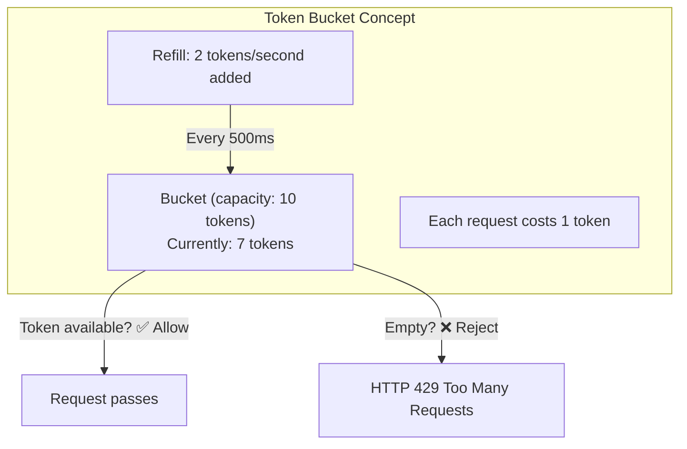
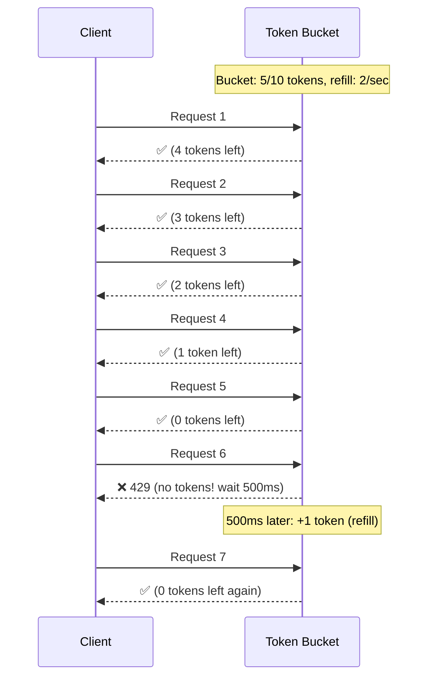
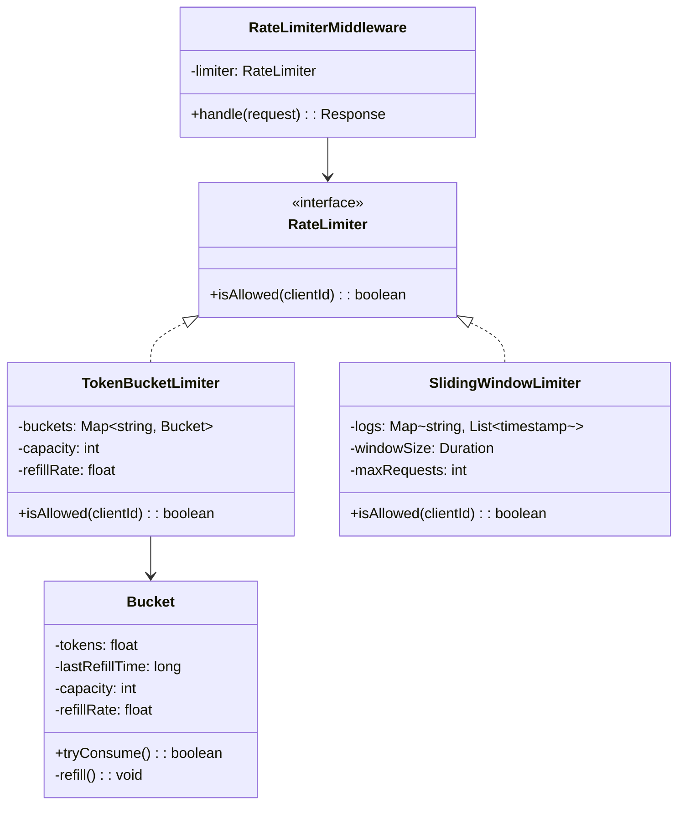
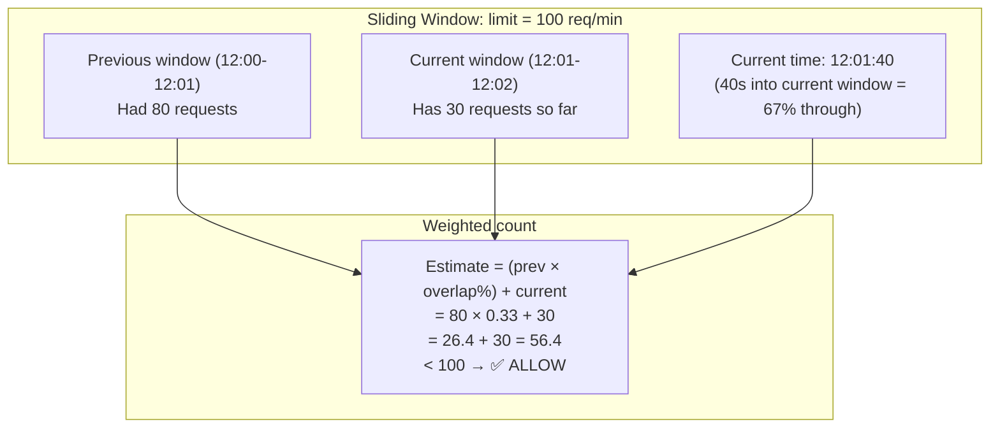
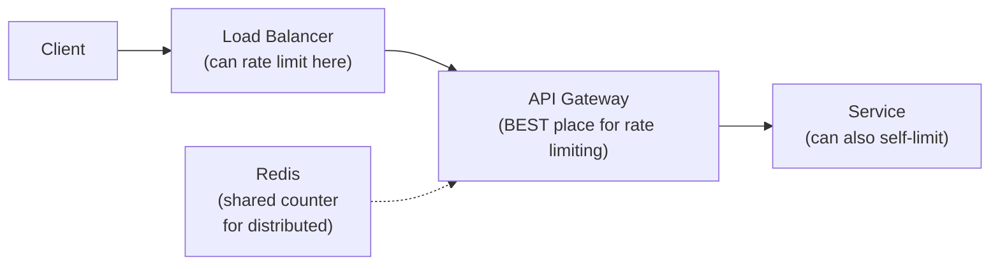

# LLD 04: Design a Rate Limiter

## 💡 Quick Summary

> **What**: A component that limits how many requests a client can make in a time window.  
> **Key Insight**: Multiple algorithms exist with different trade-offs. **Token Bucket** (bursty traffic allowed) and **Sliding Window** (smooth limiting) are the two most common in production.

---

## 🎯 Algorithms Compared

| Algorithm | Behavior | Best For |
|-----------|----------|----------|
| Token Bucket | Allows bursts up to bucket size | APIs (allow short bursts) |
| Leaky Bucket | Fixed rate output regardless of input | Smoothing traffic |
| Fixed Window | Count per fixed time window | Simple use cases |
| Sliding Window Log | Exact count in rolling window | Precision-critical |
| Sliding Window Counter | Approximation (weighted) | Memory-efficient |

---

## 🪣 Token Bucket (Most Common)





---

## 🏗️ Class Design



---

## 💻 Token Bucket Implementation

```python
import time

class TokenBucket:
    def __init__(self, capacity, refill_rate):
        self.capacity = capacity
        self.tokens = capacity
        self.refill_rate = refill_rate  # tokens per second
        self.last_refill = time.time()
    
    def try_consume(self) -> bool:
        self._refill()
        if self.tokens >= 1:
            self.tokens -= 1
            return True
        return False
    
    def _refill(self):
        now = time.time()
        elapsed = now - self.last_refill
        new_tokens = elapsed * self.refill_rate
        self.tokens = min(self.capacity, self.tokens + new_tokens)
        self.last_refill = now

class RateLimiter:
    def __init__(self, capacity=10, refill_rate=2):
        self.buckets = {}  # client_id → TokenBucket
        self.capacity = capacity
        self.refill_rate = refill_rate
    
    def is_allowed(self, client_id: str) -> bool:
        if client_id not in self.buckets:
            self.buckets[client_id] = TokenBucket(self.capacity, self.refill_rate)
        return self.buckets[client_id].try_consume()
```

---

## 📐 Sliding Window Counter (Memory-Efficient)



---

## 🧩 Where to Place the Rate Limiter



---

## 📊 Algorithm Trade-offs

| Algorithm | Pros | Cons |
|-----------|------|------|
| Token Bucket | Allows bursts; simple; memory-efficient | Burst can overwhelm downstream momentarily |
| Sliding Window Log | Exact; no approximation | Memory-heavy (stores every timestamp) |
| Sliding Window Counter | Good approximation; low memory | ~1% inaccuracy at window boundaries |
| Fixed Window | Simplest | Burst at window boundary (2x limit possible) |
| Leaky Bucket | Smooth output rate | No burst tolerance; queue management |

---

## 🔄 Distributed Rate Limiting (Redis-based)

```python
# Redis + Lua script for atomic token bucket
LUA_SCRIPT = """
local key = KEYS[1]
local capacity = tonumber(ARGV[1])
local refill_rate = tonumber(ARGV[2])
local now = tonumber(ARGV[3])

local data = redis.call('HMGET', key, 'tokens', 'last_refill')
local tokens = tonumber(data[1]) or capacity
local last_refill = tonumber(data[2]) or now

-- Refill
local elapsed = now - last_refill
tokens = math.min(capacity, tokens + elapsed * refill_rate)

-- Try consume
if tokens >= 1 then
    tokens = tokens - 1
    redis.call('HMSET', key, 'tokens', tokens, 'last_refill', now)
    redis.call('EXPIRE', key, 60)
    return 1  -- allowed
else
    redis.call('HMSET', key, 'tokens', tokens, 'last_refill', now)
    return 0  -- denied
end
"""
```

**Why Lua script?** Atomic execution in Redis — no race conditions between read and write.
