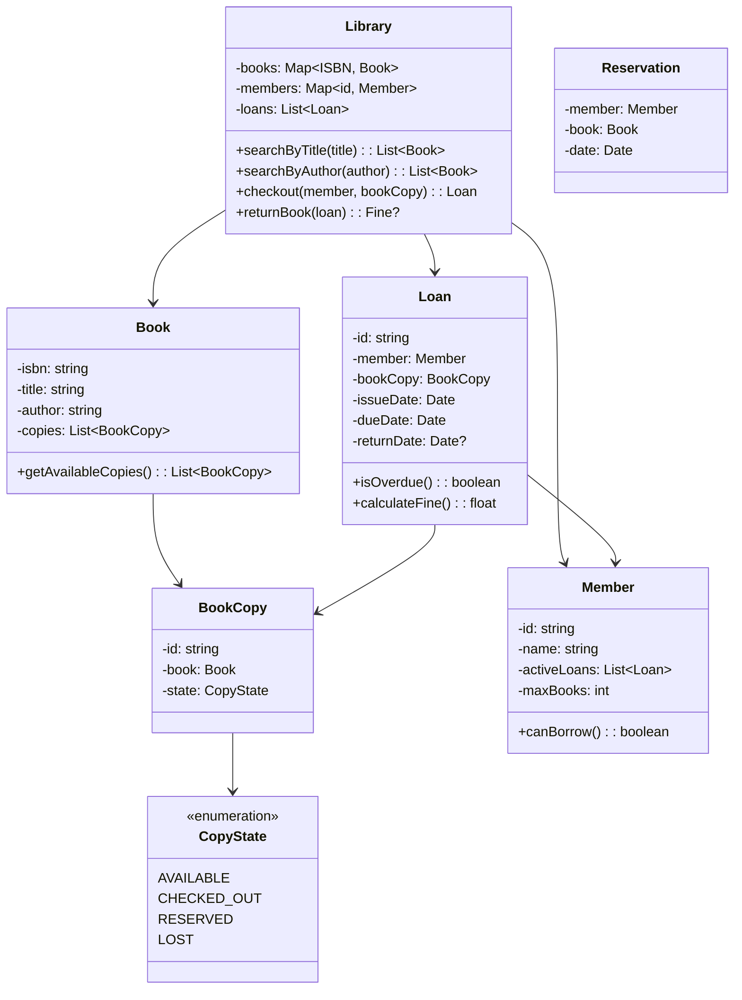
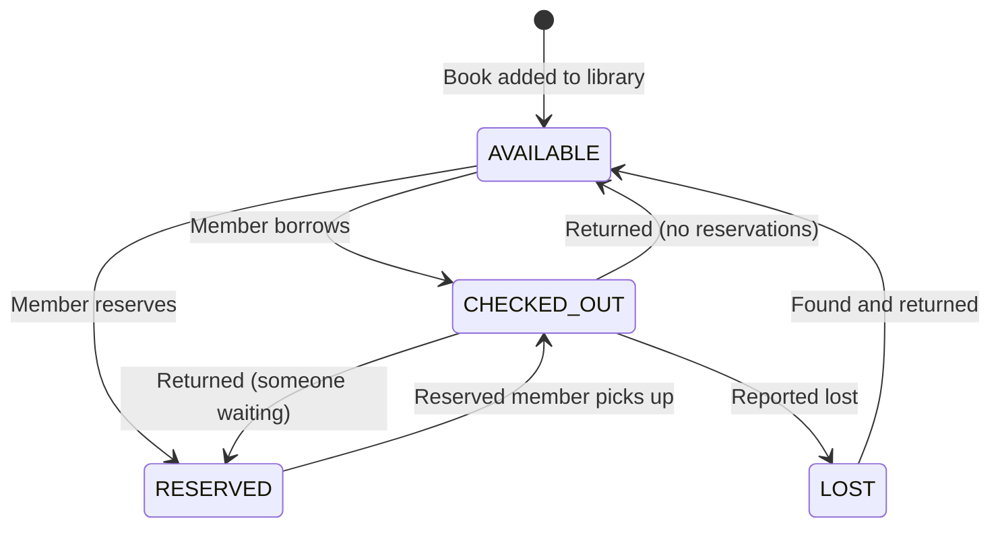
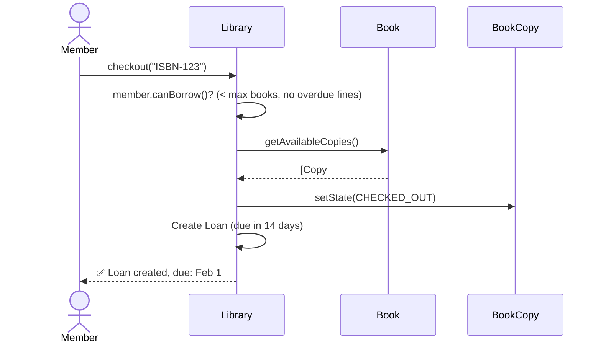

# LLD 05: Design a Library Management System

## 💡 Quick Summary

> **What**: A system managing books, members, borrowing/returning, fines, and reservations.  
> **Key Insight**: Classic OOP exercise. Key patterns: **State Pattern** for book copy states, **Observer** for notifications, and proper separation between Book (metadata) and BookCopy (physical item).

---

## 🏗️ Class Design



---

## 🔄 Book Copy State Machine



---

## 🔍 Checkout Flow



---

## 💻 Core Implementation

```python
from datetime import date, timedelta
from enum import Enum

class CopyState(Enum):
    AVAILABLE = "available"
    CHECKED_OUT = "checked_out"
    RESERVED = "reserved"
    LOST = "lost"

class BookCopy:
    def __init__(self, copy_id, book):
        self.id = copy_id
        self.book = book
        self.state = CopyState.AVAILABLE

class Member:
    MAX_BOOKS = 5
    
    def __init__(self, member_id, name):
        self.id = member_id
        self.name = name
        self.active_loans = []
    
    def can_borrow(self):
        return len(self.active_loans) < self.MAX_BOOKS

class Loan:
    FINE_PER_DAY = 0.50
    LOAN_PERIOD = 14  # days
    
    def __init__(self, member, book_copy):
        self.member = member
        self.book_copy = book_copy
        self.issue_date = date.today()
        self.due_date = date.today() + timedelta(days=self.LOAN_PERIOD)
        self.return_date = None
    
    def is_overdue(self):
        check_date = self.return_date or date.today()
        return check_date > self.due_date
    
    def calculate_fine(self):
        if not self.is_overdue():
            return 0
        check_date = self.return_date or date.today()
        overdue_days = (check_date - self.due_date).days
        return overdue_days * self.FINE_PER_DAY

class Library:
    def checkout(self, member, isbn):
        if not member.can_borrow():
            raise Exception("Borrow limit reached or outstanding fines")
        
        book = self.books[isbn]
        available = [c for c in book.copies if c.state == CopyState.AVAILABLE]
        if not available:
            raise Exception("No copies available")
        
        copy = available[0]
        copy.state = CopyState.CHECKED_OUT
        loan = Loan(member, copy)
        member.active_loans.append(loan)
        self.loans.append(loan)
        return loan
    
    def return_book(self, loan):
        loan.return_date = date.today()
        loan.member.active_loans.remove(loan)
        fine = loan.calculate_fine()
        
        # Check if someone reserved this book
        reservation = self._find_reservation(loan.book_copy.book)
        if reservation:
            loan.book_copy.state = CopyState.RESERVED
            self._notify(reservation.member, "Your reserved book is ready!")
        else:
            loan.book_copy.state = CopyState.AVAILABLE
        
        return fine
```

---

## 🧩 Design Patterns

| Pattern | Where | Why |
|---------|-------|-----|
| **State** | BookCopy states | Valid transitions enforced; behavior per state |
| **Observer** | Reservation notifications | Notify member when reserved book returned |
| **Strategy** | Fine calculation | Different policies (student vs regular) |
| **Repository** | BookRepository, MemberRepository | Separate data access from business logic |
