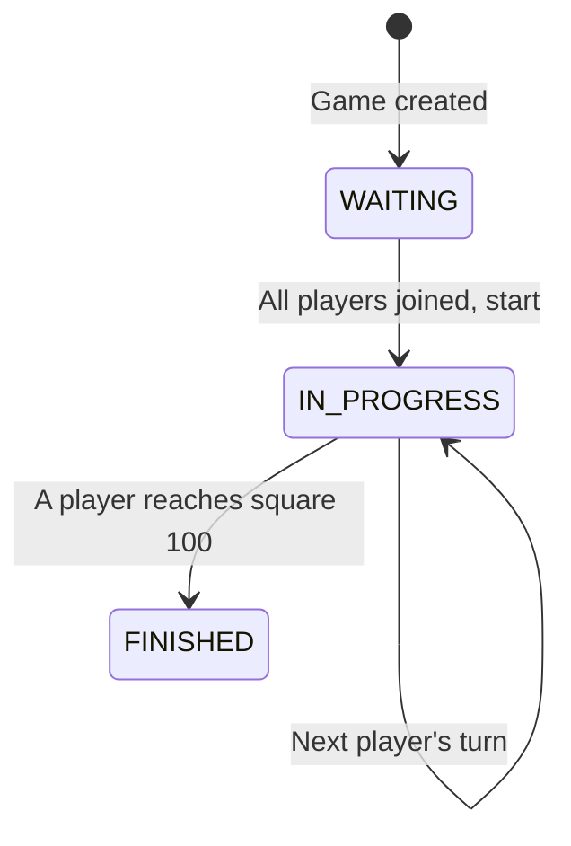
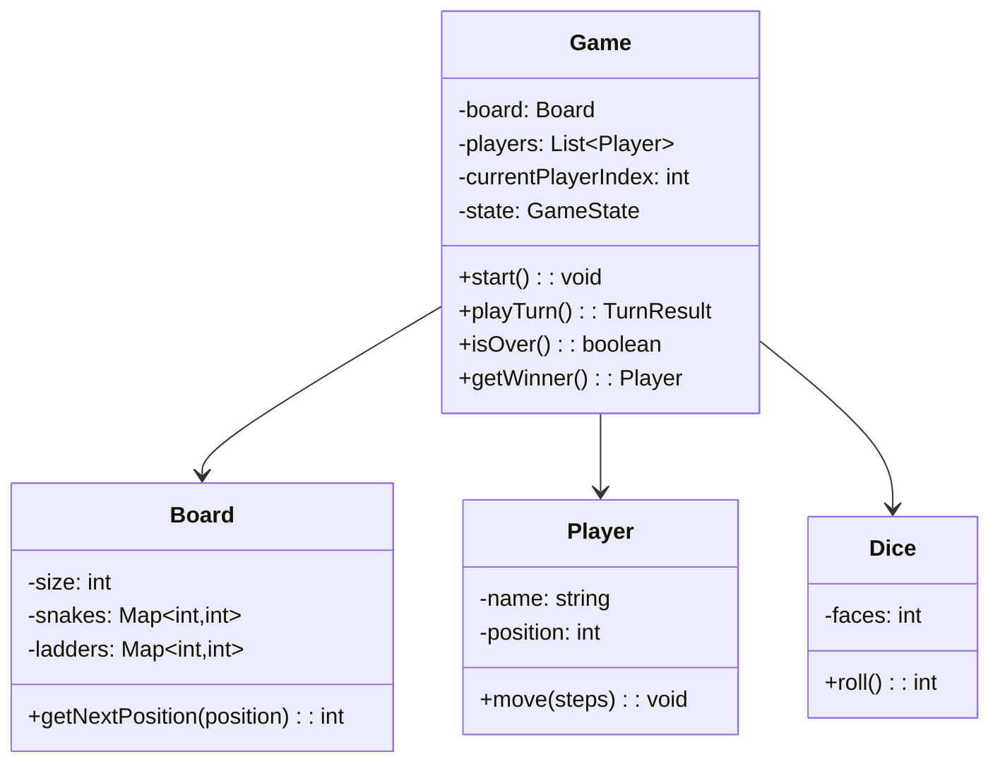
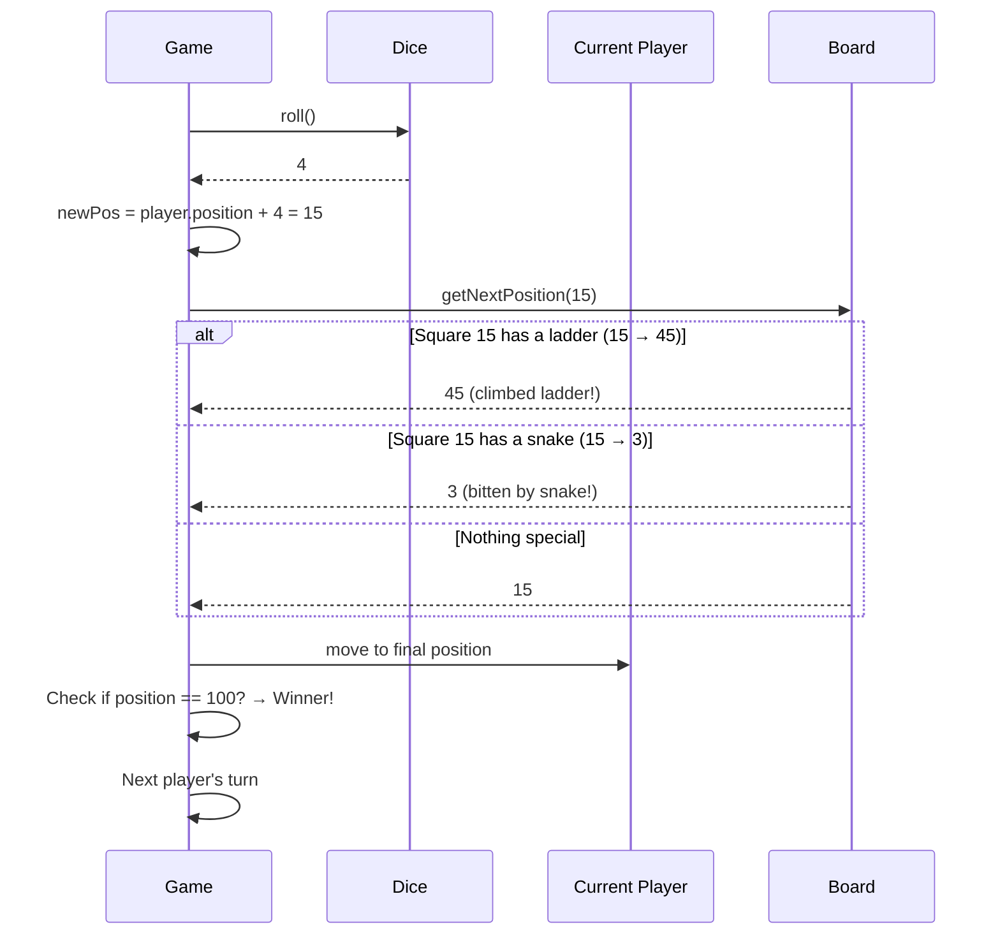

# LLD 06: Design Snake and Ladder

## 💡 Quick Summary

> **What**: A multiplayer board game where players roll dice and move across a grid, with snakes (go down) and ladders (go up).  
> **Key Insight**: Clean separation of concerns: Board (configuration), Game (flow control), Player (state). The game loop is a simple state machine.

---

## 🔄 Game State Machine



---

## 🏗️ Class Design



---

## 🔍 Turn Flow



---

## 💻 Implementation

```python
import random

class Dice:
    def __init__(self, faces=6):
        self.faces = faces
    
    def roll(self):
        return random.randint(1, self.faces)

class Board:
    def __init__(self, size=100):
        self.size = size
        self.snakes = {}   # head → tail (go down)
        self.ladders = {}  # bottom → top (go up)
    
    def add_snake(self, head, tail):
        self.snakes[head] = tail
    
    def add_ladder(self, bottom, top):
        self.ladders[bottom] = top
    
    def get_next_position(self, position):
        if position in self.snakes:
            return self.snakes[position]
        if position in self.ladders:
            return self.ladders[position]
        return position

class Player:
    def __init__(self, name):
        self.name = name
        self.position = 0

class Game:
    def __init__(self, board, players):
        self.board = board
        self.players = players
        self.dice = Dice()
        self.current = 0
        self.winner = None
    
    def play_turn(self):
        player = self.players[self.current]
        roll = self.dice.roll()
        new_pos = player.position + roll
        
        if new_pos > self.board.size:
            # Can't move beyond 100 — stay in place
            pass
        else:
            new_pos = self.board.get_next_position(new_pos)
            player.position = new_pos
            if new_pos == self.board.size:
                self.winner = player
                return
        
        self.current = (self.current + 1) % len(self.players)
    
    def play(self):
        while not self.winner:
            self.play_turn()
        return self.winner
```

---

## 🧩 Design Decisions

| Decision | Choice | Why |
|----------|--------|-----|
| Snakes & Ladders storage | Map (position → destination) | O(1) lookup per move |
| Overshoot rule | Stay in place if roll > remaining | Standard game rule |
| Turn management | Circular index | Simple, fair rotation |
| Board configuration | Injected at construction | Different boards without changing game logic |
