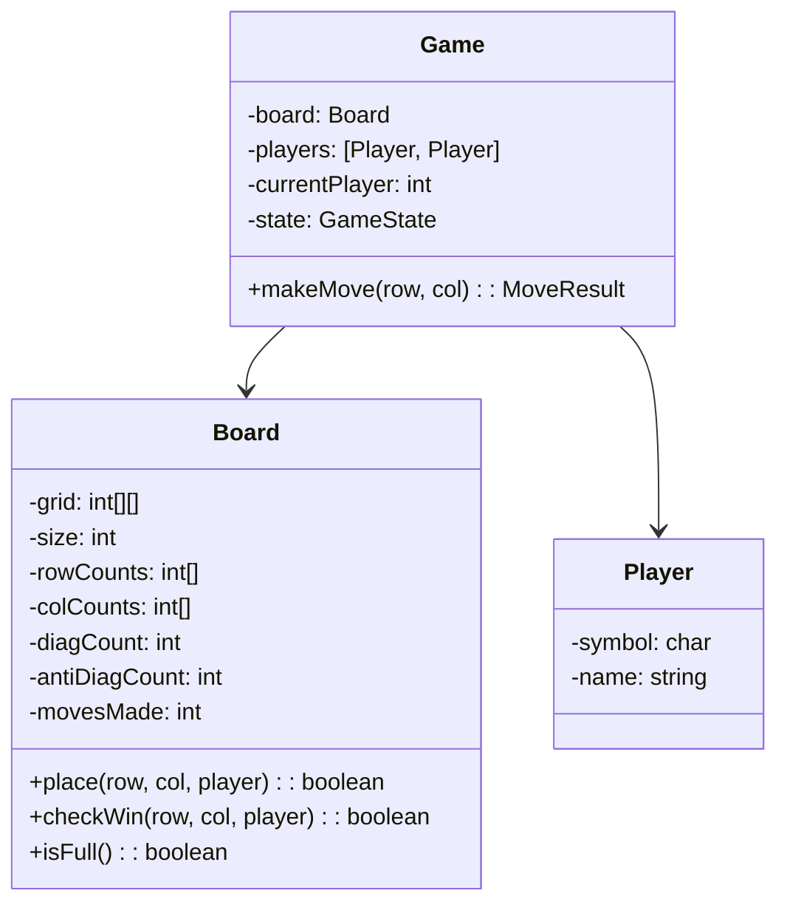
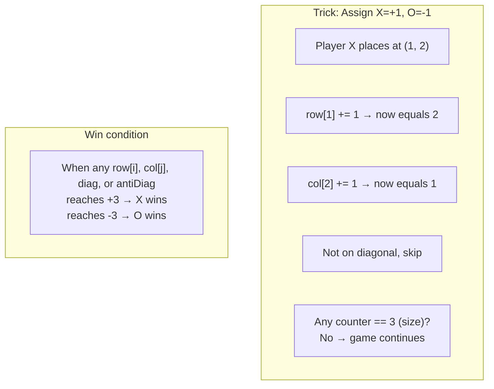

# LLD 07: Design Tic-Tac-Toe

## 💡 Quick Summary

> **What**: A two-player board game (3×3 grid) with O(1) win-checking using row/column/diagonal counters.  
> **Key Insight**: Don't scan the entire board after each move! Track sums per row, column, and diagonal. A player wins when any counter reaches N (board size).

---

## 🏗️ Class Design



---

## ⚡ O(1) Win Detection



---

## 💻 Implementation

```python
class Board:
    def __init__(self, size=3):
        self.size = size
        self.grid = [[None] * size for _ in range(size)]
        self.rows = [0] * size
        self.cols = [0] * size
        self.diag = 0
        self.anti_diag = 0
        self.moves = 0
    
    def place(self, row, col, player_value):  # player_value: +1 or -1
        if self.grid[row][col] is not None:
            return False  # Already occupied
        
        self.grid[row][col] = player_value
        self.rows[row] += player_value
        self.cols[col] += player_value
        if row == col:
            self.diag += player_value
        if row + col == self.size - 1:
            self.anti_diag += player_value
        self.moves += 1
        return True
    
    def check_win(self, row, col):
        n = self.size
        return (abs(self.rows[row]) == n or
                abs(self.cols[col]) == n or
                abs(self.diag) == n or
                abs(self.anti_diag) == n)
    
    def is_full(self):
        return self.moves == self.size * self.size

class TicTacToe:
    def __init__(self):
        self.board = Board()
        self.current = 1  # +1 for X, -1 for O
    
    def make_move(self, row, col):
        if not self.board.place(row, col, self.current):
            return "INVALID"
        if self.board.check_win(row, col):
            return f"{'X' if self.current == 1 else 'O'} WINS!"
        if self.board.is_full():
            return "DRAW"
        self.current *= -1  # Switch player
        return "CONTINUE"
```

---

## 🧩 Key Design Decisions

| Decision | Choice | Why |
|----------|--------|-----|
| Win check | O(1) with counters | O(N²) scan per move is wasteful |
| Player encoding | +1 / -1 integers | Sum-based detection; elegant math |
| Board size | Configurable N | Works for 3×3, 4×4, NxN |
| Input validation | Check occupancy before placing | Prevent invalid moves |
