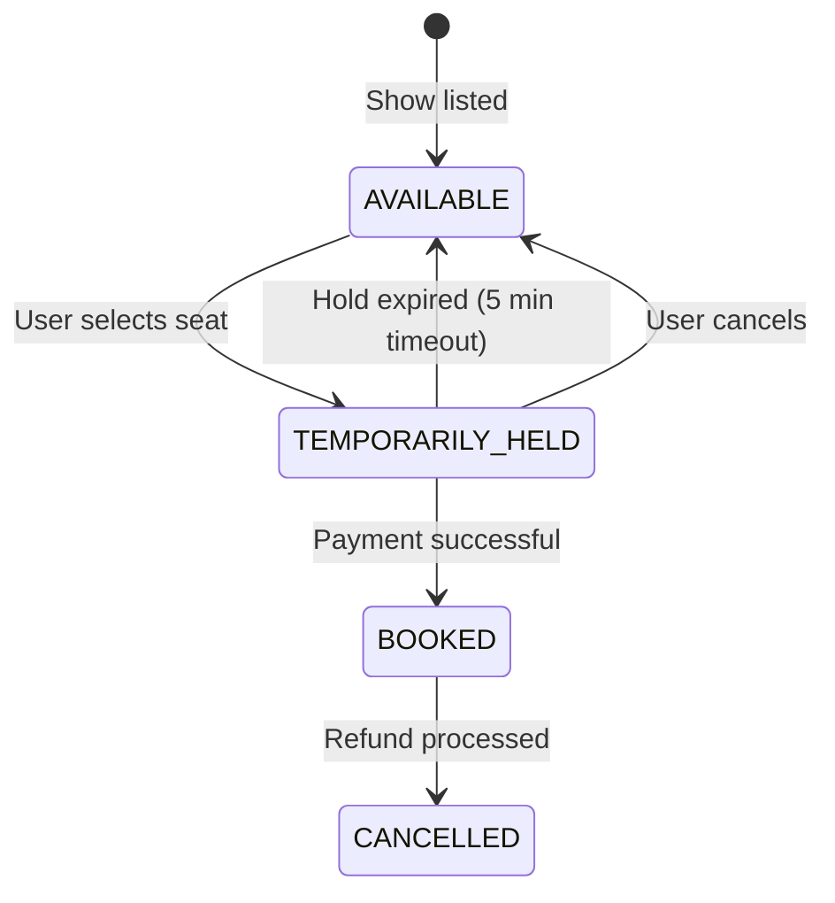
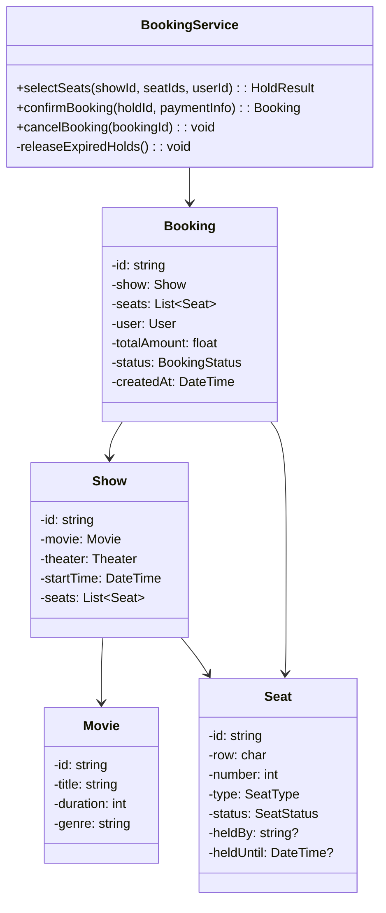

# LLD 08: Design an Online Booking System (Movie Tickets)

## 💡 Quick Summary

> **What**: A system for browsing movies, selecting seats, and booking tickets with payment — handling concurrent seat selection.  
> **Key Insight**: The **seat locking** problem is critical. When Alice selects seat A5, it must be temporarily held (5 min) so Bob can't book it simultaneously. Use optimistic locking or temporary reservations with expiry.

---

## 🔄 Booking State Machine



---

## 🏗️ Class Design



---

## 🔍 Booking Flow (Handling Concurrency)

```mermaid
sequenceDiagram
    actor Alice
    actor Bob
    participant API as Booking Service
    participant DB as Database
    participant Timer as Expiry Timer

    Alice->>API: Select seats [A5, A6] for Show #7
    API->>DB: UPDATE seats SET status='HELD', held_by='alice', held_until=now+5min WHERE id IN (A5,A6) AND status='AVAILABLE'
    DB-->>API: ✅ 2 rows updated
    API-->>Alice: Seats held for 5 minutes. Proceed to payment.
    API->>Timer: Set expiry timer (5 min)
    
    Bob->>API: Select seat A5 for Show #7
    API->>DB: UPDATE seats WHERE id=A5 AND status='AVAILABLE'
    DB-->>API: ❌ 0 rows updated (already HELD)
    API-->>Bob: Seat A5 is unavailable. Choose another.
    
    Alice->>API: Pay (within 5 min)
    API->>DB: UPDATE seats SET status='BOOKED'; Create booking
    API-->>Alice: 🎉 Booking confirmed! Ticket #T001
    
    Note over Timer: If Alice hadn't paid in 5 min:<br/>Seats auto-released back to AVAILABLE
```

---

## 💻 Core Implementation

```python
from datetime import datetime, timedelta

class SeatStatus:
    AVAILABLE = "available"
    HELD = "held"
    BOOKED = "booked"

class BookingService:
    HOLD_DURATION = timedelta(minutes=5)
    
    def select_seats(self, show_id, seat_ids, user_id):
        """Atomically hold seats — returns hold_id or raises if unavailable."""
        # Atomic DB operation (WHERE status='available' prevents race conditions)
        updated = self.db.execute("""
            UPDATE seats 
            SET status = 'held', held_by = %s, held_until = %s
            WHERE show_id = %s AND id IN %s AND status = 'available'
        """, user_id, datetime.now() + self.HOLD_DURATION, show_id, seat_ids)
        
        if updated != len(seat_ids):
            # Some seats weren't available — rollback
            self.db.execute("UPDATE seats SET status='available' WHERE held_by=%s AND show_id=%s", user_id, show_id)
            raise SeatUnavailableError("One or more seats already taken")
        
        return HoldResult(user_id, seat_ids, expires=datetime.now() + self.HOLD_DURATION)
    
    def confirm_booking(self, user_id, show_id, payment_info):
        """Convert held seats to booked after payment."""
        # Verify hold is still valid
        held = self.db.query("SELECT * FROM seats WHERE held_by=%s AND show_id=%s AND held_until > NOW()", user_id, show_id)
        if not held:
            raise ExpiredHoldError("Hold expired, please select seats again")
        
        # Process payment
        payment = self.payment_service.charge(payment_info)
        
        # Finalize booking
        self.db.execute("UPDATE seats SET status='booked' WHERE held_by=%s AND show_id=%s", user_id, show_id)
        booking = Booking(user_id, show_id, held, payment.amount)
        return booking
    
    def release_expired_holds(self):
        """Background job: runs every minute."""
        self.db.execute("UPDATE seats SET status='available', held_by=NULL WHERE status='held' AND held_until < NOW()")
```

---

## 🧩 Design Patterns

| Pattern | Where | Why |
|---------|-------|-----|
| **State** | Seat status transitions | Clear valid transitions |
| **Optimistic Locking** | WHERE status='available' in UPDATE | Prevents double-booking without explicit locks |
| **Temporal Hold** | 5-minute seat reservation | Give time for payment without permanent locks |
| **Scheduled Task** | Expired hold cleanup | Release abandoned seats periodically |

---

## 📊 Key Decisions

| Decision | Choice | Why |
|----------|--------|-----|
| Concurrency | Atomic UPDATE with WHERE clause | DB handles race condition; no app-level locks needed |
| Hold expiry | 5 minutes | Enough for payment; not too long to block others |
| Seat selection | User picks specific seats | Better UX than random assignment for cinemas |
| Payment failure | Release seats immediately | Don't block seats for failed transactions |
