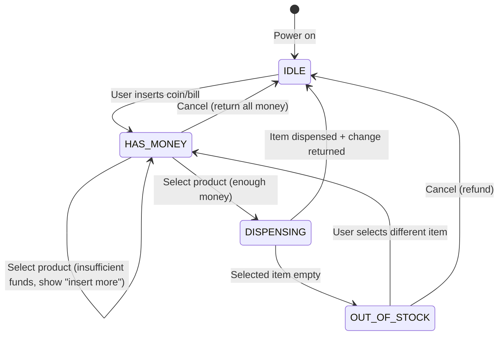
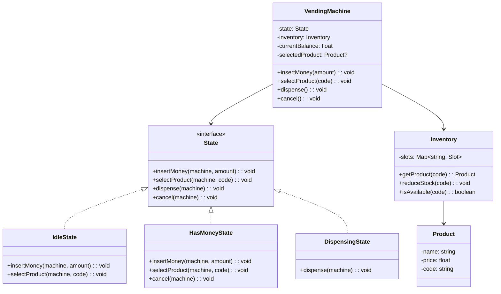
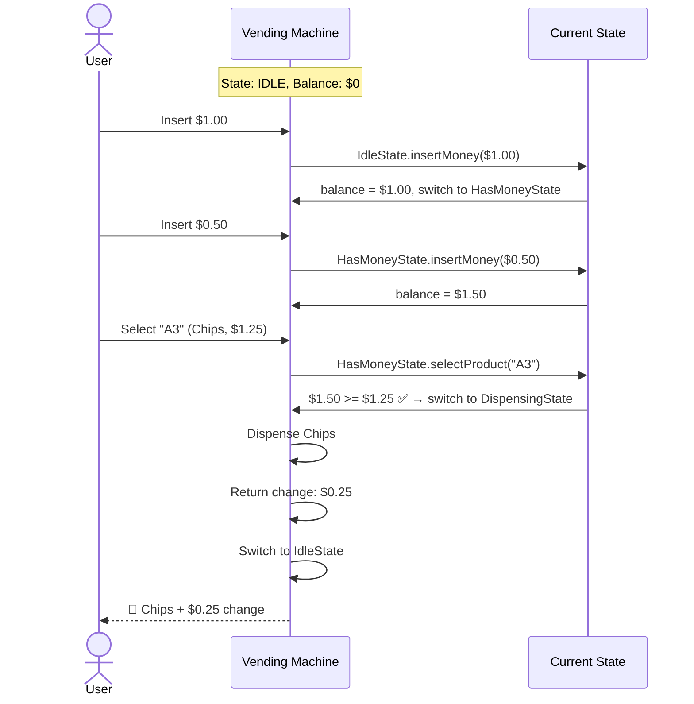

# LLD 09: Design a Vending Machine

## 💡 Quick Summary

> **What**: A vending machine that accepts money, lets users select products, dispenses items, and returns change.  
> **Key Insight**: Classic **State Pattern** example. The machine behavior changes entirely based on its state (idle, money inserted, dispensing). Each state handles the same inputs differently.

---

## 🔄 State Machine



---

## 🏗️ Class Design



---

## 🔍 Interaction Flow



---

## 💻 Implementation

```python
from abc import ABC, abstractmethod

class State(ABC):
    @abstractmethod
    def insert_money(self, machine, amount): pass
    @abstractmethod
    def select_product(self, machine, code): pass
    @abstractmethod
    def dispense(self, machine): pass
    @abstractmethod
    def cancel(self, machine): pass

class IdleState(State):
    def insert_money(self, machine, amount):
        machine.balance += amount
        machine.state = HasMoneyState()
        print(f"Balance: ${machine.balance:.2f}")
    
    def select_product(self, machine, code):
        print("Please insert money first")
    
    def dispense(self, machine):
        print("Please insert money and select a product")
    
    def cancel(self, machine):
        print("Nothing to cancel")

class HasMoneyState(State):
    def insert_money(self, machine, amount):
        machine.balance += amount
        print(f"Balance: ${machine.balance:.2f}")
    
    def select_product(self, machine, code):
        product = machine.inventory.get(code)
        if not product:
            print("Invalid code")
        elif not machine.inventory.is_available(code):
            print(f"{product.name} is out of stock")
        elif machine.balance < product.price:
            print(f"Insert ${product.price - machine.balance:.2f} more")
        else:
            machine.selected = product
            machine.state = DispensingState()
            machine.state.dispense(machine)
    
    def dispense(self, machine):
        print("Please select a product first")
    
    def cancel(self, machine):
        print(f"Returning ${machine.balance:.2f}")
        machine.balance = 0
        machine.state = IdleState()

class DispensingState(State):
    def dispense(self, machine):
        machine.inventory.reduce(machine.selected.code)
        change = machine.balance - machine.selected.price
        print(f"Dispensing: {machine.selected.name}")
        if change > 0:
            print(f"Change: ${change:.2f}")
        machine.balance = 0
        machine.selected = None
        machine.state = IdleState()
    
    def insert_money(self, machine, amount): print("Please wait...")
    def select_product(self, machine, code): print("Please wait...")
    def cancel(self, machine): print("Cannot cancel during dispense")

class VendingMachine:
    def __init__(self, inventory):
        self.inventory = inventory
        self.state = IdleState()
        self.balance = 0.0
        self.selected = None
    
    def insert_money(self, amount): self.state.insert_money(self, amount)
    def select_product(self, code): self.state.select_product(self, code)
    def cancel(self): self.state.cancel(self)
```

---

## 🧩 Why State Pattern Here?

| Without State Pattern | With State Pattern |
|---|---|
| Giant if/elif checking `self.current_state` everywhere | Each state class handles its own logic |
| Easy to miss a case | Compiler/linter catches missing methods |
| Adding new state = modify every method | Adding new state = one new class |
| Hard to test | Test each state independently |
