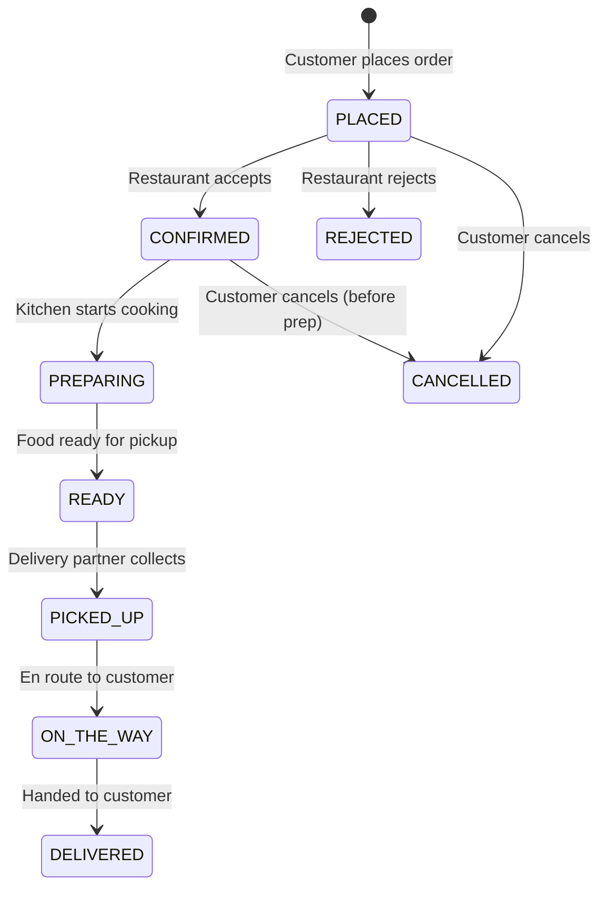
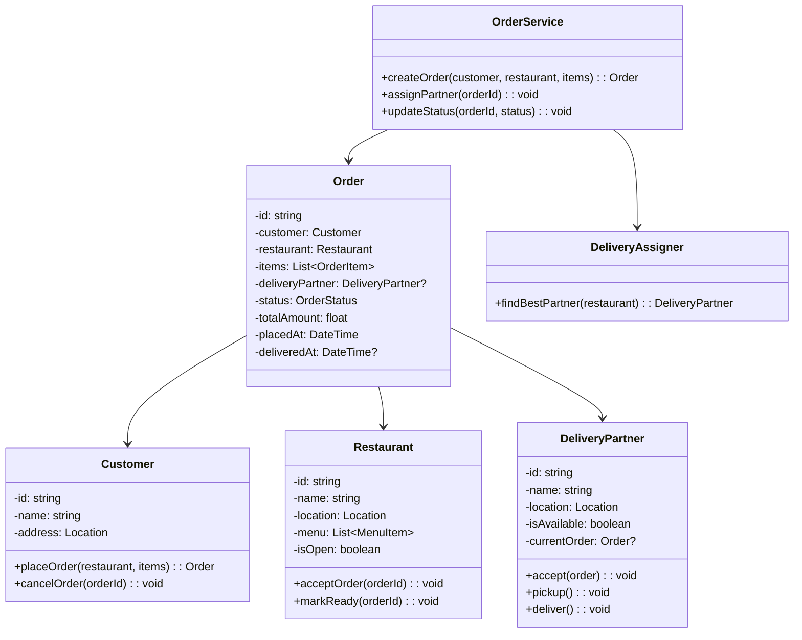
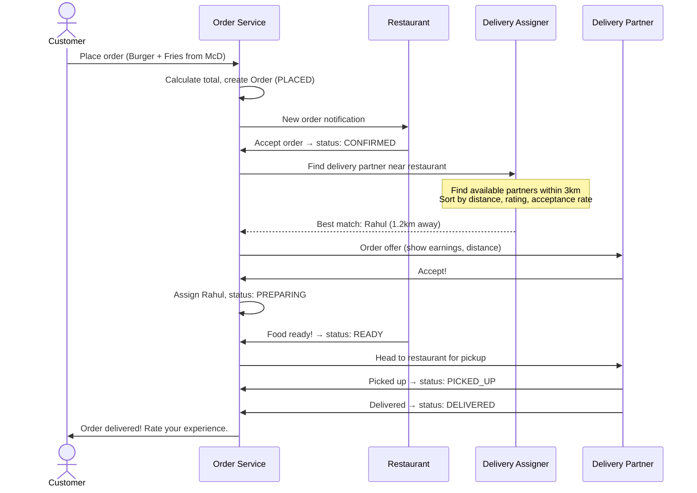
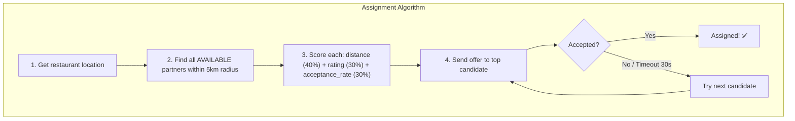

# LLD 10: Design a Food Delivery System (Swiggy/Zomato)

## 💡 Quick Summary

> **What**: A food ordering system connecting customers, restaurants, and delivery partners with order management, assignment, and tracking.  
> **Key Insight**: Three key challenges — (1) real-time delivery partner assignment (nearest available), (2) order state management across multiple actors, (3) ETA estimation considering prep time + travel time.

---

## 🔄 Order State Machine



---

## 🏗️ Class Design



---

## 🔍 Order Flow



---

## 🚗 Delivery Partner Assignment



---

## 💻 Core Implementation

```python
from enum import Enum
from datetime import datetime
import math

class OrderStatus(Enum):
    PLACED = "placed"
    CONFIRMED = "confirmed"
    PREPARING = "preparing"
    READY = "ready"
    PICKED_UP = "picked_up"
    DELIVERED = "delivered"
    CANCELLED = "cancelled"

class OrderService:
    def create_order(self, customer, restaurant, items):
        order = Order(customer=customer, restaurant=restaurant, items=items)
        order.status = OrderStatus.PLACED
        # Notify restaurant
        self.notify_restaurant(restaurant, order)
        return order
    
    def assign_partner(self, order):
        candidates = self.find_nearby_partners(
            location=order.restaurant.location, radius_km=5
        )
        candidates.sort(key=lambda p: self._score(p, order.restaurant))
        
        for partner in candidates:
            if self.send_offer(partner, order, timeout=30):
                order.delivery_partner = partner
                partner.is_available = False
                partner.current_order = order
                return partner
        
        raise NoPartnerAvailable("Retrying in 30 seconds...")
    
    def _score(self, partner, restaurant):
        distance = self._haversine(partner.location, restaurant.location)
        # Lower score = better (weighted combination)
        return distance * 0.4 + (5 - partner.rating) * 0.3 + (1 - partner.acceptance_rate) * 0.3

class ETACalculator:
    def estimate(self, order):
        prep_time = order.restaurant.avg_prep_time  # e.g., 15 min
        pickup_travel = self._travel_time(order.delivery_partner.location, order.restaurant.location)
        delivery_travel = self._travel_time(order.restaurant.location, order.customer.address)
        return prep_time + pickup_travel + delivery_travel
```

---

## 🧩 Design Patterns

| Pattern | Where | Why |
|---------|-------|-----|
| **State** | Order status transitions | Each status has valid next states |
| **Observer** | Notifications to all parties | Customer, restaurant, partner all get updates |
| **Strategy** | Partner assignment algorithm | Swap scoring strategies (distance-first vs rating-first) |
| **Command** | Order actions (accept, reject, cancel) | Each action validates, transitions, and notifies |

---

## 📊 Key Decisions

| Decision | Choice | Why |
|----------|--------|-----|
| Partner assignment | Nearest + scoring | Pure nearest ignores partner quality |
| Offer timeout | 30 seconds | Don't wait forever; try next partner |
| ETA calculation | Prep + pickup travel + delivery travel | Transparent breakdown for customer |
| Cancellation | Free before PREPARING, fee after | Restaurant already started work |
| Real-time tracking | Partner sends GPS every 5 seconds | Customer sees live map |
