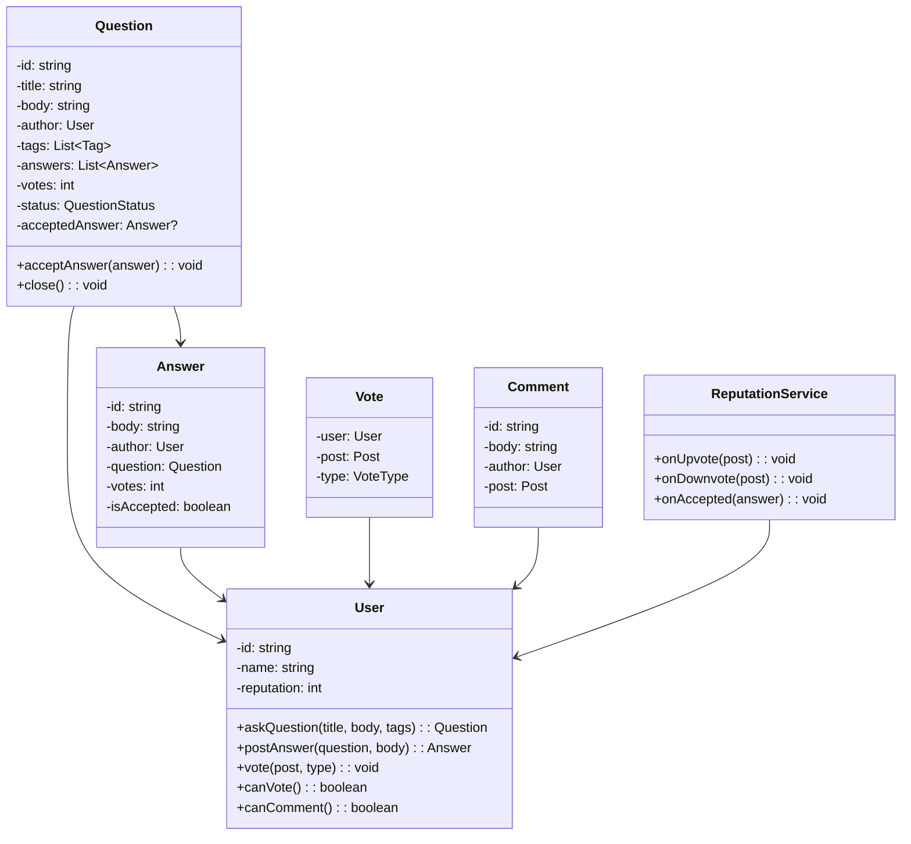
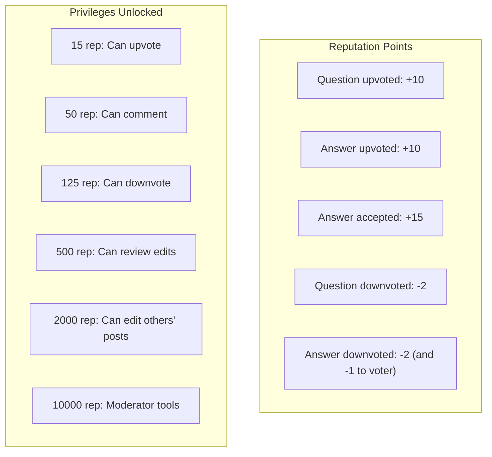

# LLD 11: Design Stack Overflow

## 💡 Quick Summary

> **What**: A Q&A platform where users ask questions, post answers, vote, comment, and earn reputation.  
> **Key Insight**: Core entities — Question, Answer, Comment, Vote — form a hierarchy. Reputation system drives quality (privileges unlock at thresholds). **Observer Pattern** for notifications, **Strategy** for ranking/sorting answers.

---

## 🏗️ Class Design



---

## 🔍 Reputation System



---

## 💻 Core Logic

```python
class VoteType:
    UPVOTE = 1
    DOWNVOTE = -1

class Post:  # Base for Question and Answer
    def __init__(self, author, body):
        self.author = author
        self.body = body
        self.votes = 0
        self.comments = []
        self.voters = {}  # user_id → vote_type (prevent double voting)

class VotingService:
    REPUTATION_RULES = {
        'question_upvote': 10,
        'answer_upvote': 10,
        'accepted_answer': 15,
        'downvote_received': -2,
        'downvote_given': -1,  # Cost to downvoter
    }
    
    def vote(self, user, post, vote_type):
        if user.id == post.author.id:
            raise Exception("Cannot vote on own post")
        if user.reputation < 15 and vote_type == VoteType.UPVOTE:
            raise Exception("Need 15 rep to upvote")
        if user.id in post.voters:
            # Undo previous vote
            old_vote = post.voters[user.id]
            post.votes -= old_vote
            self._adjust_rep(post.author, -old_vote * 10)
        
        post.voters[user.id] = vote_type
        post.votes += vote_type
        
        if vote_type == VoteType.UPVOTE:
            post.author.reputation += 10
        else:
            post.author.reputation -= 2
            user.reputation -= 1  # Cost to downvote
    
    def accept_answer(self, question, answer, user):
        if user.id != question.author.id:
            raise Exception("Only asker can accept")
        question.accepted_answer = answer
        answer.is_accepted = True
        answer.author.reputation += 15
```

---

## 📊 Key Design Decisions

| Decision | Choice | Why |
|----------|--------|-----|
| One accepted answer | Only question asker can accept one | Prevents gaming; clear "solved" signal |
| Downvote cost (-1 to voter) | Discourages frivolous downvotes |
| No double voting | Track voter per post | Prevent reputation abuse |
| Answer sorting | Score (votes) then date | Best answers float to top |
| Reputation thresholds | Graduated privileges | Earn trust before getting power |
