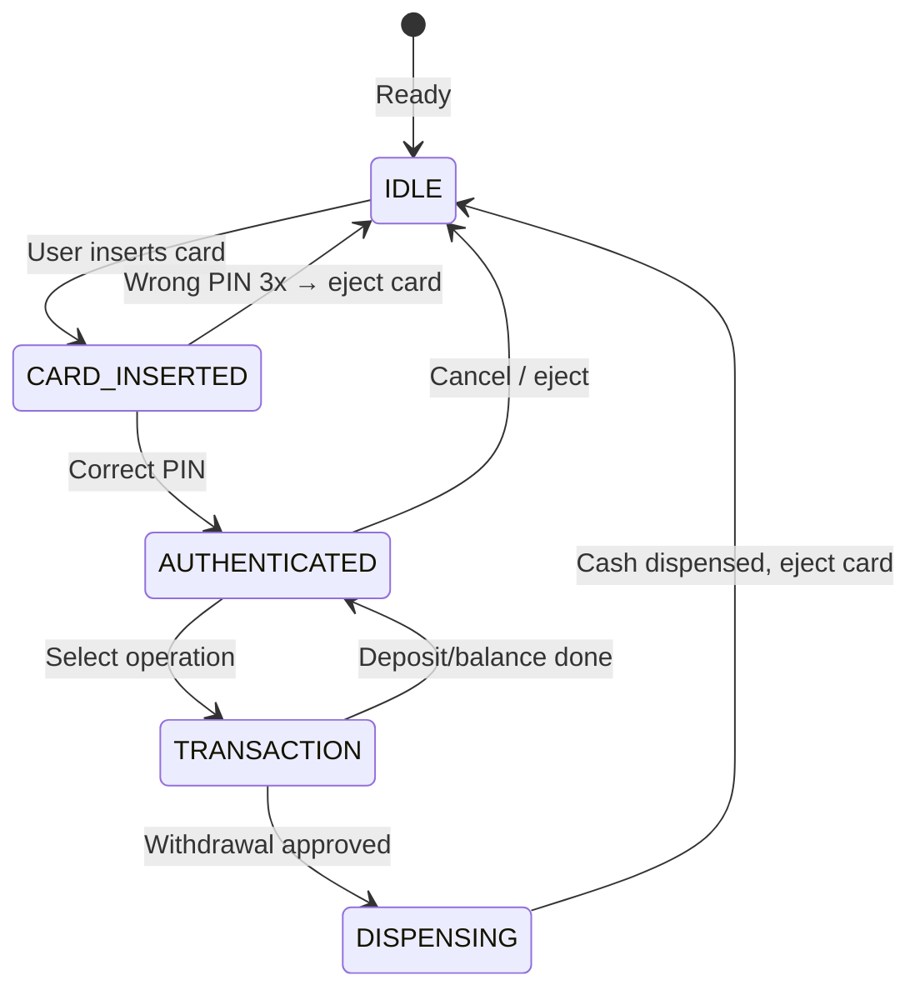
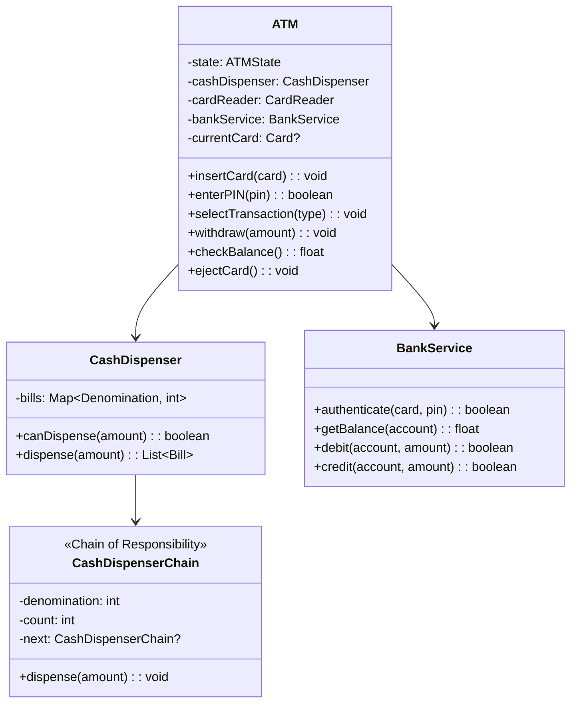
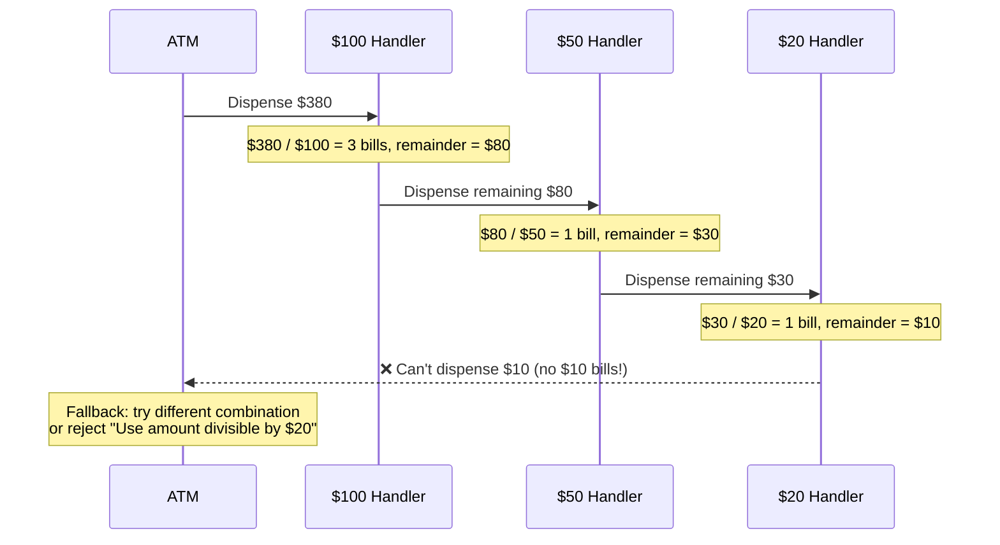

# LLD 12: Design an ATM System

## 💡 Quick Summary

> **What**: An ATM that authenticates users, checks balances, handles withdrawals/deposits, and manages cash dispensing.  
> **Key Insight**: **State Pattern** for ATM states (idle → card inserted → authenticated → transaction), **Chain of Responsibility** for cash dispensing (dispense $100 bills first, then $50, then $20).

---

## 🔄 ATM State Machine



---

## 🏗️ Class Design



---

## 💰 Cash Dispensing (Chain of Responsibility)



---

## 💻 Implementation

```python
class CashHandler:
    """Chain of Responsibility for bill dispensing."""
    def __init__(self, denomination, count, next_handler=None):
        self.denomination = denomination
        self.count = count
        self.next = next_handler
    
    def dispense(self, amount):
        bills_needed = min(amount // self.denomination, self.count)
        remainder = amount - (bills_needed * self.denomination)
        
        result = [(self.denomination, bills_needed)] if bills_needed > 0 else []
        
        if remainder > 0:
            if self.next:
                result.extend(self.next.dispense(remainder))
            else:
                raise CannotDispenseError(f"Cannot dispense ${remainder}")
        
        return result

class CashDispenser:
    def __init__(self):
        # Build chain: $100 → $50 → $20
        self.chain = CashHandler(100, 50,
                        CashHandler(50, 100,
                            CashHandler(20, 200)))
    
    def dispense(self, amount):
        if amount % 20 != 0 and amount % 50 != 0:
            raise InvalidAmount("Amount must be divisible by 20 or 50")
        return self.chain.dispense(amount)

class ATM:
    def __init__(self, bank_service, dispenser):
        self.bank = bank_service
        self.dispenser = dispenser
        self.current_account = None
        self.pin_attempts = 0
    
    def authenticate(self, card_number, pin):
        if self.bank.verify_pin(card_number, pin):
            self.current_account = card_number
            self.pin_attempts = 0
            return True
        self.pin_attempts += 1
        if self.pin_attempts >= 3:
            self.bank.lock_card(card_number)
            raise CardLockedError("Too many attempts")
        return False
    
    def withdraw(self, amount):
        balance = self.bank.get_balance(self.current_account)
        if amount > balance:
            raise InsufficientFunds()
        if not self.dispenser.can_dispense(amount):
            raise CannotDispenseError("ATM cannot provide this denomination")
        
        self.bank.debit(self.current_account, amount)
        bills = self.dispenser.dispense(amount)
        return bills  # Physical bills dispensed
```

---

## 🧩 Design Patterns

| Pattern | Where | Why |
|---------|-------|-----|
| **State** | ATM states | Different behavior per state (can't withdraw before auth) |
| **Chain of Responsibility** | Cash dispensing | Try largest bills first, pass remainder down |
| **Transaction** | Bank debit | Atomic: debit only if dispense succeeds (2-phase) |
