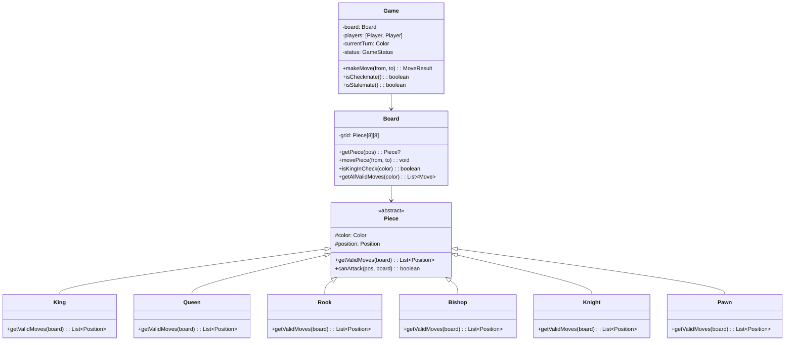
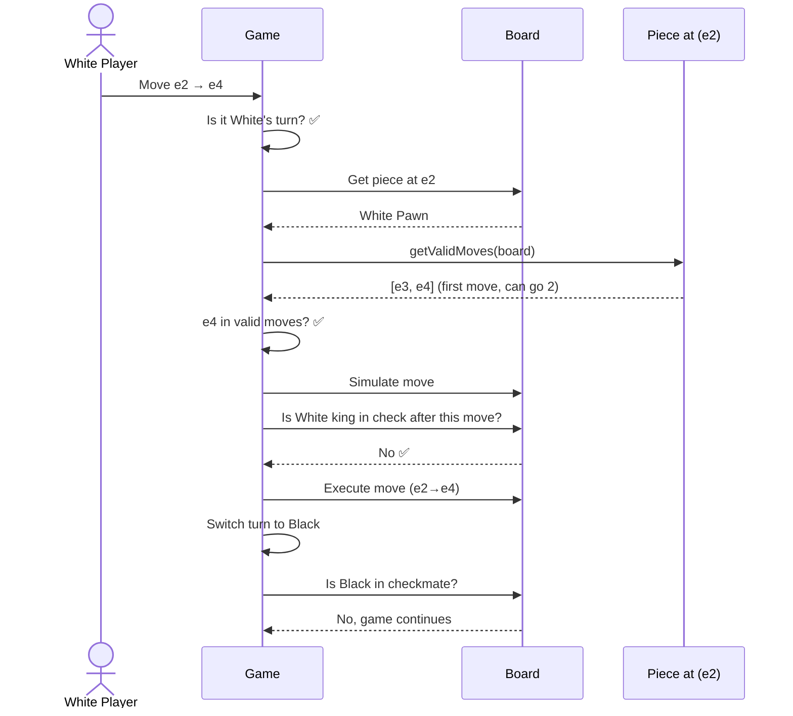

# LLD 13: Design a Chess Game

## 💡 Quick Summary

> **What**: A two-player chess game with move validation, check/checkmate detection, and proper piece movement rules.  
> **Key Insight**: Each piece type overrides a `getValidMoves()` method (polymorphism). The Board validates moves by checking: valid for piece + doesn't leave own king in check. **Command Pattern** enables undo.

---

## 🏗️ Class Design



---

## 🔍 Move Validation Flow



---

## 💻 Key Implementation

```python
from abc import ABC, abstractmethod

class Position:
    def __init__(self, row, col):
        self.row = row
        self.col = col
    
    def is_valid(self):
        return 0 <= self.row < 8 and 0 <= self.col < 8

class Piece(ABC):
    def __init__(self, color, position):
        self.color = color
        self.position = position
    
    @abstractmethod
    def get_valid_moves(self, board):
        """Return list of positions this piece can move to (ignoring check)."""
        pass

class Knight(Piece):
    MOVES = [(-2,-1),(-2,1),(-1,-2),(-1,2),(1,-2),(1,2),(2,-1),(2,1)]
    
    def get_valid_moves(self, board):
        moves = []
        for dr, dc in self.MOVES:
            pos = Position(self.position.row + dr, self.position.col + dc)
            if pos.is_valid():
                target = board.get_piece(pos)
                if target is None or target.color != self.color:
                    moves.append(pos)
        return moves

class Pawn(Piece):
    def get_valid_moves(self, board):
        moves = []
        direction = -1 if self.color == Color.WHITE else 1
        row, col = self.position.row, self.position.col
        
        # Forward one
        front = Position(row + direction, col)
        if front.is_valid() and board.get_piece(front) is None:
            moves.append(front)
            # Forward two (first move)
            start_row = 6 if self.color == Color.WHITE else 1
            if row == start_row:
                front2 = Position(row + 2*direction, col)
                if board.get_piece(front2) is None:
                    moves.append(front2)
        
        # Diagonal capture
        for dc in [-1, 1]:
            diag = Position(row + direction, col + dc)
            if diag.is_valid():
                target = board.get_piece(diag)
                if target and target.color != self.color:
                    moves.append(diag)
        return moves

class Board:
    def is_king_in_check(self, color):
        king_pos = self._find_king(color)
        opponent = Color.BLACK if color == Color.WHITE else Color.WHITE
        # Check if ANY opponent piece can attack king's position
        for piece in self._get_pieces(opponent):
            if king_pos in piece.get_valid_moves(self):
                return True
        return False
    
    def get_legal_moves(self, piece):
        """Valid moves that don't leave own king in check."""
        legal = []
        for move in piece.get_valid_moves(self):
            # Simulate move
            self._simulate_move(piece.position, move)
            if not self.is_king_in_check(piece.color):
                legal.append(move)
            self._undo_simulate()
        return legal
    
    def is_checkmate(self, color):
        if not self.is_king_in_check(color):
            return False
        # Check if ANY piece of this color has legal moves
        for piece in self._get_pieces(color):
            if self.get_legal_moves(piece):
                return False
        return True  # In check + no legal moves = checkmate
```

---

## 🧩 Design Patterns

| Pattern | Where | Why |
|---------|-------|-----|
| **Polymorphism** | Piece.getValidMoves() | Each piece type defines own movement |
| **Command** | Move objects (for undo/redo) | Store from, to, captured piece → easy undo |
| **Template Method** | Sliding pieces (Rook, Bishop, Queen) | Share "keep going in direction until blocked" logic |

---

## 📊 Special Rules to Handle

| Rule | Implementation |
|------|---------------|
| Castling | King + Rook haven't moved; no pieces between; not through check |
| En passant | Track last move; pawn captures adjacent pawn that moved 2 |
| Promotion | Pawn reaches rank 8 → replace with Queen/Rook/Bishop/Knight |
| Stalemate | Not in check + no legal moves = draw |
| 50-move rule | Track moves without capture/pawn move |
