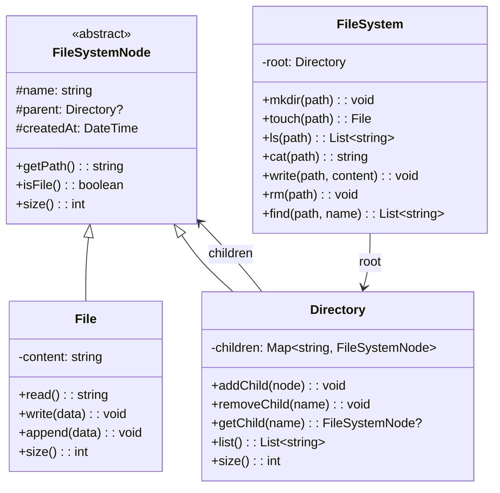
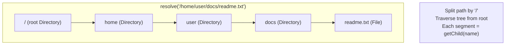

# LLD 14: Design an In-Memory File System

## 💡 Quick Summary

> **What**: A Unix-like file system with files, directories, and path-based operations — all in memory.  
> **Key Insight**: Use **Composite Pattern** — both File and Directory implement a common `FileSystemNode` interface. Directory contains children (which can be files or more directories). Path resolution = tree traversal.

---

## 🏗️ Class Design



---

## 🔍 Path Resolution



---

## 💻 Implementation

```python
from abc import ABC, abstractmethod
from datetime import datetime

class FileSystemNode(ABC):
    def __init__(self, name, parent=None):
        self.name = name
        self.parent = parent
        self.created_at = datetime.now()
    
    def get_path(self):
        if self.parent is None:
            return "/"
        parent_path = self.parent.get_path()
        return f"{parent_path.rstrip('/')}/{self.name}"
    
    @abstractmethod
    def size(self): pass
    
    @abstractmethod
    def is_file(self): pass

class File(FileSystemNode):
    def __init__(self, name, parent=None):
        super().__init__(name, parent)
        self.content = ""
    
    def read(self): return self.content
    def write(self, data): self.content = data
    def append(self, data): self.content += data
    def size(self): return len(self.content)
    def is_file(self): return True

class Directory(FileSystemNode):
    def __init__(self, name, parent=None):
        super().__init__(name, parent)
        self.children = {}
    
    def add_child(self, node):
        if node.name in self.children:
            raise FileExistsError(f"'{node.name}' already exists")
        self.children[node.name] = node
        node.parent = self
    
    def remove_child(self, name):
        if name not in self.children:
            raise FileNotFoundError(f"'{name}' not found")
        del self.children[name]
    
    def get_child(self, name):
        return self.children.get(name)
    
    def list(self):
        return sorted(self.children.keys())
    
    def size(self):
        return sum(child.size() for child in self.children.values())
    
    def is_file(self): return False

class FileSystem:
    def __init__(self):
        self.root = Directory("/")
    
    def _resolve(self, path):
        """Navigate to node at path."""
        if path == "/":
            return self.root
        parts = [p for p in path.split("/") if p]
        current = self.root
        for part in parts:
            if current.is_file():
                raise NotADirectoryError(f"'{current.name}' is not a directory")
            child = current.get_child(part)
            if child is None:
                raise FileNotFoundError(f"'{part}' not found in {current.get_path()}")
            current = child
        return current
    
    def _resolve_parent(self, path):
        """Get parent dir and final name from path."""
        parts = [p for p in path.split("/") if p]
        name = parts[-1]
        parent_path = "/" + "/".join(parts[:-1])
        parent = self._resolve(parent_path)
        if parent.is_file():
            raise NotADirectoryError()
        return parent, name
    
    def mkdir(self, path):
        parent, name = self._resolve_parent(path)
        directory = Directory(name)
        parent.add_child(directory)
    
    def touch(self, path):
        parent, name = self._resolve_parent(path)
        file = File(name)
        parent.add_child(file)
        return file
    
    def ls(self, path="/"):
        node = self._resolve(path)
        if node.is_file():
            return [node.name]
        return node.list()
    
    def cat(self, path):
        node = self._resolve(path)
        if not node.is_file():
            raise IsADirectoryError()
        return node.read()
    
    def write(self, path, content):
        node = self._resolve(path)
        if not node.is_file():
            raise IsADirectoryError()
        node.write(content)
    
    def rm(self, path):
        parent, name = self._resolve_parent(path)
        parent.remove_child(name)
```

---

## 🧩 Design Patterns

| Pattern | Where | Why |
|---------|-------|-----|
| **Composite** | File & Directory share FileSystemNode | Uniform treatment; directory contains both |
| **Iterator** | ls, find operations | Traverse tree structure |

---

## 📊 Key Decisions

| Decision | Choice | Why |
|----------|--------|-----|
| Storage | In-memory (dict) | Fast; interview scope |
| Path resolution | Split + traverse | Unix-like; intuitive |
| Directory.size() | Recursive sum of children | Reflects actual usage |
| Name collisions | Reject duplicate names in same dir | Matches real filesystem |
