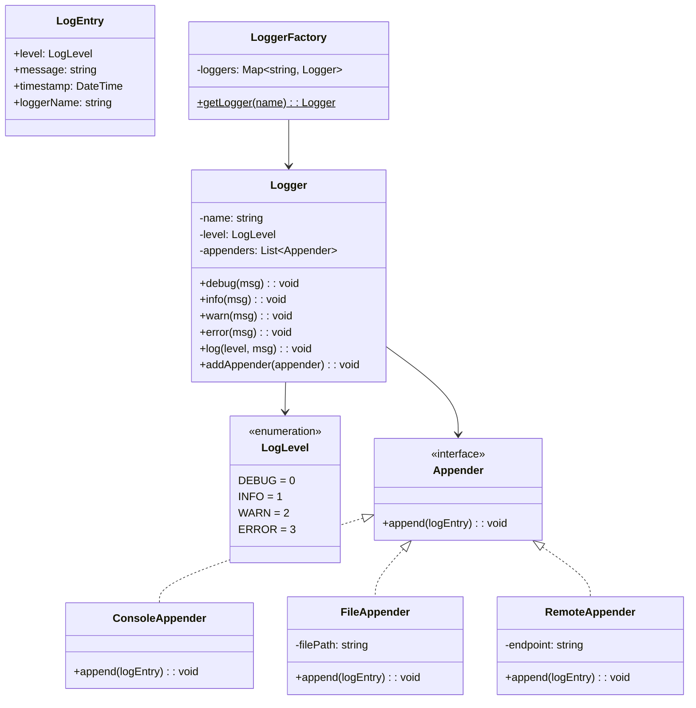
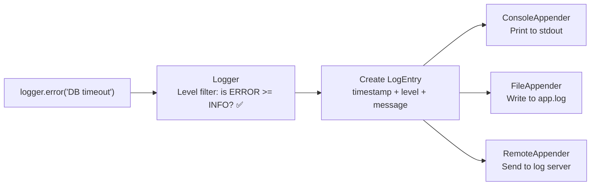

# LLD 15: Design a Logger Framework

## 💡 Quick Summary

> **What**: A logging framework supporting multiple log levels, outputs (console, file, remote), and formatting — like Log4j/SLF4J.  
> **Key Insight**: **Chain of Responsibility** for level filtering, **Strategy** for output destinations, **Singleton** for global logger. Support chaining: Logger → Filter → Formatter → Appender.

---

## 🏗️ Class Design



---

## 🔍 Log Flow



---

## 💻 Implementation

```python
from enum import IntEnum
from datetime import datetime
from abc import ABC, abstractmethod
import threading

class LogLevel(IntEnum):
    DEBUG = 0
    INFO = 1
    WARN = 2
    ERROR = 3

class LogEntry:
    def __init__(self, level, message, logger_name):
        self.level = level
        self.message = message
        self.timestamp = datetime.now()
        self.logger_name = logger_name
    
    def __str__(self):
        return f"[{self.timestamp:%Y-%m-%d %H:%M:%S}] [{self.level.name}] [{self.logger_name}] {self.message}"

class Appender(ABC):
    @abstractmethod
    def append(self, entry: LogEntry): pass

class ConsoleAppender(Appender):
    def append(self, entry):
        print(str(entry))

class FileAppender(Appender):
    def __init__(self, filepath):
        self.filepath = filepath
        self._lock = threading.Lock()
    
    def append(self, entry):
        with self._lock:
            with open(self.filepath, "a") as f:
                f.write(str(entry) + "\n")

class Logger:
    def __init__(self, name, level=LogLevel.INFO):
        self.name = name
        self.level = level
        self.appenders = []
    
    def add_appender(self, appender):
        self.appenders.append(appender)
    
    def log(self, level, message):
        if level < self.level:
            return  # Below threshold, skip
        entry = LogEntry(level, message, self.name)
        for appender in self.appenders:
            appender.append(entry)
    
    def debug(self, msg): self.log(LogLevel.DEBUG, msg)
    def info(self, msg): self.log(LogLevel.INFO, msg)
    def warn(self, msg): self.log(LogLevel.WARN, msg)
    def error(self, msg): self.log(LogLevel.ERROR, msg)

class LoggerFactory:
    _loggers = {}
    _lock = threading.Lock()
    _default_appenders = [ConsoleAppender()]
    _default_level = LogLevel.INFO
    
    @classmethod
    def get_logger(cls, name):
        with cls._lock:
            if name not in cls._loggers:
                logger = Logger(name, cls._default_level)
                for appender in cls._default_appenders:
                    logger.add_appender(appender)
                cls._loggers[name] = logger
            return cls._loggers[name]

# Usage
logger = LoggerFactory.get_logger("PaymentService")
logger.info("Processing payment")  # Prints
logger.debug("Detailed trace")     # Filtered (below INFO)
logger.error("Payment failed!")    # Prints
```

---

## 🧩 Design Patterns

| Pattern | Where | Why |
|---------|-------|-----|
| **Singleton** | LoggerFactory | Global access; one factory manages all loggers |
| **Strategy** | Appender interface | Swap output destinations without changing logger |
| **Chain of Responsibility** | Level filtering | Messages below threshold don't propagate |
| **Factory** | LoggerFactory.getLogger() | Centralized logger creation + caching |
| **Observer** | Multiple appenders per logger | One log event → multiple outputs |
