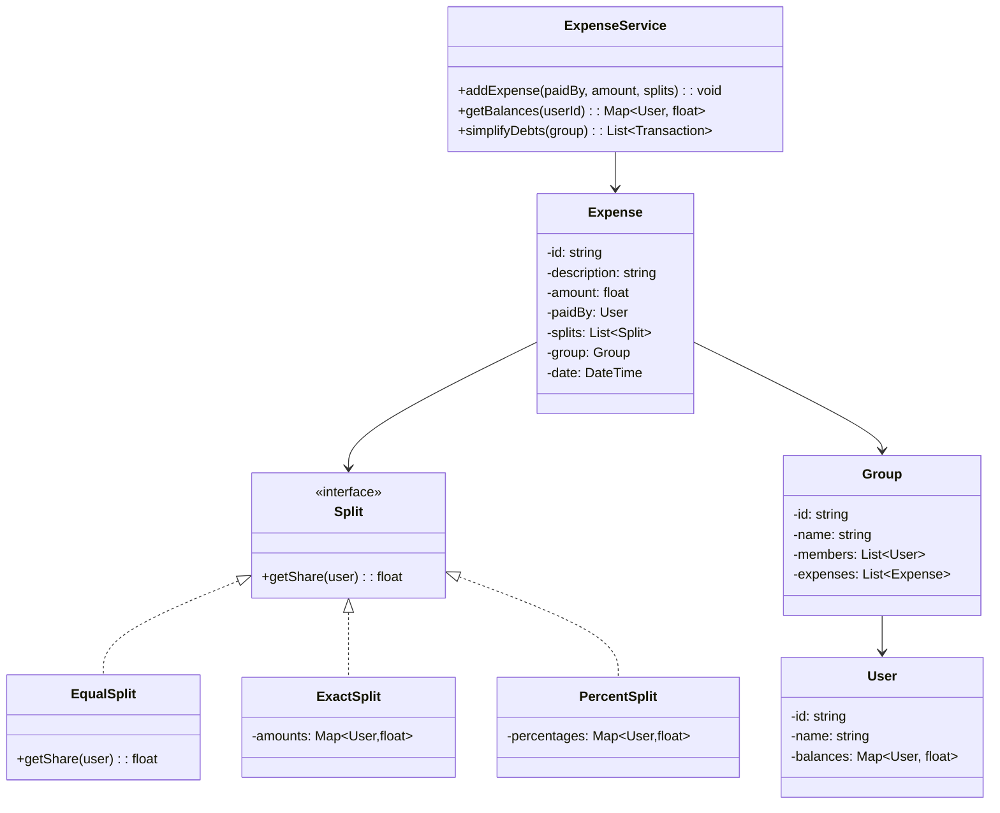
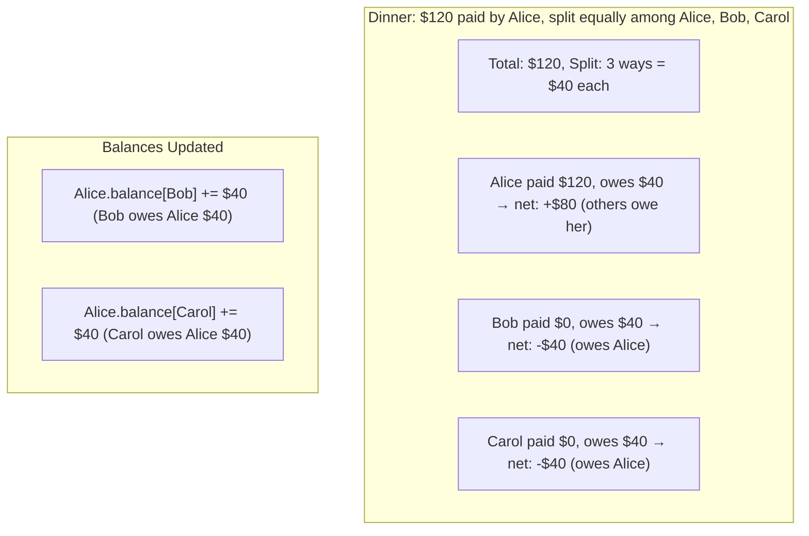
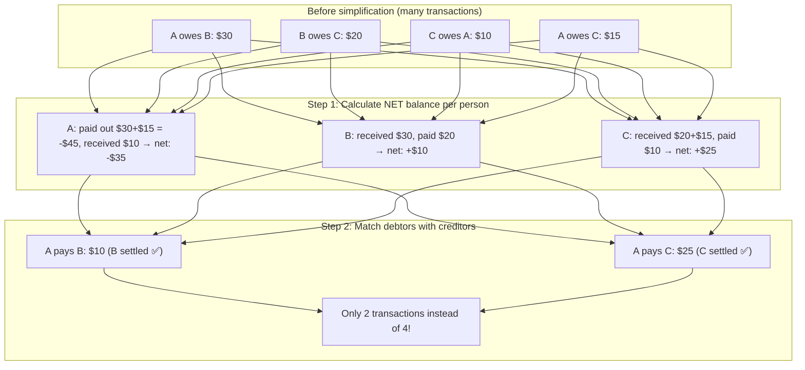

# LLD 16: Design Splitwise (Expense Sharing)

## 💡 Quick Summary

> **What**: A system where groups of people split expenses and track who owes whom, with debt simplification.  
> **Key Insight**: The core algorithm is **debt simplification** — instead of A owes B $10, B owes C $10, C owes A $10 (3 transactions), simplify to 0 transactions (circular debt cancels out). Use a net balance approach.

---

## 🏗️ Class Design



---

## 🔍 How Splitting Works



---

## 🧮 Debt Simplification Algorithm



---

## 💻 Implementation

```python
from collections import defaultdict

class ExpenseService:
    def __init__(self):
        self.balances = defaultdict(lambda: defaultdict(float))
        # balances[A][B] = amount B owes A (positive = B owes A)
    
    def add_expense(self, paid_by, amount, participants, split_type="equal"):
        if split_type == "equal":
            share = amount / len(participants)
            for user in participants:
                if user != paid_by:
                    self.balances[paid_by][user] += share
                    self.balances[user][paid_by] -= share
    
    def get_balance(self, user):
        """Net amount others owe this user (positive = they're owed money)."""
        net = 0
        for other, amount in self.balances[user].items():
            net += amount
        return net
    
    def simplify_debts(self, users):
        """Minimize number of transactions using net balance approach."""
        # Step 1: Calculate net balance for each person
        net = {}
        for user in users:
            net[user] = sum(self.balances[user].values())
        
        # Step 2: Separate into creditors (positive) and debtors (negative)
        creditors = [(user, amt) for user, amt in net.items() if amt > 0]
        debtors = [(user, -amt) for user, amt in net.items() if amt < 0]
        
        # Step 3: Match debtors to creditors greedily
        transactions = []
        i, j = 0, 0
        creditors.sort(key=lambda x: -x[1])
        debtors.sort(key=lambda x: -x[1])
        
        while i < len(creditors) and j < len(debtors):
            creditor, credit = creditors[i]
            debtor, debt = debtors[j]
            settled = min(credit, debt)
            transactions.append((debtor, creditor, settled))
            creditors[i] = (creditor, credit - settled)
            debtors[j] = (debtor, debt - settled)
            if creditors[i][1] == 0: i += 1
            if debtors[j][1] == 0: j += 1
        
        return transactions

# Usage
svc = ExpenseService()
svc.add_expense("Alice", 120, ["Alice", "Bob", "Carol"])  # Dinner
svc.add_expense("Bob", 60, ["Alice", "Bob", "Carol"])     # Cab

# Bob owes Alice: $40 - $20 = $20
# Carol owes Alice: $40, Carol owes Bob: $20
simplified = svc.simplify_debts(["Alice", "Bob", "Carol"])
```

---

## 🧩 Design Patterns

| Pattern | Where | Why |
|---------|-------|-----|
| **Strategy** | Split types (Equal, Exact, Percent) | Different splitting logic; swap without changing Expense |
| **Observer** | Notify users when balance changes | "Bob added an expense, you owe $20" |

---

## 📊 Key Decisions

| Decision | Choice | Why |
|----------|--------|-----|
| Balance tracking | Pairwise (A→B, B→A) | Easy to query "who do I owe?" |
| Simplification | Net balance + greedy matching | Minimizes transactions; O(n log n) |
| Split validation | Sum of shares == total amount | Prevent rounding errors |
| Settling up | Record as expense (B pays A) | Reuses same system |
