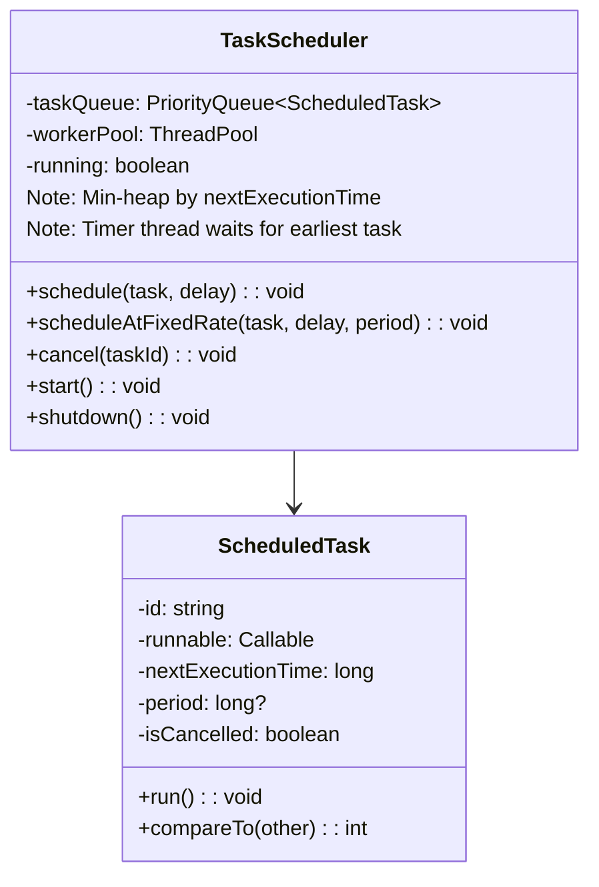
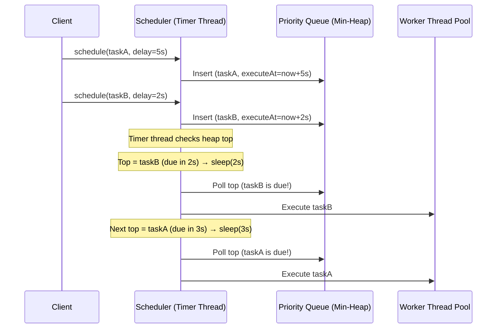

# LLD 17: Design a Task Scheduler

## 💡 Quick Summary

> **What**: A system that executes tasks at specified times or intervals — like cron jobs or `ScheduledExecutorService`.  
> **Key Insight**: Use a **min-heap (priority queue)** ordered by next execution time. A single timer thread sleeps until the earliest task is due, executes it, and re-schedules recurring tasks.

---

## 🏗️ Class Design



---

## 🔍 How It Works



---

## 💻 Implementation

```python
import heapq
import threading
import time
from dataclasses import dataclass, field

@dataclass(order=True)
class ScheduledTask:
    execute_at: float
    id: str = field(compare=False)
    func: callable = field(compare=False)
    period: float = field(compare=False, default=0)  # 0 = one-shot
    cancelled: bool = field(compare=False, default=False)

class TaskScheduler:
    def __init__(self, num_workers=4):
        self.queue = []  # min-heap
        self.lock = threading.Condition()
        self.running = False
        self.workers = threading.Semaphore(num_workers)
    
    def schedule(self, task_id, func, delay_seconds):
        task = ScheduledTask(
            execute_at=time.time() + delay_seconds,
            id=task_id, func=func
        )
        with self.lock:
            heapq.heappush(self.queue, task)
            self.lock.notify()  # Wake timer thread
    
    def schedule_recurring(self, task_id, func, delay, period):
        task = ScheduledTask(
            execute_at=time.time() + delay,
            id=task_id, func=func, period=period
        )
        with self.lock:
            heapq.heappush(self.queue, task)
            self.lock.notify()
    
    def cancel(self, task_id):
        with self.lock:
            for task in self.queue:
                if task.id == task_id:
                    task.cancelled = True
    
    def start(self):
        self.running = True
        threading.Thread(target=self._run, daemon=True).start()
    
    def _run(self):
        while self.running:
            with self.lock:
                while not self.queue:
                    self.lock.wait()  # Wait for tasks
                
                task = self.queue[0]
                wait_time = task.execute_at - time.time()
                
                if wait_time > 0:
                    self.lock.wait(timeout=wait_time)
                    continue  # Re-check (new task may be earlier)
                
                heapq.heappop(self.queue)
            
            if task.cancelled:
                continue
            
            # Execute in worker thread
            threading.Thread(target=self._execute, args=(task,)).start()
    
    def _execute(self, task):
        task.func()
        # Re-schedule if recurring
        if task.period > 0 and not task.cancelled:
            task.execute_at = time.time() + task.period
            with self.lock:
                heapq.heappush(self.queue, task)
                self.lock.notify()
```

---

## 🧩 Key Design Decisions

| Decision | Choice | Why |
|----------|--------|-----|
| Data structure | Min-heap (by execution time) | O(log n) insert; O(1) peek at next due task |
| Timer thread | Single thread sleeps until next task | Efficient; no busy-waiting |
| Execution | Worker thread pool | Don't block scheduler if task takes long |
| Cancellation | Lazy (mark cancelled, skip on poll) | O(1) cancel; avoid expensive heap removal |
| Recurring tasks | Re-insert after execution with updated time | Fixed-rate: next = previous + period |
| Thread safety | Condition variable (lock + wait/notify) | Timer wakes when new task added or time elapses |

---

## 🔄 Fixed-Rate vs Fixed-Delay

| Type | Behavior |
|------|----------|
| Fixed-rate | Next = scheduled_time + period (ignores execution time) |
| Fixed-delay | Next = completion_time + period (waits after finishing) |
