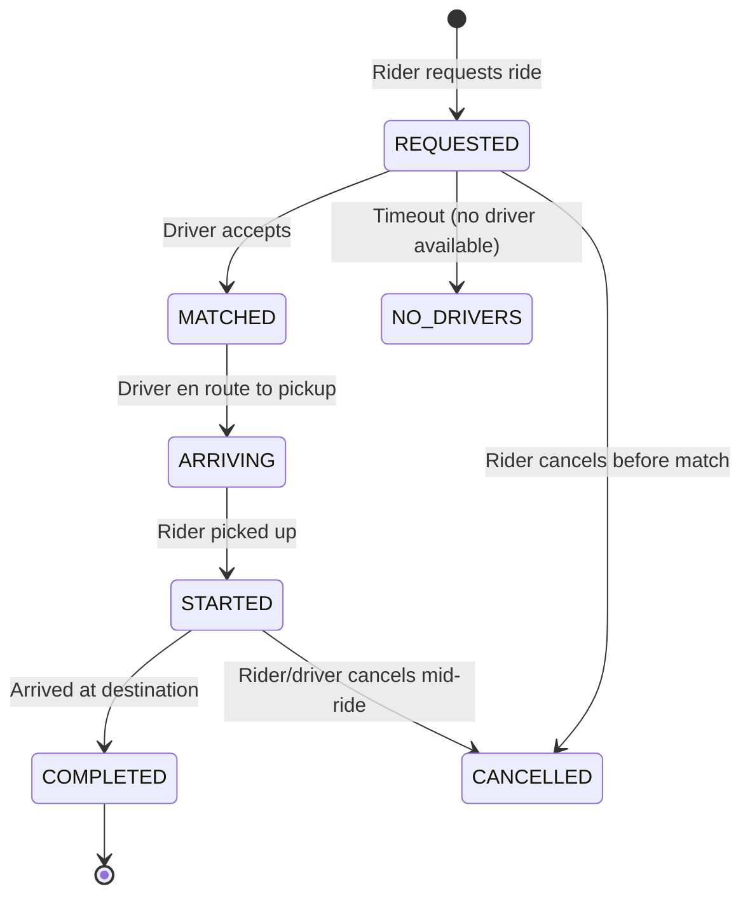
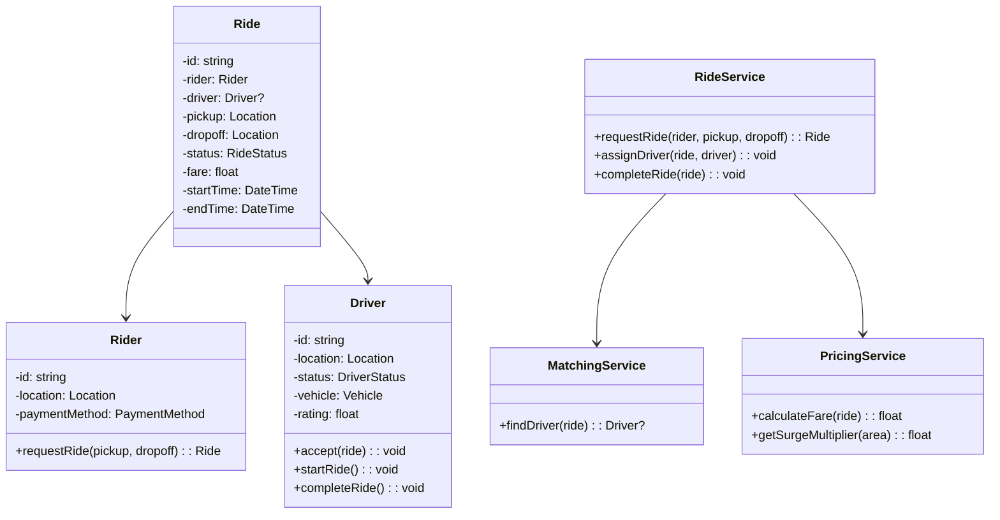
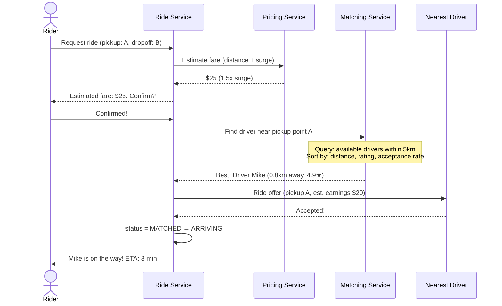
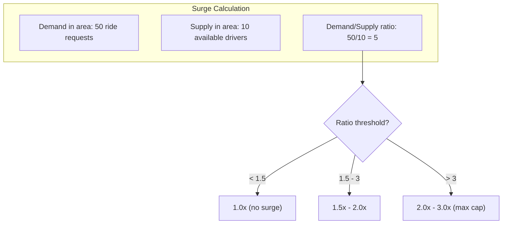

# LLD 18: Design a Ride-Sharing System (Uber/Lyft)

## 💡 Quick Summary

> **What**: A system matching riders with nearby drivers, managing ride lifecycle from request to payment.  
> **Key Insight**: Similar to Food Delivery (LLD 10) but with real-time matching, dynamic pricing (surge), and ETA calculation. **Strategy Pattern** for matching algorithms, **State Pattern** for ride lifecycle.

---

## 🔄 Ride State Machine



---

## 🏗️ Class Design



---

## 🔍 Ride Request Flow



---

## 💰 Surge Pricing



---

## 💻 Core Implementation

```python
from enum import Enum
import math

class RideStatus(Enum):
    REQUESTED = "requested"
    MATCHED = "matched"
    ARRIVING = "arriving"
    STARTED = "started"
    COMPLETED = "completed"
    CANCELLED = "cancelled"

class MatchingService:
    MAX_RADIUS_KM = 5
    
    def find_driver(self, pickup_location, available_drivers):
        candidates = []
        for driver in available_drivers:
            dist = self._distance(driver.location, pickup_location)
            if dist <= self.MAX_RADIUS_KM:
                score = dist * 0.5 + (5 - driver.rating) * 0.3 + (1 - driver.acceptance_rate) * 0.2
                candidates.append((score, driver))
        
        candidates.sort(key=lambda x: x[0])
        return candidates[0][1] if candidates else None

class PricingService:
    BASE_FARE = 2.50
    PER_KM = 1.50
    PER_MIN = 0.25
    
    def calculate_fare(self, distance_km, duration_min, surge=1.0):
        fare = self.BASE_FARE + (distance_km * self.PER_KM) + (duration_min * self.PER_MIN)
        return round(fare * surge, 2)
    
    def get_surge(self, area_demand, area_supply):
        if area_supply == 0:
            return 3.0  # Max surge
        ratio = area_demand / area_supply
        if ratio < 1.5:
            return 1.0
        return min(3.0, ratio * 0.7)  # Capped at 3x

class RideService:
    def request_ride(self, rider, pickup, dropoff):
        ride = Ride(rider=rider, pickup=pickup, dropoff=dropoff)
        ride.status = RideStatus.REQUESTED
        
        driver = self.matching.find_driver(pickup, self.get_available_drivers())
        if not driver:
            raise NoDriversAvailable()
        
        # Send offer to driver (timeout 15s)
        if self.send_offer(driver, ride):
            ride.driver = driver
            ride.status = RideStatus.MATCHED
            driver.status = DriverStatus.ON_TRIP
        return ride
    
    def complete_ride(self, ride):
        ride.status = RideStatus.COMPLETED
        ride.end_time = datetime.now()
        distance = self._calc_distance(ride.pickup, ride.dropoff)
        duration = (ride.end_time - ride.start_time).total_seconds() / 60
        ride.fare = self.pricing.calculate_fare(distance, duration, ride.surge)
        self.payment.charge(ride.rider, ride.fare)
        self.payment.pay_driver(ride.driver, ride.fare * 0.75)
        ride.driver.status = DriverStatus.AVAILABLE
```

---

## 📊 Key Decisions

| Decision | Choice | Why |
|----------|--------|-----|
| Matching | Nearest + rating weighted | Balance speed and quality |
| Surge | Demand/supply ratio per geo-cell | Incentivize drivers to high-demand areas |
| Offer timeout | 15 seconds | Quick enough for rider; fair to driver |
| Driver location | GPS update every 3-5 seconds | Balance accuracy vs bandwidth |
| Fare calculation | Base + distance + time + surge | Transparent pricing |
| Payment split | 75% driver / 25% platform | Industry standard |
