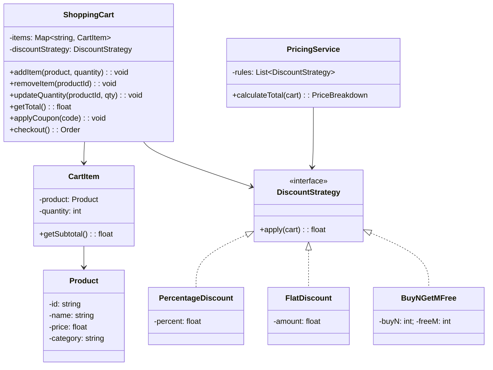

# LLD 19: Design a Shopping Cart

## 💡 Quick Summary

> **What**: An e-commerce shopping cart supporting add/remove items, quantity updates, pricing rules (coupons, bulk discounts), and checkout.  
> **Key Insight**: **Strategy Pattern** for pricing/discount rules, **Observer** for price recalculation on changes. The cart is the aggregate root; pricing logic should be separate from cart state.

---

## 🏗️ Class Design



---

## 💻 Implementation

```python
class Product:
    def __init__(self, id, name, price, category="general"):
        self.id = id
        self.name = name
        self.price = price
        self.category = category

class CartItem:
    def __init__(self, product, quantity=1):
        self.product = product
        self.quantity = quantity
    
    @property
    def subtotal(self):
        return self.product.price * self.quantity

class ShoppingCart:
    def __init__(self):
        self.items = {}  # product_id → CartItem
        self.coupon = None
    
    def add_item(self, product, quantity=1):
        if product.id in self.items:
            self.items[product.id].quantity += quantity
        else:
            self.items[product.id] = CartItem(product, quantity)
    
    def remove_item(self, product_id):
        self.items.pop(product_id, None)
    
    def update_quantity(self, product_id, quantity):
        if quantity <= 0:
            self.remove_item(product_id)
        elif product_id in self.items:
            self.items[product_id].quantity = quantity
    
    def get_subtotal(self):
        return sum(item.subtotal for item in self.items.values())
    
    def apply_coupon(self, coupon):
        if coupon.is_valid(self):
            self.coupon = coupon
    
    def get_total(self):
        subtotal = self.get_subtotal()
        discount = self.coupon.apply(subtotal) if self.coupon else 0
        tax = (subtotal - discount) * 0.08  # 8% tax
        return subtotal - discount + tax
    
    def checkout(self):
        if not self.items:
            raise EmptyCartError()
        total = self.get_total()
        order = Order(items=list(self.items.values()), total=total)
        self.items.clear()
        self.coupon = None
        return order

# Discount Strategies
class PercentageCoupon:
    def __init__(self, code, percent, min_order=0):
        self.code = code
        self.percent = percent
        self.min_order = min_order
    
    def is_valid(self, cart):
        return cart.get_subtotal() >= self.min_order
    
    def apply(self, subtotal):
        return subtotal * (self.percent / 100)

class FlatCoupon:
    def __init__(self, code, amount, min_order=0):
        self.code = code
        self.amount = amount
        self.min_order = min_order
    
    def is_valid(self, cart):
        return cart.get_subtotal() >= self.min_order
    
    def apply(self, subtotal):
        return min(self.amount, subtotal)  # Can't discount more than total
```

---

## 🧩 Design Patterns

| Pattern | Where | Why |
|---------|-------|-----|
| **Strategy** | Discount/coupon types | Different discount logic; easily add new types |
| **Observer** | Recalculate total on item change | UI updates when cart changes |
| **Null Object** | No coupon = 0 discount | Avoid null checks in total calculation |

---

## 📊 Key Decisions

| Decision | Choice | Why |
|----------|--------|-----|
| Cart storage | In-memory map (product_id → item) | O(1) add/remove/update |
| Multiple coupons | Only one coupon at a time | Simplicity; prevents stacking abuse |
| Tax calculation | Applied after discount | Standard tax law |
| Out-of-stock | Check at checkout, not at add | Inventory may change; check at commitment time |
| Price | Use price at add-time vs checkout-time | Checkout-time (always current price) |
